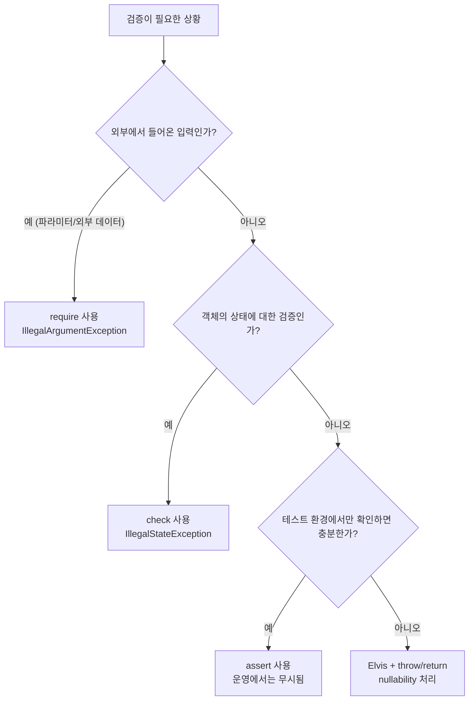

# 아이템 5. 예외를 활용해 코드에 제한을 걸어라
함수의 동작이 특정 조건에서만 올바르게 작동한다면, 해당 **조건을 코드 자체에 명시적으로 걸어두는 것**이 좋다. 코틀린은 이를 위해 다음 4가지 방법을 제공한다.

| 방법 | 용도 | 실패 시 예외 |
|------|------|-------------|
| `require` | 아규먼트(파라미터) 검증 | `IllegalArgumentException` |
| `check` | 객체/함수의 상태 검증 | `IllegalStateException` |
| `assert` | 테스트 단계에서만 참(true) 검증 | `AssertionError` (JVM `-ea` 옵션 필요) |
| `return` / `throw` + Elvis(`?:`) | 안전한 nullability 처리 | 직접 지정 |

## 제한을 거는 것의 장점
- 문서를 읽지 않은 개발자도 코드만 보고 제약을 인지할 수 있다.
- 잘못된 입력이 들어오면 **함수가 이상하게 동작하지 않고 즉시 예외를 던진다.** (Fail-fast)
- 코드가 **자체적으로 검사**되므로 단위 테스트의 부담이 줄어든다.
- 스마트 캐스트 기능과 함께 사용하면 **이후 코드에서 타입 변환을 생략**할 수 있다.

---

## 1) `require` - 아규먼트 검증
함수의 파라미터에 대한 제약을 함수 시작 부분에서 정의한다.

```kotlin
fun factorial(n: Int): Long {
    require(n >= 0) { "Cannot calculate factorial of $n because it is smaller than 0" }
    return if (n <= 1) 1 else factorial(n - 1) * n
}

fun findClusters(points: List<Point>): List<Cluster> {
    require(points.isNotEmpty()) { "points 리스트가 비어 있을 수 없습니다." }
    // ...
}
```

- 조건을 만족하지 못하면 `IllegalArgumentException`을 던진다.
- 람다 형태로 **lazy evaluation 메시지**를 전달할 수 있어, 정상 흐름에서는 메시지 생성 비용이 들지 않는다.

---

## 2) `check` - 상태 검증
객체나 함수가 **특정 상태일 때만 동작**해야 한다면 `check`를 사용한다.

```kotlin
class Connection {
    private var isOpen = false

    fun open() { isOpen = true }

    fun send(data: ByteArray) {
        check(isOpen) { "Connection이 열리지 않은 상태에서는 데이터를 보낼 수 없습니다." }
        // ...
    }
}

fun next(): T {
    check(isInitialized) { "iterator가 초기화되지 않았습니다." }
    // ...
}
```

- 조건을 만족하지 못하면 `IllegalStateException`을 던진다.
- `require`는 외부에서 들어온 입력을 검증하는 반면, `check`는 객체의 내부 상태를 검증한다는 점이 다르다.

---

## 3) `assert` - 단언
함수가 정확하게 동작하는지 **테스트 환경에서만** 확인하고 싶을 때 사용한다.

```kotlin
fun pop(num: Int = 1): List<T> {
    val ret = collection.take(num)
    assert(ret.size == num) { "size가 일치해야 합니다." }
    return ret
}
```

- JVM 옵션 `-ea`(enable assertions)가 켜진 환경에서만 동작한다.
- 일반 운영 환경에서는 무시되므로, **사용자 입력 같은 외부 조건 검증에는 사용하면 안 된다.**
- 코틀린/JVM에서는 거의 사용되지 않으며, 보통 **단위 테스트 안에서 사용**한다.

```kotlin
@Test
fun `Stack pops correct number of elements`() {
    val stack = Stack(20) { it }
    val ret = stack.pop(10)
    assertEquals(10, ret.size)  // junit의 assert
}
```

---

## 4) nullability와 스마트 캐스팅 활용
`require`/`check` 통과 후에는 컴파일러가 해당 변수의 타입을 좁혀(narrow) 준다.

```kotlin
class Person(val email: String?)

fun sendEmail(person: Person, message: String) {
    require(person.email != null) { "이메일 주소가 필수입니다." }
    val email: String = person.email   // ✅ 스마트 캐스팅: String? → String
    // ...
}
```

Elvis 연산자(`?:`)와 `throw` / `return`을 결합하면 더 짧고 안전하게 표현할 수 있다.

```kotlin
fun sendEmail(person: Person, text: String) {
    val email: String = person.email ?: return   // null이면 그냥 빠져나감

    val name: String = person.name
        ?: throw IllegalArgumentException("name이 필요합니다.")

    val phone: String = person.phone
        ?: run {
            log.error("phone이 비어 있어 SMS 발송 생략")
            return
        }
    // ...
}
```

- `?: return`: null이면 함수를 조용히 종료
- `?: throw ...`: null이면 의미 있는 예외를 던짐
- `?: run { ... }`: null일 때 부수 효과(로깅 등) 후 분기 처리

---

## require / check / assert 선택 가이드



---

## 정리
- 제한을 훨씬 더 쉽게 확인할 수 있다.
- 애플리케이션을 더 **안정적으로 지킬 수 있다.**
- 코드를 잘못 쓰는 상황을 막을 수 있고, 적절히 **예외를 throw**할 수 있다.
- 스마트 캐스팅을 활용해, **자동으로 타입을 변환**할 수 있다.

**핵심 이점 4가지**
1. 제약 조건이 코드의 **앞부분에 명시**되어 가독성이 좋아진다.
2. 잘못된 사용을 **빠르게 실패(fail-fast)** 시킨다.
3. 함수 본문에서 **방어 코드(if-throw)** 가 줄어든다.
4. 컴파일러의 **스마트 캐스팅**이 활성화되어 후속 코드가 더 깔끔해진다.
