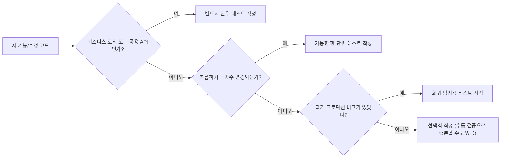
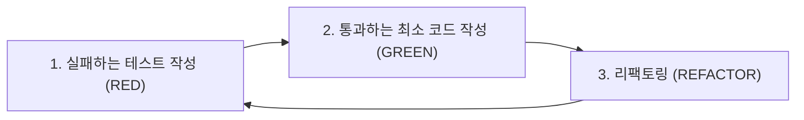

# 아이템 10. 단위 테스트를 만들어라
코드를 안정적으로 만드는 가장 궁극적인 방법은 **다양한 종류의 테스트**, 그중에서도 **단위 테스트(unit test)** 를 작성하는 것이다. 단위 테스트는 개발자 관점에서 요소가 **올바르게 동작하는지를 빠르게 검증**한다.

## 단위 테스트가 확인해야 하는 3가지
1. **일반적인 유스 케이스(happy path)**: 요소가 사용될 거라 예상되는 일반적인 방법을 테스트한다.
2. **일반적인 오류 케이스와 잠재적인 문제**: 정상적으로 작동할 거라고 예상되지만, 문제가 발생하는 케이스를 테스트한다.
3. **엣지 케이스와 잘못된 아규먼트**: `Int`의 경우 `Int.MAX_VALUE`, nullable의 경우 `null`/null로 채워진 객체 등 엣지 상황을 테스트한다.

```kotlin
@Test
fun `factorial of 4`() {
    assertEquals(24, factorial(4))
}

@Test
fun `factorial of 0 returns 1`() {
    assertEquals(1, factorial(0))  // 엣지 케이스
}

@Test
fun `factorial of negative throws`() {
    assertThrows<IllegalArgumentException> { factorial(-1) }  // 잘못된 아규먼트
}
```

---

## 단위 테스트의 장점
- **신뢰할 수 있는 요소가 된다**: 잘 테스트된 요소는 그 자체로 작동을 보증한다. 사용할 때 안정감을 준다.
- **리팩토링이 안전해진다**: 테스트가 잘 만들어져 있으면, 수정 후 회귀(regression)를 빠르게 잡아낼 수 있다.
- **수동 테스트보다 빠르다**: 새로운 기능을 추가/변경했을 때마다 매번 손으로 클릭하는 것보다 훨씬 빠르고 비용이 적게 든다.

## 단위 테스트의 단점
- 단위 테스트를 만드는 데 **시간이 걸린다.** 다만 장기적으로 보면 디버깅 시간을 줄여 더 절약된다.
- **테스트하기 좋은 코드 구조**가 필요하다. 의존성 주입 등 일정한 설계 변경을 강요한다.
- **테스트 자체를 유지보수**해야 한다. 코드가 변경되면 테스트도 따라 바뀌어야 한다.

> 시간 투자에 비해 얻는 가치가 크지 않은 부분도 있다는 점을 인식해야 한다.

---

## 단위 테스트가 특히 중요한 코드
모든 코드를 100% 테스트할 수는 없으므로, **테스트가 정말로 가치 있는 영역**을 우선시해야 한다.

| 영역 | 이유 |
|------|------|
| 복잡한 로직 | 직관으로 검증하기 어려움 |
| 자주 수정/리팩토링되는 부분 | 회귀 위험이 큼 |
| 비즈니스 로직(도메인) | 망가지면 사용자에게 직접 영향 |
| 공용 API(라이브러리/모듈 경계) | 외부 의존성이 깨질 수 있음 |
| 문제가 자주 발생하는 부분 | 재발 방지 효과 |
| 수정해야 하는 프로덕션 버그 | 다시 발생하지 않도록 보장 |



---

## TDD(Test-Driven Development) 관점
TDD를 적용하면 사이클이 다음 순서로 진행된다.



- 테스트가 **명세 역할**을 하므로, 코드 의도가 명확해진다.
- 처음부터 테스트 가능한 구조로 설계가 강제된다.
- 단, **모든 코드에 TDD가 적합한 것은 아니다.** 탐색적 개발이나 UI 프로토타이핑 등에는 비용 대비 효율이 떨어질 수 있다.

---

## 정리
- 장기적으로 단위 테스트는 **코드 안정성과 개발 속도**를 모두 끌어올린다.
- 단위 테스트가 "추가 작업"이 아니라 **개발 프로세스의 일부**가 되어야 한다.
- 모든 코드를 테스트할 필요는 없지만, **비즈니스 로직과 공용 API**에는 반드시 작성한다.
- 기존 테스트가 잘 만들어져 있다면, 코드 변경 시 두려움이 줄어든다.

> **개발자는 테스트를 작성하는 것이 좋다.** 다만, 학습 시간을 따로 들여야 하므로 처음 진입할 때는 다소 저항이 크다는 점을 인식하고 점진적으로 도입하자.
