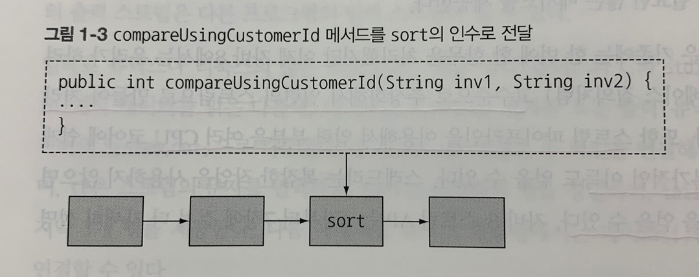

## Chapter 1 - 자바 8, 9, 10, 11 : 무슨 일이 일어나고 있는가
Java는 처음부터 많은 유용한 라이브러리를 포함하는 잘 설계된 객체지향 언어로 시작했다. 코드를 JVM 바이트 코드로 컴파일하는 특징 때문에 자바는 인터넷 애플릿 프로그램의 주요 언어가 되었다. JVM의 최신 업데이트 덕분에 경쟁 언어는 JVM에서 더 부드럽게 실행될 수 있으며, Java와 상호동작할 수 있게 되었다. 또한 자바는 임베디드 컴퓨팅 분야도 장악하고 있다.

하지만 프로그래밍 언어 생테계에 변화의 바람이 불어 프로그래머는 빅데이터라는 도전에 직면하면서 멀티코어 컴퓨터나 컴퓨팅 클러스터를 활용하여 빅데이터를 효과적으로 처리할 필요성이 커졌다. 병렬 프로세싱을 활용해야 하는 데 이전의 Java로는 충분히 대응할 수 없었다.

따라서 Java는 변화하였고 Java 8은 더 다양한 프로그래밍 도구, 다양한 프로그래밍 문제를 더 빠르고 정확하며 쉽게 유지보수할 수 있다는 장점을 제공한다. 추가된 기능들은 Java에 없던 완전히 새로운 개념이지만 현 시장에서 요구하는 기능을 효과적으로 제공한다.

## 세 가지 프로그래밍 개념
- 스트림 처리
> 스트림 API는 파이프라인을 만드는 데 필요한 많은 메서드를 제공한다. 작업을 고수준으로 추상화해서 일련의 스트림으로 만들어 처리할 수 있도록 하는데, 스트림 파이프라인을 이용해서 입력 부분을 여러 CPU 코어에 쉽게 할당할 수 있다는 부가적인 이득도 얻을 수 있다. 스레드라는 복잡한 작업을 사용하지 않으면서도 공짜로 병렬성을 얻을 수 있다.
- 동작 파라미터화로 메서드에 코드 전달하기
> 코드 일부를 API로 전달하는 기능이다. 쉽게 말해, 동작(메서드)을 파라미터화 해서 전달 가능하다. 함수형 프로그래밍 기술을 이용한다.
> 
- 병렬성과 공유 가변 데이터
> 병렬성을 공짜로 얻을 수 있지만, 포기해야하는 점이 있다. 스트림 메서드로 전달하는 코드는 다른 코드와 동시에 실행하더라도 안전하게 실행될 수 있어야 한다. 이를 위해 공유된 가변 데이터에 접근하지 않아야 한다.

## 자바 함수
Java 8에서 함수 사용법은 일반적인 프로그래밍 언어의 함수 사용법과 아주 비슷하다. 프로그래밍 언어의 핵심은 값을 바꾸는 것이다. 전통적으로 프로그래밍 언어에서는 이 값을 일급(first-class) 값(또는 시민)이라고 부른다. 이전까지 자바 프로그래밍 언어에선 기본값, 인스턴스만이 일급 시민이었다. 메서드, 클래스는 이급 시민에 해당하였는데, 런타임에 메서드를 전달할 수 있다면(메서드를 일급 시민으로 만들면) 프로그래밍에 유용하게 활용할 수 있다. 따라서 Java 8 설계자들은 이급 시민을 일급 시민으로 바꿀 수 있는 기능을 추가했다.

### 메서드 참조(method reference)
동작의 전달을 위해 익명 클래스를 만들고 메서드를 구현해서 넘길 필요 없이, 준비된 함수를 메서드 참조(::)를 이용해서 전달할 수 있다.
- 익명 클래스를 통한 파일 리스팅
```java
File[] hiddenFiles = new File(".").listFiles(new FileFilter() {
    public boolean accept(File file) {
        return file.isHidden();
    }
});
```

- 메서드 참조를 이용한 파일 리스팅
```java
File[] hiddenFiles = new File(".").listFiles(File::isHidden);
```
다음과 같이 더 이상 메서드가 이급값이 아닌 일급값임을 확인할 수 있다.     
// 메서드 참조(::) : 이 메서드를 값으로 사용하라는 의미

### 람다: 익명 함수
Java 8에서는 (기명 named) 메서드를 일급 값으로 취급할 뿐 아니라 람다(anonymous functions)를 포함하여 함수도 값으로 취급할 수 있다.
```java
filterApples(inventory, (Apple a) -> GREEN.equals(a.getColor()));
filterApples(inventory, (Apple a) -> a.getWeight() > 150);
filterApples(inventory, (Apple a) -> a. getWeight() < 80 || RED.equals(a.getColor()));
```
한 번만 사용할 메서드는 따로 정의를 구현할 필요가 없다. 위 코드는 우리가 넘겨주려는 코드를 애써 찾을 필요가 없을 정도로 더 짧고 간결하다. 하지만 람다가 몇 줄 이상으로 길어진다면 코드가 수행하는 일을 잘 설명하는 이름을 가진 메서드를 정의하고 메서드 참조를 활용하는 것이 바람직하다.(코드의 명확성이 우선시 되어야 함)

## 스트림
스트림 API를 이용하면 컬렉션 API와는 상당히 다른 방식으로 데이터를 처리할 수 있다. 컬렉션 API를 이용하면 for-each 루프를 이용해 각 요소를 반복하면서 작업을 수행했다. 이러한 방식의 반복을 외부반복(external iteration)이라 한다. 반면, 스트림 API를 이용하면 루프를 신경 쓸 필요가 없다. 스트림 API에서는 라이브러리 내부에서 모든 데이터가 처리된다. 이와 같은 반복을 내부 반복(internal iteration)이라 한다.

### 멀티스레딩
기존 스레드 API로 멀티스레딩 코드를 구현해서 병렬성을 이용하는 것은 쉽지 않다. 스트림 API는 컬렉션을 처리하면서 발생하는 모호함과 반복적인 코드 문제, 멀티코어 활용 어려움이라는 두 가지 문제를 모두 해결했다. 내부적으로 fork-join 방식을 사용한다.  

// 참고로 컬렉션은 어떻게 데이터를 저장하고 접근할지에 중점을 두지만, 스트림은 데이터에 어떤 계산을 할 것인지 묘사하는 것에 중점을 둔다. 컬렉션을 필터링할 수 있는 가장 빠른 방법은 컬렉션을 스트림으로 바꾸고, 병렬로 처리한 다음, 리스트로 다시 복원하는 것이다.
```java
import static java.util.stream.Collectors.toList;
List<Apple> heavyApples = 
    inventory.parallelStream().filter((Apple a) -> a.getWeight() > 150)
                              .collect(toList());
```

## 디폴트 메서드와 자바 모듈
기존 자바 기능으로는 대규모 컴포넌트 기반 프로그래밍과 진화하는 시스템의 인터페이스를 적절히 대응하기 어려웠다. Java 8에서 지원하는 디폴트 메서드를 이용해 기존 인터페이스를 구현하는 클래스를 바꾸지 않고도 인터페이스를 변경할 수 있다.    
(인터페이스에 새로운 메서드를 추가한다면 인터페이스를 구현하는 모든 클래스는 새로 추가된 메서드를 구현해야 된다는 문제점 해결)

예를 들어 List나 Collection 인터페이스는 이전에 stream이나 parallelStream 메서드를 지원하지 않았다. 하지만, Java 8에서 Collection 인터페이스에 stream 메서드를 추가하고 이를 디폴트 메서드로 제공하여 기존 인터페이스를 쉽게 변경할 수 있었다.

## 함수형 프로그래밍에서 가져온 다른 유용한 아이디어
Java 8에서는 NPE(Null Pointer Exception)을 피할 수 있도록 도와주는 `Optional<T>` 클래스를 제공한다.