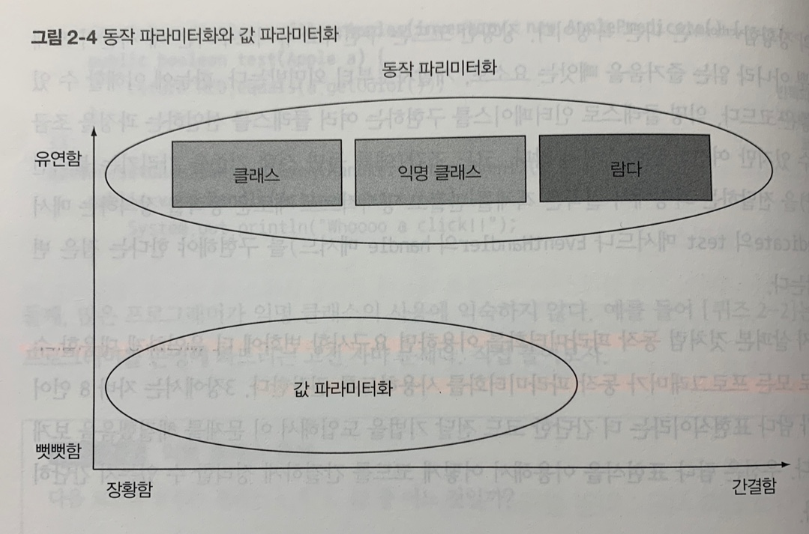

# Chapter 2 - 동작 파라미터화 코드 전달하기
동작 파라미터화란 아직은 어떻게 실행할 것인지 결정하지 않은 코드 블록을 의미한다. 동작 파라미터화를 이용하면 자주 바뀌는 요구사항에 효과적으로 대응할 수 있다.

## 동작 파라미터화
코드 전달 기법을 이용하면 동작을 메서드의 인수로 전달할 수 있다. 하지만 Java 8 이전에는 코드를 지저분하게 구현해야 했다. 익명 클래스로도 어느 정도 코드를 깔끔하게 만들 수 있지만, Java 8에서는 인터페이스를 상속받아 여러 클래스를 구현해야 하는 수고를 없앨 수 있는 방법을 제공한다.

- 선택 조건을 결정하는 (전략)인터페이스 선언(Predicate)
```java
public interface ApplePredicate {
    boolean test(Apple apple);
}
```
> 각 알고리즘(전략이라 불리는)을 캡슐화하는 알고리즘 패밀리를 정의해둔 다음에 런타임에 알고리즘을 선택하는 기법을 전략 디자인 패턴이라 한다. 위 인터페이스가 알고리즘 패밀리이고 이를 implements한 클래스가 전략이다.

- 클래스를 통한 동작 파라미터화
```java
public class AppleRedAndHeavyPredicate implements ApplePredicate {
    public boolean test(Apple apple) {
        return RED.equals(apple.getColor()) && apple.getWeight() > 150;
    }
}

List<Apple> heavyApples = filterApples(inventory, new AppleRedAndHeavyPredicate());
```
> 
> 메서드는 객체만 인수로 받으므로 가장 중요한 로직인 test 메서드를 ApplePredicate 객체로 감싸서 전달해야 한다. 동작을 추상화해서 변화하는 요구사항에 대응할 수 있는 코드를 구현하는 방법으로 좋지만, 여러 클래스를 구현해서 인스턴스화 하는 과정을 보면 여전히 개선이 필요하다.

- 익명 클래스를 통한 동작 파라미터화
```java
List<Apple> redApples = filterApples(inventory, new ApplePredicate() {
    public boolean test(Apple apple) {
        return RED.equals(apple.getColor());
    }
});
```
> Java는 클래스의 선언과 인스턴스화를 동시에 수행할 수 있도록 익명 클래스라는 기법을 제공한다. 이를 이용하면 코드의 양을 줄일 수 있다. 하지만, 여전히 반복적인 코드가 남아있다. 게다가 많은 프로그래머가 익명 클래스의 사용에 익숙하지 않다. 한눈에 이해할 수 있는 좋은 코드로 개선해보자.

- 람다를 통한 동작 파라미터화
```java
List<Apple> result = filterApples(inventory, (Apple apple) -> RED.equals(apple.getColor()));
```
>      

정렬, 스레드, GUI 처리 등 자바 API의 많은 메서드를 다양한 동작으로 파라미터화할 수 있다.
```java
// ex) java.util.Comparator
public interface Comparator<T> {
    int compare(T o1, T o2);
}
```

```java
// anonymous class
inventory.sort(new Comparator<Apple>() {
    public int compare(Apple a1, Apple a2) {
        return a1.getWeight().compareTo(a2.getWeight());
    }
});

// lamda
inventory.sort((Apple a1, Apple a2) -> a1.getWeight().compareTo(a2.getWeight()));
```

## 📌정리
- 동작 파라미터화에서는 메서드 내부적으로 다양한 동작을 수행할 수 있도록 코드를 메서드 인수로 전달한다.
- 동작 파라미터화를 이용하면 변화하는 요구사항에 더 잘 대응할 수 있는 코드를 구현할 수 있으며 나중에 엔지니어링 비용을 줄일 수 있다.
- 코드 전달 기법을 이용하면 동작을 메서드의 인수로 전달할 수 있다. 하지만 자바 8 이전에는 코드를 지저분하게 구현해야 했다. 익명 클래스로도 어느 정도 코드를 깔끔하게 만들 수 있지만 자바 8에서는 인터페이스를 상속받아 여러 클래스를 구현해야 하는 수고를 없앨 수 있는 방법을 제공한다.
- 자바 API의 많은 메서드는 정렬, 스레드, GUI 처리 등을 포함한 다양한 동작으로 파라미터화할 수 있다.