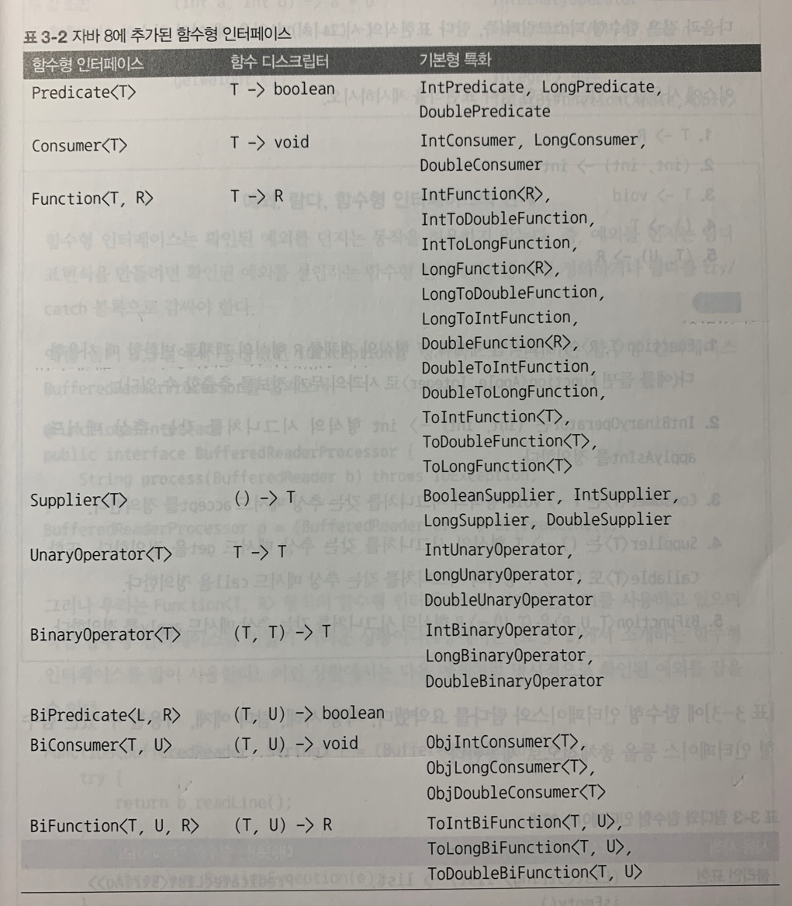

# Chapter 3 - 람다 표현식
람다 표현식은 메서드로 전달할 수 있는 익명 함수를 단순화 한 것이다. 이름은 없지만, 파라미터 리스트, 바디, 반환 형식, 발생할 수 있는 예외 리스트는 가질 수 있다.

## 람다의 특징
> - 익명 : 보통의 메서드와 달리 이름이 없으므로 익명이라 표현한다. 구현해야 할 코드에 대한 걱정거리가 줄어든다.
> - 함수 : 람다는 메서드처럼 특정 클래스에 종속되지 않으므로 함수라고 부른다. 하지만 메서드처럼 파라미터 리스트, 바디, 반환 형식, 가능한 예외 리스트를 포함한다.
> - 전달 : 람다 표현식을 메서드 인수로 전달하거나 변수로 저장할 수 있다.
> - 간결성 : 익명 클래스처럼 많은 자질구레한 코드를 구현할 필요가 없다.

## 람다의 구성
```java
/* 람다 파라미터 | 화살표 | 람다 바디 */
(Apple a1, Apple a2) -> a1.getWeight().compareTo(a2.getWeight());
```
> - 파라미터 리스트 : 람다 바디에서 사용할 메서드 파라미터를 명시한다.
> - 화살표 : 람다의 파라미터 리스트와 바디를 구분한다.
> - 람다 바디 - 람다의 반환값에 해당하는 표현식이다.

| 사용 사례 | 람다 예제 |
|---|:---|
| 불리언 표현식 | (List<String> list) -> list.isEmpty() |
| 객체 생성 | () -> new Apple(10) |
| 객체에서 소비 | (Apple a) -> { System.out.println(a.getWeight()); } |
| 객체에서 선택/추출 | (String s) -> s.length() |
| 두 값을 조합 | (int a, int b) -> a * b |
| 두 객체 비교 | (Apple a1, Apple a2) -> a1.getWeight().compareTo(a2.getWeight()) |

## 람다의 사용
### 함수형 인터페이스
> 함수형 인터페이스는 정확히 하나의 추상 메서드를 지정하는 인터페이스다. 아무리 많은 디폴트 메서드가 존재하더라도 추상 메서드가 오직 하나이면 함수형 인터페이스이다. 람다 표현식으로 함수형 인터페이스의 추상 메서드 구현을 직접 전달할 수 있으므로 전체 표현식을 인터페이스의 인스턴스로 취급할 수 있다.
📌 함수형 인터페이스에는 @FunctionalInterface 애노테이션을 함께 붙여주자. 이 애노테이션은 함수형 인터페이스임을 가리키는 애노테이션으로 만약 애노테이션을 선언했지만, 실제로 함수형 인터페이스가 아니면 컴파일 에러를 발생시킨다.

// Java API의 함수형 인터페이스들?
```java
public interface Comparator<T> { // java.util.Comparator
    int compare(T o1, T o2);
}
public interface Runnable { // java.langRunnable
    void run();
}
public interface ActionListener extends EventListener { // java.awt.event.ActionListener
    void actionPerformed(ActionEvent e);
}
public interface Callable<V> { // java.util.concurrent.Callable
    V call() throws Exception;
}
public interface PrivilegedAction<T> { // java.security.PrivilegedAction
    T run();
}
```

### 함수 디스크립터(function descriptor)
> 람다 표현식의 시그니처를 서술하는 메서드를 함수 디스크립터라고 부른다. 예를 들어, 함수형 인터페이스 Comparator의 compare 메서드의 함수 디스크립터는 `(T, T) -> int` 이다.

## 함수형 인터페이스 사용
### Predicate
(T) -> boolean
```java
@FunctionalInterface
public interface Predicate<T> {
    boolean test(T t);
}
```

예시)
```java
@FunctionalInterface
public interface Predicate<T> {
    boolean test(T t);
}
public <T> List<T> filter(List<T> list, Predicate<T>) {
    List<T> result = new ArrayList<>();
    for(T t : list) {
        if(p.test(t)) {
            results.add(t);
        }
    }
    return results;
}
Predicate<String> nonEmptyStringPredicate = (String s) -> !s.isEmpty();
List<String> nonEmpty = filter(listOfStrings, nonEmptyStringPredicate);
```

### Consumer
(T) -> void
```java
@FunctionalInterface
public interface Consumer<T> {
    void accept(T t);
}
```

예시)
```java
@FunctionalInterface
public interface Consumer<T> {
    void accept(T t);
}
public <T> void forEach(List<T> list, Consumer<T> c) {
    for(T t : list) {
        c.accept(t);
    }
}
forEach(
    Arrays.asList(1,2,3,4,5),
    (Integer i) -> System.out.println(i)    // Consumer의 accept 메서드를 구현하는 람다
);
```

### Supplier
() -> T
```java
@FunctionalInterface
public interface Supplier<T> {
    T get();
}
```

예시)
```java
@FunctionalInterface
public interface Supplier<T> {
    T get();
}
BufferedReader br = new BufferedReader(new InputStreamReader(System.in));
BooleanSupplier bs = () -> {
    int a = Integer.parseInt(br.readLine());
    if(a > 0) return true;
    else return false;
};
System.out.println(bs.getAsBoolean());
```

### Function
(T) -> R
```java
@FunctionalInterface
public interface Function<T, R> {
    R apply(T t);
}
```

예시)
```java
@FunctionalInterface
public interface Function<T, R> {
    R apply(T t);
}
public <T, R> List<R> map(List<T> list, Function<T, R> f) {
    List<R> result = new ArrayList<>();
    for(T t : list) {
        result.add(f.apply(t));
    }
    return result;
}
List<Integer> l = map(
    Arrays.asList("lambdas", "in", "action"),
    (String s) -> s.length()    // Function의 apply 메서드를 구현하는 람다
);
```

### 기본형 특화
제네릭은 참조형 타입만 지정할 수 있다. Integer와 Long과 같이 기본타입에 대해 박싱된 타입을 통해 제네릭을 이용할 수 있지만, 오토박싱으로 인해 변환 비용이 소모된다. Java 8에 추가된 함수형 인터페이스는 기본형을 입출력으로 사용하는 상황에서 오토박싱 동작을 피할 수 있도록 기본형에 특화된 버전의 함수형 인터페이스를 제공한다.

앞서 본 함수형 인터페이스의 이름 앞에 사용하는 기본형 타입의 이름을 합친 이름으로 제공된다. (ex. 파라미터로 int를 받는 Predicate인 IntPredicate)
```java
@FunctionalInterface
public interface IntPredicate {
    boolean test(int value);
}
```
📌 Java 8에 추가된 함수형 인터페이스


- Unary - 파라미터 타입과 반환 타입이 같은 경우    
```java
@FunctionalInterface
public interface UnaryOperator<T> extends Function<T, T> {}
```

- Bi - 파라미터 인자가 두 개인 경우
```java
@FunctionalInterface
public interface BiFunction<T, U, R> {
    R apply(T t, U u);
}
```


## 함수형 인터페이스와 예외
> java.util.function의 함수형 인터페이스는 확인된 예외를 던지는 동작을 허용하지 않는다. 즉, 예외를 던지는 람다 표현식을 만드려면 확인된 예외를 선언하는 함수형 인터페이스를 직접 정의하거나, 람다를 try/catch 블록으로 감싸야 한다.
```java
Function<BufferedReader, String> f = (BufferedReader br) -> {
    try {
        return b.readLine();
    }
    catch(IOException e) {
        throw new RuntimeException(e);
    }
};
```

## 형식 검사, 형식 추론, 제약
### 형식 검사
람다가 사용되는 콘텍스트(context)를 이용해서 람다의 형식(type)을 추론할 수 있다. 어떤 콘텍스트에서 기대되는 람다의 형식을 대상 형식(target type) 이라고 부른다. 형식 검사는 다음과 같은 과정으로 진행된다.
> 1. 람다가 사용된 메서드의 선언을 확인한다.
> 2. 람다가 사용된 메서드의 파라미터로 대상 형식을 기대한다.
> 3. 기대하는 파라미터의 함수형 인터페이스를 파악한다.
> 4. 그 함수형 인터페이스의 함수 디스크립터를 묘사한다.
> 5. 전달받은 인수의 람다가 그 요구사항을 만족해야 한다.

### 형식 추론
제네릭을 사용할 때 선언부에 타입 매개변수를 명시하면 생성자에서는 빈 다이아몬드 연산자(<>)로 남겨두어도 자바 컴파일러는 생성 객체의 타입을 추론할 수 있다. 람다 표현식도 동일하다. 자바 컴파일러는 람다 표현식이 사용된 콘텍스트를 이용해서 람다 표현식과 관련된 함수형 인터페이스를 추론한다.
```java
// 형식 추론을 하지 않음
Comparator<Apple> c =
    (Apple a1, Apple a2) -> a1.getWeight().compareTo(a2.getWeight());

// 형식을 추론함
Comparator<Apple> c =
    (a1, a2) -> a1.getWeight().compareTo(a2.getWeight());
```

### 지역 변수 사용 / 제약
람다 표현식에서는 익명 함수가 하는 것 처럼 자유 변수(파라미터로 넘겨진 변수가 아닌 외부에서 정의된 변수)를 활용할 수 있다. 이를 람다 캡쳐링(capturing lambda)이라 부른다. 하지만, 그러려면 지역 변수는 명시적으로 final로 선언되어 있어야 하거나 실질적으로 final로 선언된 변수와 똑같이 사용되어야 한다.(이후 재 할당 불가)

인스턴스 변수는 힙에 저장되는 반면, 지역 변수는 스택에 위치한다. 람다에서 지역 변수에 바로 접근할 수 있다는 가정하에 람다가 스레드에서 실행된다면 지역 변수를 할당한 스레드가 사라져서 변수 할당이 해제되었는데도 람다를 실행하는 스레드에서는 해당 변수에 접근하려 할 수 있다. 따라서 자바 구현에서는 원래 변수에 접근을 허용하는 것이 아니라 자유 지역 변수의 복사본을 제공한다. 따라서 복사본의 값이 바뀌지 않아야 하므로 지역 변수에는 한 번만 값을 할당해야 한다는 제약이 생긴 것이다.

## 메서드 참조
명시적으로 메서드 명을 참조함으로써 가독성을 높일 수 있다. 메서드 참조는 메서드명 앞에 구분자(::)를 붙이는 방식으로 사용할 수 있다. Class::method 형식을 취한다. 메서드 참조는 세 가지 유형으로 구분할 수 있다.
> 1. 정적 메서드 참조 - Integer::parseInt
> 2. 다양한 형식의 인스턴스 메서드 참조 - String::length
> 3. 기존 객체의 인스턴스 메서드 참조 - Apple::getWeight

또한 ClassName::new 처럼 클래스명과 new 키워드를 이용해 기존 생성자의 참조를 만들 수 있다. 이는 정적 메서드의 참조를 만드는 방식과 비슷하다.
```java
Supplier<Apple> c1 = Apple::new;
Apple a1 = c1.get();

Function<Integer, Apple> c2 = Apple::new;
Apple a2 = c2.apply(110);
```

## 람다 표현식을 조합할 수 있는 유용한 메서드
함수형 인터페이스에서는 다양한 유틸리티 메서드를 지원한다. Comparator, Function, Predicate 같은 함수형 인터페이스는 람다 표현식을 조합할 수 있도록 유틸리티 메서드를 제공하며, 간단한 여러 개의 람다 표현식을 조합해서 복잡한 람다 표현식을 만들 수 있다. 이 유틸리티 메서드는 디폴트 메서드로 제공되어 함수형 인터페이스의 정의를 해치지 않으며 여러 조합을 가능케 하는 유틸리티를 제공한다.

### Comparator
- comparing : 비교에 사용할 Function 기반의 키 지정
- reversed : 역정렬
- thenComparing : 동일한 조건에 대하여 추가적인 비교
```java
inventory.sort(comparing(Apple::getWeight)
         .reversed()
         .thenComparing(Apple::getCountry));
```

### Predicate
- and - and 연산
- or - or 연산
- negate - not 연산
```java
Predicate<Apple> notRedApple = redApple.negate();

Predicate<Apple> redAndHeavyAppleOrGreen =
    redApple.and(apple -> apple.getWeight() > 150)
            .or(apple -> GREEN.equals(a.getColor()));
```

### Function
- andThen : 이후에 처리할 function 추가
- compose : 이전에 처리되어야 할 function 추가
```java
Function<Integer, Integer> f = x -> x + 1;
Function<Integer, Integer> g = x -> x * 2;
Function<Integer, Integer> h1 = f.andThen(g);
int result1 = h1.apply(1); // 4를 반환

Function<Integer, Integer> h2 = f.compose(g);
int result2 = h2.apply(1); // 3을 반환
```

## 📌정리
- 람다 표현식은 익명 함수의 일종이다. 이름은 없지만, 파라미터 리스트, 바디, 반환 형식을 가지며 예외를 던질 수 있다.
- 람다 표현식으로 간결한 코드를 구현할 수 있다.
- 함수형 인터페이스는 하나의 추상 메서드만을 정의하는 인터페이스다.
- 함수형 인터페이스를 기대하는 곳에서만 람다 표현식을 사용할 수 있다.
- 람다 표현식을 이용해서 함수형 인터페이스의 추상 메서드를 즉석으로 제공할 수 있으며 람다 표현식 전체가 함수형 인터페이스의 인스턴스로 취급된다.
- java.util.function 패키지는 Predicate<T>, Function<T, R>, Supplier<T>, Consumer<T>, BinaryOperator<T> 등을 포함해서 자주 사용하는 다양한 함수형 인터페이스를 제공한다.
- Java 8은 Predicate<T>와 Function<T, R> 같은 제네릭 함수형 인터페이스와 관련한 박싱 동작을 피할 수 있는 IntPredicate, IntToLongFunction 등과 같은 기본형 특화 인터페이스도 제공한다.
- 실행 어라운드 패턴(예를 들어 자원 할당, 자원 정리 등 코드 중간에 실행해야 하는 메서드에 꼭 필요한 코드)을 람다와 활용하면 유연성과 재사용성을 추가로 얻을 수 있다.
- 람다 표현식의 기대형식(type expected)을 대상 형식(target type)이라고 한다.
- 메서드 참조를 이용하면 기존의 메서드 구현을 재사용하고 직접 전달할 수 있다.
- Comparator, Predicate, Function 같은 함수형 인터페이스는 람다 표현식을 조합할 수 있는 다양한 디폴트 메서드를 제공한다.