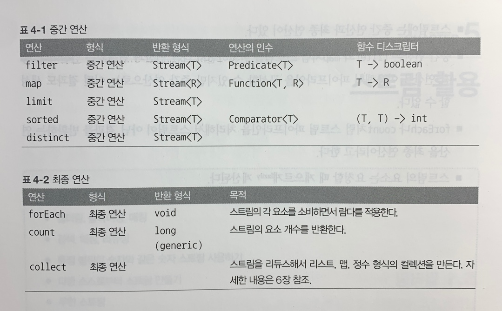

# Chapter 4 - 스트림 소개
## 스트림이란 무엇인가?
스트림(Stream)은 Java 8 API에 새로 추가된 기능이다. 스트림을 이용하면 선언형(데이터를 처리하는 임시 구현 코드 대신 질의로 표현할 수 있다)으로 컬렉션 데이터를 처리할 수 있다. 또한 멀티스레드 코드를 구현하지 않아도 데이터를 투명하게 병렬로 처리할 수 있다.

저칼로리의 요리명을 반환하고, 칼로리를 기준으로 요리를 정렬하는 코드가 있다.
```java
List<Dish> lowCaloricDishes = new ArrayList<>();
for(Dish dish : menu) {
    if(dish.getCalories() < 400>) {
        lowCaloricDishes.add(dish);
    }
}
Collections.sort(lowCaloricDishes, new Comparator<Dish>() {
    public int compare(Dish dish1, Dish dish2) {
        return Integer.compare(dish1.getCalories(), dish2.getCalories());
    }
});
List<String> lowCaloricDishesName = new ArrayList<>();
for(Dish dish : lowCaloricDishes) {
    lowCaloricDishesName.add(dish.getName());
}
```
lowCaloricDishes라는 '가비지 변수'를 사용했다. 이는 컨테이너 역할만 하는 중간 변수이다.

```java
import static java.util.Comparator.comparing;
import static java.util.stream.Collectors.toList;
List<String> lowCaloricDishesName = menu.stream()
                                        .filter(d -> d.getCalories() < 400)
                                        .sorted(comparing(Dish::getCalories))
                                        .map(Dish::getName)
                                        .collect(toList());
```
스트림으로 처리한 똑같은 로직이다.

스트림을 이용할 때의 장점은 다음과 같다.
- 선언형으로 코드를 구현할 수 있다.   
// 기존 코드를 복사하여 붙여 넣는 방식을 사용하지 않고 람다 표현식을 이용하여 쉽게 구현 가능.
- 가비지 변수를 만들지 않는다.
- 여러 빌딩 블록 연산을 연결해서 복잡한 데이터 처리 파이프라인을 만들 수 있으며, 여전히 가독성과 명확성이 유지된다.
- filter, map, sorted, collect 같은 연산은 고수준 빌딩 블록(high-level building block)으로 이루어져 있으므로 특정 스레딩 모델에 제한되지 않고 자유롭게 어떤 상황에서든 사용할 수 있다.

스트림 API의 특징을 다음과 같이 요약할 수 있다.
- 선언형: 더 간결하고 가독성이 좋아진다.
- 조립할 수 있음: 유연성이 좋아진다.
- 병렬화: 성능이 좋아진다.

## 스트림 시작하기
스트림이란 '데이터 처리 연산을 지원하도록 소스에서 추출된 연속된 요소'로 정의할 수 있다.
- 연속된 요소: 스트림은 특정 요소 형식으로 이루어진 연속된 값 집합의 인터페이스를 제공한다. filter, sorted, map처럼 표현 계산식이 주를 이룬다.
- 소스: 스트림은 컬렉션, 배열, I/O 자원 등의 데이터 제공 소스로부터 데이터를 소비한다.
- 데이터 처리 연산: 스트림은 함수형 프로그래밍 언어에서 일반적으로 지원하는 연산과 데이터베이스와 비슷한 연산을 지원하며, 순차적으로 또는 병렬로 실행할 수 있다.

스트림은 다음과 같은 두 가지 중요 특징이 있다.
- 파이프라이닝(Pipelining): 스트림 연산은 스트림 연산끼리 연결해서 커다란 파이프라인을 구성할 수 있도록 스트림 자신을 반환한다. 그 덕분에 게으름(lazyness), 쇼트서킷(short-circuiting) 같은 최적화도 얻을 수 있다.
- 내부 반복: 반복자를 이용해서 명시적으로 반복하는 컬렉션과 달리 스트림은 내부 반복을 지원한다.

## 스트림과 컬렉션
컬렉션과 스트림 모두 연속된 요소 형식의 값을 저장하는 자료구조의 인터페이스를 제공한다.    
컬렉션과 스트림의 가장 큰 차이는 _데이터를 언제 계산하느냐_ 이다.    
컬렉션은 현재 자료구조가 포함하는 모든 값을 메모리에 저장하는 자료구조이다. 즉, __컬렉션의 모든 요소는 컬렉션에 추가하기 전에 계산되어야 한다.__ 반면 스트림은 이론적으로 __요청할 때만 요소를 계산__ 하는 고정된 자료구조다. 이러한 스트림의 특성은 __게으른 생성__ 을 가능하게 한다.

스트림은 반복자와 마찬가지로 한 번만 탐색할 수 있다. 탐색된 스트림의 요소는 소비된다.

## 외부 반복과 내부 반복
컬렉션 인터페이스를 사용하려면 사용자가 직접 요소를 반복해야 한다. for-each나 Iterator를 이용해서 반복할 수 있으며 이를 __외부 반복(external iteration)__ 이라고 한다. 반면 스트림 라이브러리는 반복을 알아서 처리하고 결과 스트림 값을 저장해주는 __내부 반복(internal iteration)__ 을 사용한다.

ex) 컬렉션: for-each 루프를 이용하는 외부 반복
```java
List<String> names = new ArrayList<>();
for(Dish dish : menu) {    // 메뉴 리스트를 명시적으로 순차 반복한다.
    names.add(dish.getName()); // 이름을 추출해서 리스트에 추가한다.
}
```

ex) 스트림: 내부반복
```java
List<String> names = menu.stream()
                         .map(Dish::getName) // map 메서드를 getName 메서드로 파라미터화 해서 요리명을 추출함.
                         .collect(toList()); // 파이프라인을 실행한다. 반복자는 필요 없음
```

내부 반복을 이용하면 작업을 투명하게 병렬로 처리하거나 더 최적화된 다양한 순서로 처리할 수 있다. 스트림 라이브러리의 내부 반복은 데이터 표현과 하드웨어를 활용한 병렬성 구현을 자동으로 선택한다. 반면 for-each를 이용하는 외부 반복에서는 병렬성을 스스로 관리해야 한다.

## 스트림 연산: 중간 연산과 최종 연산
스트림은 연결할 수 있는 스트림 연산인 __중간 연산(intermediate operation)__ 과 스트림을 닫는 연산인 __최종 연산(terminal operation)__ 으로 구성된다.

중간 연산은 다른 스트림을 반환한다. 따라서 여러 중간 연산을 연결해서 질의를 만들 수 있다. 중간 연산의 가장 중요한 특징은 단말 연산을 스트림 파이프라인에 실행하기 전까지는 아무 연산도 수행하지 않는다는 것, 즉 게으르다(lazy)는 것이다. 중간 연산을 합친 다음에 합쳐진 중간 연산을 최종 연산으로 한 번에 처리하기 때문이다.
```java
List<String> names = menu.stream() // 스트림 open
                         .filter(dish -> { // 중간 연산 시작
                                 System.out.println("filtering:" + dish.getName());
                                 return dish.getCalories() > 300;
                         }) // 필터링한 요리명을 출력한다.
                         .map(dish -> {
                                 System.out.println("mapping:" + dish.getName());
                                 return dish.getName();
                         }) // 추출한 요리명을 출력한다.
                         .limit(3) // 중간 연산 끝. short-circuit
                         .collect(toList());
System.out.println(names);
```
```bash
// 실행 결과
filtering:pork
mapping:pork
filtering:beef
mapping:beef
filtering:chicken
mapping:chicken
[pork, beef, chicken]
```

스트림의 게으른 특성 덕분에 얻을 수 있는 몇 가지 최적화 효과가 있다.
- 쇼트 서킷: 모든 연산을 다 해보기 전에 조건을 만족하면 추가적인 불필요한 연산을 하지 않는다. 위의 예시에서는 limit 연산이 쇼트 서킷 연산에 해당된다. 3개의 결과를 얻은 후 앞선 filter와 map연산은 더 이상 수행할 필요가 없어 빠르게 최종 연산을 수행한다.
- 루프 퓨전(loop fusion): 위의 예시 코드에서 filter와 map 연산에 값을 print 하는 과정을 추가한다면 filter와 map은 서로 다른 연산이지만 한 과정으로 병합되어 처리됨을 확인할 수 있다. 루프 퓨전은 이렇게 둘 이상의 연산이 합쳐 하나의 연산으로 처리됨을 말한다.

최종 연산은 스트림 파이프라인에서 결과를 도출한다. 스트림 이외의 결과가 반환되는 연산을 말한다.



## 📌정리
- 스트림은 소스에서 추출된 연속 요소로, 데이터 처리 연산을 지원한다.
- 스트림은 내부 반복을 지원한다. 내부 반복은 filter, map, sorted 등의 연산으로 반복을 추상화한다.