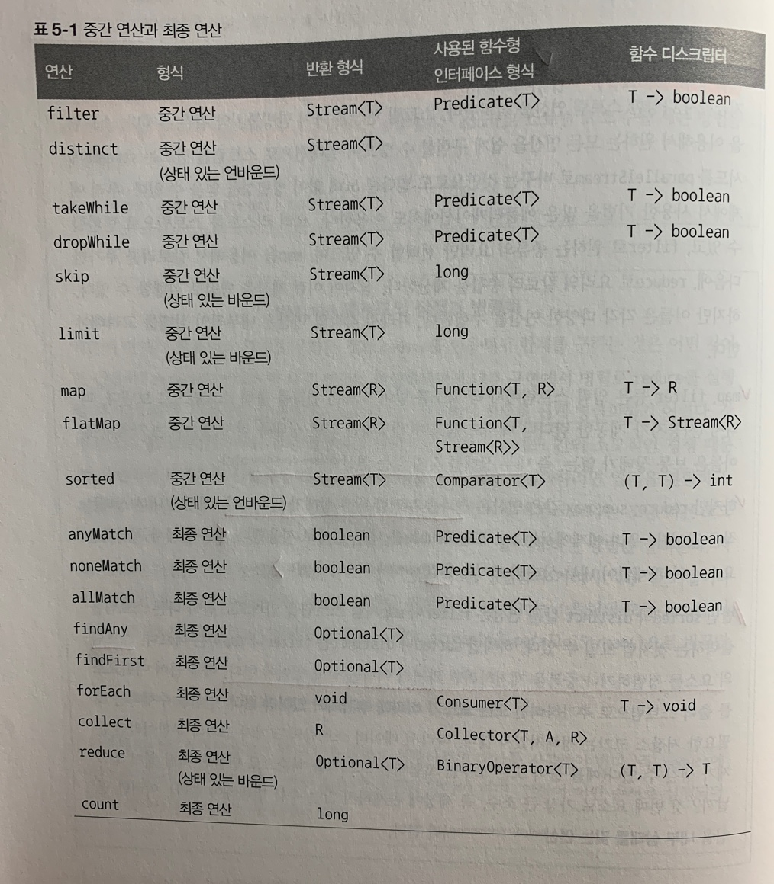

# Chapter 5 - 스트림 활용
스트림 API가 지원하는 다양한 연산을 살펴보자.

## 필터링
- filter - Predicate를 통한 필터링
```java
Stream<T> filter(Predicate<? super T> predicate);
```
예시)
```java
List<Dish> vegetarianMenu = menu.stream()
                                .filter(Dish::isVegetarian)
                                .collect(toList());
```
- distinct - 고유 요소만 필터링
```java
Stream<T> distinct();
```
예시)
```java
List<Integer> numbers = Arrays.asList(1, 2, 1, 3, 3, 2, 4);
numbers.stream()
       .filter(i -> i % 2 == 0)
       .distinct()
       .forEach(System.out::println);
```

## 스트림 슬라이싱
### 1. Predicate를 통한 슬라이싱
- takeWhile: Predicate의 결과가 true인 요소에 대한 필터링. Predicate가 처음으로 거짓이 되는 지점에 연산을 멈춘다.
```java
Stream<T> takeWhile(Predicate<? super T> predicate)
```
- dropWhile: Predicate의 결과가 false인 요소에 대한 필터링. Predicate가 처음으로 거짓이 되는 지점까지 발견된 요소를 버린다.
```java
Stream<T> dropWhile(Predicate<? super T> predicate)
```

### 2. 스트림 축소
- limit: 주어진 값 이하의 크기를 갖는 새로운 스트림을 반환한다.
```java
Stream<T> limit(long maxSize);
```

### 3. 요소 건너뛰기
- skip: 처음 n개 요소를 제외한 스트림을 반환한다.
```java
Stream<T> skip(long n);
```

## 매핑
### 1. 스트림의 각 요소에 함수 적용하기
- map: 함수를 인수로 받아 새로운 요소로 매핑된 스트림을 반환한다. 기본형 요소에 대한 mapToType 메서드도 지원한다.(mapToInt, mapToLong, mapToDouble)
```java
<R> Stream<R> map(Function<? super T, ? extends R> mapper);
```
예시) 중복 문자를 필터링 하는 예제코드 1
```java
String[] words = {"Hello", "World"};

Arrays.stream(words)
      .map(word -> word.split("")) // Stream<String[]> 반환
      .map(Arrays::stream)
      .distinct()
      .collect(Collectors.toList())
      .forEach(System.out::print);

// 결과: java.util.stream.ReferencePipeline$Head@30c7da1ejava.util.stream.ReferencePipeline$Head@5b464ce8
```
// map이 반환한 스트림의 형식은 `Stream<String[]>` 이다. 따라서 최종 결과가 `List<String[]>`가 되어 원하는 출력 결과를 얻을 수 없게 된다. `Arrays.stream`을 활용해서 각 배열을 별도의 스트림으로 생성하여 바꿀 수는 있지만, 이 경우 최종 결과는 `List<Stream<String>>`이 되어 문제가 해결되지 않는다.

### 2. 스트림 평면화
- flatMap: 제공된 함수를 각 요소에 적용하여 새로운 하나의 스트림으로 매핑한다. 결과적으로 하나의 평면화 된 스트림을 반환한다.
```java
<R> Stream<R> flatMap(Function<? super T, ? extends Stream<? extends R>> mapper);
```
예시) 중복 문자를 필터링 하는 예제코드 2
```java
String[] words = {"Hello", "World"};

Arrays.stream(words)
      .map(word -> word.split(""))
      .flatMap(Arrays::stream)
      .distinct()
      .collect(Collectors.toList())
      .forEach(System.out::print);

// 결과: HeloWrd
```
// flatMap을 사용하면 각 배열을 스트림이 아니라 스트림의 콘텐츠로 매핑하기 때문에 결과적으로 원하는 결과를 얻을 수 있다.

## 검색과 매칭 (쇼트 서킷)
- anyMatch: Predicate가 주어진 스트림에서 적어도 한 요소와 일치하는지 확인하는 최종 연산(일치하는 순간 true 반환)  
// 불리언을 반환하므로 최종연산임.
```java
boolean anyMatch(Predicate<? super T> predicate);
```
- allMatch: 스트림의 모든 요소가 주어진 Predicate와 일치하는지 검사하는 최종연산(일치하지 않는 순간 false 반환)
```java
boolean allMatch(Predicate<? super T> predicate);
```
- noneMatch: 모든 요소가 일치하지 않는지 검사하는 최종 연산(일치하는 순간 false 반환)
```java
boolean noneMatch(Predicate<? super T> predicate);
```
- findFirst: 첫 번째 요소를 찾아 반환한다. 순서가 정해져 있을 때 사용한다.
```java
Optional<T> findFirst();
```
- findAny: 요소를 찾으면 반환한다. 요소의 반환순서가 상관없을 때 findFirst 대신 사용된다.
```java
Optional<T> findAny();
```

## 리듀싱
reduce 연산을 이용해서 '메뉴의 모든 칼로리의 합계를 구하시오', '메뉴에서 칼로리가 가장 높은 요리는?' 같이 스트림 요소를 조합해서 더 복잡한 질의를 표현하는 방법을 알아보자.

- reduce: 모든 스트림 요소를 BinaryOperator로 처리해서 값으로 도출한다. 두 번재 reduce 메서드와 같은 경우 초기값(identity)이 없으므로 아무 요소가 없을 때를 위해 `Optional<T>`를 반환한다.
```java
T reduce(T identity, BinaryOperator<T> accumulator);
Optional<T> reduce(BinaryOperator<T> accumulator);
<U> U reduce(U identity, BiFunction<U, ? super T, U> accumulator, BinaryOperator<U> combiner);

// 예시
int sum = numbers.stream().reduce(0, Integer::sum);
// 예시: 초깃값 없음
Optional<Integer> sum = numbers.stream().reduce((a, b) -> (a + b));
```

- max, min: 요소에서 최댓값과 최솟값을 반환한다. 마찬가지로, 빈 스트림일 수 있기에 `Optional<T>`를 반환한다.
```java
Optional<T> max(Comparator<? super T> comparator);
Optional<T> min(Comparator<? super T> comparator);

// 예시
Optional<Integer> max = numbers.stream().reduce(Integer::max);
```
> 💡 reduce 메서드의 장점과 병렬화
> 
> 기존의 단계적 반복으로 합계를 구하는 것보다 reduce를 이용하면 내부 반복이 추상화되면서 내부 구현에서 병렬로 reduce를 실행할 수 있게 된다. 반복적인 합계에서는 sum 변수를 공유해야 하므로 쉽게 병렬화 하기 어렵다. 스트림은 내부적으로 fork/join 프레임워크를 통해 이를 처리한다.

> 💡 스트림 연산: 상태 없음과 상태 있음
> 
> 각각의 스트림 연산은 상태를 갖는 연산과 상태를 갖지 않는 연산으로 나뉘어져 있다.
> 
> map, filter 등은 입력 스트림에서 각 요소를 받아 0 또는 결과를 출력 스트림으로 보낸다. 따라서 이들은 보통 상태가 없는, 즉 __내부 상태를 갖지 않는 연산(stateless operation)__ 이다.
> 
> 하지만 reduce, sum, max 같은 연산은 결과를 누적할 내부 상태가 필요하다. 스트림에서 처리하는 요소 수와 관계없이 내부 상태의 크기는 __한정(bounded)__ 되어 있다.
> 
> 반면 sorted나 distinct 같은 연산은 스트림의 요소를 정렬하거나 중복을 제거하기 위해 과거의 이력을 알고 있어야 한다. 얘를 들어 어떤 요소를 출력 스트림으로 추가하려면 __모든 요소가 버퍼에 추가되어 있어야 한다.__ 따라서 데이터 스트림의 크기가 크거나 무한이라면 문제가 생길 수 있다. 이러한 연산을 __내부 상태를 갖는 연산(stateful operation)__ 이라 한다.

## 숫자형 스트림
스트림 API는 박싱 비용을 피하며 숫자 스트림을 효율적으로 처리할 수 있도록 기본형 특화 스트림(primitive stream specialization)을 제공한다.
### 1. 기본형 특화 스트림
기본형 특화 스트림으로 `IntStream`, `DoubleStream`, `LongStream`이 존재하며 각각의 인터페이스에는 숫자 스트림의 합계를 계산하는 sum, 최댓값 요소를 검색하는 max 같이 자주 사용하는 숫자 관련 리듀싱 연산 메서드를 제공한다. 또한 필요할 때 다시 객체 스트림으로 복원하는 기능도 제공한다.
```java
int calories = menu.stream() // Stream<Dish> 반환
                   .mapToInt(Dish::getCalories) // IntStream 반환
                   .sum();
```

### 2. 객체 스트림으로 복원하기
`boxed` 메서드를 이용하면 특화 스트림을 일반 스트림으로 변환할 수 있다.
```java
Stream<Integer> boxed(); // in IntStream

// 예시
IntStream intStream = menu.stream().mapToInt(Dish::getCalories);
Stream<Integer> stream = intStream.boxed();
```

### 3. 숫자 범위
특정 범위의 숫자를 이용해야 할 때 `range`와 `rangeClosed`메서드를 사용할 수 있다. 이는 IntStream, LongStream 두 기본형 특화 스트림에서 지원된다. 두 메서드 모두 첫 번째 인수로 시작값을, 두 번째 인수로 종료값을 갖는다. range는 시작값과 종료값이 결과에 포함되지 않는 반면, rangeClosed는 시작값과 종료값이 결과에 포함된다는 점이 다르다.

예시)
```java
IntStream evenNumbers = IntStream.rangeClosed(1, 100) // [1, 100]의 범위
                                 .filter(n -> n % 2 == 0);
System.out.println(evenNumbers.count()); // 50개 출력
```

## 스트림 만들기
### 1. 값으로 스트림 만들기
정적 메서드 `Stream.of`를 이용하여 스트림을 만들 수 있다.

### 2. null이 될 수 있는 객체로 스트림 만들기
Java 9 부터 지원되며 `Stream.ofNullable` 메서드를 이용하여 null 될 수 있는 객체를 지원하는 스트림을 만들 수 있다.

### 3. 배열로 스트림 만들기
배열을 인수로 받는 정적 메서드 `Arrays.stream`을 이용하여 스트림을 만들 수 있다.

### 4. 파일로 스트림 만들기
파일을 처리하는 등의 I/O 연산에 사용하는 자바의 NIO API(비블록 I/O)도 스트림 API를 활용할 수 있도록 업데이트되었다. java.nio.file.Files의 많은 정적 메서드가 스트림을 반환한다. 예를 들어 `Files.lines`는 주어진 파일의 행 스트림을 문자열로 반환한다.

### 5. 함수로 무한 스트림 만들기
`Stream.iterate`와 `Stream.generate`를 통해 함수를 이용하여 무한 스트림을 만들 수 있다. iterate와 generate에서 만든 스트림은 요청할 때마다 주어진 함수를 이용해서 값을 만든다. 따라서 무제한으로 값을 계산할 수 있지만, 보통 무한한 값을 출력하지 않도록 `limit(n)` 함수를 함께 연결해서 사용한다.
- Stream.iterate
```java
public static<T> Stream<T> iterate(final T seed, final UnaryOperator<T> f)
```
- Stream.generate
```java
public static<T> Stream<T> generate(Supplier<T> s)
```

## 📌정리
- 스트림 API를 이용하면 복잡한 데이터 처리 질의를 표현할 수 있다.
- filter, distinct, takeWhile(Java 9), dropWhile(Java 9), skip, limit 메서드로 스트림을 필터링하거나 자를 수 있다.
- 소스가 정렬되어 있다는 사실을 알고 있을 때 takeWhile과 dropWhile 메소드를 효과적으로 사용할 수 있다.
- map, flatMap 메서드로 스트림의 요소를 추출하거나 변환할 수 있다.
- findFirst, findAny 메서드로 스트림의 요소를 검색할 수 있다. allMatch, noneMatch, anyMatch 메서드를 이용해서 주어진 프레디케이트와 일치하는 요소를 스트림에서 검색 할 수 있다.
- 이들 메서드는 쇼트 서킷(short-circuit), 즉 결과를 찾는 즉시 반환하며, 전체 스트림을 처리하지는 않는다.
- reduce 메서드로 스트림의 모든 요소를 반복 조합하며 값을 도출할 수 있다. 예를 들어 reduce로 스트림의 최댓값이나 모든 요소의 합계를 계산할 수 있다.
- filter, map 등은 상태를 저장하지 않는 상태 없는 연산(stateless operation)이다. reduce 같은 연산은 값을 계산하는 데 필요한 상태를 저장한다. sorted, distinct 등의 메서드는 새로운 스트림을 반환하기에 앞서 스트림의 모든 요소를 버퍼에 저장해야 한다. 이런 메서드를 상태 있는 연산(stateful operation) 이라고 부른다.
- IntStream, DoubleStream, LongStream은 기본형 특화 스트림이다. 이들 연산은 각각의 기본형에 맞게 특화되어 있다.
- 컬렉션뿐 아니라 값, 배열, 파일, iterate와 generate 같은 메서드로도 스트림을 만들 수 있다.
- 무한한 개수의 요소를 가진 스트림을 무한 스트림이라 한다.

