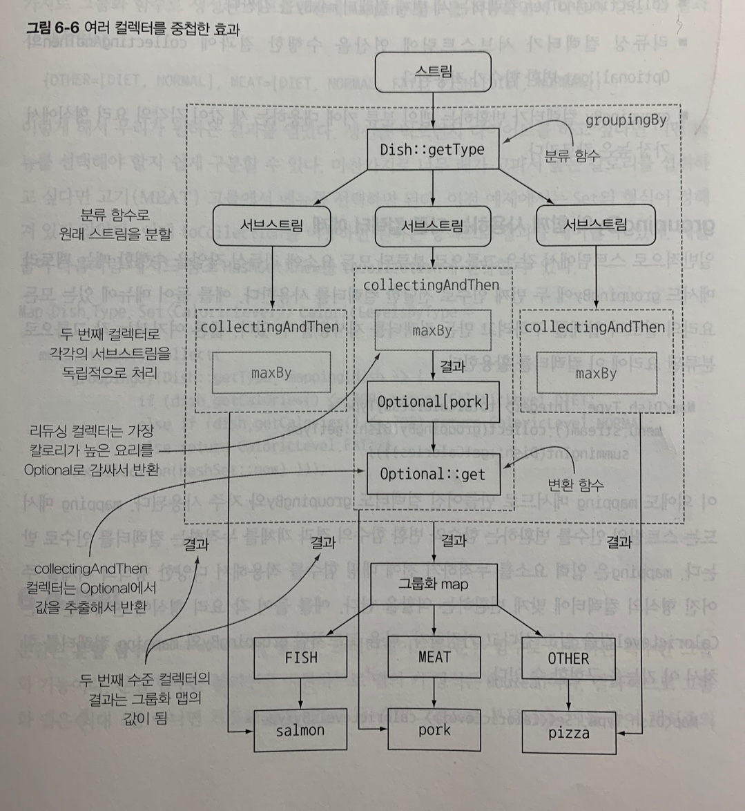
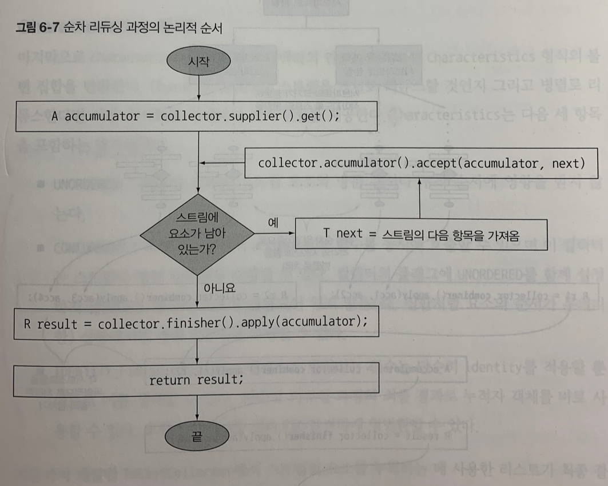
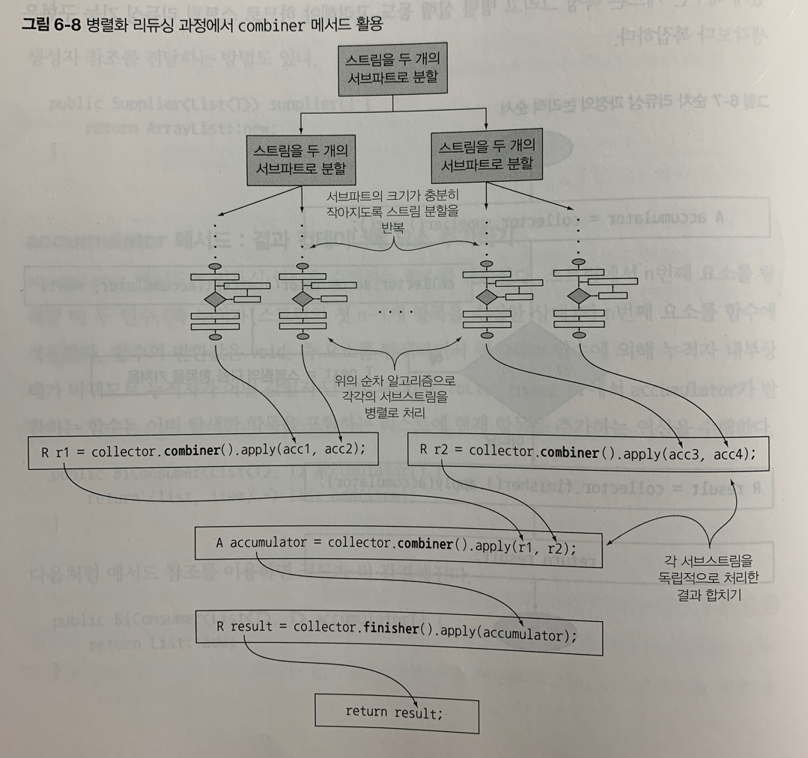

# Chapter 6 - 스트림으로 데이터 수집
## Collector
Collector 인터페이스 구현은 스트림 요소를 어떤 식으로 도출할 지 지정한다. 훌륭하게 설계된 함수형 API의 장점으론 **높은 수준의 조합성**과 **재사용성**을 꼽을 수 있다. Collector 인터페이스 메서드를 어떻게 구현하느냐에 따라 스트림에 어떤 리듀싱 연산을 수행할 지 결정된다. **Collectors 유틸리티 클래스**는 자주 사용하는 컬렉터 인스턴스를 손쉽게 생성할 수 있는 정적 팩토리 메서드를 제공한다.

Collector에서 제공하는 메서드의 기능은 크게 세 가지로 구분할 수 있다.
- 스트림 요소를 하나의 값으로 리듀스하고 요약
- 요소 그룹화
- 요소 분할

## 리듀싱과 요약
- counting: 개수를 카운트한다.
- maxBy, minBy: 최대 혹은 최소를 만족하는 요소를 찾는다.
- summingint: 객체를 int로 매핑하는 인수를 받아 합을 계산한다.
- averagingInt: 객체를 int로 매핑하는 인수를 받아 평균을 계산한다.
- summarizingInt: 요소 수, 합계, 평균, 최댓값, 최솟값 등을 계산한다.
- joining: 내부적으로 StringBuilder를 이용해서 문자열을 하나로 만든다.

### collect와 reduce
collect와 reduce를 이용하면 동일한 기능을 구현할 수 있다. 하지만 의미론적인 문제와 실용성 문제 등에 대한 차이가 존재한다.

collect 메서드는 도출하려는 결과를 누적하는 컨테이너를 바꾸도록 설계된 메서드인 반면, reduce는 두 값을 하나로 도출하는 불변형 연산이라는 점에서 의미론적인 차이가 존재한다.

여러 스레드가 동시에 같은 데이터 구조체를 고치면 리스트 자체가 망가져버리므로 리듀싱 연산을 병렬로 수행할 수 없다. 이럴 때 가변 컨테이너 관련 작업이면서 병렬성을 확보하려면 collect 메서드로 리듀싱 연산을 구현하는 것이 바람직하다.

## 그룹화
그룹화 함수는 어떤 기준으로 스트림을 분류하는 속성을 가졌기에 **분류 함수(classification function)**라고 부른다.

- groupingBy

그룹핑에 핵심적인 메서드이며 많은 오버로딩된 메서드를 가진다.
```java
// 분할 함수
public static <T, K> Collector<T, ?, Map<K, List<T>>> groupingBy(
    Function<? super T, extends K> classifier) {

    return groupingBy(classifier, toList());
}

// 분할 함수, 감싸인 컬렉터
public static <T, K, A, D> Collector<T, ?, Map<K, D>> groupingBy(
    Function<? super T, ? extends K> classifier,
    Collector<? super T, A, D> downstream) {

    return groupingBy(classifier, HashMap::new, downstream);
}

// 분할 함수, 반환 타입, 감싸인 컬렉터
public static <T, K, D, A, M extends Map<K, D>> Collector<T, ?, M> groupingBy(
    Function<? super T, extends K> classifier,
    Supplier<M> mapFactory,
    Collector<? super T, A, D> downstream) {
    // ...
}
```

### 컬렉터 중첩
```java
Map<Dish.Type, Dish> mostCaloricByType = 
    menu.stream()
        .collect(groupingBy(Dish::Type, // 분류 함수
                collectingAndThen(
                    maxBy(comparingInt(Dish::getCalories)), // 감싸인 컬렉터
                Optional::get))); // 변환 함수
```
컬렉터를 중첩할 시 가장 외부 계층에서 안쪽으로 다음과 같은 작업이 수행된다.
1. 가장 바깥쪽에 위치한 groupingBy에서 분류하는 요소(Dish.Type)에 따라 서브스트림으로 그룹화 한다.
2. groupingBy 컬렉터는 collectingAndThen으로 컬렉터를 감싼다. 따라서 두 번째 컬렉터는 그룹화된 서브스트림에 적용한다.
3. collectingAndThen 컬렉터는 세 번째 컬렉터인 maxBy를 감싼다.
4. 리듀싱 컬렉터(maxBy)가 서브스트림에 연산을 수행한 결과에 Optional::get 변환 함수가 적용된다.
5. groupingBy 컬렉터가 반환하는 맵의 분류 키에 대응하는 값이 각각의 Dish에서 가장 높은 칼로리이다.


## 분류
분할은 분할 함수(partitioning function)라 불리는 Predicate를 분류 함수로 사용하는 특수한 그룹화 기능이다. 맵의 키 형식은 Boolean이며, 결과적으로 그룹화 맵은 참 아니면 거짓을 갖는 두 개의 그룹으로 분류된다.

분할의 장점은 참, 거짓 두 가지 요소의 스트림 리스트를 모두 유지한다는 것이 장점이다.
```java
public static <T> Collector<T, ?, Map<Boolean, List<T>>> partitioningBy(Predicate<? super T> predicate)

public static <T, D, A> Collector<T, ?, Map<Boolean, D>> partitioningBy(Predicate<? super T> predicate, Collector<? super T, A, D> downstream)
```

## Collector 인터페이스
Collector 인터페이스는 리듀싱 연산을 어떻게 구현할지 제공하는 메서드 집합으로 구성된다. Collector 인터페이스를 직접 구현해서 더 효율적으로 문제를 해결하는 컬렉터를 만드는 방법을 살펴보자.
```java
public interface Collector<T, A, R> {
    Supplier<A> supplier();
    BiConsumer<A, T> accumulator();
    Function<A, R> finisher();
    BinaryOperator<A> combiner();
    Set<Characteristics> characteristics();
}
```
- T는 수집될 스트림 항목의 제네릭 형식이다.
- A는 누적자, 즉 수집 과정에서 중간 결과를 누적하는 객체의 형식이다.
- R은 수집 연산 결과 객체의 형식이다.

예를 들어 Stream의 모든 요소를 List로 수집하는 ToListCollector라는 클래스는 아래와 같이 만들 수 있다.
```java
public class ToListCollector<T> implements Collector<T, List<T>, List<T>>
```

### supplier 메서드: 새로운 결과 컨테이너 만들기
supplier 메서드는 빈 결과로 이루어진 Supplier를 반환해야 한다. 즉, 수집 과정에서 빈 누적자 인스턴스를 만드는 파라미터가 없는 함수이다.

### accumulator 메서드: 결과 컨테이너에 요소 추가하기
accumulator 메서드는 리듀싱 연산을 수행하는 함수를 반환한다. 즉 누적자(스트림의 첫 n-1개 항목을 수집한 상태)와 n번째 요소를 함수에 적용한다. // 제네릭 형식도 `<A, T>`이다.

### finisher 메서드: 최종 변환 값을 결과 컨테이너로 적용하기
finisher 메서드는 스트림 탐색을 끝내고 누적자 객체를 최종 결과로 반환하면서 누적 과정을 끝낼 때 호출할 함수를 반환해야 한다. ToListCollector와 같이 누적자 객체가 이미 최종 결과인 상황도 있다. 이럴 경우, finisher 함수는 항등 함수를 반환한다.

### combiner 메서드: 두 결과 컨테이너 병합
combiner는 스트림의 서로 다른 서브파트를 병렬로 처리할 때 누적자가 이 결과를 어떻게 처리할지 정의한다. // BinaryOperator이다.

### characteristics 메서드
characteristics 메서드는 컬렉터의 연산을 정의하는 Characteristics 형식의 불변 집합을 반환한다. Characteristics는 다음 세 항목을 포함하는 열거형이다. 스트림을 병렬로 리듀스할 것인지 그리고 병렬로 리듀스한다면 어떤 최적화를 선택해야 할지 힌트를 제공한다.
```java
enum Characteristics {
    CONCURRENT,
    UNORDERED,
    IDENTITY_FINISH
}
```
- UNORDERED: 리듀싱 결과는 스트림 요소의 방문 순서나 누적 순서에 영향을 받지 않는다.
- CONCURRENT: 다중 스레드에서 accumulator 함수를 동시에 호출할 수 있으며 병렬 리듀싱을 수행할 수 있다. 컬렉터의 플래그에 UNORDERED를 함께 설정하지 않았다면 데이터 소스가 정렬되어 있지 않은 상황에서만 병렬 리듀싱을 수행할 수 있다.
- IDENTITY_FINISH: finisher 메서드가 반환하는 함수는 단순히 identity를 적용할 뿐이므로 이를 생략할 수 있다. 따라서 리듀싱 과정의 최종 결과로 누적자 객체를 바로 사용할 수 있다. 또한 누적자 A를 결과 R로 안전하게 형변환할 수 있다.

ToListCollector 구현 예시)
```java
import java.util.*;
import java.util.function.*;
import java.util.stream.Collector;
import static java.util.stream.Collector.Characteristics.*;

public class ToListCollector<T> implements Collector<T, List<T>, List<T>> {
    @Override
    public Supplier<List<T>> supplier() {
        return ArrayList::new; // 수집 연산의 시발점
    }

    @Override
    public BiConsumer<List<T>, T> accumulator() {
        return List::add; // 탐색한 항목을 누적하고 바로 누적자를 고친다.
    }

    @Override
    public Fucntion<List<T>, List<T>> finisher() {
        return Function.identity(); // 항등 함수
    }

    @Override
    public BinaryOperator<List<T>> combiner() {
        return (list1, list2) -> { // 두 번째 콘텐츠와 합쳐서 첫 번째 누적자를 고친다.
            list1.addAll(list2); // 변경된 첫 번재 누적자를 반환한다.
            return list1;
        };
    }

    @Override
    public Set<Characteristics> characteristics() {
        return Collections.unmodifiableSet(EnumSet.of(
            IDENTITY_FINISH, CONCURRENT));
            // 컬렉터의 플래그를 IDENTITY_FINISH, CONCURRENT로 설정한다.
    }
}
```

### 리듀싱 과정의 논리적 순서
- 순차 리듀싱 과정의 논리적 순서


1. supplier를 통해 누적할 컨테이너를 공급받는다.
2. 각 요소에 대하여 accumulator를 통해 컨테이너에 누적한다.
3. 모든 요소에 대하여 처리를 마쳤다면 finisher를 통해 최종 변환값을 결과 컨테이너로 적용한다.

- 병렬 리듀싱 과정의 논리적 순서


1. 스트림을 여러 서브 파트로 분할한다.
2. 분할된 서브 파트에 대하여 순차 리듀싱 과정의 변환과정을 처리한다.
3. 완료된 서브 파트에 대하여 combiner를 통해 결과 컨테이너를 병합한다.
4. combiner를 통해 완성된 최종 컨테이너를 finisher를 통해 결과 컨테이너로 적용한다.


## 📌정리
- collect는 스트림의 요소를 요약 결과로 누적하는 다양한 방법(컬렉터라 불리는)을 인수로 갖는 최종 연산이다.
- 스트림의 요소를 하나의 값으로 리듀스하고 요약하는 컬렉터뿐 아니라 최솟값, 최댓값, 평균값을 계산하는 컬렉터 등이 미리 정의되어 있다.
- 미리 정의된 컬렉터인 groupingBy로 스트림의 요소를 그룹화하거나, partitioningBy로 스트림의 요소를 분할할 수 있다.
- 컬렉터는 다수준의 그룹화, 분할, 리듀싱 연산에 적합하게 설계되어 있다.
- Collector 인터페이스에 정의된 메서드를 구현해서 커스텀 컬렉터를 개발할 수 있다.