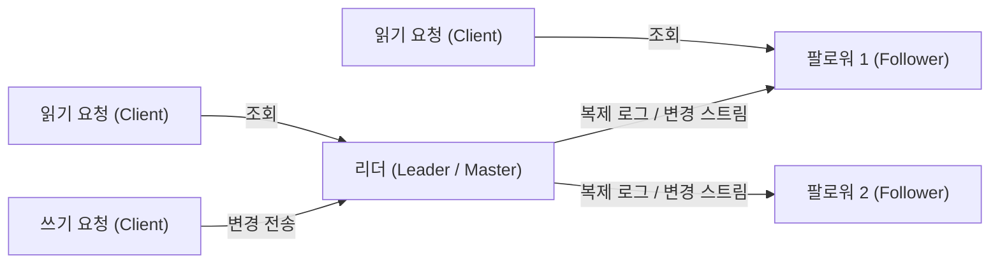
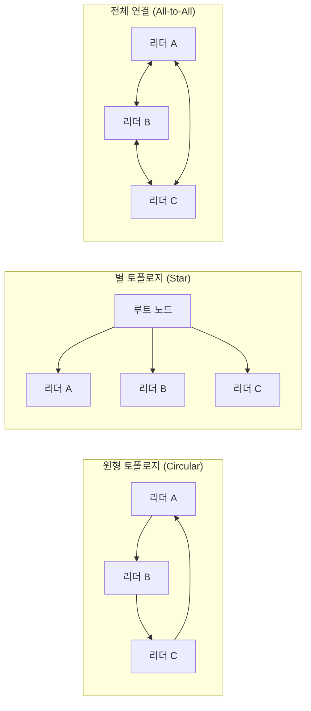

# 5장. 복제

복제(replication)는 네트워크로 연결된 여러 장비에 동일한 데이터의 복사본을 유지하는 것을 의미한다. 데이터를 복제하는 이유는 다음과 같다.

- **지연 시간 감소**: 사용자와 지리적으로 가까운 곳에 데이터를 위치시킬 수 있다.
- **가용성 향상**: 시스템 일부에 장애가 발생해도 계속 동작하게 만든다.
- **읽기 처리량 확장**: 읽기 질의를 처리하는 장비의 수를 늘릴 수 있다.

복제할 데이터가 시간이 지나도 변하지 않는다면 모든 노드에 한 번만 복사하면 되므로 쉽다. **복제의 모든 어려움은 복제된 데이터의 변경을 처리하는 데 있다.** 이 장에서는 변경을 노드 사이에 전파하는 세 가지 인기 있는 알고리즘을 다룬다.

- **단일 리더(single-leader)**
- **다중 리더(multi-leader)**
- **리더 없는(leaderless)**

복제에는 고려해야 할 트레이드오프가 많다. 예를 들어 동기식 복제와 비동기식 복제 중 무엇을 사용할지, 잘못된 복제본은 어떻게 처리할지 등이다. 이런 사항은 데이터베이스의 설정 옵션인 경우가 많은데, 세부 사항은 다양하지만 일반적인 원리는 여러 종류의 구현에서 비슷하다. 이 장에서는 복제에서 일어날 수 있는 결과를 다루며, 일관성 모델([자신이 쓴 내용 읽기], [단조 읽기], [일관된 순서로 읽기])도 함께 논의한다.

---

## 리더와 팔로워

데이터베이스의 복사본을 저장하는 각 노드를 **복제 서버(replica)**라고 한다. 모든 쓰기를 모든 복제 서버에 누락 없이 반영함을 어떻게 보장할 수 있을까? 가장 일반적인 해결책이 **리더 기반 복제(leader-based replication, 능동/수동(active/passive) 또는 마스터/슬레이브(master/slave) 복제)**다.

1. 복제 서버 중 하나를 **리더(leader)**로 지정한다. 클라이언트가 데이터베이스에 쓰려면 요청을 리더에게 보내야 하며, 리더는 먼저 새로운 데이터를 로컬 저장소에 기록한다.
2. 나머지 복제 서버는 **팔로워(follower)**다. 리더가 로컬 저장소에 새로운 데이터를 기록할 때마다 데이터 변경을 **복제 로그(replication log)**나 변경 스트림의 일부로 팔로워에게 전송한다.
3. 클라이언트가 데이터베이스에서 읽을 때는 리더나 팔로워 중 누구에게나 질의할 수 있다. **단, 쓰기는 오직 리더에서만 허용된다.**

이 모드는 PostgreSQL, MySQL, Oracle Data Guard, SQL Server의 AlwaysOn 가용성 그룹 등 많은 관계형 데이터베이스에 내장됐고, MongoDB, RethinkDB, Espresso 같은 비관계형 데이터베이스에서도 사용한다. 또한 카프카, RabbitMQ 같은 분산 메시지 브로커에서도 쓰인다.

### 동기식 대 비동기식 복제

복제 시스템에서 중요한 세부 사항은 복제가 **동기식(synchronous)**으로 일어나는지 **비동기식(asynchronous)**으로 일어나는지다.

- **동기식**: 리더는 팔로워가 쓰기를 수신했는지 확인할 때까지 기다린 후 사용자에게 성공을 보고하고 다른 클라이언트가 변경 내용을 볼 수 있게 한다.
  - **장점**: 팔로워가 리더와 일관성 있는 최신 데이터 복사본을 가지는 것을 보장한다. 리더가 갑자기 작동하지 않아도 데이터는 여전히 팔로워에서 사용할 수 있다.
  - **단점**: 동기 팔로워가 응답하지 않으면(장애·네트워크 문제 등) 쓰기를 처리할 수 없다. 리더는 모든 쓰기를 차단하고 동기 복제 서버가 다시 사용 가능해질 때까지 기다려야 한다.
- **비동기식**: 리더는 메시지를 보내지만 팔로워의 응답을 기다리지 않는다.
  - **단점**: 리더가 실패하고 복구 불가능하면 팔로워에 아직 복제되지 않은 모든 쓰기는 손실된다. 즉, 쓰기가 클라이언트에게 확인된 경우에도 지속성이 보장되지 않는다.
  - **장점**: 팔로워가 뒤처져도 리더는 쓰기 처리를 계속할 수 있다.

> 모든 팔로워가 동기식인 것은 비현실적이다. 노드 하나라도 멈추면 전체 시스템이 멈추기 때문이다. 실무에서 동기식 복제를 활성화한다는 것은 보통 팔로워 하나는 동기식이고 나머지는 비동기식인 **반동기식(semi-synchronous)** 구성을 의미한다. 완전한 비동기식 구성도 널리 쓰인다.

### 새로운 팔로워 설정

복제 서버 수를 늘리거나 장애 노드의 대체를 위해 새로운 팔로워를 설정해야 한다. 단순히 파일을 복사하는 방식은 한 시점에 일관성 있는 스냅숏을 보장하지 못한다. 다운타임 없이 다음 과정으로 처리한다.

1. 리더의 데이터베이스 스냅숏을 일정 시점에 가져온다(대부분 잠금 없이 가능).
2. 스냅숏을 새로운 팔로워 노드에 복사한다.
3. 팔로워는 리더에 연결해 스냅숏 이후로 발생한 모든 데이터 변경을 요청한다. 이를 위해 스냅숏이 리더 복제 로그의 정확한 위치와 연관돼야 한다(MySQL의 binlog coordinate 등).
4. 팔로워가 스냅숏 이후 변경의 backlog를 모두 처리했을 때 **따라잡았다(caught up)**고 말하며, 이후 리더의 변경을 계속 처리한다.

### 노드 중단 처리

목표는 개별 노드가 다운된 상태에서도 전체 시스템을 계속 운영하고, 노드 중단의 영향을 최대한 작게 하는 것이다.

- **팔로워 장애: 따라잡기 복구(catch-up recovery)**
  - 각 팔로워는 리더로부터 수신한 데이터 변경 로그를 로컬에 보관한다. 팔로워가 죽었다가 재시작하거나 네트워크가 일시적으로 중단됐다면, 로그를 통해 마지막으로 처리한 트랜잭션을 알 수 있다. 따라서 결함이 발생한 시점 이후의 모든 데이터 변경을 리더에 요청해 따라잡으면 된다.
- **리더 장애: 장애 복구(failover)**
  - 팔로워 중 하나를 새로운 리더로 승격하고, 클라이언트가 새 리더로 쓰기를 보내도록 재설정하며, 다른 팔로워가 새 리더의 데이터를 소비하도록 해야 한다. 이를 **장애 복구(failover)**라고 하며, 다음과 같은 문제가 따른다.
    - **리더 결함 확인**: 대부분 타임아웃을 사용한다. 노드가 정해진 시간 동안 응답하지 않으면 죽은 것으로 간주한다.
    - **새로운 리더 선택**: 선출 과정(가장 최신 데이터를 가진 복제본 선택) 또는 컨트롤러 노드가 임명한다. 최적의 후보는 보통 리더와 데이터 차이가 가장 적은 복제 서버다.
    - **새로운 리더 사용을 위한 시스템 재설정**: 클라이언트가 새 리더로 쓰기를 보내야 한다. 이전 리더가 돌아오면 자신이 여전히 리더라고 믿을 수 있는데, 이를 잘 처리해야 한다.

장애 복구는 다음과 같이 잘못될 수 있는 일이 많다.

- **비동기 복제** 사용 시 새 리더가 이전 리더의 쓰기를 다 받지 못했을 수 있다. 이때 흔한 해결책은 이전 리더의 복제되지 않은 쓰기를 폐기하는 것인데, 이는 클라이언트의 지속성 기대를 침해한다.
- 쓰기 폐기는 데이터베이스 외부 저장 시스템이 데이터베이스 내용과 조율돼야 하는 경우 특히 위험하다. (예: 깃허브 사건 — MySQL 팔로워가 오래된 자동 증가 기본키를 재사용해 Redis와 불일치, 일부 사용자에게 다른 사용자의 데이터가 노출됨)
- **스플릿 브레인(split brain)**: 특정 결함 시나리오에서 두 노드가 모두 자신이 리더라고 믿을 수 있다. 둘 다 쓰기를 받으면 충돌이 발생하고 데이터가 손실·오염될 수 있다.
- 리더가 죽었다고 판단하는 적절한 타임아웃은? 타임아웃이 길면 복구가 오래 걸리고, 짧으면 일시적 부하 급증 시 불필요한 장애 복구가 일어날 수 있다.

> 이런 문제들 때문에 일부 운영팀은 자동 장애 복구가 있더라도 수동으로 장애 복구를 수행하는 것을 선호한다.

### 복제 로그 구현

리더 기반 복제를 구현하는 몇 가지 방법이 있다.

- **구문 기반 복제(statement-based)**: 리더가 모든 쓰기 요청(구문, statement)을 기록하고 각 쓰기 구문(INSERT, UPDATE, DELETE)을 팔로워에게 전송한다. 간단해 보이지만 다음 문제로 깨질 수 있다.
  - `NOW()`, `RAND()` 같은 **비결정적 함수**는 복제 서버마다 다른 값을 생성한다.
  - 자동 증가 컬럼이나 기존 데이터에 의존하는 구문은 모든 복제본에서 **정확히 같은 순서로** 실행돼야 한다.
  - 부수 효과(트리거, 스토어드 프로시저 등)를 가진 구문은 복제본마다 다른 부수 효과를 낼 수 있다.
  - → 이런 문제로 다른 복제 방법이 일반적으로 선호된다.
- **쓰기 전 로그(WAL) 배송(Write-Ahead Log shipping)**: 저장 엔진의 WAL을 그대로 팔로워에게 전송해 동일한 데이터 구조의 사본을 구축한다.
  - **단점**: 로그가 저수준 데이터(어떤 디스크 블록의 어떤 바이트가 변경됐는지)를 기술하므로 저장소 엔진과 **밀접하게 결합**된다. 리더와 팔로워가 다른 저장 형식·버전을 사용할 수 없어 무중단 업그레이드가 어렵다.
- **논리적(로우 기반) 로그 복제(logical / row-based log)**: 저장소 엔진의 내부와 분리된, 복제를 위한 별도의 로그 형식을 사용한다. 보통 로우 단위로 기록한다(삽입된 로우의 모든 컬럼 값, 삭제된 로우 식별 정보, 변경된 로우의 새 값 등).
  - 저장소 엔진 내부와 분리되어 **하위 호환성** 유지가 쉽고 리더·팔로워가 다른 버전을 운영할 수 있다. 외부 시스템이 파싱하기도 쉬워 **변경 데이터 캡처(change data capture, CDC)** 용도로 유용하다.
- **트리거 기반 복제(trigger-based)**: 애플리케이션 코드 레벨에서 복제를 제어한다. 데이터 변경 시 트리거가 별도 테이블에 로깅하고, 외부 프로세스가 이를 읽어 복제한다.
  - 다른 방법보다 오버헤드가 크고 버그·제한이 많지만, **유연성** 때문에 유용할 수 있다.

---

## 복제 지연 문제

비동기 팔로워를 두는 주된 이유는, 노드의 결함이나 네트워크 중단을 견디고 읽기 확장성을 확보하기 위해서다. 애플리케이션이 리더와 팔로워 어디서 읽어도 같은 결과를 보는 것이 이상적이지만, 비동기 복제에서는 팔로워가 뒤처져 일시적으로 리더와 다른 데이터를 보게 된다. 이런 불일치는 일시적이며, 쓰기를 멈추고 기다리면 결국 따라잡는다. 이 효과를 **최종적 일관성(eventual consistency)**이라고 한다.

다만 복제 지연(replication lag)이 크면(수 초·수 분) 응용 관점에서 다양한 문제가 드러난다. 이 절은 복제 지연이 일으키는 세 가지 대표 문제와 해결책을 다룬다.

### 자신이 쓴 내용 읽기 (read-your-writes consistency)

사용자가 데이터를 쓴 직후 그 데이터를 조회하는데, 읽기가 비동기 팔로워에 도달하면 자신이 방금 제출한 데이터가 보이지 않을 수 있다. **쓰기 후 읽기 일관성(read-your-writes consistency)**은 사용자가 페이지를 다시 로드했을 때 자신이 제출한 갱신은 항상 볼 수 있음을 보장한다(다른 사용자의 갱신은 보장하지 않음).

구현 기법:

- 사용자가 **수정할 수도 있는 데이터**를 읽을 때는 리더에서 읽는다(예: 사용자 자신의 프로필은 리더에서). 그 외에는 팔로워에서 읽는다.
- 마지막 갱신 시각을 기록해 갱신 후 일정 시간(예: 1분) 동안은 리더에서 읽는다.
- 클라이언트가 가장 최근 쓰기의 타임스탬프를 기억하고, 그 타임스탬프까지 반영된 복제본에서만 읽도록 한다.
- **교차 디바이스(cross-device)** 쓰기 후 읽기 일관성도 고려해야 한다. 한 기기에서 입력한 정보를 다른 기기에서 봐야 하며, 디바이스의 메타데이터를 중앙에서 관리해야 할 수 있다.

### 단조 읽기 (monotonic reads)

사용자가 여러 복제본에서 차례로 읽을 때, 먼저 최신 데이터를 본 뒤 더 오래된 데이터를 보는 **시간이 거꾸로 흐르는** 현상이 발생할 수 있다. **단조 읽기(monotonic reads)**는 이런 종류의 이상 현상이 발생하지 않음을 보장한다. 즉, 사용자가 한 번 데이터를 읽으면 그 이후에는 더 과거의 데이터를 보지 않는다(강한 일관성보다는 약하고 최종적 일관성보다는 강한 보장).

- 구현 방법: 각 사용자의 읽기가 항상 **동일한 복제본**에서 수행되게 한다(예: 사용자 ID 해시 기반으로 복제본 선택).

### 일관된 순서로 읽기 (consistent prefix reads)

다른 사람의 대화/쓰기가 **인과성을 위반한** 순서로 보이는 경우가 있다(질문보다 답변이 먼저 보이는 등). **일관된 순서로 읽기(consistent prefix reads)**는, 일련의 쓰기가 특정 순서로 발생하면 이 데이터를 읽는 모든 사용자는 같은 순서로 봄을 보장한다.

- 이는 특히 **파티셔닝(샤딩)** 데이터베이스에서 발생하는 문제다. 파티션이 독립적으로 동작하면 전역적인 쓰기 순서가 없기 때문이다.
- 해결책: 인과적으로 서로 연관된 쓰기가 같은 파티션에 기록되게 한다.

### 복제 지연을 위한 해결책

복제 지연이 몇 분, 몇 시간으로 늘어났을 때 발생할 결과를 염두에 두고 설계해야 한다. 애플리케이션이 더 강한 보장(예: 쓰기 후 읽기)을 제공해야 한다면, 복제가 비동기인데도 동기인 것처럼 동작하게 만드는 것은 실수를 부르기 쉽다. **트랜잭션(transaction)**은 애플리케이션이 더 단순해질 수 있게 데이터베이스가 더 강한 보장을 제공하는 방법이다. (단일 노드 트랜잭션은 오래 존재했지만, 분산 시스템으로 가면서 많은 시스템이 이를 포기하고 약한 일관성을 택했다 — 이후 장에서 다룬다.)

---

## 다중 리더 복제

리더 기반 복제의 단점은 **리더가 하나**이므로 모든 쓰기가 리더를 거쳐야 한다는 점이다. 이를 확장해 쓰기를 받아들이는 노드를 둘 이상 두는 방식이 **다중 리더 복제(multi-leader, 마스터-마스터 또는 능동/능동 복제)**다. 각 리더는 동시에 다른 리더의 팔로워 역할도 한다.

### 다중 리더 복제 사용 사례

단일 데이터센터 내에서 다중 리더를 쓰는 것은 보통 이득보다 복잡성이 크다. 다만 다음 상황에서는 합리적이다.

- **다중 데이터센터 운영**: 각 데이터센터마다 리더를 둔다.
  - **성능**: 모든 쓰기가 인터넷을 통해 멀리 있는 데이터센터로 가지 않아도 되어 지연이 줄어든다.
  - **데이터센터 중단 내성**: 한 데이터센터가 고장 나도 다른 데이터센터가 독립적으로 동작한다.
  - **네트워크 문제 내성**: 데이터센터 간 비동기 복제는 일시적 네트워크 문제를 더 잘 견딘다.
- **오프라인 작업을 하는 클라이언트**: 인터넷 연결이 끊긴 동안에도 동작해야 하는 앱(예: 캘린더 앱). 각 디바이스가 로컬 데이터베이스(리더 역할)를 가지며, 연결되면 비동기로 동기화한다.
- **협업 편집(real-time collaborative editing)**: 구글 도크스 같은 실시간 협업 편집. 한 사용자의 변경을 로컬 복제본에 즉시 적용하고 다른 사용자/서버로 비동기 복제한다.

### 쓰기 충돌 다루기

다중 리더 복제의 가장 큰 문제는 **쓰기 충돌(write conflict)**이며, 충돌 해소가 필요하다.

- **동기 대 비동기 충돌 감지**: 단일 리더는 두 번째 쓰기를 차단하거나 중단시켜 충돌을 막지만, 다중 리더는 두 쓰기가 모두 성공한 뒤 나중에야 비동기로 충돌이 감지된다. (충돌을 동기로 감지하려면 다중 리더의 장점을 잃는다.)
- **충돌 회피(conflict avoidance)**: 충돌을 다루는 가장 간단한 전략은 회피다. 특정 레코드의 모든 쓰기가 항상 같은 리더를 거치게 라우팅하면 충돌이 발생하지 않는다(예: 사용자별로 home 데이터센터 지정).
- **일관된 상태 수렴(converging toward a consistent state)**: 모든 복제 서버가 최종적으로 동일한 값으로 수렴해야 한다. 수렴 충돌 해소 방법:
  - 각 쓰기에 고유 ID를 부여하고 가장 높은 ID를 가진 쓰기를 선택 → **최종 쓰기 승리(LWW)**. 인기 있지만 데이터 손실 위험이 있다.
  - 각 복제 서버에 고유 ID를 부여하고 높은 번호의 복제본 쓰기를 우선한다(역시 데이터 손실 가능).
  - 값을 병합한다(예: 알파벳 순으로 정렬해 연결).
  - 모든 충돌 정보를 보존하는 자료 구조에 기록하고, 나중에(애플리케이션 코드로) 충돌을 해소한다.
- **사용자 정의 충돌 해소 로직**: 가장 적합한 충돌 해소 방법은 애플리케이션에 따라 다르므로, 대부분의 다중 리더 복제 도구는 사용자가 직접 충돌 해소 로직을 작성하게 한다. 쓰기 시점(on write) 또는 읽기 시점(on read)에 실행할 수 있다. (자동 충돌 해소 연구: CRDT, 병합 가능한 영속 자료 구조, 운영 변환(operational transformation) 등)

### 다중 리더 복제 토폴로지

**복제 토폴로지(replication topology)**는 쓰기를 한 노드에서 다른 노드로 전파하는 통신 경로를 기술한다.

- **원형(circular) / 별(star) 토폴로지**: 각 노드가 하나(별은 지정된 루트) 노드로부터 쓰기를 받아 다른 노드로 전달한다. 무한 루프를 막기 위해 각 노드에 고유 식별자를 부여하고, 자신의 식별자가 이미 포함된 변경은 무시한다.
  - **단점**: 한 노드에 장애가 발생하면 다른 노드 사이의 복제 흐름이 방해받는다(단일 장애점에 취약).
- **전체 연결(all-to-all) 토폴로지**: 모든 리더가 다른 모든 리더에게 쓰기를 전송한다. 단일 장애점 문제는 없지만, 일부 네트워크 경로가 다른 경로보다 빨라 **쓰기가 잘못된 순서로 도착**할 수 있다(인과성 위반). 이를 올바르게 정렬하려면 **버전 벡터(version vector)** 같은 기법이 필요하다.

> 다중 리더 복제는 충돌 감지·해소가 미흡한 채로 도입된 도구가 많아, 잘 검토하지 않으면 위험할 수 있다.

---

## 리더 없는 복제

리더의 개념을 버리고 **모든 복제 서버가 클라이언트로부터 쓰기를 직접 받게** 하는 방식이다. 일부 데이터스토어는 이 방식을 채택했다. 아마존이 내부 Dynamo 시스템에 사용한 후 부흥했으며, 리악(Riak), 카산드라(Cassandra), 볼드모트(Voldemort) 등이 이에 영감을 받은 **Dynamo 스타일** 데이터스토어다.

리더 없는 구현에서 클라이언트는 여러 복제본에 직접 쓰기를 보내거나, **코디네이터 노드(coordinator)**를 거쳐 보낸다(단, 코디네이터는 특정 순서를 강제하지 않는다).

### 노드가 다운됐을 때 데이터베이스 쓰기

리더가 없으므로 장애 복구가 존재하지 않는다. 한 노드가 다운돼도 사용자는 나머지 노드에 쓰고 읽을 수 있다.

- **쓰기**: 사용자가 모든 복제본(예: 3개)에 병렬로 쓰기를 보내고, 정해진 수 이상의 복제본이 확인하면 성공으로 간주한다. 다운된 노드는 쓰기를 놓친다.
- **읽기**: 사용자가 여러 노드에 병렬로 읽기 요청을 보낸다. 일부 노드는 최신 값을, 다운됐던 노드는 오래된 값을 반환할 수 있다. **버전 번호**를 사용해 어떤 값이 최신인지 판단한다.

다운됐던 노드가 다시 온라인이 되면 누락된 쓰기를 따라잡아야 한다. 두 가지 메커니즘이 쓰인다.

- **읽기 복구(read repair)**: 클라이언트가 여러 노드에서 읽을 때 오래된 값을 감지하면 최신 값을 그 노드에 다시 기록한다. 자주 읽는 값에 적합하다.
- **안티 엔트로피(anti-entropy)**: 백그라운드 프로세스가 복제본 간 데이터 차이를 지속적으로 찾아 누락된 데이터를 복사한다. (특정 순서를 보장하지 않고 상당한 지연이 있을 수 있다.)

### 읽기와 쓰기를 위한 정족수

복제 서버가 `n`개일 때, 모든 쓰기는 `w`개의 노드에서 성공해야 확인되고, 모든 읽기는 최소 `r`개의 노드에 질의한다. 다음 조건을 만족하면 읽을 때 최신 값을 얻을 것으로 기대할 수 있다.

> **w + r > n**

이를 **정족수(quorum) 읽기·쓰기**라고 한다. `w`와 `r`은 적어도 하나의 최신 노드가 읽기 집합에 겹치도록 보장하는, 최소 표 수다. 일반적으로 `n`을 홀수로 정하고 `w = r = (n + 1) / 2`로 설정한다. (`w`와 `r`을 조정해 읽기·쓰기 부하를 조절할 수 있다.)

- `w < n`: 노드 하나를 사용할 수 없어도 쓰기를 처리할 수 있다.
- `r < n`: 노드 하나를 사용할 수 없어도 읽기를 처리할 수 있다.

### 정족수 일관성의 한계

`w + r > n`이라도 오래된 값을 반환하는 경계 사례가 존재한다.

- **느슨한 정족수(sloppy quorum)**를 사용하는 경우, `w`개의 쓰기와 `r`개의 읽기가 겹치지 않을 수 있다.
- 두 쓰기가 동시에 발생하면 어느 것이 먼저인지 불분명하다. 안전한 해결책은 동시 쓰기를 병합하는 것인데, 시계에 의존해(LWW) 승자를 정하면 쓰기가 손실될 수 있다.
- 쓰기와 읽기가 동시에 발생하면 쓰기가 일부 복제본에만 반영됐을 수 있어, 읽기가 최신 값을 반환할지 불확실하다.
- 쓰기가 일부 복제본에서 실패해 `w`개 미만에서만 성공한 경우, 성공한 복제본에서는 롤백되지 않으므로 이후 읽기가 그 값을 반환할 수도 있다.

> 따라서 정족수는 절대적인 보장이 아니다. 강한 보장이 필요하면 트랜잭션이나 합의(consensus)가 필요하다(9장에서 다룸).

**최신성 모니터링**: 리더 기반 복제는 복제 지연을 측정할 수 있지만, 리더 없는 복제는 쓰기가 적용되는 고정된 순서가 없어 모니터링이 더 어렵다.

### 느슨한 정족수와 암시된 핸드오프

네트워크 중단으로 클라이언트가 정족수(`w` 또는 `r`개)에 도달하지 못할 때 두 가지 선택지가 있다.

- 정족수를 채우지 못한 모든 요청에 에러를 반환한다.
- 값을 받아들이되, 평소 그 값이 위치할 노드가 아니더라도 **연결 가능한 다른 노드**에 임시로 기록한다. → **느슨한 정족수(sloppy quorum)**
- 중단이 해소되면 임시로 받은 노드가 원래의 홈 노드로 데이터를 전송한다. → **암시된 핸드오프(hinted handoff)**

느슨한 정족수는 쓰기 가용성을 높이지만, `w + r > n`이라도 최신 값을 읽는 것을 보장하지 못한다(임시 노드에 기록됐을 수 있으므로). 즉 가용성을 위한 보장이지, 일관성을 위한 보장이 아니다.

### 동시 쓰기 감지

Dynamo 스타일 데이터베이스는 여러 클라이언트가 같은 키에 동시에 쓰는 것을 허용하므로 충돌이 발생한다. 읽기 복구나 안티 엔트로피 과정에서도 충돌이 생길 수 있다. 최종적으로 복제본들이 같은 값으로 **수렴**하게 만들어야 한다.

- **최종 쓰기 승리(LWW, Last Write Wins)**: 각 쓰기에 타임스탬프를 부여하고 가장 큰 타임스탬프의 쓰기를 채택하며 나머지는 버린다. **수렴은 달성하지만 지속성을 희생**한다(같은 키의 여러 동시 쓰기가 보고됐더라도 하나만 살아남고 나머지는 조용히 폐기됨). 카산드라가 사용한다. 데이터 손실이 허용되지 않으면 부적합하다.
- **"이전 발생(happens-before)" 관계와 동시성**: 한 연산 B가 A의 결과를 알고 있거나/의존하거나/기반한다면 A는 B 이전에 발생(happens-before)한 것이다. 두 연산이 서로 상대를 알지 못하면 두 연산은 **동시적(concurrent)**이다. (절대적 시간 순서가 아니라 인과성으로 정의)
- **동시에 쓴 값 병합**: 동시 쓰기가 발생하면 모든 값을 보존했다가 병합해야 한다. 클라이언트가 키를 읽을 때 여러 버전(형제, sibling)을 모두 반환하고, 쓰기 시 이를 병합한다. (예: 장바구니는 합집합으로 병합. 단, 항목 삭제를 제대로 다루려면 **삭제 표시(tombstone)**가 필요하다.)
- **버전 번호와 버전 벡터(version vector)**:
  - 단일 복제본: 서버가 키마다 버전 번호를 유지하고, 클라이언트는 읽은 버전 번호를 쓰기 때 함께 보낸다. 그 버전 이하의 값은 덮어쓰고, 더 높은 값은 형제로 보존한다.
  - 다중 복제본: 복제본마다, 키마다 버전 번호가 필요하다. 모든 복제본의 버전 번호 모음을 **버전 벡터(version vector)**라고 한다. 버전 벡터로 어떤 연산이 동시적이고 어떤 것이 덮어쓰기/형제인지 구분할 수 있고, 복제본 간에 안전하게 읽고 쓸 수 있다. (리악의 dotted version vector 등)

---

## 정리

이 장에서는 복제를 살펴봤다. 복제는 여러 목적을 위해 사용할 수 있다.

- **고가용성(High availability)**: 한 장비(또는 여러 장비, 또는 데이터센터 전체)가 다운돼도 시스템이 계속 동작하게 한다.
- **연결이 끊긴 작업(Disconnected operation)**: 네트워크가 중단돼도 애플리케이션이 계속 동작하게 한다.
- **지연 시간(Latency)**: 지리적으로 사용자 가까이 데이터를 위치시켜 더 빠르게 작용하게 한다.
- **확장성(Scalability)**: 복제본을 사용해 읽기를 분산함으로써 단일 장비보다 더 많은 읽기 양을 처리한다.

데이터 복제의 세 가지 주요 접근 방식:

| 접근 방식 | 특징 |
| --- | --- |
| **단일 리더 복제** | 모든 쓰기를 단일 리더로 전송하고, 리더는 변경 이벤트 스트림을 팔로워에게 전송한다. 읽기는 어떤 복제본에서나 가능. 이해·운영하기 쉽고 충돌이 없다. |
| **다중 리더 복제** | 쓰기를 여러 리더 노드로 전송하고, 리더는 변경 이벤트 스트림을 서로에게/팔로워에게 전송한다. 견고하지만 일관성 보장이 약하고 충돌 해소가 필요하다. |
| **리더 없는 복제** | 쓰기를 여러 노드로 전송하고, 여러 노드에서 병렬로 읽어 오래된 값을 감지·정정한다. 노드 결함·지연에 견고하지만 일관성 추론이 어렵다. |

복제는 동기식 또는 비동기식일 수 있으며, 장애 상황에서 둘의 동작은 크게 다르다. 비동기 복제는 시스템이 원활할 때는 빠르지만, 복제 지연이 증가하거나 서버에 장애가 발생하면 어떤 일이 생길지 알아야 한다. 리더가 실패하고 비동기로 갱신된 팔로워를 새 리더로 승격하면, 최근에 커밋된 데이터가 손실될 수 있다.

복제 지연이 만드는 이상 현상과 일관성 모델:

- **쓰기 후 읽기 일관성(read-your-writes)**: 사용자는 자신이 제출한 데이터를 항상 볼 수 있어야 한다.
- **단조 읽기(monotonic reads)**: 어떤 시점의 데이터를 본 후에는 그보다 과거 시점의 데이터를 보지 않아야 한다.
- **일관된 순서로 읽기(consistent prefix reads)**: 사용자는 데이터를 인과적으로 의미 있는 상태로 봐야 한다(질문과 그에 대한 답이 올바른 순서로 보여야 한다).

다중 리더와 리더 없는 복제는 동시 쓰기를 허용하므로 충돌이 발생할 수 있다. 어떤 연산이 다른 연산보다 먼저 발생했는지, 또는 동시에 발생했는지 판단하는 알고리즘을 검토했고, 동시 쓰기를 병합해 충돌을 해소하는 방법을 살펴봤다.

---

## 핵심 takeaway

- 복제의 본질적 어려움은 **변경의 전파**에 있으며, 해법은 단일 리더 / 다중 리더 / 리더 없는 세 가지로 나뉜다.
- **동기 vs 비동기**는 지속성과 가용성의 트레이드오프다. 현실에서는 보통 반동기식 또는 비동기식을 쓴다.
- 비동기 복제의 부작용인 **복제 지연**은 read-your-writes / monotonic reads / consistent prefix reads라는 세 가지 일관성 보장으로 완화한다.
- 다중 리더·리더 없는 복제의 핵심 난제는 **쓰기 충돌**이며, LWW는 간단하지만 데이터를 잃고, 안전한 해법은 **버전 벡터 + 동시 쓰기 병합**이다.
- 리더 없는 복제에서 **정족수(w + r > n)**는 최신성을 높이지만 절대 보장은 아니다 — 강한 보장이 필요하면 트랜잭션·합의가 필요하다.
