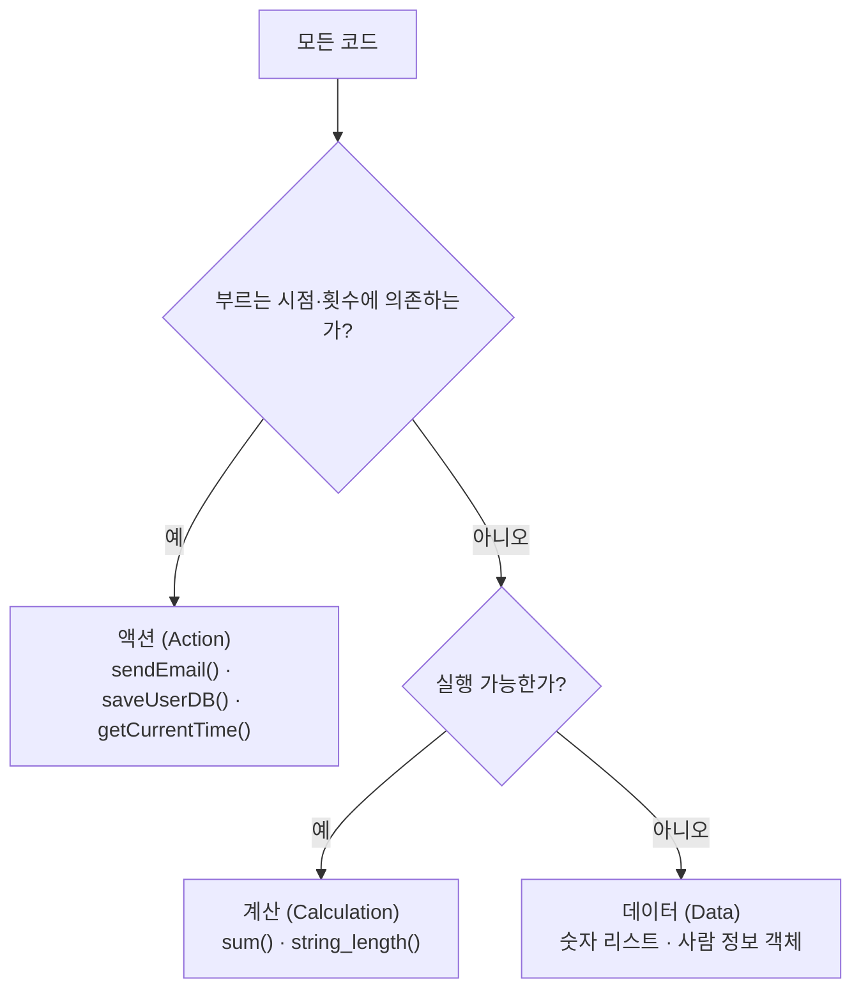

# 1장. 쏙쏙 들어오는 함수형 코딩에 오신 것을 환영합니다

이 장에서는 **함수형 사고(functional thinking)** 가 무엇인지, 왜 더 좋은 소프트웨어를 만들려는 개발자에게 도움이 되는지 설명한다. 많은 함수형 프로그래머가 경험으로 깨달은 두 가지 통찰을 통해 앞으로 배울 내용을 미리 살펴본다.

## 함수형 프로그래밍의 일반적인 정의와 그 문제점

위키피디아 등에서 흔히 볼 수 있는 정의는 다음과 같다.

> **함수형 프로그래밍**, 명사
> 1. 수학 함수를 사용하고 부수 효과(side effect)를 피하는 것이 특징인 프로그래밍 패러다임
> 2. 부수 효과 없이 순수 함수(pure function)만 사용하는 프로그래밍 스타일

- **부수 효과**: 함수가 리턴값 이외에 하는 모든 일 (이메일 전송, 전역 상태 수정 등)
- **순수 함수**: 부수 효과 없이 결괏값이 인자에만 의존하는 함수. 수학 함수라고도 볼 수 있으며, 다루기 쉽고 이해하기 쉽다.

이 정의는 학술적으로는 가치가 있을지 모르나, 실제 프로그래밍을 하는 개발자에게는 도움이 되지 않는다. 실용적인 측면에서 세 가지 문제가 있다.

| 문제 | 내용 |
| --- | --- |
| 1. 부수 효과는 필요하다 | 부수 효과는 소프트웨어를 실행하는 이유 그 자체다. 이메일을 전송하지 않는 이메일 전송 소프트웨어는 의미가 없다. 정의는 부수 효과를 완전히 쓰지 말라는 것처럼 되어 있지만 필요할 때는 써야 한다. |
| 2. 함수형 프로그래밍은 부수 효과를 잘 다룰 수 있다 | 함수형 프로그래머는 부수 효과가 필요하지만 문제가 될 수 있다는 것을 알기 때문에, 이를 다루기 위한 도구를 많이 알고 있다. 순수하지 않은 함수도 사용하며 잘 다루는 기술이 많다. |
| 3. 함수형 프로그래밍은 실용적이다 | 정의만 보면 수학적이라 실무에서 쓰지 않는 것처럼 느껴지지만, 함수형 프로그래밍으로 잘 만들어진 소프트웨어가 많다. |

이 정의는 오히려 함수형 프로그래밍을 시작하려는 사람에게 혼란을 준다. 책에 등장하는 사례에서도, 관리자가 위키피디아 정의만 보고 "이메일 보내는 것을 하지 말아야 한다는 건가? 우린 이메일 전송 서비스를 만들어야 하는데!"라며 도입을 반려한다.

## 함수형 프로그래밍을 학문적 지식이 아닌 기술과 개념으로 보기

이 책은 위와 같은 일반적인 정의를 쓰지 않는다. 대신 실제 함수형 프로그래밍을 쓰고 있는 프로그래머가 가진 **기술과 생각의 흐름, 시각**을 정리했다.

- 학술적인 최신 연구 자료나 난해한 개념(재귀, CPS 등)은 뺐다.
- 함수형 프로그래밍의 중요한 개념은 객체 지향/절차적 프로그래밍을 가리지 않고 **모든 프로그래밍 언어에서 쓸 수 있다.**
- 함수형 프로그래밍의 진정한 아름다움은 코드 어느 곳에나 적용할 수 있는 유익한 내용이라는 점이다.

그 출발점이 바로 함수형 프로그래머가 입을 모아 중요하다고 말하는 기술, **액션(action)과 계산(calculation), 데이터(data)를 구분하는 일**이다.

## 액션과 계산, 데이터 구분하기

함수형 프로그래머는 직감적으로 코드를 세 분류로 나눈다. 아래와 같은 코드 조각이 있다고 하자.

```
sendEmail(to, from, subject, body)   // ★ 이메일을 보내는 코드. 사용할 때 조심해야 한다.
sum(numbers)                          // 모든 숫자를 더하는 편리한 함수
saveUserDB(user)                      // ★ DB에 저장하면 다른 시스템에서 저장한 데이터를 볼 수 있다.
string_length(str)                    // 같은 문자열을 넣으면 항상 같은 길이를 준다.
getCurrentTime()                      // ★ 부를 때마다 다른 시간을 준다.
[1, 10, 2, 45, 3, 98]                 // 그냥 숫자 리스트
{"firstname": "Eric", "lastname": "Normand"}  // 사람에 대한 정보
```

### 1차 구분 — 부를 때 조심해야 하는 코드

별(★) 표시가 있는 함수는 **언제, 얼마큼 호출하는지가 중요**하다. 중요한 이메일을 중복으로 보내거나 전송이 안 되는 것을 바라지는 않을 것이다. 이렇게 **호출하는 시점과 횟수에 의존하는 코드를 액션**이라 부르고 나머지와 선을 그어 구분한다.

반면 선 아래쪽 코드는 사용하기 쉽다. `sum()`은 언제 호출해도 항상 같은 값을 주고, 외부에 영향을 주지 않기 때문에 여러 번 호출해도 상관없다.

### 2차 구분 — 실행 가능 여부

계산과 데이터는 둘 다 부르는 시점이나 횟수가 중요하지 않다. 둘의 차이는 **실행 여부**에 있다.

- **계산**: 실행 가능하다. 실행하기 전까지 어떻게 동작할지 알 수 없다.
- **데이터**: 실행되지 않는다. 정적이고 보이는 그대로다.



> **함수형 프로그래머는 코드를 액션과 계산, 데이터로 구분한다.** 이것이 함수형 프로그래밍의 핵심 개념이다.
>
> 액션·계산·데이터는 모두 필요하지만 각각 장단점이 있다. 일반적으로 **액션보다는 계산이, 계산보다는 데이터가 쓰기 쉽다.** 결과적으로 가장 쓰기 좋은 것은 데이터다.

### 실제 서비스에서의 구분 예시

프로젝트 관리를 위한 클라우드 서비스(클라이언트가 작업 완료 표시를 하면 서버에서 이메일로 알려주는 서비스)를 예로 들면 다음과 같다.

| 단계 | 동작 | 분류 | 이유 |
| --- | --- | --- | --- |
| 1 | 사용자가 작업 완료 표시를 함 | 액션 | UI 이벤트이며 실행 횟수에 의존 |
| 2 | 클라이언트가 서버로 메시지를 보냄 | 액션 + 데이터 | 보내는 것은 액션, 메시지 자체는 나중에 해석해야 하는 값이므로 데이터 |
| 3 | 서버가 메시지를 받음 | 액션 | 받는 것은 횟수에 의존 |
| 4 | 서버가 데이터베이스를 변경 | 액션 | 내부 상태를 바꾸는 것 |
| 5 | 서버가 누구에게 알림을 보낼지 결정 | 계산 | 입력값이 같다면 항상 같은 결정을 내림 |
| 6 | 서버가 이메일로 알림을 보냄 | 액션 | 같은 메일을 한 번 보내는 것과 두 번 보내는 것은 다름 |

## 세 가지 분류의 특징과 관련 도구

### 1. 액션 (Action)

실행 시점이나 횟수 또는 둘 다에 의존한다. 긴급한 메일을 오늘 보내는 것과 다음 주에 보내는 것은 완전히 다르며, 같은 메일을 10번 보내는 것과 한 번 보내는 것 또는 보내지 않는 것 역시 다르다.

- 시간이 지남에 따라 안전하게 상태를 바꿀 수 있는 방법
- 순서를 보장하는 방법
- 액션이 정확히 한 번만 실행되게 보장하는 방법

### 2. 계산 (Calculation)

입력값으로 출력값을 만드는 것이다. 같은 입력값을 가지고 계산하면 항상 같은 결괏값이 나온다. 언제, 어디서 계산해도 결과는 같고 외부에 영향을 주지 않는다. **테스트하기 쉽고 언제든지 몇 번을 불러도 안전하다.**

- 정확성을 위한 정적 분석
- 소프트웨어에서 쓸 수 있는 수학적 지식
- 테스트 전략

### 3. 데이터 (Data)

이벤트에 대해 기록한 사실이다. 실행하는 코드만큼 복잡하지 않으며, 알아보기 쉬운 속성으로 되어 있고 실행하지 않아도 데이터 자체로 의미가 있다. 또 **같은 데이터를 여러 형태로 해석할 수 있다.** (레스토랑 영수증 데이터 → 관리자는 인기 메뉴 분석에, 고객은 외식비 지출 내역 확인에 사용)

- 효율적으로 접근하기 위해 데이터를 구성하는 방법
- 데이터를 보관하기 위한 기술
- 데이터를 이용해 중요한 것을 발견하는 원칙

## 액션, 계산, 데이터를 구분하면 어떤 장점이 있나?

**함수형 프로그래밍은 요즘 유행하는 분산 시스템에 잘 어울린다.**

함수형 프로그래밍은 단순한 트렌드가 아니라 오랫동안 쌓아온 수학 지식을 기반으로 하는 가장 오래된 프로그래밍 패러다임이다. 최근 인터넷·전화·노트북·클라우드 서버 같은 기기가 확산되면서 네트워크 통신을 하는 복잡한 소프트웨어가 필요하게 되었고, 그런 이유로 다시 각광받게 되었다.

> **분산 시스템 규칙 3가지**
> 1. 메시지 순서가 바뀔 수 있다.
> 2. 메시지는 한 번 이상 도착할 수도 있고 도착하지 않을 수도 있다.
> 3. 응답을 받지 못하면 무슨 일이 생겼는지 알 수 없다.

- **데이터와 계산은 실행 시점이나 횟수에 의존하지 않는다.** 그래서 코드를 데이터와 계산으로 바꿀수록 분산 시스템에서 생기는 여러 문제를 해결할 수 있다.
- 액션은 여전히 문제가 되지만, **코드 전체에 영향을 주지 않도록 격리**하면 된다.
- 코드의 많은 부분을 액션에서 계산으로 옮기면 결과적으로 액션도 다루기 쉬워진다.

## 다른 함수형 프로그래밍 책과 다른 점

| 특징 | 내용 |
| --- | --- |
| 소프트웨어 엔지니어링 관점에서 실용적 | 재귀나 CPS(continuation-passing style) 같은 학술적 내용 대신 실제 동작하는 소프트웨어에 쓸 수 있는 것을 목표로 한다. |
| 실제 있을 법한 시나리오로 설명 | 피보나치나 합병 정렬 대신, 실무에서 일어날 수 있는 상황(기존 코드·신규 코드·아키텍처)에 함수형 사고를 적용한다. |
| 소프트웨어 설계를 중심으로 설명 | 대부분의 함수형 책이 설계가 필요 없는 작은 프로그램만 다루는 것과 달리, 짧은 코드부터 완성된 애플리케이션까지 코드 규모에 따른 함수형 설계 원칙을 설명한다. |
| 함수형 프로그래밍의 풍부함 | 1950년대부터 쌓아온 기술과 원칙을 다룬다. |
| 특정 언어에 종속적이지 않음 | 자바스크립트로 설명하지만 자바스크립트를 가르치는 책은 아니다. 언어보다 **개념**에 초점을 맞추는 것이 좋다. |

자바스크립트를 쓰는 이유는 흥미롭다. 자바스크립트는 함수형 프로그래밍을 **하기** 좋은 언어는 아니지만, 기능이 부족하기 때문에 그 문제를 어떻게 해결할지 생각해봐야 해서 오히려 **가르치기** 좋은 언어다. 대부분의 프로그래밍 언어가 함수형 기능을 완전히 갖고 있지 않기 때문에, 이런 기술을 배워두면 어떤 언어를 가지고도 함수형 프로그래밍을 할 수 있다.

## 함수형 사고가 무엇인가?

함수형 사고는 함수형 프로그래머가 소프트웨어 문제를 해결하기 위해 사용하는 기술과 생각을 말한다. 그 중 가장 중요한 두 가지 개념이 이 책의 두 파트를 이룬다.

- **파트 I: 액션과 계산, 데이터** — 코드를 구분하는 방법, 액션을 계산으로 리팩터링하는 방법, 액션을 더 쉽게 다루는 방법
- **파트 II: 일급 추상(first-class abstraction)** — 함수에 함수를 넘겨 더 많은 함수를 재사용하는 방법. 마지막으로 반응형 아키텍처(reactive architecture)와 어니언 아키텍처(onion architecture)를 일급 추상과 연결해 설명한다.

## 이 책을 읽는 기본 규칙

1. **특정 언어 기능에 의존하지 않아야 한다.** 강력한 타입 시스템 같은 언어 종속적인 기술은 설명하지 않는다.
2. **실용적이라 바로 쓸 수 있어야 한다.** 이론적으로 중요하더라도 실용적이지 않으면 다루지 않는다.
3. **현재 가지고 있는 코드와 관계없이 쓸 수 있어야 한다.** 처음부터 함수형으로 다시 만드는 것이 아니라 지금 있는 코드에도 적용할 수 있어야 한다.

## 정리

- 이 책은 두 파트로 되어 있다. 각 파트는 **액션과 계산, 데이터를 구분하는 것**과 **일급 추상을 사용하는 것**을 다룬다.
- 일반적인 함수형 프로그래밍 정의(부수 효과를 피하고 순수 함수만 사용)는 학계 연구자에게는 도움이 되지만 소프트웨어 공학에는 큰 도움이 되지 못했다. 그래서 함수형 프로그래밍이 추상적이고 실용적이지 않다는 느낌을 준다.
- **함수형 사고**는 함수형 프로그래밍의 기술과 개념을 말하며, 이 책의 주제다.
- **액션은 시간에 의존한다.** 그래서 사용하기 가장 어렵다. 액션에서 시간에 의존하는 부분을 분리하면 좀 더 다루기 쉽다.
- **계산은 시간에 의존적이지 않다.** 다루기 쉽기 때문에 가능한 코드를 계산으로 바꾸는 것이 좋다.
- **데이터는 정적이고 해석이 필요하다.** 저장하거나 이해하기 쉽고 전송하기 편리하다.
