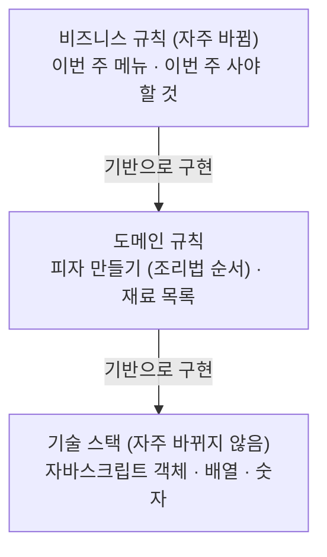
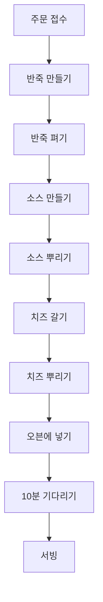
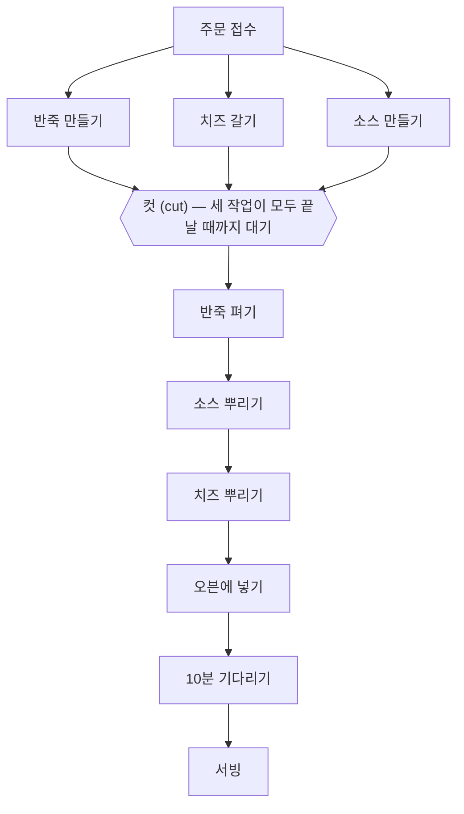

# 2장. 현실에서의 함수형 사고

1장에서 살펴본 함수형 사고를 **토니 피자**라는 가상의 시나리오에 적용해 본다. 때는 2118년, 로봇이 자바스크립트로 프로그래밍되어 피자를 만든다. 피자 가게를 운영하는 토니가 겪은 두 번의 경험을 통해 앞으로 배울 내용을 미리 조망한다.

- **파트 I (액션과 계산, 데이터)**: 토니는 요리 재료와 자원을 사용하는 코드를 액션으로 구분하고 나머지를 계산으로 구분했다. 여기에 **계층형 설계(stratified design)** 원칙을 적용했다.
- **파트 II (일급 추상)**: 주방의 여러 로봇은 분산 시스템이다. 토니는 **타임라인 다이어그램(timeline diagram)** 으로 실패하는 분산 시스템을 이해하고, **일급 함수(first-class function)** 로 로봇들이 협력하게 만들었다.

---

## 파트 I: 액션과 계산, 데이터

토니의 피자 가게는 사업이 빠르게 성장해 확장성 문제를 겪었다. 토니는 함수형 사고 중 **가장 먼저 액션과 계산, 데이터를 구분하는 것**부터 시작했다. 함수형 프로그래머가 코드에서 이 세 가지를 가장 먼저 구분하는 이유는 **쉽게 다룰 수 있는 부분과 조심히 다뤄야 할 부분을 명확하게 하기 위함**이다.

| 분류 | 성격 | 피자 가게에서의 예 |
| --- | --- | --- |
| **액션** | 호출 횟수와 시점에 의존한다. 오븐이나 배달차 같은 자원과 요리 재료를 사용하는 것. **사용할 때 조심해야 한다.** | 반죽 펴기, 피자 배달, 재료 주문 |
| **계산** | 어떤 것을 결정하거나 계획하는 것. 실행해도 다른 곳에 영향을 주지 않는다. 아무 때나 사용해도 주방이 엉망진창 될 걱정이 없다. | 조리법에 나온 것을 두 배로 만들기, 쇼핑 목록 결정 |
| **데이터** | 이벤트에 대해 기록한 사실. 변경 불가능한(immutable) 데이터를 가능한 한 많이 쓰려고 한다. 저장하거나 네트워크로 전송하는 등 유연하게 쓸 수 있다. | 고객 주문, 영수증, 조리법 |

실제로 액션·계산·데이터라는 용어를 사용하지 않더라도 위와 같은 기준으로 나누는 것이 중요하다. 파트 I이 끝나면 **액션과 계산을 구분하고, 액션과 계산을 자유롭게 옮길 수 있게** 된다.

## 변경 가능성에 따라 코드 나누기 (계층화 설계 맛보기)

피자 사업이 성장하면서 소프트웨어도 사업에 맞춰 달라져야 했다. 토니는 **코드를 변경할 때 드는 비용을 줄이기 위해** 변경 가능성에 따라 코드를 나눴다.

- 가장 아래쪽: **자바스크립트 언어 자체**(배열, 객체, 숫자). 언어는 잘 바뀌지 않는다.
- 가운데: **피자 조리에 대한 것**. 바뀔 수도 있지만 자주 바뀌지 않는다.
- 가장 위쪽: **이번 주 메뉴 같은 사업적인 내용**. 자주 바뀐다.

각 계층은 그 아래에 있는 계층을 기반으로 만들어진다. 그래서 각 계층에 있는 코드는 **더 안정적인 기반 위에 작성**할 수 있다.

- 가장 위에 있는 코드는 의존성이 거의 없기 때문에 쉽게 바꿀 수 있다.
- 아래에 있는 코드들은 의존성이 많아 바꾸기 어렵지만 자주 바뀌지 않는다.

함수형 프로그래머는 이 아키텍처 패턴이 계층을 만들기 때문에 **계층형 설계(stratified design)** 라고 부른다. 계층형 설계는 일반적으로 **비즈니스 규칙 / 도메인 규칙 / 기술 스택** 계층으로 나뉘며, 이렇게 만든 코드는 테스트·재사용·유지보수가 쉽다. (8장, 9장에서 자세히 다룬다)

---

## 파트 II: 일급 추상

### 주방을 자동화하기

토니의 주방에는 로봇이 혼자 일하고 있었기 때문에 얼마 지나지 않아 확장성 문제가 생겼다. 고객이 원하는 속도로 피자를 만들 수 없었다. 로봇 한 대가 피자를 만들기 위한 액션들을 **타임라인 다이어그램**으로 그리면 다음과 같다.

- 타임라인에 있는 모든 단계는 **액션**이다.
- 타임라인 다이어그램을 사용하면 액션이 시간 순서에 따라 어떻게 실행되는지 볼 수 있다.
- **액션은 실행 시점에 의존하기 때문에 실행 순서가 중요하다.**

### 분산 시스템을 타임라인으로 시각화하기

로봇 한 대로는 고객의 요구를 맞출 만큼 빠르지 않았다. 토니는 피자 만드는 작업을 반죽 만들기, 소스 만들기, 치즈 갈기로 나누고 **로봇 세 대가 동시에** 일하게 했다. 여러 대의 로봇이 함께 일하는 것은 곧 **분산 시스템**을 의미한다.

문제는 분산 시스템에서 **독립된 액션의 실행 순서를 알 수 없다**는 것이다. 로봇 세 대는 각자 타임라인을 가지고 동시에 일하며, 각각의 타임라인에서 처리되는 일은 순서가 섞여 누가 먼저 끝날지 알 수 없다.

### 각각의 타임라인은 다른 순서로 실행된다

기본적으로 타임라인은 서로 순서를 맞출 수 있는 기능이 없다. 다른 타임라인 작업이 끝날 때까지 기다리라는 표시가 없어 순서대로 다음 단계를 그냥 진행한다.

- 소스가 먼저 완성되고 반죽이 나중에 완성될 수도 있다. 이 경우 **소스를 만드는 로봇이 반죽이 나오기도 전에 반죽을 펴는 작업을 시작**한다.
- 치즈 가는 작업이 가장 마지막이 될 수도 있다. 이 경우 **치즈 갈기가 끝나기도 전에 치즈를 뿌리는 작업**을 하게 된다.

세 작업의 순서는 총 여섯 가지로 섞일 수 있는데, 그중 **소스 만들기가 가장 마지막 순서에 와야만** 제대로 된 피자가 완성된다. 즉 6가지 중 2가지만 정상 동작한다.

> **타임라인을 서로 맞추지 않은 분산 시스템은 예측 불가능한 순서로 실행된다.**

토니는 저녁에 로봇 세 대로 장사를 해봤지만 완전히 실패했고, 많은 피자가 잘못 나왔다.

### 어려운 경험을 통해 분산 시스템에 대해 배운 것

순차적인 프로그램을 분산 시스템으로 바꾸는 것은 어렵다. 올바른 순서로 동작하는 프로그램을 만들려면 **액션(시간에 의존적인)** 에 집중할 필요가 있다.

1. **기본적으로 타임라인은 서로 순서를 맞추지 않는다.** 반죽이 준비되지 않았는데도 다른 타임라인은 그냥 진행되었다. 타임라인은 서로 실행 순서를 맞춰야 한다.
2. **액션이 실행되는 시간은 중요하지 않다.** 일반적으로 소스 만드는 것이 제일 오래 걸리지만 항상 그렇지는 않다. 각각의 타임라인은 다른 타임라인의 순서와 관계없이 만들어야 한다.
3. **드물지만 타이밍이 어긋나는 경우는 실제 일어난다.** 테스트할 때는 문제가 없었지만 실제 서비스에서 주문이 몰리자 가끔 발생하던 오류가 더 많이 발생했다. 타임라인은 항상 올바른 결과를 보장해야 한다.
4. **타임라인 다이어그램으로 시스템의 문제를 알 수 있다.** 다이어그램을 보고 치즈가 제시간에 준비되지 않을 수 있다는 것을 알았다.

### 타임라인 커팅: 로봇이 서로를 기다릴 수 있게 하기

토니는 **타임라인 커팅(cutting)** 이라는 기술을 사용했다. 타임라인 커팅은 **여러 타임라인이 동시에 진행될 때 서로 순서를 맞추는 방법**이며, **고차 동작(high-order operation)** 으로 구현한다.

각 타임라인은 독립적으로 동작하고, 작업이 완료되면 다른 타임라인이 끝나기를 기다리기 때문에 **어떤 타임라인이 먼저 끝나도 괜찮다.**

컷 아래에 있는 것은 컷 위에 있는 것이 **모두 끝나야만** 실행할 수 있다. 컷이 있기 때문에 **재료를 준비하는 작업들의 실행 순서를 신경 쓰지 않고** 피자 만드는 나머지 작업을 할 수 있다. 토니는 이 시스템으로 저녁 장사를 했고 결과는 대성공이었다. (17장에서 자세히 다룬다)

### 좋은 경험을 통해 타임라인에 대해 배운 것

1. **타임라인 커팅으로 서로 다른 작업들을 쉽게 이해할 수 있다.** 동시에 할 수 있는 재료 준비와 순서대로 해야 하는 피자 만들기를 분리했다. 커팅으로 더 짧아진 타임라인을 실행 순서에 상관없이 이해할 수 있다.
2. **타임라인 다이어그램을 사용하면 시간에 따라 진행하는 작업을 쉽게 이해할 수 있다.** 타임라인은 동시에 실행되는 분산 시스템을 시각화하기 좋다.
3. **타임라인 다이어그램은 유연하다.** 하려고 했던 것을 타임라인으로 그리고, 그것을 보고 쉽게 코드로 옮길 수 있다.

---

## 정리

- **액션과 계산, 데이터를 구분하는 일은 함수형 프로그래머에게 가장 중요하고 첫 번째로 해야 하는 일이다.** (3장에서 구분하는 방법을 배운다)
- 함수형 프로그래머는 유지보수를 잘 하기 위해 **계층형 설계**를 사용한다. 각 계층은 코드의 **변경 가능성**에 따라 나눈다. (8~9장)
- **타임라인 다이어그램**은 시간에 따라 변하는 액션을 시각화하는 방법이다. 액션이 다른 액션과 어떻게 연결되는지 볼 수 있다. (15장)
- 액션 간 협력을 위해 **타임라인 커팅**이라는 기술을 사용한다. 타임라인 커팅은 액션이 올바른 순서로 실행될 수 있도록 보장해 준다. (17장)
