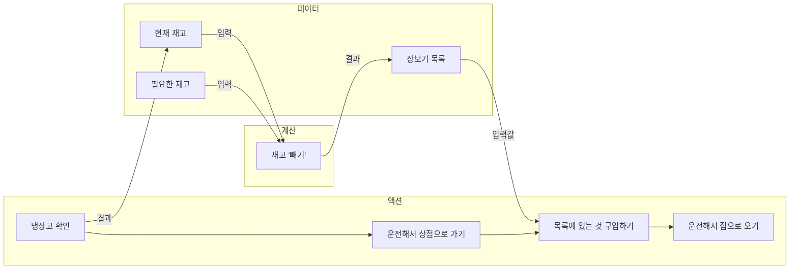
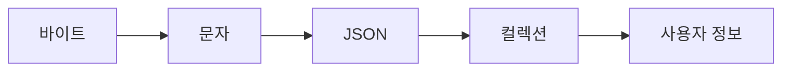
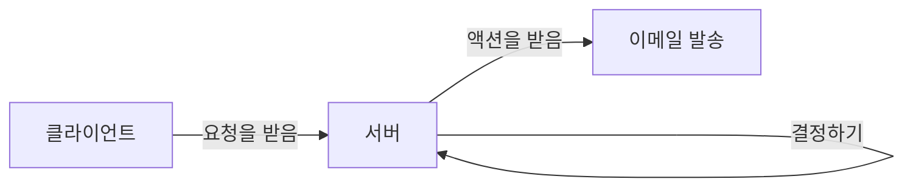
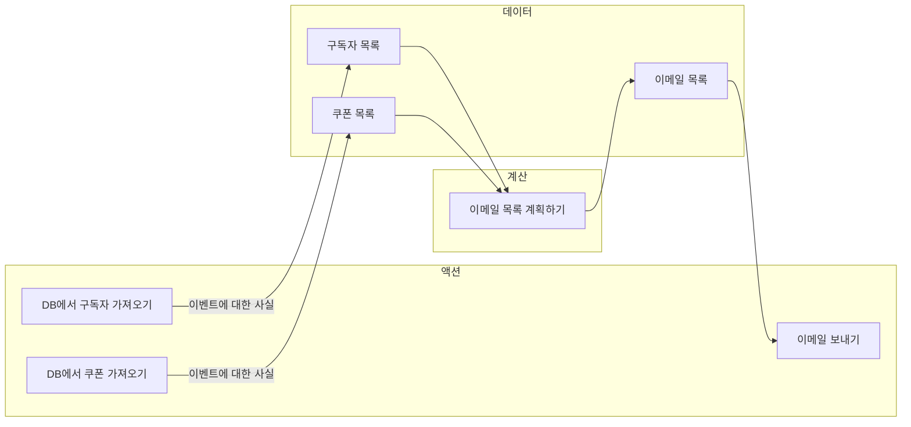
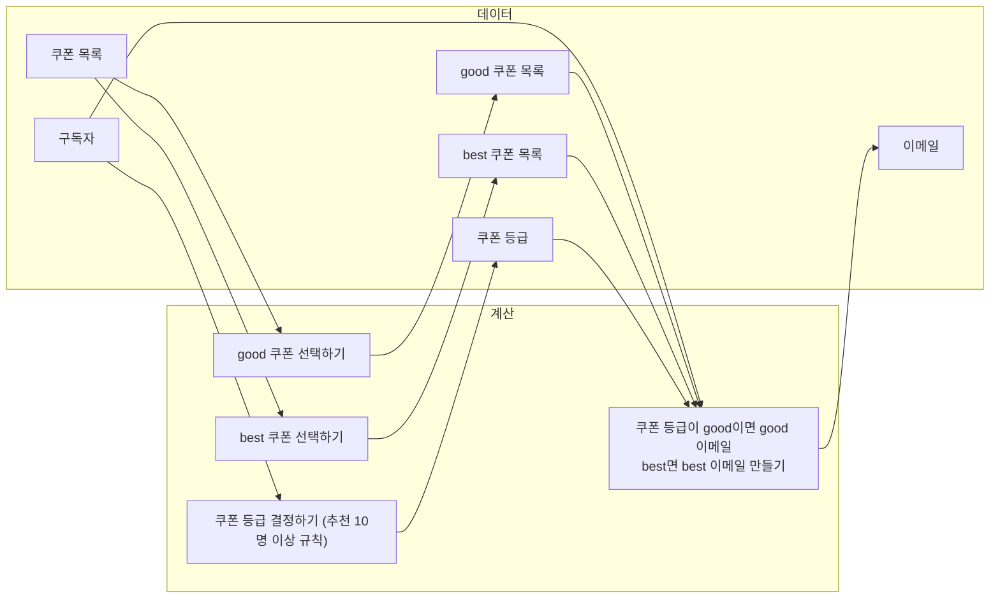
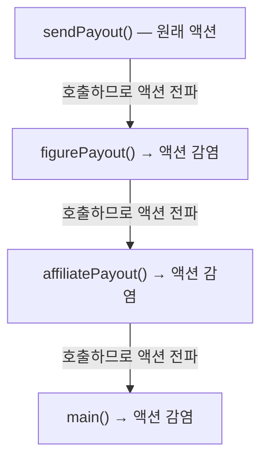

# 3장. 액션과 계산, 데이터의 차이를 알기

**이번 장에서 살펴볼 내용**

- 액션과 계산, 데이터가 어떻게 다른지 배운다.
- 문제에 대해 생각하거나 코드를 작성할 때, 또는 코드를 읽을 때 액션과 계산, 데이터를 구분해서 적용해 본다.
- 액션이 코드 전체로 퍼질 수 있다는 것을 이해한다.
- 이미 있는 코드에서 어떤 부분이 액션인지 찾아본다.

> 액션과 계산, 데이터를 구분하는 것은 **함수형 프로그래밍의 첫 번째 단계**다. 이 장을 통해 일반적으로 코드에 액션이 너무 많이 사용되는 반면 계산은 거의 찾아보기 힘든 이유를 알 수 있다.

---

## 1. 액션과 계산, 데이터

| 구분 | 정의 | 다른 이름 | 예 |
| --- | --- | --- | --- |
| **액션(Action)** | 실행 시점과 횟수에 의존한다 | 부수 효과(side-effect), 부수 효과가 있는 함수, 순수하지 않은 함수(impure function) | 이메일 보내기, 데이터베이스 읽기 |
| **계산(Calculation)** | 입력으로 출력을 계산한다 | 순수 함수(pure function), 수학 함수(mathematical function) | 최댓값 찾기, 이메일 주소가 올바른지 확인하기 |
| **데이터(Data)** | 이벤트에 대한 사실 | — | 사용자가 입력한 이메일 주소, 은행 API로 읽은 달러 수량 |

> **용어 설명 — 참조 투명(referentially transparent)**
> 계산은 계산을 호출하는 코드를 계산 결과로 바꿀 수 있다. `2 + 3`은 항상 `5`이므로 코드에서 `5`로 바꿔도 프로그램이 달라지지 않는다. 결과가 항상 같기 때문에 여러 번 불러도 문제가 없다는 뜻이다.

### 세 가지를 구분하는 기술은 개발 전 과정에 적용된다

1. **문제에 대해 생각할 때** — 코딩을 시작하기 전에도 문제를 액션·계산·데이터로 나눠 생각할 수 있다. 특별히 주의해야 할 부분(액션), 데이터로 처리해야 할 부분, 결정을 내려야 하는 부분(계산)을 명확히 알 수 있다.
2. **코딩할 때** — 최대한 액션에서 계산을 빼내려고 한다. 계산에서 데이터를 분리할 수 있는지 생각한다. 더 나아가 액션이 계산이 될 수 있는지, 계산은 데이터가 될 수 있는지 고민한다.
3. **코드를 읽을 때** — 액션은 시간에 의존하기 때문에 **언제나 숨어있는 액션까지 찾아야** 한다. 더 좋은 코드를 만들기 위해 이미 있는 코드를 액션·계산·데이터로 리팩터링하는 방법을 찾는다.

---

## 2. 액션과 계산, 데이터는 어디에나 적용할 수 있습니다 (장보기 예제)

함수형 프로그래머가 아닌 사람이 장보기 과정을 그리면 **모든 단계가 액션**으로 보인다.

| 단계 | 왜 액션인가 |
| --- | --- |
| 냉장고 확인하기 | 확인하는 시점에 따라 냉장고에 있는 제품이 다르다 |
| 운전해서 상점으로 가기 | 두 번 운전하면 연료가 두 배로 든다 |
| 필요한 것 구입하기 | 누군가 먼저 사가면 다 떨어질 수 있어 시점이 중요하다 |
| 운전해서 집으로 오기 | 이미 집에 있다면 상점에서 집으로 올 수 없다 |

> "모든 것이 액션이라니! 뭔가 놓친 것이 있는 것 같습니다."

물론 아주 단순한 과정은 액션으로만 분류할 수 있지만, 장보기 과정은 그렇게 단순하지 않다. **단계별로 다시 살펴보면 숨어 있는 계산과 데이터가 드러난다.**

### 단계별로 쪼개기

- **냉장고 확인하기** → 확인하는 시점이 중요하므로 **액션**. 하지만 냉장고에 가지고 있는 제품은 **데이터**다(= `현재 재고`).
- **운전해서 상점으로 가기** → 명확히 **액션**. 사실 상점 위치나 가는 경로는 데이터로 볼 수 있지만, 자율 주행 자동차를 만드는 게 아니므로 분리하지 않는다.
- **필요한 것 구입하기** → 확실히 **액션**이지만 몇 단계로 나눌 수 있다. 무엇이 필요한지 알아야 구입할 수 있고, 그것은 아래 식으로 결정된다.

  ```
  필요한 재고 - 현재 재고 = 장보기 목록
  ```

  재고 '빼기'는 같은 입력값이면 항상 같은 결괏값을 주므로 **계산**이다. 즉 **구입할 것을 결정하는 단계(계산)** 와 **실제 구입하는 단계(액션)** 를 나눌 수 있다.
- **운전해서 집으로 오기** → 더 나눌 수 있지만 다루려는 범위가 아니므로 나누지 않는다.

### 완성된 장보기 과정

액션·계산·데이터를 각각 다른 열에 그리고, 데이터는 액션과 계산의 입력/출력으로 사용되므로 선으로 연결한다.



이렇게 반복하면 액션과 계산, 데이터를 더 많이 찾을 수 있고 풍부한 모델을 만들 수 있다. 예를 들어 '냉장고 확인하기'는 '냉장실 확인하기'와 '냉동실 확인하기'로 더 나눌 수 있다.

> 계속 나누면 복잡해진다고 생각할 수 있지만, **액션에 숨어 있는 다른 액션이나 계산 또는 데이터를 발견하기 위해 나눌 수 있는 만큼 나누는 것이 좋다.**

---

## 3. 장보기 과정에서 배운 것

1. **액션과 계산, 데이터는 어디에나 적용할 수 있다.** 처음에는 어렵지만 연습할수록 잘할 수 있다.
2. **액션 안에는 계산과 데이터, 또 다른 액션이 숨어 있을지도 모른다.** 단순해 보이는 액션도 더 나눌 수 있다. **나누는 것을 언제 멈춰야 할지 아는 것**이 중요하다.
3. **계산은 더 작은 계산과 데이터로 나누고 연결할 수 있다.** 계산을 나누면 첫 번째 계산의 결과 데이터가 두 번째 계산의 입력이 된다.
4. **데이터는 데이터만 조합할 수 있다.** 데이터는 다른 영향을 주지 않는 그냥 데이터이므로 **데이터 찾는 일을 먼저 해야** 한다.
5. **계산은 때로 '우리 머릿속에서' 일어난다.** 장을 보면서 무엇을 사야 할지는 그냥 머릿속에서 저절로 생각난다. 그래서 계산 단계가 잘 보이지 않는다. → **"어떤 단계에서 무언가 결정해야 할 것이 있는지, 또는 무언가 계획해서 방법을 찾아야 할 것이 있는지" 스스로에게 물어보면 계산을 쉽게 찾을 수 있다.** 결정과 계획은 계산이 될 가능성이 높다.

---

## 데이터에 대해 자세히 알아보기

| 질문 | 답 |
| --- | --- |
| **데이터는 무엇인가?** | 이벤트에 대한 사실. 일어난 일의 결과를 기록한 것 |
| **어떻게 구현하나?** | 자바스크립트에서는 기본 데이터 타입(숫자, 문자, 배열, 객체)으로 구현한다. 하스켈 같은 언어는 새로운 데이터 타입을 정의해 도메인을 표현한다 |
| **어떻게 의미를 담나?** | **데이터 구조**로 담는다. 목록의 순서가 중요하다면 순서를 보장하는 데이터 구조를 사용하면 된다 |
| **예** | 구입하려는 음식 목록, 이름, 전화 번호, 음식 조리법 |

### 불변성

함수형 프로그래머는 불변 데이터 구조를 만들기 위해 두 가지 원칙을 사용한다. (6장, 7장에서 다룬다)

1. **카피-온-라이트(copy-on-write)** — 변경할 때 복사본을 만든다.
2. **방어적 복사(defensive copy)** — 보관하려고 하는 데이터의 복사본을 만든다.

### 데이터의 장점

역설적으로 데이터는 **데이터 자체로 할 수 있는 것이 없기 때문에** 좋다. 그래서 데이터는 데이터 그대로 이해할 수 있다.

1. **직렬화** — 직렬화된 액션과 계산은 다른 곳에서 잘 동작할 것이라는 보장이 없다. 하지만 직렬화된 데이터는 전송하거나 디스크에 저장했다가 읽기 쉽다.
2. **동일성 비교** — 계산이나 액션은 서로 비교하기 어렵지만 데이터는 비교하기 쉽다.
3. **자유로운 해석** — 접속 로그는 문제 해결에도, 모니터링에도 쓸 수 있다.

### 데이터의 단점

유연하게 해석할 수 있다는 점은 장점이지만, **해석이 반드시 필요하다**는 점은 단점이다. 계산은 해석하지 않아도 실행할 수 있지만, **해석하지 않은 데이터는 쓸모없는 바이트일 뿐**이다.

> 데이터를 언제나 쉽게 해석할 수 있도록 표현하는 것이 함수형 프로그램에서 중요한 기술이다.

### 쉬는 시간 — 모든 데이터가 이벤트에 대한 사실인가?

사용자 정보도 어떤 시점에 시스템으로 들어온다. DB에 저장된 사용자 이름은 `create user` 같은 **웹 요청 이벤트로부터 저장된 것**이다. 그래서 답은 '예'다.

또한 **대부분의 데이터는 여러 단계의 해석 과정을 거친다.**



정보를 처리하는 시스템은 정보를 받고, 처리한 후에 **결정을 하고**(오류가 생길 수 있음), 결정에 따라 **특정 행동**을 한다.



---

## 4. 새로 만드는 코드에 함수형 사고 적용하기 — 쿠폰독 예제

### 요구사항

쿠폰독은 구독자에게 이메일로 쿠폰을 매주 보내주는 서비스다. CMO는 사용자를 더 늘리기 위해 **친구를 10명 추천하면 더 좋은 쿠폰을 보내주는** 마케팅 전략을 세웠다.

- **이메일 데이터베이스 테이블**: `email`, `rec_count`(추천한 친구 수)
- **쿠폰 데이터베이스 테이블**: `coupon`(코드), `rank`(등급: `bad` / `good` / `best`)
- **추천 정책**: 10명 이상 추천한 사용자(`rec_count >= 10`)는 `best` 쿠폰을 받는다. 나머지는 `good` 쿠폰을 받고, `bad` 쿠폰은 사용하지 않으므로 전달하지 않는다.

### 연습 문제 정답 (A: 액션 / C: 계산 / D: 데이터)

| 항목 | 분류 |
| --- | --- |
| 이메일 보내기 | **A** (보내는 시점과 횟수에 의존) |
| 데이터베이스에서 구독자 가져오기 | **A** |
| 데이터베이스에서 쿠폰 읽기 | **A** |
| 어떤 이메일이 쿠폰을 받을지 결정하기 | **C** (입력으로 결과를 계산) |
| 각 쿠폰의 등급 / 이메일 제목 / 이메일 주소 / 추천 수 / 이메일 본문 | **D** |
| 구독자 DB 레코드 / 쿠폰 DB 레코드 / 쿠폰 목록 DB 레코드 / 구독자 목록 DB 레코드 | **D** |

---

## 5. 쿠폰 보내는 과정을 그려보기

### 전체 흐름



1. **DB에서 구독자 가져오기 (액션)** — 구독자는 계속 바뀌기 때문에 실행 시점에 의존한다. 가져온 결과인 `구독자 목록`은 **데이터**다.
2. **DB에서 쿠폰 목록 가져오기 (액션)** — 마찬가지로 가져오는 시점이 중요하다. 결과인 `쿠폰 목록`은 **DB 쿼리 이벤트에 대한 사실**이므로 데이터다.
3. **보내야 할 이메일 목록 만들기 (계산)** — 함수형 프로그래머는 처리 과정에 필요한 데이터를 만들기도 한다. *장을 볼 때 돌아다니면서 생각나는 것을 사지 않고, 장보기 전에 목록을 만드는 것과 비슷하다.*
4. **이메일 전송하기 (액션)** — 수신자와 보낼 내용이 이미 다 만들어졌기 때문에 목록을 순회하면서 그냥 보내면 된다. **중요한 것은 계획할 것을 미리 계획했다는 점이다.**

### 왜 계산을 만드나? 그냥 이메일을 보내는 게 더 쉬워 보이는데?

> 함수형 프로그래머는 일반적으로 **가능하면 액션을 쓰지 않으려고** 한다. 계산으로 바꿀 수 있는 액션이 있다면 그렇게 하는 것이 좋다.

가능한 계산을 사용하려고 하는 이유는 **테스트하기 쉽기 때문**이다. 이메일을 실제로 보내고 결과를 주는 시스템은 테스트하기 어렵지만, 결과가 이메일 목록 데이터인 시스템은 테스트하기 쉽다.

### 계산을 더 작은 계산으로 나누기



구독자 한 명의 이메일을 계획하는 과정을 정리했으므로, 구독자 목록에 이 과정을 반복 적용하면 전체 이메일 목록을 얻을 수 있다.

> 계산을 더 나눌 수도 있지만, **충분히 구현하기 쉽다고 생각되는 시점에서 더 나누는 것을 멈춰야 한다.**

---

## 6. 쿠폰 보내는 과정 구현하기

### 데이터: DB 행은 자바스크립트 객체로

```javascript
var subscriber = {
  email: "sam@pmail.com",
  rec_count: 16
};

var coupon = {
  code: "10PERCENT",
  rank: "bad"
};

// 쿠폰 등급은 문자열
var rank1 = "best";
var rank2 = "good";
```

함수형 프로그래밍에서 데이터는 **언어에서 제공하는 단순한 데이터 타입**으로 표현한다. 알아보기 쉽고 사용하려는 목적에도 잘 맞다.

### 계산: 쿠폰 등급 결정하기

```javascript
function subCouponRank(subscriber) {   // 입력
  if (subscriber.rec_count >= 10)      // 계산
    return "best";                     // 출력
  else
    return "good";
}
```

> **기억하세요** — 계산은 입력값으로 출력값을 만드는 것이다. 호출 시점이나 횟수에 의존하지 않고, **동일한 입력값으로 부르면 항상 같은 결괏값**을 돌려준다.

이 함수는 명확하고, **테스트하기 쉬우며, 재사용할 수 있다.**

### 계산: 특정 등급의 쿠폰 목록 선택하기

```javascript
function selectCouponsByRank(coupons, rank) {   // 입력
  var ret = [];                                 // 빈 배열로 초기화
  for (var c = 0; c < coupons.length; c++) {    // 모든 쿠폰에 대해 반복
    var coupon = coupons[c];
    if (coupon.rank === rank)
      ret.push(coupon.code);                    // 등급이 맞으면 코드를 배열에 넣기
  }
  return ret;                                   // 출력
}
```

**계산인지 확인하기**

- 같은 입력값(쿠폰 목록 + 등급)을 넣으면 항상 같은 쿠폰 목록이 나온다. ✅
- 호출 횟수가 외부에 어떤 영향도 주지 않는다. ✅

→ 따라서 `selectCouponsByRank()`는 **계산**이다.

### 데이터: 이메일은 그냥 데이터

```javascript
var message = {
  from: "newsletter@coupondog.co",
  to: "sam@pmail.com",
  subject: "Your weekly coupons inside",
  body: "Here are your coupons ..."
};
```

이 객체는 이메일을 보내기 위한 모든 정보를 담고 있지만, **어떠한 결정도 담고 있지 않다.**

### 계산: 구독자가 받을 이메일을 계획하기

구독자가 받아야 할 쿠폰이 `good`일지 `best`일지 미리 알 수 없기 때문에 **good 쿠폰 목록과 best 쿠폰 목록을 모두 입력값으로** 받아야 한다.

```javascript
function emailForSubscriber(subscriber, goods, bests) {
  var rank = subCouponRank(subscriber);   // 등급을 결정하기
  if (rank === "best")
    return {                              // 이메일을 만들어 리턴하기
      from: "newsletter@coupondog.co",
      to: subscriber.email,
      subject: "Your best weekly coupons inside",
      body: "Here are the best coupons: " + bests.join(", ")
    };
  else // rank === "good"
    return {
      from: "newsletter@coupondog.co",
      to: subscriber.email,
      subject: "Your good weekly coupons inside",
      body: "Here are the good coupons: " + goods.join(", ")
    };
}
```

이 함수는 **계산**이다. 외부에 어떤 영향도 주지 않고 입력값에 따라 이메일을 결정하고 리턴하는 것이 전부다.

### 계산: 보낼 이메일 목록을 준비하기

```javascript
function emailsForSubscribers(subscribers, goods, bests) {
  var emails = [];
  for (var s = 0; s < subscribers.length; s++) {
    var subscriber = subscribers[s];
    var email = emailForSubscriber(subscriber, goods, bests);
    emails.push(email);
  }
  return emails;
}
```

> **연습 문제** — 이 함수는 액션·계산·데이터 중 어떤 것일까?
> **정답: 계산.** 이 함수는 실행 시점에 의존하지 않는다.
>
> (파트 II에서 반복문 대신 `map`을 사용해 코드를 개선하는 법을 살펴본다.)

### 액션: 이메일 보내기

액션도 계산처럼 함수로 구현하기 때문에 **함수만 보고 계산인지 액션인지 알아보기는 쉽지 않다.**

```javascript
function sendIssue() {
  var coupons     = fetchCouponsFromDB();
  var goodCoupons = selectCouponsByRank(coupons, "good");
  var bestCoupons = selectCouponsByRank(coupons, "best");
  var subscribers = fetchSubscribersFromDB();
  var emails = emailsForSubscribers(subscribers, goodCoupons, bestCoupons);
  for (var e = 0; e < emails.length; e++) {
    var email = emails[e];
    emailSystem.send(email);
  }
}
```

**액션으로 모든 기능을 하나로 묶었다.**

> **일반적인 구현 순서**
> 1. 데이터
> 2. 계산
> 3. 액션
>
> 데이터는 사용하는 데 제약이 많고 액션은 가장 제약이 없다. 그래서 **데이터를 먼저 구현하고, 계산을 구현한 후에, 마지막으로 액션을 구현하는 것**이 함수형 프로그래밍의 일반적인 구현 순서다.

### 쉬는 시간 — 사용자가 수백만 명이면 이메일을 전부 미리 만드는 게 비효율적이지 않나?

메모리 부족 우려는 타당하다. 다행히도 이 문제는 **원래 코드를 거의 그대로 두고** 해결할 수 있다. `emailsForSubscribers()`는 구독자를 배열로 받으므로, 전체 구독자 목록을 한꺼번에 넘기지 않고 **페이지 단위로 나눠서 반복**하면 된다.

```javascript
function sendIssue() {
  var coupons     = fetchCouponsFromDB();
  var goodCoupons = selectCouponsByRank(coupons, "good");
  var bestCoupons = selectCouponsByRank(coupons, "best");
  var page = 0;                                        // 0번 페이지부터 시작
  var subscribers = fetchSubscribersFromDB(page);
  while (subscribers.length > 0) {                     // 가져온 것이 없을 때까지 반복
    var emails = emailsForSubscribers(subscribers, goodCoupons, bestCoupons);
    for (var e = 0; e < emails.length; e++) {
      var email = emails[e];
      emailSystem.send(email);
    }
    page++;
    subscribers = fetchSubscribersFromDB(page);        // 다음 페이지 가져오기
  }
}
```

**중요한 것은 계산은 고치지 않았다는 점이다.** '0보다 크거나 같은 구독자들에 대한 이메일을 가져온다'는 추상적 개념이 바뀌지 않는 한 계산은 바뀌지 않아야 한다. DB에서 메모리로 읽어오는 것은 액션이므로, **더 작은 개수를 읽도록 액션만 고쳐서 최적화**했다.

---

## 계산에 대해 자세히 알아보기

| 질문 | 답 |
| --- | --- |
| **계산은 무엇인가?** | 입력값으로 출력값을 만드는 것. 실행 시점과 횟수에 관계없이 항상 같은 입력값에 대해 같은 출력값을 돌려준다 |
| **어떻게 구현하나?** | 함수로 구현한다 |
| **어떻게 의미를 담나?** | 연산을 담을 수 있다. 계산은 입력값을 출력값으로 만드는 것을 표현하며, 언제/어떻게 사용할지는 때에 따라 다르다 |
| **예** | 더하기나 곱하기, 문자열 합치기, 쇼핑 계획 하기 |

### 왜 액션보다 계산이 좋은가?

1. **테스트하기 쉽다.** 계산은 언제 어디서나(로컬 장비, 빌드 서버, 테스트 장비) 원하는 만큼 테스트를 실행할 수 있다.
2. **기계적인 분석이 쉽다.** 학술 연구에 정적 분석기가 있고, 정적 분석에서 자동화된 분석은 중요하다.
3. **계산은 조합하기 좋다.** 계산을 조합해 더 큰 계산을 만들 수 있다. 이때 **일급(high-order) 계산**을 사용하는데 14장에서 살펴본다.

### 계산을 쓰면서 걱정하지 않아도 되는 것

1. 동시에 실행되는 것
2. 과거에 실행되었던 것이나 미래에 실행할 것
3. 실행 횟수

### 계산의 단점

계산과 액션은 **실행하기 전에 어떤 일이 발생할지 알 수 없다**는 단점이 있다. 코드를 읽으면 예상할 수 있지만, 소프트웨어 측면에서 함수는 **블랙박스**다. 입력값으로 실행해야 결과를 알 수 있다.

이런 단점이 싫다면 계산이나 액션 대신 **데이터**를 사용해야 한다.

> 함수형 프로그래밍의 대부분은 계산을 가지고 하는 일이다. 계산은 일반적으로 함수형 프로그래밍 외부에 있는 액션을 통해 수행된다.

---

## 7. 이미 있는 코드에 함수형 사고 적용하기

제나가 자회사에 수수료를 보내기 위해 만든 코드다. `sendPayout()`은 실제 은행 계좌로 송금하는 액션이다.

```javascript
function figurePayout(affiliate) {
  var owed = affiliate.sales * affiliate.commission;
  if (owed > 100)                                 // 100달러 이하면 송금하지 않기
    sendPayout(affiliate.bank_code, owed);        // ← 액션
}

function affiliatePayout(affiliates) {
  for (var a = 0; a < affiliates.length; a++)
    figurePayout(affiliates[a]);
}

function main(affiliates) {
  affiliatePayout(affiliates);
}
```

> "이 코드에서 액션은 하나만 있죠?"

**아니다.** 액션은 하나가 아니다. 왜 그런지 알고 나면 액션을 사용하기가 얼마나 어려운지 알 수 있다.

### 액션이 코드 전체로 퍼져나가는 과정

1. `sendPayout()`은 실제 돈을 송금하는 코드다. 호출 시점이나 횟수가 중요하므로 **액션**이다.
2. **액션의 정의에 따르면 액션은 호출 시점이나 횟수에 의존한다.** `figurePayout()`은 액션인 `sendPayout()`을 호출하기 때문에 **역시 호출 시점과 횟수에 의존하게 된다.** → `figurePayout()`도 **액션**이 된다.
3. 같은 논리로 `affiliatePayout()`도 **액션**이다.
4. 안에서 액션을 호출하는 `main()`도 같은 논리로 **액션**이 되는 것을 피할 수 없다.



> **결국, 코드 안쪽에 액션을 호출하는 작은 코드 하나가 전체 프로그램을 액션으로 만들었다.**

### 액션은 코드 전체로 퍼집니다

제나가 만든 코드는 **잘못된 코드가 아니다.** 다만 함수형 사고를 적용하지 않은 코드다.

- 액션을 부르는 함수가 있다면 그 함수도 액션이 된다.
- 또 그 함수를 부르는 다른 함수도 역시 액션이 된다.
- 이런 식으로 **작은 액션 하나가 코드 전체로 퍼져 나간다.**

그렇기 때문에 함수형 프로그래머는 **액션을 가능한 사용하지 않으려고** 한다. 액션을 쓰는 순간 코드 전체로 퍼져나가기 때문에 사용할 때 조심해야 한다.

---

## 8. 액션은 다양한 형태로 나타납니다

많은 프로그래밍 언어는 액션과 계산, 데이터를 구분하지 않는다. 자바스크립트 같은 언어에서는 **나도 모르게 액션을 호출하고 있을지도 모른다.** 액션을 관리하려면 액션이 코드에서 어떤 형태로 나타나는지 알아야 한다.

| 형태 | 예 | 왜 액션인가 |
| --- | --- | --- |
| **함수 호출** | `alert("Hello world!")` | 팝업 창이 뜨는 것은 액션 |
| **메서드 호출** | `console.log("hello")` | 콘솔에 출력한다 |
| **생성자** | `new Date()` | 부르는 시점의 현재 날짜와 시간으로 초기화하므로 호출 시점에 따라 값이 다르다 |
| **표현식 — 변수 참조** | `y` | `y`가 공유되고 변경 가능한 변수라면 읽는 시점에 따라 값이 다를 수 있다 |
| **표현식 — 속성 참조** | `user.first_name` | `user`가 공유되고 변경 가능한 객체라면 읽는 시점에 따라 값이 다를 수 있다 |
| **표현식 — 배열 참조** | `stack[0]` | `stack`이 공유되고 변경 가능한 배열이라면 읽는 시점에 따라 값이 다를 수 있다 |
| **상태 — 값 할당** | `z = 3;` | 공유하기 위해 값을 할당했고 변경 가능한 변수라면 다른 코드에 영향을 준다 |
| **상태 — 속성 삭제** | `delete user.first_name;` | 속성을 지우는 것은 다른 코드에 영향을 준다 |

> 액션을 찾기 위해 액션 코드를 모두 찾을 필요는 없다. 단지 **코드가 호출 시점이나 횟수에 의존하는지 생각해보면 된다.**

---

## 액션에 대해 자세히 알아보기

| 질문 | 답 |
| --- | --- |
| **액션은 무엇인가?** | 외부 세계에 영향을 주거나 받는 것. 실행 시점(**순서**)과 횟수(**반복**)에 의존한다 |
| **어떻게 구현하나?** | 자바스크립트에서는 함수로 구현한다. 계산도 함수로 구현하기 때문에 구분하기 쉽지 않다 |
| **어떻게 의미를 담나?** | 외부 세상에 영향을 줄 수 있으므로 **어떤 일을 하려는지 아는 것**이 중요하다 |
| **예** | 이메일 보내기, 계좌에서 인출하기, 전역변숫값 바꾸기, ajax 요청 보내기 |

### 액션을 잘 사용하기 위한 방법

1. **가능한 액션을 적게 사용한다.** 액션을 전혀 쓰지 않을 수는 없다. 액션 대신 계산을 사용할 수 있는지 생각해봐야 한다. (15장)
2. **액션은 가능한 작게 만든다.** 액션에서 액션과 관련 없는 코드는 모두 제거한다. 예를 들어 액션에서 결정이나 계획과 관련된 부분은 계산으로 빼낼 수 있다. (4장)
3. **액션이 외부 세계와 상호작용하는 것을 제한한다.** 내부에 계산과 데이터만 있고 가장 바깥쪽에 액션이 있는 구조가 이상적이다. (18장 어니언 아키텍처)
4. **액션이 호출 시점에 의존하는 것을 제한한다.** 액션이 호출 시점과 횟수에 덜 의존하도록 만드는 기술을 사용하면 액션을 조금 더 쉽게 사용할 수 있다.

> **액션은 함수형 프로그래밍에서 가장 중요하다.** 앞으로 몇 장에 걸쳐 액션을 제한적으로 사용하는 법을 다룬다.

---

## 결론

이 장에서 액션과 계산, 데이터를 여러 가지 상황에 적용해 봤다. **계산은 계획이나 결정을 할 때 적용했고, 데이터는 계획하거나 결정한 결과였다. 마지막으로 액션을 통해 계산으로 만든 계획을 실행**할 수 있었다.

## 요점 정리

- 함수형 프로그래머는 액션과 계산, 데이터를 구분한다. 이것이 함수형 프로그래머가 하는 **첫 번째 기술**이다.
- **액션**은 실행 시점이나 횟수에 의존한다. 일반적으로 액션은 외부 세계에 영향을 주거나 받는다.
- **계산**은 입력값으로 출력값을 만드는 것이다. 외부 세계에 영향을 주거나 받지 않고 실행 시점이나 횟수에 의존하지 않는다.
- **데이터**는 이벤트에 대한 사실이다. 사실은 변하지 않기 때문에 영구적으로 기록할 수 있다.
- 함수형 프로그래머는 **액션보다 계산을 좋아하고, 계산보다 데이터를 좋아한다.**
- 계산은 같은 입력값을 주면 항상 같은 출력값이 나오기 때문에 액션보다 테스트하기 쉽다.

## 다음 장에서 배울 내용

코드에서 액션과 계산, 데이터가 무엇인지 배웠지만 충분하지 않다. 함수형 프로그래머는 계산의 장점을 최대한 활용하기 위해 **가능한 액션을 계산으로 바꾸려고** 한다. 다음 장에서 이 부분을 살펴본다.
