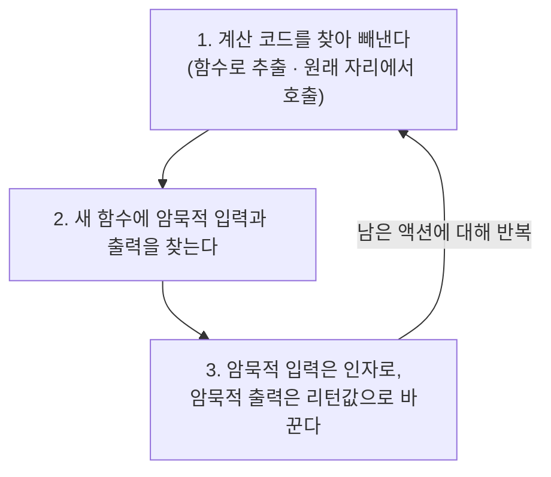

# 4장. 액션에서 계산 빼내기

**이번 장에서 살펴볼 내용**

- 어떻게 함수로 정보가 들어가고 나오는지 살펴본다.
- 테스트하기 쉽고 재사용성이 좋은 코드를 만들기 위한 함수형 기술에 대해 알아본다.
- 액션에서 계산을 빼내는 방법을 배운다.

> 이 장에서는 테스트하기 쉽고 재사용하기 좋은 코드를 만들기 위해 리팩터링 하는 방법을 살펴본다. 예제 코드에 기능을 조금 추가한 다음, **액션에서 계산을 빼내는 리팩터링**을 한다.

---

## 1. MegaMart.com 예제 코드

MegaMart는 온라인 쇼핑몰이다. 중요한 기능 중 하나는 쇼핑 중에 장바구니에 담겨 있는 제품의 **금액 합계**를 항상 보여주는 것이다.

```js
var shopping_cart = [];           // 장바구니 제품을 담는 전역변수
var shopping_cart_total = 0;      // 금액 합계를 담는 전역변수

function add_item_to_cart(name, price) {
  shopping_cart.push({            // cart 배열에 레코드 추가
    name: name,
    price: price
  });
  calc_cart_total();              // 제품이 바뀌었으므로 금액 합계 업데이트
}

function calc_cart_total() {
  shopping_cart_total = 0;
  for(var i = 0; i < shopping_cart.length; i++) {
    var item = shopping_cart[i];
    shopping_cart_total += item.price;   // 모든 제품값 더하기
  }
  set_cart_total_dom();           // 금액 합계를 반영하기 위해 DOM 업데이트
}
```

> **용어 설명 — DOM(document object model)**
> 웹브라우저 안에 있는 HTML 페이지를 메모리상에 표현한 것.

### 요구사항 1) 무료 배송비 계산하기

구매 합계가 20달러 이상이면 무료 배송을 해준다. 장바구니에 넣으면 합계가 20달러가 넘는 제품의 구매 버튼 옆에 무료 배송 아이콘을 표시한다.

```js
function update_shipping_icons() {
  var buy_buttons = get_buy_buttons_dom();   // 페이지에 있는 모든 구매 버튼
  for(var i = 0; i < buy_buttons.length; i++) {
    var button = buy_buttons[i];
    var item = button.item;
    if(item.price + shopping_cart_total >= 20)  // 무료 배송이 가능한지 확인
      button.show_free_shipping_icon();
    else
      button.hide_free_shipping_icon();
  }
}
```

합계 금액이 바뀔 때마다 모든 아이콘을 업데이트해야 하므로 `calc_cart_total()` 마지막에 `update_shipping_icons()`를 불러 준다.

### 요구사항 2) 세금 계산하기

금액 합계가 바뀔 때마다 세금을 다시 계산한다.

```js
function update_tax_dom() {
  set_tax_dom(shopping_cart_total * 0.10);   // 금액 합계에 10%를 곱해 DOM 업데이트
}
```

역시 `calc_cart_total()` 마지막에 호출을 추가한다.

> MegaMart 개발팀의 모토는 "동작하면 배포한다!" 지금까지는 잘 동작한다. 하지만 **테스트팀과 다른 부서에서 문제가 생긴다.**

---

## 2. 두 사람의 요구 — 테스트하기 쉽고 재사용하기 쉽게

### 테스트를 담당하고 있는 조지의 고민

지금 코드는 비즈니스 규칙을 테스트하기 어렵다. 코드가 바뀔 때마다 다음과 같은 테스트를 만들어야 한다.

1. 브라우저 설정하기
2. 페이지 로드하기
3. 장바구니에 제품 담기 버튼 클릭
4. **DOM이 업데이트될 때까지 기다리기**
5. DOM에서 값 가져오기
6. 가져온 문자열 값을 숫자로 바꾸기
7. 예상하는 값과 비교하기

```js
function update_tax_dom() {
  set_tax_dom(shopping_cart_total * 0.10);
  //          ^ 테스트하기 전에 전역변숫값을 설정해야 한다
  //   결괏값을 얻을 방법은 DOM에서 값을 가져오는 방법뿐이다
}
```

**조지의 제안**

- DOM 업데이트와 비즈니스 규칙은 분리되어야 한다.
- 전역변수가 없어야 한다!

### 개발팀 제나의 고민

결제팀과 배송팀에서 코드를 가져다 쓰려고 했지만 재사용할 수 없었다.

- 장바구니 정보를 전역변수에서 읽어오지만, 결제팀과 배송팀은 **데이터베이스에서** 장바구니 정보를 읽어야 한다.
- 결과를 보여주기 위해 DOM을 직접 바꾸고 있지만, 결제팀은 **영수증**을, 배송팀은 **운송장**을 출력해야 한다.

**제나의 제안**

- 전역변수에 의존하지 않아야 한다.
- DOM을 사용할 수 있는 곳에서 실행된다고 가정하면 안 된다.
- 함수가 결괏값을 리턴해야 한다.

---

## 3. 액션과 계산, 데이터를 구분하기

각 함수에 액션은 A, 계산은 C, 데이터는 D로 표시해 보면 **모든 코드가 액션(A)** 이다.

| 코드 | 구분 | 이유 |
| --- | --- | --- |
| `var shopping_cart = [];` | A | 전역변수는 변경 가능하다 |
| `add_item_to_cart()` | A | 전역변수를 바꾼다 |
| `update_shipping_icons()` | A | DOM에서 읽고 DOM을 바꾼다 |
| `update_tax_dom()` | A | DOM을 바꾼다 |
| `calc_cart_total()` | A | 전역변수를 바꾼다 |

> **기억하세요**
> **액션은 코드 전체로 퍼진다.** 어떤 함수 안에 액션이 하나만 있어도 그 함수 전체가 액션이 된다.

---

## 4. 함수에는 입력과 출력이 있습니다

**입력**은 함수가 계산을 하기 위한 외부 정보다. **출력**은 함수 밖으로 나오는 정보나 어떤 동작이다.

```js
var total = 0;
function add_to_total(amount) {          // 인자는 입력
  console.log("Old total: " + total);    // 전역변수를 읽는 것은 입력, 콘솔에 찍는 것은 출력
  total += amount;                       // 전역변수를 바꾸는 것은 출력
  return total;                          // 리턴값은 출력
}
```

### 입력과 출력은 명시적이거나 암묵적일 수 있습니다

| 구분 | 해당하는 것 |
| --- | --- |
| **명시적 입력** | 인자 |
| **암묵적 입력** | 인자 외 모든 입력 (전역변수 읽기, DB 조회 등) |
| **명시적 출력** | 리턴값 |
| **암묵적 출력** | 리턴값 외 모든 출력 (전역변수 바꾸기, DOM 업데이트, 콘솔 출력, 웹 요청 등) |

> **핵심** — 함수에 암묵적 입력과 출력이 있으면 **액션**이 된다.
> 암묵적 입력을 **인자**로 바꾸고, 암묵적 출력을 **리턴값**으로 바꾸면 **계산**이 된다.

> **용어 설명**
> 함수형 프로그래머는 암묵적 입력과 출력을 **부수 효과(side effect)** 라고 부른다. 부수 효과는 함수가 하려고 하는 주요 기능(리턴값을 계산하는 일)이 아니다.

### 조지와 제나의 제안은 모두 "암묵적 입출력을 없애자"는 말이었다

| 제안 | 함수형 관점의 해석 |
| --- | --- |
| 조지1: DOM 업데이트와 비즈니스 규칙은 분리되어야 한다 | DOM 업데이트는 **암묵적 출력**. 사용자가 정보를 봐야 하므로 DOM 업데이트는 어딘가 해야 하지만, 비즈니스 규칙과는 분리한다 |
| 조지2: 전역변수가 없어야 한다 | 전역변수를 **읽는 것은 암묵적 입력**, **바꾸는 것은 암묵적 출력** |
| 제나1: 전역변수에 의존하지 않아야 한다 | 조지2와 동일 |
| 제나2: DOM을 사용할 수 있는 곳에서 실행된다고 가정하면 안 된다 | DOM을 직접 쓰는 것은 암묵적 출력. 리턴값으로 바꿀 수 있다 |
| 제나3: 함수가 결괏값을 리턴해야 한다 | 암묵적 출력 대신 **명시적 출력**을 쓰자 |

---

## 5. 액션에서 계산 빼내기 — `calc_cart_total()`

### 1단계) 서브루틴 추출하기 (extract subroutine)

계산에 해당하는 코드를 골라 새로운 함수로 빼내고, 원래 자리에서는 새 함수를 호출한다. **동작은 바뀌지 않는다.**

```js
function calc_cart_total() {
  calc_total();               // 새로 만든 함수를 불러 준다
  set_cart_total_dom();
  update_shipping_icons();
  update_tax_dom();
}

function calc_total() {       // 아직 액션이다
  shopping_cart_total = 0;
  for(var i = 0; i < shopping_cart.length; i++) {
    var item = shopping_cart[i];
    shopping_cart_total += item.price;
  }
}
```

### 2단계) 암묵적 출력 없애기 → 리턴값으로

`shopping_cart_total` 전역변수를 바꾸는 것이 출력이다. 지역변수를 쓰고 리턴하도록 바꾸고, 호출하는 쪽에서 리턴값을 전역변수에 할당한다.

```js
function calc_cart_total() {
  shopping_cart_total = calc_total();   // 리턴값을 받아 전역변수에 할당
  set_cart_total_dom();
  update_shipping_icons();
  update_tax_dom();
}

function calc_total() {
  var total = 0;                        // 지역변수로 바꾼다
  for(var i = 0; i < shopping_cart.length; i++) {
    var item = shopping_cart[i];
    total += item.price;
  }
  return total;                         // 지역변수를 리턴
}
```

### 3단계) 암묵적 입력 없애기 → 인자로

`shopping_cart` 전역변수를 읽는 것이 입력이다. `cart` 인자를 추가한다.

```js
function calc_cart_total() {
  shopping_cart_total = calc_total(shopping_cart);   // 전역변수를 인자로 전달
  set_cart_total_dom();
  update_shipping_icons();
  update_tax_dom();
}

function calc_total(cart) {              // 이제 계산이다
  var total = 0;
  for(var i = 0; i < cart.length; i++) {
    var item = cart[i];
    total += item.price;
  }
  return total;
}
```

**모든 입력은 인자이고 모든 출력은 리턴값**이므로 `calc_total()`은 계산이다.

---

## 6. 액션에서 또 다른 계산 빼내기 — `add_item_to_cart()`

같은 3단계를 그대로 적용한다.

```js
// 1단계) 함수 추출하기 — add_item()은 아직 액션(전역 배열을 바꾼다)
function add_item_to_cart(name, price) {
  add_item(name, price);
  calc_cart_total();
}
function add_item(name, price) {
  shopping_cart.push({ name: name, price: price });
}
```

```js
// 2단계) 암묵적 입력(전역변수 읽기) → 인자로
function add_item_to_cart(name, price) {
  add_item(shopping_cart, name, price);
  calc_cart_total();
}
function add_item(cart, name, price) {
  cart.push({ name: name, price: price });   // 아직 암묵적 출력(배열 변경)이 남아 있다
}
```

```js
// 3단계) 암묵적 출력(배열 변경) → 복사본을 만들어 리턴
function add_item_to_cart(name, price) {
  shopping_cart = add_item(shopping_cart, name, price);
  calc_cart_total();
}
function add_item(cart, name, price) {
  var new_cart = cart.slice();      // 복사본을 만들어 지역변수에 할당
  new_cart.push({ name: name, price: price });   // 복사본을 변경
  return new_cart;                  // 복사본을 리턴
}
```

> **용어 설명 — 카피-온-라이트(copy-on-write)**
> 어떤 값을 바꿀 때 그 값을 복사해서 바꾸는 방법. 불변성을 구현하는 방법 중 하나이며 6장에서 자세히 다룬다.
>
> 자바스크립트에는 배열을 직접 복사하는 방법이 없어 이 책에서는 `array.slice()`를 사용한다.

---

## 7. 계산 추출을 단계별로 알아보기

액션에서 계산을 빼내는 작업은 **반복적인 과정**이다.



1. **계산 코드를 찾아 빼낸다.** 빼낼 코드를 찾아 새 함수로 추출하고, 인자가 필요하다면 추가한다. 원래 코드에서 빼낸 부분은 새 함수를 부르도록 바꾼다.
2. **새 함수에 암묵적 입력과 출력을 찾는다.**
   - 입력: 함수 인자를 포함해 **함수 밖에 있는 변수를 읽거나 데이터베이스에서 값을 가져오는 것**
   - 출력: 리턴값을 포함해 **전역변수를 바꾸거나 공유 객체를 바꾸거나 웹 요청을 보내는 것**
3. **암묵적 입력은 인자로, 암묵적 출력은 리턴값으로 바꾼다.** 한 번에 하나씩 바꾼다.

> 여기서 인자와 리턴값은 **바뀌지 않는 불변값**이라는 것이 중요하다. 리턴값이 나중에 바뀐다면 암묵적 출력이고, 인자로 받은 값이 바뀔 수 있다면 암묵적 입력이다. (6장에서 강제하는 방법을 배운다)

---

## 8. 연습 문제 — 세금 계산 / 무료 배송 판단 빼내기

### `calc_tax()` 빼내기 (결제팀 재사용)

```js
// 원래 코드
function update_tax_dom() {
  set_tax_dom(shopping_cart_total * 0.10);
}

// 완성된 코드
function update_tax_dom() {
  set_tax_dom(calc_tax(shopping_cart_total));
}
function calc_tax(amount) {          // 계산 — 비즈니스 규칙만 남았다
  return amount * 0.10;
}
```

### `gets_free_shipping()` 빼내기 (배송팀 재사용)

```js
// 완성된 코드
function update_shipping_icons() {
  var buy_buttons = get_buy_buttons_dom();
  for(var i = 0; i < buy_buttons.length; i++) {
    var button = buy_buttons[i];
    var item = button.item;
    if(gets_free_shipping(shopping_cart_total, item.price))
      button.show_free_shipping_icon();
    else
      button.hide_free_shipping_icon();
  }
}
function gets_free_shipping(total, item_price) {   // 계산
  return item_price + total >= 20;
}
```

두 함수 모두 조지와 제나의 고민을 **모두** 해결해 준다.

---

## 9. 전체 코드를 봅시다

| 함수 | 구분 | 이유 |
| --- | --- | --- |
| `shopping_cart`, `shopping_cart_total` | A | 전역변수 |
| `add_item_to_cart()` | A | 전역변수를 읽고 바꾼다 |
| `calc_cart_total()` | A | 전역변수를 읽고 바꾼다 |
| `update_shipping_icons()` | A | 전역변수를 읽고 DOM을 바꾼다 |
| `update_tax_dom()` | A | 전역변수를 읽고 DOM을 바꾼다 |
| `add_item()` | **C** | 암묵적 입력과 출력이 없다 |
| `calc_total()` | **C** | 암묵적 입력과 출력이 없다 |
| `gets_free_shipping()` | **C** | 암묵적 입력과 출력이 없다 |
| `calc_tax()` | **C** | 암묵적 입력과 출력이 없다 |

> **기억하세요** — 함수 안에 액션이 하나 있다면 그 함수 전체가 액션이 된다.

---

## 쉬는 시간 (Q&A)

| 질문 | 답 |
| --- | --- |
| **코드가 더 많아졌는데 잘하고 있는 것인가?** | 일반적으로 코드가 적은 것이 좋지만, 함수로 분리하면서 얻은 장점이 더 크다. 테스트하기 쉬워졌고 재사용하기 좋아졌으며, 이미 다른 두 부서에서 사용하고 있다. 테스트 코드는 더 짧아졌다 |
| **재사용성과 테스트 용이성이 함수형 프로그래밍의 전부인가?** | 아니다. 동시성, 설계, 데이터 모델링 측면에서도 장점이 있다. 함수형 프로그래밍의 장점은 훨씬 더 많다 |
| **다른 곳에서 쓰지 않아도 계산으로 분리하는 것이 중요한가?** | 물론이다. **어떤 것을 분리해 더 작게 만드는 것** 자체가 목적 중 하나다. 작은 것은 테스트하기 쉽고 재사용하기 쉽고 이해하기 쉽다 |
| **계산 안에서 아직 변수를 변경하고 있는데 불변값이어야 하지 않나?** | 불변값은 **생성된 다음에** 바뀌면 안 되는 값이다. 생성할 때는 초기화가 필요하다. 지역변수는 함수 밖에서 접근할 수 없고, 초기화가 끝나면 리턴한다. (원칙은 6장에서 다룬다) |

---

## 결론

코드를 바꾸고 나서 모두가 행복해졌다. 조지는 테스트를 쉽게 할 수 있게 되었고, 제나가 고친 코드는 결제팀과 배송팀에서 아무 문제 없이 잘 사용했다.

## 요점 정리

- **액션은 암묵적인 입력 또는 출력을 가지고 있다.**
- 계산의 정의에 따르면 **계산은 암묵적인 입력이나 출력이 없어야 한다.**
- 공유 변수(전역변수 같은)는 일반적으로 암묵적 입력 또는 출력이 된다.
- **암묵적 입력은 인자로 바꿀 수 있다.**
- **암묵적 출력은 리턴값으로 바꿀 수 있다.**
- 함수형 원칙을 적용하면 **액션은 줄어들고 계산은 늘어난다.**

## 다음 장에서 배울 내용

더 좋은 코드를 만들기 위해 액션에서 계산을 추출해 봤다. 하지만 어떤 경우에는 빼낼 계산이 없을지도 모른다. 그러면 모든 것이 액션이다. **액션을 없앨 수 없는 상황에서 코드를 개선하려면** 어떻게 해야 할까? 다음 장에서 이 주제를 알아본다.
