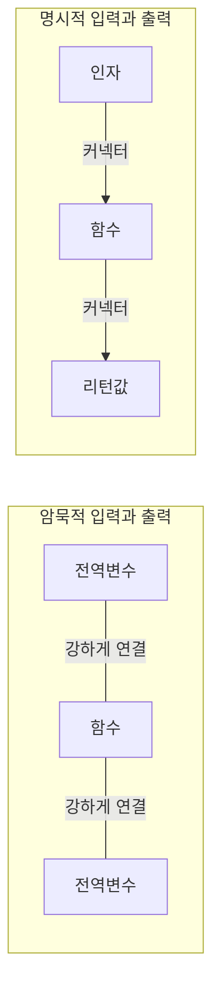

# 5장. 더 좋은 액션 만들기

**이번 장에서 살펴볼 내용**

- 암묵적 입력과 출력을 제거해서 재사용하기 좋은 코드를 만드는 방법을 알아본다.
- 복잡하게 엉킨 코드를 풀어 더 좋은 구조로 만드는 법을 배운다.

> 지난 장에서 암묵적 입력과 출력을 없애 액션을 계산으로 만드는 방법을 배웠다. 하지만 **모든 액션을 없앨 수는 없다.** 액션은 필요하기 때문이다. 이 장에서는 **액션에서 암묵적 입력과 출력을 줄여 설계를 개선**하는 방법에 대해 알아본다.

---

## 1. 비즈니스 요구 사항과 설계를 맞추기

### 요구 사항에 맞춰 더 나은 추상화 단계 선택하기

액션에서 계산으로 리팩터링하는 과정은 단순하고 기계적이었다. 하지만 **기계적인 리팩터링이 항상 최선의 구조를 만들어 주는 것은 아니다.** 좋은 구조를 만들기 위해서는 어느 정도 사람의 손길이 필요하다.

```js
function gets_free_shipping(total, item_price) {   // 이 인자는 요구 사항과 맞지 않는다
  return item_price + total >= 20;
}
```

- **요구 사항**: 장바구니에 담긴 제품을 주문할 때 무료 배송인지 확인하는 것
- **현재 함수**: 장바구니로 확인하지 않고 **제품의 합계와 가격**으로 확인하고 있다

또한 **합계에 제품 가격을 더하는 코드(`item + total`)가 두 군데**에 중복되어 있다.

> **용어 설명 — 코드의 냄새(code smell)**
> 코드의 냄새는 더 큰 문제를 미리 알려준다. 중복이 항상 나쁜 것은 아니지만 코드에서 나는 냄새이며, 나중에 문제가 될 수도 있다.

### 함수 시그니처를 요구 사항에 맞추기

```js
// 원래 코드
function gets_free_shipping(total, item_price) {
  return item_price + total >= 20;
}

// 새 시그니처를 적용한 코드 — 장바구니가 무료 배송인지 알려준다
function gets_free_shipping(cart) {
  return calc_total(cart) >= 20;     // 별도의 계산 함수를 재사용해 중복도 없앤다
}
```

장바구니(cart)는 전자상거래에서 많이 사용하는 **엔티티(entity) 타입**이기 때문에 비즈니스 요구 사항과 잘 맞는다.

시그니처가 바뀌었으므로 호출하는 쪽도 고친다.

```js
function update_shipping_icons() {
  var buttons = get_buy_buttons_dom();
  for(var i = 0; i < buttons.length; i++) {
    var button = buttons[i];
    var item = button.item;
    var new_cart = add_item(shopping_cart,        // 추가할 제품이 들어있는 새 장바구니를 만든다
                            item.name,
                            item.price);
    if(gets_free_shipping(new_cart))
      button.show_free_shipping_icon();
    else
      button.hide_free_shipping_icon();
  }
}
```

> 원래 있던 장바구니를 직접 변경하지 않고 **복사본을 만들었다.** 이런 스타일을 함수형 프로그래밍에서 많이 사용한다 → **카피-온-라이트(copy-on-write)**

---

## 2. 원칙: 암묵적 입력과 출력은 적을수록 좋습니다

인자가 아닌 모든 입력은 암묵적 입력이고, 리턴값이 아닌 모든 출력은 암묵적 출력이다. 계산을 만들기 위해 이것들을 없애는 원칙은 **액션에도 적용할 수 있다.** 모두 없애지 못하더라도 **줄이면 좋다.**

| 관점 | 암묵적 입력과 출력이 있는 함수 | 명시적 입력과 출력만 있는 함수 |
| --- | --- | --- |
| **모듈성** | 다른 컴포넌트와 강하게 연결되어 있어 모듈이 아니다. 다른 곳에서 사용할 수 없다 | 쉽게 뗐다 붙일 수 있는 **커넥터로 연결된 모듈**과 같다 |
| **동작 예측** | 동작이 연결된 부분의 동작에 의존한다 | 인자와 리턴값만 보면 된다 |
| **테스트** | 모든 입력값을 설정하고 테스트를 돌린 후 모든 출력값을 확인해야 한다. 입출력이 많을수록 더 어려워진다 | 쉽다 |



- **암묵적 입력이 있는 함수는 조심해야 한다.** 원하는 값을 얻으려면 그 값을 읽는 동안 다른 코드가 실행되지 않는지 확인해야 한다.
- **암묵적 출력이 있는 함수도 조심해야 한다.** 원할 때만 쓸 수 있고, 다른 곳에 영향을 준다.
- 모든 암묵적 입출력을 없애지 못해 액션을 계산으로 바꾸지 못해도, **암묵적 입출력을 줄이면 테스트하기 쉽고 재사용하기 좋아진다.**

---

## 3. 암묵적 입력과 출력 줄이기

`update_shipping_icons()`에 원칙을 적용해 전역변수 읽기를 인자로 바꾼다.

```js
// 명시적 인자로 바꾼 코드
function update_shipping_icons(cart) {          // 전역변수 대신 인자를 추가
  var buttons = get_buy_buttons_dom();
  for(var i = 0; i < buttons.length; i++) {
    var button = buttons[i];
    var item = button.item;
    var new_cart = add_item(cart, item.name, item.price);
    if(gets_free_shipping(new_cart))
      button.show_free_shipping_icon();
    else
      button.hide_free_shipping_icon();
  }
}

// 호출하는 곳도 인자를 전달하도록 고친다
function calc_cart_total() {
  shopping_cart_total = calc_total(shopping_cart);
  set_cart_total_dom();
  update_shipping_icons(shopping_cart);
  update_tax_dom();
}
```

### 연습 문제 — 전역변수를 읽는 곳을 모두 인자로 바꾸기

전역변수를 읽는 곳을 인자로 최대한 바꾸면 다음과 같다. **`shopping_cart` 전역변수는 `add_item_to_cart()` 한 곳에서만 읽게 된다.**

```js
function add_item_to_cart(name, price) {
  shopping_cart = add_item(shopping_cart, name, price);
  calc_cart_total(shopping_cart);         // 인자로 전달
}

function calc_cart_total(cart) {          // 인자로 받는다
  var total = calc_total(cart);
  set_cart_total_dom(total);
  update_shipping_icons(cart);
  update_tax_dom(total);
  shopping_cart_total = total;            // 전역변수를 바꾸지만 어디서도 읽지 않는다
}

function set_cart_total_dom(total) { ... total ... }

function update_shipping_icons(cart) {
  var buttons = get_buy_buttons_dom();
  for(var i = 0; i < buttons.length; i++) {
    var button = buttons[i];
    var item = button.item;
    var new_cart = add_item(cart, item.name, item.price);
    if(gets_free_shipping(new_cart))
      button.show_free_shipping_icon();
    else
      button.hide_free_shipping_icon();
  }
}

function update_tax_dom(total) {
  set_tax_dom(calc_tax(total));
}
```

---

## 4. 코드 다시 살펴보기 — 중복과 불필요한 코드 정리

함수형 원칙을 적용할 부분을 찾는 것도 중요하지만, **중복이나 불필요한 코드**가 있는지도 살펴봐야 한다.

정리할 코드가 두 개 있었다.

1. 사용하지 않는 `shopping_cart_total` 전역변수 → **지운다**
2. 조금 과해 보이는 `calc_cart_total()` 함수 → **본문을 `add_item_to_cart()` 안으로 옮긴다**

```js
// 개선한 코드
function add_item_to_cart(name, price) {
  shopping_cart = add_item(shopping_cart, name, price);

  var total = calc_total(shopping_cart);
  set_cart_total_dom(total);
  update_shipping_icons(shopping_cart);
  update_tax_dom(total);
}
```

---

## 5. 계산 분류하기

의미 있는 계층을 알아보기 위해 계산 함수를 분류해 본다.

| 표시 | 의미 |
| --- | --- |
| **C** | cart(장바구니)에 대한 동작 |
| **I** | item(제품)에 대한 동작 |
| **B** | 비즈니스 규칙 |

| 함수 | 분류 |
| --- | --- |
| `add_item(cart, name, price)` | C, I |
| `calc_total(cart)` | C, I, B |
| `gets_free_shipping(cart)` | B |
| `calc_tax(amount)` | B |

> 이렇게 나눈 것은 코드에서 **의미 있는 계층**이 되기 때문에 기억해 두면 좋다. 계층에 관한 이야기는 8장과 9장에서 본격적으로 다룬다. **계층은 엉켜있는 코드를 풀면 자연스럽게 만들어진다.**

---

## 6. 원칙: 설계는 엉켜있는 코드를 푸는 것이다

함수를 사용하면 관심사를 자연스럽게 분리할 수 있다. 함수는 **인자로 넘기는 값**과 **그 값을 사용하는 방법**을 분리한다.

가끔 어떤 것은 합치고 싶을 수도 있다. 크고 복잡한 것이 더 잘 만들어진 것 같다고 느끼기 때문이다. 하지만 **분리된 것은 언제든 쉽게 조합할 수 있다.** 오히려 잘 분리하는 방법을 찾기가 더 어렵다.

| 분리하면 좋은 이유 | 설명 |
| --- | --- |
| **재사용하기 쉽다** | 함수는 작으면 작을수록 재사용하기 쉽다. 하는 일도 적고 쓸 때 가정을 많이 하지 않아도 된다 |
| **유지보수하기 쉽다** | 작은 함수는 쉽게 이해할 수 있다. 코드가 작기 때문에 올바른지 아닌지 명확하게 알 수 있다 |
| **테스트하기 쉽다** | 한 가지 일만 하기 때문에 한 가지만 테스트하면 된다 |

> 함수에 특별한 문제가 없어도 **꺼낼 것이 있다면 분리하는 것이 좋다.**
> 설계는 **엉켜 있는 커다란 실타래를 풀어 개별적인 것으로 만드는 방법을 찾는 것**이다. 풀려있는 것은 문제를 풀기 위해 언제든 다시 조합할 수 있다.

---

## 7. `add_item()`을 분리해 더 좋은 설계 만들기

`add_item()`은 간단해 보이지만 자세히 보면 **네 부분**으로 나눌 수 있다.

```js
function add_item(cart, name, price) {
  var new_cart = cart.slice();     // 1. 배열을 복사
  new_cart.push({                  // 3. 복사본에 item을 추가
    name: name,                    // 2. item 객체를 만든다
    price: price
  });
  return new_cart;                 // 4. 복사본을 리턴
}
```

`cart`와 `item` 구조를 **모두** 알고 있으므로, item에 관한 코드를 별도 함수로 분리한다.

```js
function make_cart_item(name, price) {     // 생성자 함수 — item 구조만 안다
  return {
    name: name,
    price: price
  };
}

function add_item(cart, item) {            // cart 구조만 안다
  var new_cart = cart.slice();             // 1. 배열 복사
  new_cart.push(item);                     // 3. 복사본에 추가
  return new_cart;                         // 4. 복사본 리턴
}

add_item(shopping_cart, make_cart_item("shoes", 3.45));
```

이렇게 분리하면 **cart와 item을 독립적으로 확장**할 수 있다. 예를 들어 배열인 cart를 해시 맵 같은 자료 구조로 바꿔도 변경해야 할 부분이 적다.

> 1, 3, 4번은 값을 바꿀 때 복사하는 **카피-온-라이트**를 구현한 부분이므로 함께 두는 것이 좋다. (6장에서 자세히)

---

## 8. 카피-온-라이트 패턴을 빼내기

`add_item()`은 이제 **어떤 배열과 항목에도 쓸 수 있는 구현**이 되었지만 이름은 일반적이지 않다. 이름을 더 일반적으로 바꾼다.

```js
// 일반적인 이름으로 바꾼 코드 — 재사용 가능한 유틸리티 함수
function add_element_last(array, elem) {
  var new_array = array.slice();
  new_array.push(elem);
  return new_array;
}

// 원래 add_item()은 간단하게 다시 만들 수 있다
function add_item(cart, item) {
  return add_element_last(cart, item);
}
```

호출하는 곳도 `item`을 만들어 넘기도록 고친다.

```js
function add_item_to_cart(name, price) {
  var item = make_cart_item(name, price);
  shopping_cart = add_item(shopping_cart, item);
  var total = calc_total(shopping_cart);
  set_cart_total_dom(total);
  update_shipping_icons(shopping_cart);
  update_tax_dom(total);
}
```

### 다시 분류하기

| 표시 | 의미 |
| --- | --- |
| **A** | 배열 유틸리티 |
| **C** | cart에 대한 동작 |
| **I** | item에 대한 동작 |
| **B** | 비즈니스 규칙 |

| 함수 | 분류 | 비고 |
| --- | --- | --- |
| `add_element_last(array, elem)` | A | 원래 하나였던 함수를 |
| `add_item(cart, item)` | C | 세 개로 나눴다 |
| `make_cart_item(name, price)` | I | |
| `calc_total(cart)` | C, I, B | 세 분류가 다 묶여 있다(흥미로운 함수) |
| `gets_free_shipping(cart)` | B | 바뀌지 않았다 |
| `calc_tax(amount)` | B | 바뀌지 않았다 |

---

## 9. 연습 문제 — `update_shipping_icons()` 풀기

이 함수는 여섯 가지 일을 하고 있다.

| 하는 일 | 분류 |
| --- | --- |
| 1. 모든 버튼을 가져오기 | 구매하기 버튼 관련 동작 |
| 2. 버튼을 가지고 반복하기 | 구매하기 버튼 관련 동작 |
| 3. 버튼에 관련된 제품을 가져오기 | 구매하기 버튼 관련 동작 |
| 4. 가져온 제품을 가지고 새 장바구니 만들기 | cart와 item 관련 동작 |
| 5. 장바구니가 무료 배송이 필요한지 확인하기 | cart와 item 관련 동작 |
| 6. 아이콘 표시하거나 감추기 | DOM 관련 동작 |

**하나의 분류에만 속하도록 푼 코드**(정답 예시 중 하나)

```js
function update_shipping_icons(cart) {              // 구매하기 버튼 관련 동작
  var buy_buttons = get_buy_buttons_dom();
  for(var i = 0; i < buy_buttons.length; i++) {
    var button = buy_buttons[i];
    var item = button.item;
    var hasFreeShipping = gets_free_shipping_with_item(cart, item);
    set_free_shipping_icon(button, hasFreeShipping);
  }
}

function gets_free_shipping_with_item(cart, item) {  // cart와 item 관련 동작
  var new_cart = add_item(cart, item);
  return gets_free_shipping(new_cart);
}

function set_free_shipping_icon(button, isShown) {   // DOM 관련 동작
  if(isShown)
    button.show_free_shipping_icon();
  else
    button.hide_free_shipping_icon();
}
```

---

## 10. 작은 함수와 많은 계산

최종 코드를 A(액션) / C(계산) / D(데이터)로 표시해 보면, **액션은 4개뿐이고 나머지는 모두 계산**이다.

| 함수 | 구분 |
| --- | --- |
| `shopping_cart` (전역변수) | A |
| `add_item_to_cart()` | A (전역변수 읽기) |
| `update_shipping_icons()` | A (DOM 수정) |
| `update_tax_dom()` | A (DOM 수정) |
| `add_element_last()` | **C** |
| `add_item()` | **C** |
| `make_cart_item()` | **C** |
| `calc_total()` | **C** |
| `gets_free_shipping()` | **C** |
| `calc_tax()` | **C** |

---

## 쉬는 시간 (Q&A)

| 질문 | 답 |
| --- | --- |
| **코드 라인 수가 늘어났는데 좋은 코드인가?** | 라인 수도 지표지만 그것만으로 판단하기는 어렵다. 또 다른 지표는 **함수의 크기**다. 우리가 만든 계산 함수는 매우 작고, 응집력 있고 재사용하기 쉽다 |
| **`add_item()`을 부를 때마다 cart 배열을 복사하면 비용이 크지 않나?** | 배열을 바꾸는 것보다 비용이 더 드는 것은 맞다. 하지만 최신 언어의 런타임과 **가비지 컬렉터**는 불필요한 메모리를 효율적으로 처리한다. 복사본을 사용할 때 잃는 것보다 **얻는 것이 더 많다.** 느리다면 나중에 최적화할 수 있지만 **섣부른 최적화는 하지 않는다** (6장, 7장) |
| **왜 계산을 유틸리티와 장바구니, 비즈니스 규칙으로 다시 나누는가?** | 나중에 다룰 **설계 기술(계층형 설계)** 을 미리 보여주기 위해서다. 최종적으로 코드는 구분된 그룹과 분리된 계층으로 구성된다 |
| **비즈니스 규칙과 장바구니 기능의 차이는?** | 장바구니는 대부분의 전자상거래 서비스에서 사용하는 **일반적인 개념**이지만, 비즈니스 규칙은 **MegaMart에서 운영하는 특별한 규칙**이다. 다른 서비스에도 장바구니는 있겠지만 똑같은 무료 배송 규칙이 있을 거라고 기대하지는 않는다 |
| **두 분류에 모두 속하는 함수가 있어도 되나?** | 지금은 예외로 볼 수 있지만 **계층 관점에서는 코드의 냄새**다. 비즈니스 규칙은 장바구니 구조 같은 하위 계층보다 빠르게 바뀌므로 설계를 진행하면서 분리해야 한다 |

---

## 결론

킴이 설계에 관해 제안한 아이디어는 코드를 잘 구성하는 데 도움이 되었다. 이제 **액션은 데이터 구조에 대해 몰라도 되고, 재사용할 수 있는 유용한 인터페이스 함수가 많이 생겼다.**

하지만 MegaMart가 아직 모르고 있는 **버그가 장바구니에 많이 숨어 있다.** 그전에 먼저 불변성에 대해 자세히 알아봐야 한다.

## 요점 정리

- 일반적으로 **암묵적 입력과 출력은 인자와 리턴값으로 바꿔 없애는 것이 좋다.**
- **설계는 엉켜있는 것을 푸는 것이다.** 풀려있는 것은 언제든 다시 합칠 수 있다.
- 엉켜있는 것을 풀어 **각 함수가 하나의 일만 하도록** 하면, 개념을 중심으로 쉽게 구성할 수 있다.

## 다음 장에서 배울 내용

설계에 대한 내용은 8장에서 다시 살펴본다. 다음 두 장(6장, 7장)에서는 **불변성**에 대해 알아본다. 기존 코드와 상호작용하면서 새로운 코드에 불변성을 적용하려면 어떻게 해야 할까?
