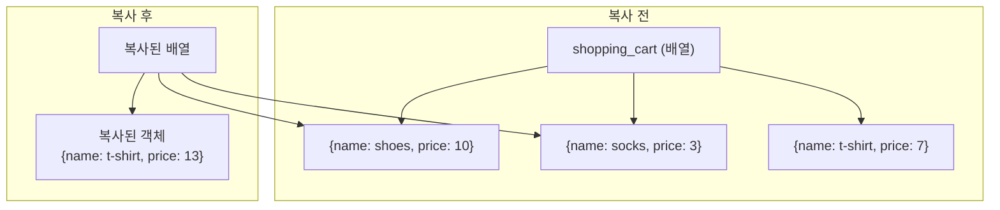

# 6장. 변경 가능한 데이터 구조를 가진 언어에서 불변성 유지하기

**이번 장에서 살펴볼 내용**

- 데이터가 바뀌지 않도록 하기 위해 카피-온-라이트를 적용한다.
- 배열과 객체를 데이터에 쓸 수 있는 카피-온-라이트 동작을 만든다.
- 깊이 중첩된 데이터도 카피-온-라이트가 잘 동작하게 만든다.

> 앞에서 불변성에 대해 잠깐 이야기했고 일부 코드에 적용해 봤다. 이 장에서는 **일반적인 자바스크립트 배열과 객체에 불변 데이터를 다룰 수 있는 동작**을 만들고 적용해 본다.

---

## 1. 모든 동작을 불변형으로 만들 수 있나요?

앞으로 카피-온-라이트를 적용해야 하는 장바구니와 제품에 대한 동작이다.

| 장바구니에 대한 동작 | 제품에 대한 동작 |
| --- | --- |
| 1. 제품 개수 가져오기 | 1. 가격 설정하기 |
| 2. 제품 이름으로 제품 가져오기 | 2. 가격 가져오기 |
| 3. 제품 추가하기 (이미 구현함) | 3. 이름 가져오기 |
| 4. 제품 이름으로 제품 빼기 | |
| 5. 제품 이름으로 제품 구매 수량 바꾸기 (**중첩된 데이터에 대한 동작**) | |

> **용어 설명 — 중첩(nested) / 깊이 중첩(deeply nested)**
> 데이터 구조 안에 데이터 구조가 있는 경우 데이터가 **중첩**되었다고 한다. 배열 안에 객체가 있다면 중첩된 데이터다. 러시아 인형(마트료시카)을 상상하면 된다.
> **깊이 중첩**되었다는 말은 중첩이 이어진다는 말이다. 객체 안에 객체, 또 배열 안에… 중첩은 계속 이어질 수 있다.

---

## 2. 동작을 읽기, 쓰기 또는 둘 다로 분류하기

| 구분 | 정의 |
| --- | --- |
| **읽기(read)** | 데이터에서 정보를 가져온다. **데이터를 바꾸지 않는다.** 인자에만 의존해 정보를 가져오는 읽기 동작이라면 **계산**이라고 할 수 있다 |
| **쓰기(write)** | 데이터를 어떻게든 **바꾼다.** 바뀌는 값은 어디서 사용될지 모르기 때문에 바뀌지 않도록 원칙이 필요하다 |

| 장바구니 동작 | 분류 |
| --- | --- |
| 1. 제품 개수 가져오기 | 읽기 |
| 2. 제품 이름으로 제품 가져오기 | 읽기 |
| 3. 제품 추가하기 | 쓰기 |
| 4. 제품 이름으로 제품 빼기 | 쓰기 |
| 5. 제품 구매 수량 바꾸기 | 쓰기 |

| 제품 동작 | 분류 |
| --- | --- |
| 1. 가격 설정하기 | 쓰기 |
| 2. 가격 가져오기 | 읽기 |
| 3. 이름 가져오기 | 읽기 |

쓰기 동작은 **불변성 원칙에 따라 구현**해야 한다. 그 원칙이 바로 **카피-온-라이트(copy-on-write)** 다.

> **언어 탐구**
> 불변형 데이터 구조는 함수형 언어의 일반적인 기능이지만 언어에서 지원하지 않는 경우가 많다. 아래는 불변 데이터 구조를 기본으로 지원하는 언어다.
> 하스켈(Haskell), 클로저(Clojure), 엘름(Elm), 퓨어스크립트(Purescript), 얼랭(Erlang), 엘릭서(Elixir)
>
> 자바스크립트는 기본적으로 변경 가능한 데이터 구조를 사용하기 때문에 **불변성 원칙을 직접 구현해야 한다.**

읽으면서 쓰는 동작(둘 다인 동작)도 있다. 이것도 카피-온-라이트로 바꿀 수 있다. (뒤에서 다룬다)

---

## 3. 카피-온-라이트 원칙 세 단계


```js
function add_element_last(array, elem) {
  var new_array = array.slice();   // 1. 복사본 만들기
  new_array.push(elem);            // 2. 복사본 바꾸기
  return new_array;                // 3. 복사본 리턴하기
}
```

이 함수가 기존 배열을 변경하지 않는 이유

1. 배열을 복사했고 **기존 배열은 변경하지 않았다.**
2. 복사본은 **함수 범위 안에 있기 때문에** 다른 코드에서 접근할 수 없다.
3. 복사본을 변경하고 나서 **함수를 나간다(리턴한다).** 이후에는 값을 바꿀 수 없다.

> **`add_element_last()`는 읽기일까 쓰기일까?**
> 데이터를 바꾸지 않았고 정보를 리턴했기 때문에 **읽기**다.
> **카피-온-라이트는 쓰기를 읽기로 바꾼다.**

---

## 4. 카피-온-라이트로 쓰기를 읽기로 바꾸기

제품 이름으로 장바구니에서 제품을 빼는 함수에 적용해 본다.

```js
// 원래 코드 — cart를 직접 변경한다(쓰기)
function remove_item_by_name(cart, name) {
  var idx = null;
  for(var i = 0; i < cart.length; i++) {
    if(cart[i].name === name)
      idx = i;
  }
  if(idx !== null)
    cart.splice(idx, 1);      // idx 위치의 항목을 하나 삭제 → 장바구니를 변경
}
```

세 단계를 차례로 적용한다.

```js
// 카피-온-라이트를 적용한 코드
function remove_item_by_name(cart, name) {
  var new_cart = cart.slice();          // 1. 복사본 만들기
  var idx = null;
  for(var i = 0; i < new_cart.length; i++) {
    if(new_cart[i].name === name)
      idx = i;
  }
  if(idx !== null)
    new_cart.splice(idx, 1);            // 2. 복사본 변경하기
  return new_cart;                      // 3. 복사본 리턴하기
}
```

호출하는 쪽도 **리턴값을 전역변수에 할당**하도록 고쳐야 한다.

```js
function delete_handler(name) {
  shopping_cart = remove_item_by_name(shopping_cart, name);   // 리턴값을 할당
  var total = calc_total(shopping_cart);
  set_cart_total_dom(total);
  update_shipping_icons(shopping_cart);
  update_tax_dom(total);
}
```

### 카피-온-라이트 동작은 일반화할 수 있다

`.splice()`를 감싼 일반적인 유틸리티를 만들어 두면 배열/객체 복사 패턴을 반복하지 않아도 된다.

```js
// 원래 코드
function removeItems(array, idx, count) {
  array.splice(idx, count);
}

// 카피-온-라이트를 적용한 코드
function removeItems(array, idx, count) {
  var copy = array.slice();
  copy.splice(idx, count);
  return copy;
}

// removeItems()가 이미 복사하므로 remove_item_by_name()은 복사할 필요가 없다
function remove_item_by_name(cart, name) {
  var idx = null;
  for(var i = 0; i < cart.length; i++) {
    if(cart[i].name === name)
      idx = i;
  }
  if(idx !== null)
    return removeItems(cart, idx, 1);
  return cart;      // 보너스! 값을 바꾸지 않으면 복사하지 않아도 된다
}
```

---

## 5. 자바스크립트 배열 훑어보기

배열은 자바스크립트의 기본 컬렉션이다. 순서 있는 값을 나타내며 인덱스로 접근한다. 크기를 늘리거나 줄일 수 있다.

| 동작 | 읽기/쓰기 | 설명 |
| --- | --- | --- |
| `array[idx]` | 읽기 | idx 위치 값 가져오기 (0부터 시작) |
| `array[idx] = v` | **쓰기** | 값 할당 — 배열을 변경한다 |
| `array.length` | 읽기 | 항목 개수 (메서드가 아니라 괄호를 쓰지 않는다) |
| `array.push(el)` | **쓰기** | 끝에 추가하고 새로운 길이를 리턴 |
| `array.pop()` | **쓰기 + 읽기** | 끝의 값을 지우고 지운 값을 리턴 |
| `array.unshift(el)` | **쓰기** | 맨 앞에 추가하고 새로운 길이를 리턴 |
| `array.shift()` | **쓰기 + 읽기** | 맨 앞의 값을 지우고 지운 값을 리턴 |
| `array.slice()` | 읽기 | 배열을 **얕게 복사**해서 새로운 배열을 리턴 |
| `array.splice(idx, num)` | **쓰기 + 읽기** | idx 위치에서 num개 항목을 지우고 지운 항목을 리턴 |

> ⚠️ 배열에 항목이 다른 배열이나 객체를 참조한다면 `.slice()`를 해도 **참조하는 배열이나 객체는 복사되지 않는다.** (얕은 복사)

### 연습 문제 — 메일링 리스트

```js
// 원래 코드
var mailing_list = [];
function add_contact(email) {
  mailing_list.push(email);          // 전역변수를 직접 변경
}

// 카피-온-라이트를 적용한 코드
var mailing_list = [];
function add_contact(mailing_list, email) {
  var list_copy = mailing_list.slice();
  list_copy.push(email);
  return list_copy;
}
function submit_form_handler(event) {
  var form = event.target;
  var email = form.elements["email"].value;
  mailing_list = add_contact(mailing_list, email);   // 리턴값을 전역변수에 할당
}
```

---

## 6. 쓰기를 하면서 읽기도 하는 동작은 어떻게 해야 할까요?

`.shift()`는 값을 바꾸면서 동시에 첫 번째 항목을 리턴한다. **읽기 + 쓰기** 동작이다.

```js
var a = [1, 2, 3, 4];
var b = a.shift();
console.log(b);  // 1을 출력 (값을 리턴)
console.log(a);  // [2, 3, 4]를 출력 (값이 바뀌었다)
```

두 가지 접근 방법이 있다.

| 접근 방법 | 설명 |
| --- | --- |
| **1. 읽기와 쓰기 함수로 각각 분리한다** | **더 좋은 방법.** 책임이 확실히 분리된다. 5장에서 본 것처럼 설계는 서로 엉켜있는 것을 분리하는 작업이다 |
| **2. 함수에서 값을 두 개 리턴한다** | 함께 쓸 수밖에 없는 경우 |

### 방법 1) 쓰면서 읽기도 하는 함수를 분리하기

```js
// 읽기 동작 — 계산이다 (아무것도 바꾸지 않는다)
function first_element(array) {
  return array[0];
}

// 쓰기 동작 — .shift()를 실행하고 결괏값은 무시한다
function drop_first(array) {
  array.shift();
}

// 쓰기 동작을 카피-온-라이트로 바꾼다 (전형적인 카피-온-라이트)
function drop_first(array) {
  var array_copy = array.slice();
  array_copy.shift();
  return array_copy;
}
```

### 방법 2) 값을 두 개 리턴하는 함수로 만들기

```js
// 1단계) 동작을 감싼다 (리턴값을 무시하면 안 된다)
function shift(array) {
  return array.shift();
}

// 2단계) 카피-온-라이트로 바꾸고 두 값을 객체로 리턴한다
function shift(array) {
  var array_copy = array.slice();
  var first = array_copy.shift();
  return {
    first : first,
    array : array_copy
  };
}

// 다른 방법 — 첫 번째 접근 방식으로 만든 두 계산을 조합한다
function shift(array) {
  return {
    first : first_element(array),
    array : drop_first(array)
  };
}
```

> 첫 번째 접근 방법으로 만든 두 함수는 모두 계산이기 때문에 **쉽게 조합할 수 있고, 조합해도 계산이다.**

### 연습 문제 — `.pop()`, `.push()`, `arraySet()`

```js
// 1) 읽기 / 쓰기 분리
function last_element(array) {
  return array[array.length - 1];
}
function drop_last(array) {
  var array_copy = array.slice();
  array_copy.pop();
  return array_copy;
}

// 2) 값 두 개 리턴하기
function pop(array) {
  var array_copy = array.slice();
  var first = array_copy.pop();
  return { first : first, array : array_copy };
}

// .push() 카피-온-라이트 버전
function push(array, elem) {
  var copy = array.slice();
  copy.push(elem);
  return copy;
}

// 배열 항목 설정 a[15] = 2; 의 카피-온-라이트 버전
function arraySet(array, idx, value) {
  var copy = array.slice();
  copy[idx] = value;
  return copy;
}
```

---

## 7. 불변 데이터 구조를 읽는 것은 계산입니다

| 명제 | 이유 |
| --- | --- |
| **변경 가능한 데이터를 읽는 것은 액션이다** | 읽을 때마다 다른 값을 읽을 수도 있다 |
| **쓰기는 데이터를 변경 가능한 구조로 만든다** | 쓰기는 데이터를 바꾸기 때문 |
| **어떤 데이터에 쓰기가 없다면 데이터는 변경 불가능한 데이터다** | 쓰기를 모두 없앴다면 생성 이후 바뀌지 않는다 |
| **불변 데이터 구조를 읽는 것은 계산이다** | 데이터를 불변형으로 만들었다면 그 데이터에 모든 읽기는 계산이다 |
| **쓰기를 읽기로 바꾸면 코드에 계산이 많아진다** | 데이터 구조를 불변형으로 만들수록 계산이 늘고 액션은 줄어든다 |

---

## 8. 애플리케이션에는 시간에 따라 변하는 상태가 있습니다

모든 값을 불변형으로 만들더라도 **시간에 따라 바뀌는 값**을 다룰 수 있어야 한다. 우리 코드에서는 `shopping_cart` 전역변수가 그렇다.

```js
//                     교체(swapping)
//  ┌──── 3. 쓰기      ┌──── 1. 읽기
shopping_cart = add_item(shopping_cart, shoes);
//              └──── 2. 바꾸기

shopping_cart = remove_item_by_name(shopping_cart, "shirt");
```

`shopping_cart` 전역변수는 **항상 최신값**을 나타낸다. 필요할 때 새로운 값으로 **교체(swapping)** 한다.

> 교체는 함수형 프로그래밍에서 일반적으로 사용하는 방법이다. 교체를 사용하면 **되돌리기를 쉽게 구현**할 수 있다. 파트 II에서 교체를 사용해 애플리케이션을 더 견고하게 만드는 방법을 알아본다.

---

## 9. 불변 데이터 구조는 충분히 빠릅니다

| 논점 | 설명 |
| --- | --- |
| **언제든 최적화할 수 있다** | 예상하기 힘든 병목 지점이 항상 있다. **미리 최적화하지 말라.** 느린 부분이 있다면 그때 최적화하면 된다 |
| **가비지 콜렉터는 매우 빠르다** | 대부분의 언어가 GC 성능 개선을 꾸준히 연구해 왔다. 이런 기술을 그냥 쓰면 된다 |
| **생각보다 많이 복사하지 않는다** | 제품이 100개인 배열을 복사해도 **참조만 복사**된다. 데이터 구조의 최상위 단계만 복사하는 것을 **얕은 복사(shallow copy)** 라 하고, 같은 메모리를 가리키는 참조에 대한 복사본을 만드는 것을 **구조적 공유(structural sharing)** 라고 한다 |
| **함수형 프로그래밍 언어에는 빠른 구현체가 있다** | 클로저 같은 언어의 불변 데이터 구조는 복사할 때 **최대한 많은 구조를 공유**해 메모리와 GC 부담을 줄인다. 구현은 우리가 한 것과 같은 카피-온-라이트 기반이다 |

---

## 10. 객체에 대한 카피-온-라이트

배열은 `.slice()`로 복사했지만, 자바스크립트 객체에는 `.slice()`가 없다. 대신 `Object.assign()`을 사용한다.

```js
var object = {a: 1, b: 2};
var object_copy = Object.assign({}, object);   // 자바스크립트에서 객체를 복사하는 방법
```

```js
// 원래 코드
function setPrice(item, new_price) {
  item.price = new_price;
}

// 카피-온-라이트
function setPrice(item, new_price) {
  var item_copy = Object.assign({}, item);   // 1. 복사본 만들기
  item_copy.price = new_price;               // 2. 복사본 변경하기
  return item_copy;                          // 3. 복사본 리턴하기
}
```

> **용어 설명**
> - **얕은 복사(shallow copy)**: 중첩된 데이터 구조에서 **최상위 데이터만** 복사한다. 객체가 들어 있는 배열이라면 배열만 복사하고 안에 있는 객체는 참조로 공유한다.
> - **구조적 공유(structural sharing)**: 두 개의 중첩된 데이터 구조가 어떤 참조를 공유하는 것. **데이터가 바뀌지 않는 불변 데이터 구조라면 구조적 공유는 안전하다.** 메모리를 적게 사용하고 모든 것을 복사하는 것보다 빠르다.

### 자바스크립트 객체 훑어보기

| 동작 | 읽기/쓰기 | 설명 |
| --- | --- | --- |
| `object[key]` / `object.key` | 읽기 | 키로 값 찾기. 키가 없으면 `undefined` |
| `object[key] = v` / `object.key = v` | **쓰기** | 키에 값 설정 (있으면 변경, 없으면 추가) |
| `delete object[key]` | **쓰기** | 키/값 쌍 지우기 |
| `Object.assign(a, b)` | — | b 객체의 모든 키/값을 a 객체로 복사(a가 변경된다). `Object.assign({}, o)`로 복사본을 만든다 |
| `Object.keys(object)` | 읽기 | 객체의 키 목록을 배열로 리턴. 순회에 사용 |

### 연습 문제 — 객체 카피-온-라이트 유틸리티

```js
function objectSet(object, key, value) {
  var copy = Object.assign({}, object);
  copy[key] = value;
  return copy;
}

function objectDelete(object, key) {
  var copy = Object.assign({}, object);
  delete copy[key];
  return copy;
}

// objectSet()을 재사용해 간단하게 만들기
function setPrice(item, new_price) {
  return objectSet(item, "price", new_price);
}
function setQuantity(item, new_quantity) {
  return objectSet(item, "quantity", new_quantity);
}
```

---

## 11. 중첩된 쓰기를 읽기로 바꾸기

장바구니(배열) 안에 있는 제품(객체)의 가격을 바꾸는 것은 **중첩된 데이터 구조를 바꾸는 동작**이다. **가장 안쪽에 있는 쓰기 동작부터** 바꾸는 것이 쉽다.

```js
// 원래 코드
function setPriceByName(cart, name, price) {
  for(var i = 0; i < cart.length; i++) {
    if(cart[i].name === name)
      cart[i].price = price;
  }
}

// 카피-온-라이트
function setPriceByName(cart, name, price) {
  var cartCopy = cart.slice();                        // 1. 복사본 만들기
  for(var i = 0; i < cartCopy.length; i++) {
    if(cartCopy[i].name === name)
      cartCopy[i] = setPrice(cartCopy[i], price);     // 2. 중첩된 항목을 바꾸기 위해
  }                                                   //    카피-온-라이트 동작을 부른다
  return cartCopy;                                    // 3. 복사본 리턴하기
}
```

중첩된 쓰기도 **중첩되지 않은 쓰기와 같은 패턴**이다. 중첩된 항목에 또 다른 카피-온-라이트를 사용하는 부분만 다르다.

> **매우 중요한 개념**
> 원래 코드처럼 항목을 직접 변경하면 배열 자체는 바뀌지 않아도 **배열 항목이 참조하는 값이 바뀐다.** 그러면 불변 데이터가 아니다.
> **최하위부터 최상위까지 중첩된 데이터 구조의 모든 부분이 불변형이어야 한다.** 중첩된 데이터의 일부를 바꾸려면 **변경하려는 값과 상위의 모든 값을 복사**해야 한다.

---

## 12. 어떤 복사본이 생겼을까요? — 얕은 복사와 구조적 공유

장바구니(배열 1개) 안에 제품 3개(객체 3개), 총 데이터 4개가 있다고 하자. 티셔츠 가격을 13달러로 바꾼다.

```js
shopping_cart = setPriceByName(shopping_cart, "t-shirt", 13);
```



- **복사된 것**: 배열 1개(장바구니) + 객체 1개(티셔츠) = **2개**
- **복사되지 않은 것**: 나머지 객체 2개(신발, 양말) → 원래 배열과 복사한 배열이 **함께 참조**한다 (**구조적 공유**)

> 구조적 공유에서 공유된 복사본이 변경되지 않는 한 안전하다. 값을 바꿀 때는 복사본을 만들기 때문에 공유된 값은 변경되지 않는다고 확신할 수 있다.

### 규칙: 바뀐 항목과 그 경로에 있는 모든 것을 복사한다

`setPriceByName(shopping_cart, "socks", 2)`를 실행하면 **socks 객체**와 그것을 포함하는 **배열** 두 개가 복사된다.

### 연습 문제 — 중첩된 동작 카피-온-라이트로 만들기

```js
function setQuantityByName(cart, name, quantity) {
  var cartCopy = cart.slice();
  for(var i = 0; i < cartCopy.length; i++) {
    if(cartCopy[i].name === name)
      cartCopy[i] = objectSet(cartCopy[i], 'quantity', quantity);
  }
  return cartCopy;
}
```

---

## 쉬는 시간 (Q&A)

| 질문 | 답 |
| --- | --- |
| **카피-온-라이트를 적용한 함수가 어떻게 읽기가 되나?** | 장바구니를 바꾸지 않기 때문에 읽기다. 이 함수는 **'이 항목이 들어 있는 장바구니는 어떤 형태인가?'** 라는 질문(가정)에 답을 해준다. 계획할 때 계산을 사용한다는 것을 기억하자 |
| **장바구니를 배열로 쓰는 것이 최선인가? 객체가 더 좋지 않나?** | 맞다. 객체를 사용하는 것이 더 좋다. 하지만 이미 배열로 되어 있는 장바구니가 있을 수도 있고 바꾸기 쉽지 않다. 지금은 예제이므로 배열로 계속 진행한다 |
| **불변성을 구현하는 일이 많아 보이는데 가치 있는 일인가?** | 자바스크립트에는 기본 라이브러리가 많지 않아 반복적으로 구현하는 느낌을 받을 수 있다. 하지만 **한 번 만들어 두고 다시 쓰는 것이 좋다.** 다행히 만들어야 할 동작이 그렇게 많지 않고, 미리 만들어 뒀다면 다시 만들지 않아도 된다. 그래도 **필요한 시점이 되었을 때 만들 것을 추천**한다 |

---

## 결론

이 장에서 카피-온-라이트에 대해 더 자세히 배웠다. 클로저나 하스켈 같은 언어에는 기본적으로 카피-온-라이트를 지원하지만, **자바스크립트에서는 직접 구현해야 했다.** 그리고 유틸리티 함수로 만들어 나중에 편리하게 쓸 수 있도록 했다. 다른 고민 없이 이 함수들을 사용하기 때문에 **원칙**이라고 부른다.

## 요점 정리

- 함수형 프로그래밍에서 **불변 데이터가 필요하다.** 계산에서는 변경 가능한 데이터에 쓰기를 할 수 없다.
- **카피-온-라이트**는 데이터를 불변형으로 유지할 수 있는 원칙이다. 복사본을 만들고 **원본 대신 복사본을 변경**한다.
- 카피-온-라이트는 값을 변경하기 전에 **얕은 복사**를 하고 리턴한다. 이렇게 하면 통제할 수 있는 범위에서 불변성을 구현할 수 있다.
- **보일러 플레이트 코드**를 줄이기 위해 기본적인 배열과 객체 동작에 대한 카피-온-라이트 버전을 만들어 두는 것이 좋다.

## 다음 장에서 배울 내용

카피-온-라이트 원칙은 좋지만 **모든 코드에 우리가 만든 카피-온-라이트를 사용할 수는 없다.** 기존의 많은 코드가 카피-온-라이트 원칙이 적용되지 않은 상태로 있다. 그래서 데이터를 변경하지 않고 교체할 수 있는 방법이 필요하다. 다음 장에서는 **방어적 복사(defensive copy)** 라는 원칙에 대해 알아본다.
