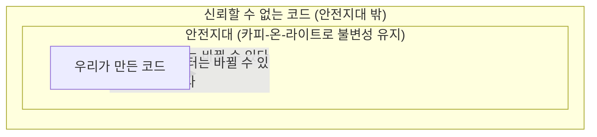
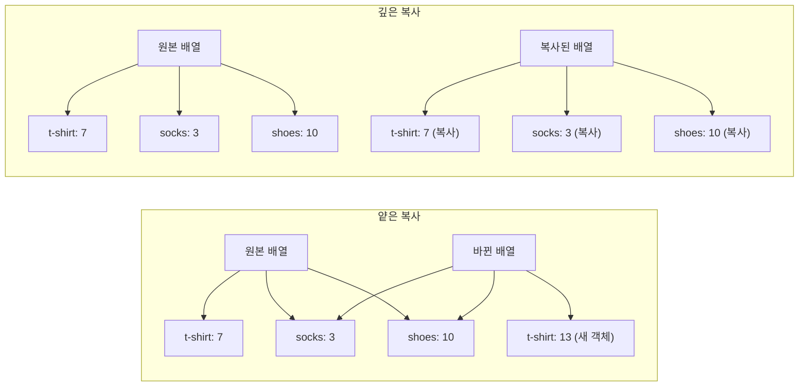

# 7장. 신뢰할 수 없는 코드를 쓰면서 불변성 지키기

**이번 장에서 살펴볼 내용**

- 레거시 코드나 신뢰할 수 없는 코드로부터 내 코드를 보호하기 위해 방어적 복사를 만든다.
- 얕은 복사와 깊은 복사를 비교한다.
- 카피-온-라이트와 방어적 복사를 언제 사용하면 좋은지 알 수 있다.

> 지난 장에서 카피-온-라이트를 배웠다. 하지만 **카피-온-라이트를 적용할 수 없는 코드**를 함께 사용해야 할 때도 있다. 바꿀 수 없는 라이브러리나 레거시 코드가 데이터를 변경한다면 카피-온-라이트를 적용할 수 없다. 이 장에서는 **데이터를 변경하는 코드를 함께 사용하면서 불변성을 지키는 방법**을 배운다.

---

## 1. 레거시 코드와 불변성

> **용어 설명 — 레거시 코드(legacy code)**
> 오래전에 만든 것으로, 지금 당장 고칠 수 없어서 그대로 사용해야 하는 코드.

MegaMart가 블랙 프라이데이 세일을 준비한다. 행사 코드는 오래전에 만든 레거시 코드이고, **많은 곳에서 장바구니 데이터를 변경한다.**

```js
function add_item_to_cart(name, price) {
  var item = make_cart_item(name, price);
  shopping_cart = add_item(shopping_cart, item);
  var total = calc_total(shopping_cart);
  set_cart_total_dom(total);
  update_shipping_icons(shopping_cart);
  update_tax_dom(total);
  black_friday_promotion(shopping_cart);   // ← 이 코드는 장바구니 값을 바꾼다!
}
```

이 함수를 호출하면 **카피-온-라이트 원칙을 지킬 수 없다.** 그리고 `black_friday_promotion()`을 고칠 수도 없다. 다행히 카피-온-라이트 원칙을 지키면서 안전하게 함수를 사용할 수 있는 다른 원칙이 있다. 바로 **방어적 복사(defensive copy)** 다.

---

## 2. 안전지대(safe zone)와 신뢰할 수 없는 코드

우리가 만든 모든 코드는 불변성이 지켜지는 **안전지대(safe zone)** 에 있다. 블랙 프라이데이 행사 함수는 안전지대 밖에 있다.



- 안전지대 **밖으로 나가는** 데이터는 신뢰할 수 없는 코드가 바꿀 수 있다.
- 신뢰할 수 없는 코드에서 안전지대로 **들어오는** 데이터도 잠재적으로 바뀔 수 있다. (신뢰할 수 없는 코드가 계속 데이터 참조를 가지고 있기 때문)

> **왜 카피-온-라이트로는 부족한가?**
> 카피-온-라이트는 **데이터를 바꾸기 전에** 복사한다. 무엇이 바뀌는지 알기 때문에 무엇을 복사해야 할지 예상할 수 있다. 반면 레거시 코드는 분석하기 힘들어 **어떤 일이 일어날지 정확히 알 수 없다.** 그래서 데이터가 바뀌는 것을 **완벽히 막아주는 원칙**이 필요하다.

---

## 3. 방어적 복사는 원본이 바뀌는 것을 막아 줍니다

핵심 아이디어는 **들어오고 나가는 데이터의 복사본(깊은 복사)을 만드는 것**이다.

### 들어오는 데이터 보호

1. 바뀔 수도 있는 데이터가 신뢰할 수 없는 코드에서 안전지대로 들어온다.
2. 들어온 데이터로 **깊은 복사본**을 만든다.
3. 변경 가능한 원본은 버린다. 신뢰할 수 있는 코드는 복사본만 쓰기 때문에 데이터가 바뀌지 않는다.

### 나가는 데이터 보호

1. 안전지대에 있는 데이터를 밖으로 내보내야 한다.
2. **깊은 복사본**을 만든다.
3. 깊은 복사를 한 데이터를 안전지대에서 내보낸다. 그 데이터가 바뀌어도 원본은 영향을 받지 않는다.

> 안전지대에 불변성을 유지하고, **바뀔 수도 있는 데이터가 안전지대로 들어오지 못하도록 하는 것**이 방어적 복사의 목적이다.

---

## 4. 방어적 복사 구현하기

```js
// 원래 코드
function add_item_to_cart(name, price) {
  var item = make_cart_item(name, price);
  shopping_cart = add_item(shopping_cart, item);
  var total = calc_total(shopping_cart);
  set_cart_total_dom(total);
  update_shipping_icons(shopping_cart);
  update_tax_dom(total);

  black_friday_promotion(shopping_cart);
}

// 데이터를 전달하기 전후에 복사
function add_item_to_cart(name, price) {
  var item = make_cart_item(name, price);
  shopping_cart = add_item(shopping_cart, item);
  var total = calc_total(shopping_cart);
  set_cart_total_dom(total);
  update_shipping_icons(shopping_cart);
  update_tax_dom(total);

  var cart_copy = deepCopy(shopping_cart);      // ① 넘기기 전에 복사 (나가는 데이터)
  black_friday_promotion(cart_copy);
  shopping_cart = deepCopy(cart_copy);          // ② 들어오는 데이터를 위한 복사
}
```

> ①만 하면 `black_friday_promotion()`이 `cart_copy` 참조를 계속 가지고 있어 나중에 값을 바꿀 수 있다(버그). 그래서 **들어오는 데이터에도 방어적 복사를 적용**해야 한다.

---

## 5. 방어적 복사 규칙

방어적 복사는 **데이터를 변경할 수도 있는 코드와 불변성 코드 사이에 데이터를 주고받기 위한 원칙**이다.

| 규칙 | 단계 |
| --- | --- |
| **규칙 1. 데이터가 안전한 코드에서 나갈 때 복사하기** | 1. 불변성 데이터를 위한 깊은 복사본을 만든다<br/>2. 신뢰할 수 없는 코드로 복사본을 전달한다 |
| **규칙 2. 안전한 코드로 데이터가 들어올 때 복사하기** | 1. 변경될 수도 있는 데이터가 들어오면 바로 깊은 복사본을 만들어 안전한 코드로 전달한다<br/>2. 복사본을 안전한 코드에서 사용한다 |

> **용어 설명 — 깊은 복사(deep copy)**
> 위에서 아래로 모든 계층에 있는 중첩된 데이터 구조를 복사한다.

두 규칙은 **순서에 관계없이** 쓸 수 있다. 먼저 나가고 나중에 들어올 수도 있고(신뢰할 수 없는 라이브러리 함수를 쓸 때), 먼저 들어오고 나중에 나갈 수도 있다(공유 라이브러리를 만들 때). 어떤 경우에는 들어오는 데이터가 없거나 나가는 데이터가 없을 수도 있다.

---

## 6. 신뢰할 수 없는 코드 감싸기

방어적 복사 코드를 분리해 새로운 함수로 만들어 두면 재사용하기 좋고 코드의 의도가 명확해진다.

```js
// 안전하게 분리한 버전
function add_item_to_cart(name, price) {
  var item = make_cart_item(name, price);
  shopping_cart = add_item(shopping_cart, item);
  var total = calc_total(shopping_cart);
  set_cart_total_dom(total);
  update_shipping_icons(shopping_cart);
  update_tax_dom(total);

  shopping_cart = black_friday_promotion_safe(shopping_cart);
}

function black_friday_promotion_safe(cart) {
  var cart_copy = deepCopy(cart);          // 나갈 때 복사
  black_friday_promotion(cart_copy);
  return deepCopy(cart_copy);              // 들어올 때 복사
}
```

### 연습 문제 1 — 외부 급여 계산 라이브러리 감싸기

```js
function payrollCalcSafe(employees) {
  var copy = deepCopy(employees);              // 나가는 데이터 복사
  var payrollChecks = payrollCalc(copy);
  return deepCopy(payrollChecks);              // 들어오는 데이터 복사
}
```

### 연습 문제 2 — 사용자 데이터 구독(들어오기만 하는 경우)

```js
userChanges.subscribe(function(user) {
  var userCopy = deepCopy(user);    // 들어오는 데이터만 복사하면 된다
  processUser(userCopy);            // (안전지대에서 나가는 데이터가 없다)
});
```

---

## 7. 방어적 복사가 익숙할 수도 있습니다

| 사례 | 설명 |
| --- | --- |
| **웹 API** | 클라이언트가 데이터를 직렬화해 보낼 때 JSON 데이터는 **깊은 복사본**이고, 서비스가 JSON으로 응답할 때도 깊은 복사본이다. 즉 서비스에 들어올 때와 나갈 때 데이터를 복사한 것이다. 마이크로서비스나 서비스 지향(service-oriented) 시스템이 **원칙이 다른 서비스끼리도 문제없이 통신**할 수 있는 이유다 |
| **얼랭(Erlang)과 엘릭서(Elixir)** | 두 프로세스가 메시지를 주고받을 때 수신자의 메일박스(mailbox)에 메시지가 복사된다. 프로세스에서 데이터가 나갈 때도 복사한다. 방어적 복사는 얼랭 시스템이 **고가용성을 보장하는 핵심 기능**이다 |

> **용어 설명 — 비공유 아키텍처(shared nothing architecture)**
> 모듈이 서로 통신하기 위해 방어적 복사를 구현했다면 비공유 아키텍처라고 한다. 모듈이 어떤 데이터의 참조도 공유하고 있지 않기 때문이다.

---

## 8. 카피-온-라이트와 방어적 복사를 비교해 봅시다

| 구분 | 카피-온-라이트 | 방어적 복사 |
| --- | --- | --- |
| **언제 쓰나?** | 통제할 수 있는 데이터를 바꿀 때 | **신뢰할 수 없는 코드**와 데이터를 주고받아야 할 때 |
| **어디서 쓰나?** | 안전지대 어디서나. 사실 카피-온-라이트가 **불변성을 가진 안전지대를 만든다** | 안전지대의 **경계**에서 데이터가 오고 갈 때 |
| **복사 방식** | **얕은 복사** (상대적으로 비용이 적음) | **깊은 복사** (상대적으로 비용이 많음) |
| **규칙** | 1. 바꿀 데이터의 얕은 복사를 만든다<br/>2. 복사본을 변경한다<br/>3. 복사본을 리턴한다 | 1. 안전지대로 들어오는 데이터에 깊은 복사를 만든다<br/>2. 안전지대에서 나가는 데이터에 깊은 복사를 만든다 |

> 두 원칙은 **함께 사용해야 한다.** 안전지대 안에서는 비용이 적은 카피-온-라이트를 쓰고, 경계에서만 비용이 큰 방어적 복사를 쓴다.

---

## 9. 깊은 복사는 얕은 복사보다 비쌉니다

| 구분 | 특징 |
| --- | --- |
| **얕은 복사** | 최상위 데이터만 복사한다. 바뀌지 않은 값은 원본과 복사본이 **데이터를 공유**한다(구조적 공유) |
| **깊은 복사** | 원본과 어떤 데이터 구조도 공유하지 않는다. **중첩된 모든 객체와 배열을 복사**한다 |



> 깊은 복사는 확실히 비싸다. 그래서 모든 곳에 쓰지 않고 **카피-온-라이트를 사용할 수 없는 곳에서만** 사용한다.

---

## 10. 자바스크립트에서 깊은 복사를 구현하는 것은 어렵습니다

자바스크립트는 표준 라이브러리가 좋지 않아 잘 동작하는 깊은 복사를 직접 만들기 어렵다. **Lodash 라이브러리의 `_.cloneDeep()`** 을 쓰는 것을 추천한다.

아래는 완벽하지는 않지만 깊은 복사가 어떻게 동작하는지 보여주는 구현이다. (JSON이 허용하는 모든 타입과 함수에 동작한다)

```js
function deepCopy(thing) {
  if(Array.isArray(thing)) {
    var copy = [];
    for(var i = 0; i < thing.length; i++)
      copy.push(deepCopy(thing[i]));        // 모든 항목을 재귀적으로 복사
    return copy;
  } else if (thing === null) {
    return null;
  } else if(typeof thing === "object") {
    var copy = {};
    var keys = Object.keys(thing);
    for(var i = 0; i < keys.length; i++) {
      var key = keys[i];
      copy[key] = deepCopy(thing[key]);     // 모든 항목을 재귀적으로 복사
    }
    return copy;
  } else {
    return thing;   // 문자열·숫자·불리언·함수는 불변형이라 복사할 필요가 없다
  }
}
```

---

## 11. 연습 문제 — 두 원칙 구분하기

### 깊은 복사(DC) vs 얕은 복사(SC)

| 문장 | 정답 |
| --- | --- |
| 1. 중첩된 데이터 구조에 모든 것을 복사한다 | **DC** |
| 2. 복사본과 원본 데이터 구조가 많은 부분을 공유하기 때문에 비용이 적게 든다 | **SC** |
| 3. 바뀐 부분만 복사한다 | **SC** |
| 4. 공유하는 데이터 구조가 없기 때문에 신뢰할 수 없는 코드로부터 원본 데이터를 보호할 수 있다 | **DC** |
| 5. 비공유 아키텍처를 구현하기 좋다 | **DC** |

### 방어적 복사(DC) vs 카피-온-라이트(CW)

| 문장 | 정답 |
| --- | --- |
| 1. 깊은 복사를 한다 | **DC** |
| 2. 다른 것보다 비용이 적게 든다 | **CW** |
| 3. 불변성을 유지하는 데 중요하다 | **DC와 CW** |
| 4. 데이터를 바꾸기 전에 복사본을 만든다 | **CW** |
| 5. 안전지대 안에서 불변성을 유지하기 위해 쓴다 | **CW** |
| 6. 신뢰할 수 없는 코드와 데이터를 주고받을 때 쓴다 | **DC** |
| 7. 불변성을 위한 완전한 방법이다. 다른 원칙이 없어도 쓸 수 있다 | **DC** |
| 8. 얕은 복사를 한다 | **CW** |
| 9. 신뢰할 수 없는 코드로 데이터를 전달하기 전에 복사한다 | **DC** |
| 10. 신뢰할 수 없는 코드로부터 데이터를 받을 때 복사한다 | **DC** |

### 레거시 코드와 상호작용할 때 불변성을 유지할 수 있는 행동은?

| 행동 | 판정 |
| --- | --- |
| 1. 레거시 코드와 데이터를 주고받을 때 **방어적 복사**를 쓴다 | ⭕ 맞다. 메모리 비용을 감안하고 복사본을 만들어 안전지대를 보호한다 |
| 2. 레거시 코드와 데이터를 주고받을 때 **카피-온-라이트**를 쓴다 | ❌ 아니다. 카피-온-라이트는 **다른 카피-온-라이트 함수를 호출할 때만** 쓸 수 있다. 확신할 수 없다면 레거시 코드는 카피-온-라이트 함수가 아니라고 생각해야 한다 |
| 3. 레거시 코드를 읽어 데이터를 바꾸는 부분이 없다면 특별한 원칙을 쓰지 않는다 | △ 맞을 수도 있다. 소스를 분석하면 알 수 있지만, **외부로 데이터를 전달하는 부분이 있는지 주의해서** 살펴봐야 한다 |
| 4. 방어적 복사를 쓰지 않고 레거시 코드를 카피-온-라이트 방식으로 고친다 | ⭕ 맞다. 할 수 있다면 그것이 문제 해결의 방법이다 |
| 5. 팀에 있는 코드이기 때문에 안전지대에 있다고 생각한다 | ❌ 아니다. **코드를 소유한다고 팀이 불변성을 강제한다고 생각할 수는 없다** |

---

## 쉬는 시간 (Q&A)

| 질문 | 답 |
| --- | --- |
| **동시에 사용자 데이터 복사본 두 개가 있어도 문제없나? 어떤 것이 진짜 사용자인가?** | 함수형 프로그래밍에서는 **유일한 객체로 사용자를 표현하지 않는다.** 그냥 사용자에 대한 데이터를 처리하고 기록한다. **데이터는 이벤트에 대한 사실**이다. 사실은 필요할 때마다 여러 번 복사할 수 있다 |
| **카피-온-라이트와 방어적 복사는 비슷한 것 같은데 둘 다 필요한가?** | 사실 안전지대에서도 방어적 복사만으로 불변성을 유지할 수는 있다. 하지만 방어적 복사는 **깊은 복사**라 비용이 많이 든다. 연산과 메모리를 낭비하지 않으려면 안전지대에서는 카피-온-라이트를 쓰는 것이 좋다. **두 원칙은 함께 사용해야 한다** |

---

## 결론

이 장에서 불변성을 유지할 수 있는 강력하고 더 일반적인 원칙인 **방어적 복사**에 대해 배웠다. 불변성을 스스로 구현할 수 있기 때문에 더 강력하지만 더 많은 데이터를 복사해야 하므로 비용이 많이 든다. 그래서 **카피-온-라이트와 함께 사용하면** 필요할 때 언제든 적용할 수 있는 강력함과, 얕은 복사로 인한 효율성에 대한 장점을 모두 얻을 수 있다.

## 요점 정리

- **방어적 복사는 불변성을 구현하는 원칙이다.** 데이터가 들어오고 나갈 때 복사본을 만든다.
- 방어적 복사는 **깊은 복사**를 한다. 그래서 카피-온-라이트보다 비용이 더 든다.
- 카피-온-라이트와 다르게 방어적 복사는 **불변성 원칙을 구현하지 않은 코드로부터 데이터를 보호**해 준다.
- 복사본이 많이 필요하지 않기 때문에 **카피-온-라이트를 더 많이 사용**한다. 방어적 복사는 신뢰할 수 없는 코드와 함께 사용할 때만 사용한다.
- 깊은 복사는 위에서 아래로 중첩된 데이터 전체를 복사한다. **얕은 복사는 필요한 부분만 최소한으로** 복사한다.

## 다음 장에서 배울 내용

다음 장(8장)에서는 지금까지 배운 내용을 모두 합쳐서 **시스템 설계를 개선하기 위해 코드를 어떻게 구성해야 하는지(계층형 설계)** 알아본다.
