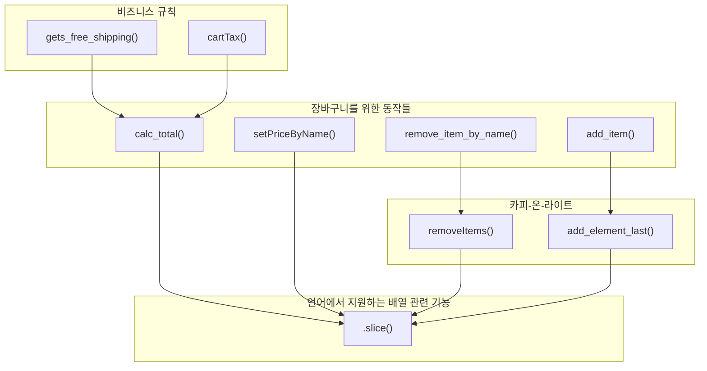
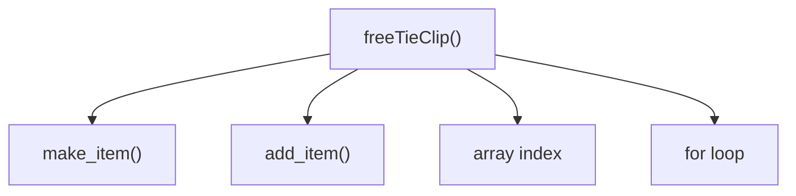
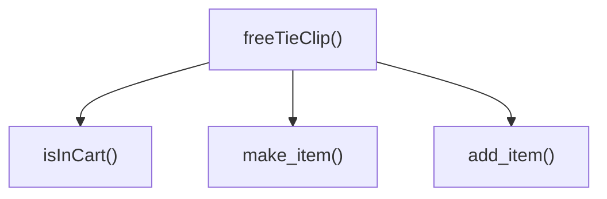
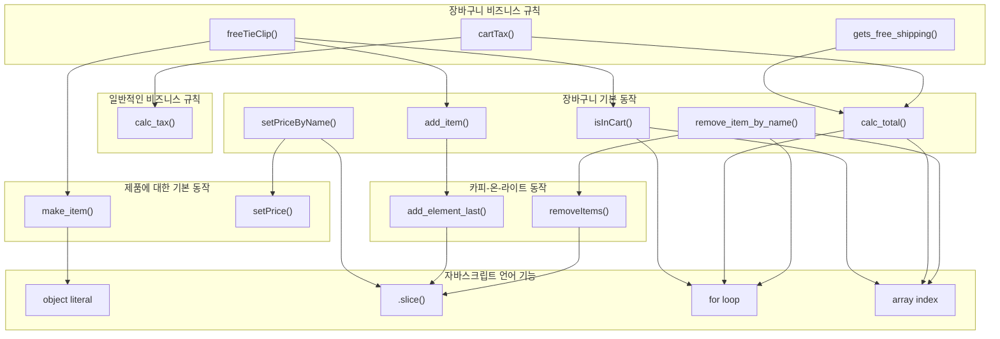
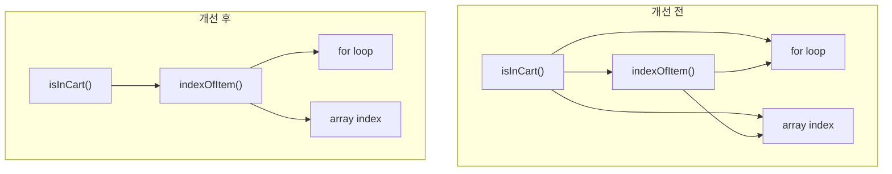

# 8장. 계층형 설계 I

**이번 장에서 살펴볼 내용**

- 소프트웨어 설계에 대한 실용적인 정의를 소개한다.
- 계층형 설계를 이해하고 어떤 도움이 되는지 알아본다.
- 깨끗한 코드를 만들기 위해 함수를 추출하는 방법을 배운다.
- 계층을 나눠서 소프트웨어를 설계하면 왜 더 나은 생각을 할 수 있는지 알아본다.

> 파트 I의 마지막 장이다. 지금까지 작업한 코드에 **계층형 설계(stratified design)** 라는 설계 방법을 적용해 본다. 계층형 설계는 **바로 아래 계층의 함수로 지금 계층의 함수를 만드는 방법**이다. 이 장과 다음 장에서 "계층이 무엇이고 왜 필요한가"에 대한 답을 찾는다.

---

## 1. 소프트웨어 설계란 무엇입니까?

MegaMart 개발팀은 장바구니 관련 기능이 중요하다는 것은 알았지만, 잘 구현되어 있다고 생각하지 않는다.

> "장바구니 관련 코드는 전체에 퍼져 있습니다. 대부분의 시간을 장바구니 관련 작업을 해야 하는데 뭔가 잘못될 것 같아 걱정입니다." — 개발팀 제나

코드에 대해 자신이 없다는 것은 **설계가 잘못되었다는 신호**다. 설계를 잘하면 아이디어를 코드로 구현하고 테스트하고 유지보수하기 쉬워진다.

> **용어 설명 — 소프트웨어 설계(software design), 명사**
> 코드를 만들고, 테스트하고, 유지보수하기 쉬운 프로그래밍 방법을 선택하기 위해 **미적 감각을 사용하는 것**.

---

## 2. 계층형 설계란 무엇인가요?

계층형 설계는 **소프트웨어를 계층으로 구성하는 기술**이다. 각 계층에 있는 함수는 **바로 아래 계층에 있는 함수를 이용해 정의**한다.



각 계층을 정확히 구분하기는 어렵다. '가장 좋은 설계'를 위한 절대 공식은 없다. 하지만 **좋은 설계를 위한 감각을 개발**하면 찾을 수 있다.

> **용어 설명 — 계층형 설계(stratified design)**
> 소프트웨어를 계층으로 구성하는 기술. 오랜 역사가 있는 기술이며, 저자는 Harold Abelson과 Gerald Sussman(《컴퓨터 프로그램의 구조와 해석》 공저자)에게 영감을 받았다고 밝힌다.

---

## 3. 설계 감각을 키우기

### 전문가의 저주

전문가는 본인의 전문 분야를 잘 알지만 **설명은 잘 못하는 것으로 악명 높다.** 오랜 시간 축적된 지식이 있지만 그것을 설명하는 방법을 모르기 때문이다. 설명하려는 것이 **블랙박스**와 같기 때문이다.

### 계층형 설계 감각을 키우기 위한 입력

코드를 읽고 **단서**를 찾아 계층형 설계를 위한 길잡이로 쓴다.

| 함수 본문 | 계층 구조 | 함수 시그니처 |
| --- | --- | --- |
| 길이<br/>복잡성<br/>구체화 단계<br/>함수 호출<br/>프로그래밍 언어의 기능 사용 | 화살표 길이<br/>응집도<br/>구체화 단계 | 함수명<br/>인자 이름<br/>인잣값<br/>리턴값 |

### 계층형 설계 감각을 키우기 위한 출력

| 조직화 | 구현 | 변경 |
| --- | --- | --- |
| 새로운 함수를 어디에 놓을지 결정<br/>함수를 다른 곳으로 이동 | 구현 바꾸기<br/>함수 추출하기<br/>데이터 구조 바꾸기 | 새 코드를 작성할 곳 선택하기<br/>적절한 수준의 구체화 단계 결정하기 |

---

## 4. 계층형 설계 패턴 (4가지)

| 패턴 | 설명 |
| --- | --- |
| **패턴 1. 직접 구현** | 계층형 설계 구조를 만드는 데 도움이 된다. 직접 구현된 함수를 읽을 때, 함수 시그니처가 나타내는 문제를 함수 본문에서 **적절한 구체화 수준**으로 해결해야 한다. 너무 구체적이라면 코드에서 나는 냄새다 |
| **패턴 2. 추상화 벽** | 호출 그래프의 어떤 계층은 **중요한 세부 구현을 감추고 인터페이스를 제공**한다. 고수준의 추상화 단계만 생각하면 되기 때문에 두뇌 용량의 한계를 극복할 수 있다 |
| **패턴 3. 작은 인터페이스** | 시스템이 커질수록 중요한 인터페이스는 **작고 강력한 동작**으로 구성하는 것이 좋다 |
| **패턴 4. 편리한 계층** | 계층형 설계 패턴은 개발자의 요구를 만족시키면서 비즈니스 문제를 잘 풀 수 있어야 한다. **그냥 좋아서 계층을 추가하면 안 된다.** 작업할 때 편리해야 한다 |

> 이 장에서는 **패턴 1(직접 구현)** 만 다루고, 나머지 세 개는 9장에서 다룬다.

---

## 5. 패턴 1: 직접 구현

### 개선 전 — 설계 없이 기능만 추가한 코드

```js
function freeTieClip(cart) {
  var hasTie     = false;
  var hasTieClip = false;
  for(var i = 0; i < cart.length; i++) {      // 장바구니가 배열이라는 것을 알아야 한다
    var item = cart[i];
    if(item.name === "tie")
      hasTie = true;
    if(item.name === "tie clip")
      hasTieClip = true;
  }
  if(hasTie && !hasTieClip) {
    var tieClip = make_item("tie clip", 0);
    return add_item(cart, tieClip);
  }
  return cart;
}
```

이 코드는 **직접 구현 패턴을 따르지 않는다.** `freeTieClip()` 함수가 알아야 할 필요가 없는 구체적인 내용(장바구니가 배열이라는 사실, 반복문, 배열 인덱스 참조)을 담고 있다.

> 마케팅 캠페인에 관련된 함수가 장바구니가 배열이라는 사실을 알아야 할까? 배열을 돌다가 오프-바이-원(off-by-one) 에러가 생기면 실패할까?

### 장바구니가 해야 할 동작 정리하기

습관적으로 코드를 바로 작성하는 대신, **코드에 있는 지식으로 장바구니가 해야 할 동작을 정리**해 본다.

| 동작 | 구현 여부 | 함수 |
| --- | --- | --- |
| 제품 추가하기 | ✅ | `add_item()` |
| 제품 삭제하기 | ✅ | `remove_item_by_name()` |
| 장바구니에 제품이 있는지 확인하기 | ❌ | (미구현) |
| 합계 계산하기 | ✅ | `calc_total()` |
| 장바구니 비우기 | ❌ | (미구현) |
| 제품 이름으로 가격 설정하기 | ✅ | `setPriceByName()` |
| 세금 계산하기 | ✅ | `cartTax()` |
| 무료 배송이 되는지 확인하기 | ✅ | `gets_free_shipping()` |

### 개선 후 — 반복문을 빼내 `isInCart()` 만들기

```js
// 개선 전                                    // 개선 후
function freeTieClip(cart) {                  function freeTieClip(cart) {
  var hasTie     = false;                       var hasTie     = isInCart(cart, "tie");
  var hasTieClip = false;                       var hasTieClip = isInCart(cart, "tie clip");
  for(var i = 0; i < cart.length; i++) {
    var item = cart[i];                         if(hasTie && !hasTieClip) {
    if(item.name === "tie")                       var tieClip = make_item("tie clip", 0);
      hasTie = true;                              return add_item(cart, tieClip);
    if(item.name === "tie clip")                }
      hasTieClip = true;                        return cart;
  }                                           }
  if(hasTie && !hasTieClip) {
    var tieClip = make_item("tie clip", 0);   function isInCart(cart, name) {
    return add_item(cart, tieClip);             for(var i = 0; i < cart.length; i++) {
  }                                               if(cart[i].name === name)
  return cart;                                      return true;
}                                               }
                                                return false;
                                              }
```

개선한 함수는 **짧고 명확**하며, 모두 **비슷한 구체화 수준**에서 작동하기 때문에 읽기 쉽다. 개선된 `freeTieClip()`이 사용하는 모든 함수는 **장바구니가 배열인지 몰라도 된다.**

---

## 6. 호출 그래프를 만들어 함수 호출을 시각화하기

함수에서 사용하는 다른 함수와 **언어 기능**을 호출 그래프(call graph)로 그릴 수 있다.

### 개선 전 — 서로 다른 추상화 단계를 사용



`make_item()`, `add_item()`은 직접 만든 함수이고 `for loop`, `array index`는 **언어에서 제공하는 더 낮은 추상화 단계**의 기능이다. **한 함수에서 서로 다른 추상화 단계를 사용하면 코드가 명확하지 않아 읽기 어렵다.**

### 개선 후 — 비슷한 추상화 계층만 호출



> **직접 구현 패턴을 사용하면 비슷한 추상화 계층에 있는 함수를 호출한다.**

### 호출 그래프를 그리는 규칙

정답 그래프가 하나만 있는 것은 아니다. 아래 항목만 만족하면 된다.

1. 모든 함수가 그래프에 있어야 한다.
2. 함수 안에서 다른 함수를 호출한다면 반드시 표시되어야 한다.
3. **화살표는 옆이나 위가 아닌 아래로 향해야 한다.**

---

## 7. 함수를 어느 계층에 놓을지 결정하기

`remove_item_by_name()` 함수를 놓을 수 있는 후보는 다섯 곳이다. 후보를 하나씩 지워가며 적당한 위치를 찾는다.

### 단서 1 — 함수 이름

> **함수 이름은 함수가 어느 곳에 위치할지 결정하기 위한 정보로 쓸 수 있습니다.**

`freeTieClip()`은 마케팅 캠페인에 관한 이름이지만, `remove_item_by_name()`은 마케팅과 관련 없는 **더 일반적인 동작**에 관한 이름이다. 마케팅에 관한 함수가 이 함수를 부를 수도 있으므로, **화살표가 아래쪽을 향해야 한다는 규칙**을 지키려면 가장 높은 계층보다 아래 있어야 한다. → 가장 높은 계층 후보 2개 탈락.

### 단서 2 — 함수 본문 (무엇을 호출하는가)

가장 낮은 계층에 있는 함수가 **어떤 함수나 언어 기능을 호출하는지** 확인한다. `isInCart()`와 `remove_item_by_name()`은 모두 `for loop`, `array index`라는 **같은 박스를 가리키고 있다.** 같은 박스를 가리킨다는 것은 **같은 계층에 있어도 좋다는 정보**다. → 가장 낮은 계층으로 결정.

### 완성된 호출 그래프와 각 계층의 목적



> **같은 계층에 있는 함수는 같은 목적을 가져야 한다.** 각 계층은 추상화 수준이 다르므로, 어떤 계층의 함수를 읽거나 고칠 때 **낮은 수준의 구체적인 내용은 신경 쓰지 않아도 된다.**

---

## 8. 3단계 줌 레벨

계층형 설계에서 문제는 세 가지 영역에서 찾을 수 있다. ① 계층 사이의 상호 관계 ② 특정 계층의 구현 ③ 특정 함수의 구현. 알맞은 줌 레벨로 하나의 영역을 살펴본다.

| 줌 레벨 | 볼 수 있는 것 | 찾을 수 있는 문제 |
| --- | --- | --- |
| **1. 전역 줌 레벨(기본)** | 그래프 전체 | 계층 사이의 상호 관계를 포함한 모든 문제 영역 |
| **2. 계층 줌 레벨** | 한 계층과 연결된 바로 아래 계층 | 계층이 어떻게 구현되어 있는지 |
| **3. 함수 줌 레벨** | 함수 하나와 바로 아래 연결된 함수들 | 함수 구현의 문제 |

### 화살표 길이로 문제 찾기

**직접 구현 패턴을 사용하면 모든 화살표가 같은 길이를 가져야 한다.** 하지만 그래프를 보면 어떤 화살표는 한 계층 길이, 어떤 화살표는 세 계층 길이를 가진다. **다양한 계층을 넘나드는 것은 같은 구체화 수준이 아니라는 증거**다.

`remove_item_by_name()`을 함수 줌 레벨로 보면, `removeItems()`(카피-온-라이트 계층)와 `for loop`/`array index`(언어 기능 계층)라는 **서로 다른 두 계층의 동작을 사용**하고 있다.

> 가장 일반적인 해결 방법은 **중간에 함수를 두는 것**이다. 긴 화살표를 줄이기 위해, `removeItems()`와 같은 계층에 반복문과 배열 인덱스 참조를 담당하는 함수를 만든다.

---

## 9. 반복문 빼내기

```js
// 원래 코드                                    // 바꾼 코드
function remove_item_by_name(cart, name) {     function remove_item_by_name(cart, name) {
  var idx = null;                                var idx = indexOfItem(cart, name);
  for(var i = 0; i < cart.length; i++) {
    if(cart[i].name === name)
      idx = i;
  }
  if(idx !== null)                               if(idx !== null)
    return removeItems(cart, idx, 1);              return removeItems(cart, idx, 1);
  return cart;                                   return cart;
}                                              }

                                               function indexOfItem(cart, name) {
                                                 for(var i = 0; i < cart.length; i++) {
                                                   if(cart[i].name === name)
                                                     return i;
                                                 }
                                                 return null;
                                               }
```

> `removeItems()`와 `indexOfItem()`은 같은 계층처럼 보이지만, 엄밀히 말하면 **`indexOfItem()`이 조금 더 위에 있다.** `indexOfItem()`은 항목이 `name` 속성을 가진다는 것을 알아야 하지만, `removeItems()`는 배열에 들어 있는 항목이 어떻게 생겼는지 몰라도 되기 때문이다.

---

## 10. 연습 문제 — 재사용으로 계층 개선하기

### 연습 1. `isInCart()`를 `indexOfItem()`으로 구현하기

`indexOfItem()`은 **인덱스를 리턴**하므로 사용하는 곳에서 장바구니가 배열이라는 것을 알아야 한다. 반면 `isInCart()`는 **불리언값을 리턴**하므로 사용하는 곳에서 장바구니가 어떤 구조인지 몰라도 된다. → `indexOfItem()`이 더 낮은 수준이다.

```js
function isInCart(cart, name) {
  return indexOfItem(cart, name) !== null;   // 반복문이 있던 곳에서 이 함수를 부른다
}
```



> 재사용으로 **코드가 짧아지고 계층도 명확해지는** 장점을 모두 얻었다.

### 연습 2. `setPriceByName()`을 `indexOfItem()`으로 구현하기

```js
function setPriceByName(cart, name, price) {
  var cartCopy = cart.slice();
  var i = indexOfItem(cart, name);
  if(i !== null)
    cartCopy[i] = setPrice(cart[i], price);
  return cartCopy;
}
```

반복문을 없애 코드는 좋아졌지만, **그래프는 여전히 서로 다른 두 계층을 가리킨다.** 하지만 긴 화살표가 세 개였다가 하나가 없어져 두 개가 되었다.

> 화살표 길이를 **비교**하는 것은 복잡성 측정에 좋은 방법이지만, 이 경우는 도움이 되지 않는다. 대신 **긴 화살표를 하나 없애 설계를 개선한 것**에 초점을 맞춘다.

### 연습 3. `arraySet()`을 이용해 `setPriceByName()` 다시 만들기

```js
function setPriceByName(cart, name, price) {
  var i = indexOfItem(cart, name);
  if(i !== null)
    return arraySet(cart, i, setPrice(cart[i], price));
  return cart;
}
```

원래 긴 화살표였던 `.slice()`를 `arraySet()`을 사용하면서 **더 짧아졌다.** 다만 화살표가 가리키는 계층이 하나 더 늘어 세 개가 되었다.

> **화살표 수보다 화살표 길이를 줄이고 있다는 것을 기억하세요.** 구체적인 것을 감춰 화살표 길이를 줄였다.

### 더 나아가기 — `arrayGet()` 도입

```js
function setPriceByName(cart, name, price) {
  var i = indexOfItem(cart, name);
  if(i !== null) {
    var item = arrayGet(cart, i);           // 배열 인덱스 직접 참조를 없앰
    return arraySet(cart, i, setPrice(item, price));
  }
  return cart;
}

function arrayGet(array, idx) {
  return array[idx];
}
```

| 배열 인덱스를 직접 참조하면서 설계가 좋다고 느낄 때 | 배열 인덱스를 직접 참조하지 않으면서 설계가 좋다고 느낄 때 |
| --- | --- |
| 배열을 쓸 때 편리했다 | 분리된 계층이 필요할 때 |

---

## 11. 직접 구현 패턴 리뷰

| 항목 | 설명 |
| --- | --- |
| **직접 구현한 코드는 한 단계의 구체화 수준에 관한 문제만 해결한다** | 코드가 서로 다른 구체화 단계에 있다면 읽기 어렵다. 직접 구현하면 코드를 읽기 위해 알아야 하는 **구체화 단계의 범위를 줄일 수 있다** |
| **계층형 설계는 특정 구체화 단계에 집중할 수 있게 도와준다** | 코드에 있는 다양한 단서를 통해 구체화 수준에 집중하면 설계 감각을 키울 수 있다 |
| **호출 그래프는 구체화 단계에 대한 풍부한 단서를 보여준다** | 코드는 큰 그림으로 한 번에 보기에 정보가 너무 많다. 호출 그래프는 함수가 어떻게 연결되어 있는지 보여준다 |
| **함수를 추출하면 더 일반적인 함수로 만들 수 있다** | 일반적인 함수는 구체적인 내용을 하나만 다루기 때문에 **테스트하기 쉽다** |
| **일반적인 함수가 많을수록 재사용하기 좋다** | '중복 코드를 찾아 빼내는 것'과는 다르다. **구현을 명확하게 하기 위해** 일반적인 함수를 빼내는 것이다 |
| **복잡성을 감추지 않는다** | 명확하지 않은 코드를 감추기 위해 '도우미 함수(helper function)'를 만드는 것은 계층형 설계가 **아니다.** 계층형 설계에서 모든 계층은 **바로 아래 계층에 의존해야 한다.** 복잡한 코드를 같은 계층으로 옮기면 안 되고, **더 낮은 구체화 수준을 가진 일반적인 함수**를 만들어야 한다 |

---

## 쉬는 시간 (Q&A)

| 질문 | 답 |
| --- | --- |
| **호출 그래프가 정말 필요한가? 그냥 코드를 봐도 알 수 있을 것 같은데** | 방금 살펴본 예제는 금방 알 수 있다. 하지만 **계층이 많아지면** 호출 그래프를 통해 시스템 계층이 어떻게 구성되어 있는지 전체적으로 볼 수 있다. **복잡한 계층 정보는 한 번에 볼 수 있는 정도의 작은 코드로는 얻을 수 없다** |
| **모든 다이어그램을 다 그려야 하나?** | 대부분은 그리지 않아도 된다. 장점을 알았다면 머릿속에서 그려볼 수 있다. 다만 **화이트보드에 그려 공유하면 좋은 커뮤니케이션 도구**가 된다. 설계 논의는 추상적이 되기 쉬운데, 다이어그램이 있으면 **구체적인 것을 보면서 논의**할 수 있다 |
| **앞에서 그린 계층이 정답인가? 객관적인 것인가?** | 답하기 어려운 철학적인 질문이다. 계층형 설계는 각자의 관점으로 사람들이 사용하면서 습득한 것이다. **계층형 설계를 코드 구조를 자세히 볼 수 있는 고글**이라고 생각해 보자. 도움이 되지 않는다면 고글을 벗으면 된다 |
| **제가 그린 다이어그램에는 더 많은 계층이 있다. 잘못된 건가?** | 아니다. 본인이 더 중요하다고 생각하는 구체화 단계에 초점을 맞춘 것이다. **더 구체적으로 보거나 더 높은 단계로 보는 것은 여러분의 자유**다 |
| **`setPriceByName()`의 설계가 좋아진 것이 맞나? 그래프가 더 복잡해진 것 같다** | 이런 질문이 설계에서 가장 어려운 점이다. **최선의 설계를 결정하는 공식은 없다.** 코드를 만드는 방법뿐 아니라 개발자의 기술 수준 등 많은 요소가 복잡하게 연결되어 최선의 설계를 결정한다. 설계에 대해 이야기할 때는 **같은 용어를 사용하는 것이 중요**하고 **상황을 고려해서 평가**해야 한다 |

---

## 결론

계층 간 차이를 보기 위해 **호출 그래프**를 그려 코드를 시각화했다. 그리고 계층형 설계에서 가장 중요한 첫 번째 패턴인 **직접 구현 패턴**을 알아봤다. 직접 구현 패턴이 적용된 계층 구조로 만들면, 간단한 함수로 또 다른 간단한 함수를 만들면서 코드를 구성할 수 있다.

## 요점 정리

- 계층형 설계는 코드를 **추상화 계층으로 구성**한다. 각 계층을 볼 때 다른 계층에 구체적인 내용을 몰라도 된다.
- 문제 해결을 위한 함수를 구현할 때 **어떤 구체화 단계로 쓸지 결정하는 것이 중요**하다. 그래야 함수가 어떤 계층에 속할지 알 수 있다.
- 함수가 어떤 계층에 속할지 알려주는 요소는 많다. **함수 이름과 본문, 호출 그래프** 등이 그런 요소다.
- **함수 이름은 의도를 알려준다.** 비슷한 목적의 이름을 가진 함수를 함께 묶을 수 있다.
- **함수 본문은 중요한 세부 사항을 알려준다.** 함수가 어떤 계층 구조에 있어야 하는지 알려준다.
- **호출 그래프로 구현이 직접적이지 않다는 것을 알 수 있다.** 함수를 호출하는 화살표가 **다양한 길이**를 가지고 있다면 직접 구현되어 있지 않다는 신호다.
- 직접 구현 패턴은 함수를 명확하고 아름답게 구현해 계층을 구성할 수 있도록 알려준다.

## 다음 장에서 배울 내용

직접 구현 패턴은 계층 구조를 알려주는 시작에 불과하다. 다음 장(9장)에서 재사용하고, 유지보수하기 쉽고, 테스트하기 쉬운 코드를 위한 **패턴 세 개(추상화 벽, 작은 인터페이스, 편리한 계층)** 를 더 알아본다.
