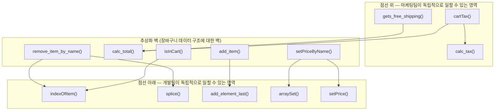
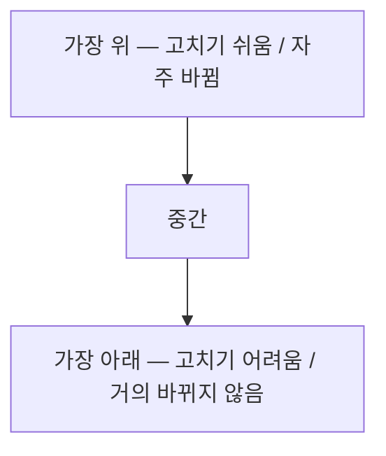
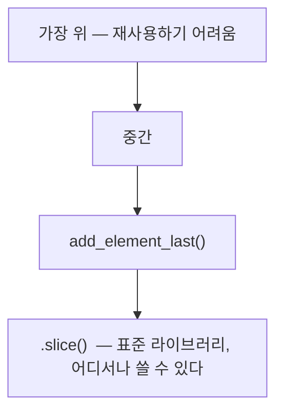
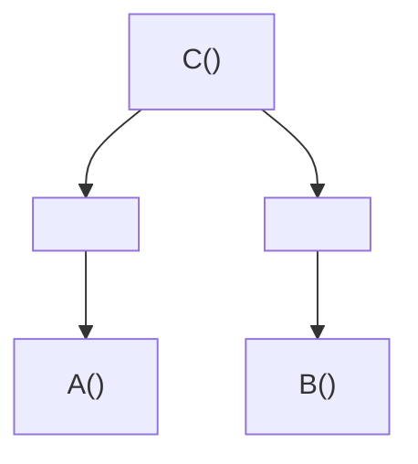

# 9장. 계층형 설계 II

**이번 장에서 살펴볼 내용**

- 코드를 모듈화하기 위해 추상화 벽을 만드는 법을 배운다.
- 좋은 인터페이스가 어떤 것이고, 어떻게 찾는지 알아본다.
- 설계가 이만하면 되었다고 할 수 있는 시점을 안다.
- 왜 계층형 설계가 유지보수와 테스트, 재사용에 도움이 되는지 이해한다.

> 이전 장에서 호출 그래프를 그리는 방법과 코드를 잘 구조화하기 위한 계층을 찾아봤다. 이번 장에서는 **나머지 세 개 패턴(추상화 벽, 작은 인터페이스, 편리한 계층)** 을 살펴본다.

---

## 1. 계층형 설계 패턴 (복습)

| 패턴 | 설명 | 상태 |
| --- | --- | --- |
| **패턴 1. 직접 구현** | 함수 시그니처가 나타내는 문제를 함수 본문에서 **적절한 구체화 수준**으로 해결한다 | ✅ 8장에서 완료 |
| **패턴 2. 추상화 벽** | 호출 그래프의 어떤 계층은 **중요한 세부 구현을 감추고 인터페이스를 제공**한다 | 이번 장 |
| **패턴 3. 작은 인터페이스** | 중요한 인터페이스는 **작고 강력한 동작**으로 구성한다 | 이번 장 |
| **패턴 4. 편리한 계층** | 계층은 **작업할 때 편리해야** 한다. 그냥 좋아서 계층을 추가하면 안 된다 | 이번 장 |

---

## 2. 패턴 2: 추상화 벽

> **용어 설명 — 추상화 벽(abstraction barrier)**
> **세부 구현을 감춘 함수로 이루어진 계층.** 추상화 벽에 있는 함수를 사용할 때는 **구현을 전혀 몰라도** 함수를 쓸 수 있다.

추상화 벽은 여러 문제를 해결하는데, 그중 하나가 **팀 간 책임을 명확하게 나누는 것**이다.

### 추상화 벽을 적용하기 전

> 최고 마케팅 담당자: "큰 세일을 앞두고 있는데 개발팀은 아직도 코드를 못 만들고 있네!"
> 개발팀 세라: "마케팅팀을 위해 매주 마케팅 관련한 코드를 만들고 있습니다. 최대한 빨리 하고 있습니다. 기다려주세요!"

### 추상화 벽을 적용한 후

> 최고 마케팅 담당자: "추상화 벽을 만들어 주셔서 기다리지 않고 세일 관련한 코드를 만들 수 있겠네요."



함수형 프로그래머는 **문제를 높은 수준으로 생각하기 위해** 추상화 벽을 효과적인 도구로 사용한다. 마케팅팀은 지저분한 반복문이나 배열을 직접 다루지 않고 추상화 벽에 있는 함수를 사용할 수 있다.

---

## 3. 세부적인 것을 감추는 것은 대칭적입니다

추상화 벽을 사용하면 마케팅팀이 세부 구현을 신경 쓰지 않아도 된다. 그리고 **신경 쓰지 않아도 된다는 것은 대칭적**이다. 추상화 벽을 만든 개발팀도 **추상화 벽에 있는 함수를 사용하는 마케팅 관련 코드를 신경 쓰지 않아도 된다.** 두 팀 모두 독립적으로 일할 수 있다.

> 추상화 벽은 흔하게 사용하는 **라이브러리나 API와 비슷하다.** 예를 들어 날씨 애플리케이션을 만들 때 RainCo라는 회사의 기상 데이터 API를 사용한다고 하면, RainCo 개발팀은 여러분이 만드는 애플리케이션을 신경 쓰지 않는다. 기상 데이터 API는 **책임을 명확하게 나눠주는 추상화 벽**과 같다.

---

## 4. 장바구니 데이터 구조 바꾸기 — 추상화 벽의 한계 시험

> 개발팀 세라: "배열을 순서대로 검색하는 것은 비효율적입니다. 조금 더 빠르게 찾을 수 있는 데이터 구조를 사용해야 합니다."

배열 대신 **자바스크립트 객체를 해시 맵처럼 쓰는 것**이 확실한 방법이다. 객체에서 항목을 추가하거나 삭제하거나 항목이 있는지 확인하는 동작 모두 빠르다.

> **성능 문제를 깔끔한 인터페이스로 감춰 해결할 수는 없다.**

### 연습 문제 — 어떤 함수를 고쳐야 할까?

**정답: 추상화 벽에 있는 함수만 고치면 된다.** 나머지 함수는 장바구니가 배열이라는 것을 모른다.

### 배열 → 객체로 다시 만들기

| 배열로 만든 장바구니 | 객체로 만든 장바구니 |
| --- | --- |
| `add_item()` → `add_element_last(cart, item)` | `add_item()` → `objectSet(cart, item.name, item)` |
| `calc_total()` → `for` + `cart[i]` | `calc_total()` → `Object.keys(cart)` 순회 |
| `setPriceByName()` → `cart.slice()` + 반복문 | `setPriceByName()` → `isInCart()` 분기 + `objectSet()` |
| `remove_item_by_name()` → `indexOfItem()` + `splice()` | `remove_item_by_name()` → `objectDelete(cart, name)` |
| `indexOfItem()` → 반복문 | **삭제** (더 이상 필요 없음) |
| `isInCart()` → `indexOfItem(...) !== null` | `isInCart()` → `cart.hasOwnProperty(name)` |

```js
// 객체로 만든 장바구니
function add_item(cart, item) {
  return objectSet(cart, item.name, item);
}

function calc_total(cart) {
  var total = 0;
  var names = Object.keys(cart);
  for(var i = 0; i < names.length; i++) {
    var item = cart[names[i]];
    total += item.price;
  }
  return total;
}

function setPriceByName(cart, name, price) {
  if(isInCart(cart, name)) {
    var item = cart[name];
    var copy = setPrice(item, price);
    return objectSet(cart, name, copy);
  } else {
    var item = make_item(name, price);
    return objectSet(cart, name, item);
  }
}

function remove_item_by_name(cart, name) {
  return objectDelete(cart, name);
}

function isInCart(cart, name) {
  return cart.hasOwnProperty(name);       // 항목이 있는지 확인하는 객체 메서드
}
```

> 잘못 선택한 데이터 구조가 때로는 어려운 코드를 만든다. 고친 코드는 더 작고 깔끔하고 효율적이다. **마케팅팀은 원래 있던 코드를 고치지 않고 그대로 쓰고 있다!**

---

## 5. 추상화 벽이 있으면 구체적인 것을 신경 쓰지 않아도 됩니다

데이터 구조를 변경하기 위해 **함수 다섯 개만 바꿀 수 있었던 것**은 바꾼 함수가 추상화 벽에 있는 함수이기 때문이다.

> 추상화 벽은 **'어떤 것을 신경 쓰지 않아도 되지?'** 라는 말을 거창하게 표현한 개념이다. 계층 구조에서 어떤 계층에 있는 함수들이 장바구니와 같이 **공통된 개념을 신경 쓰지 않아도 된다면**, 그 계층을 추상화 벽이라고 할 수 있다.

### 완전하지 않은 추상화 벽

**점선을 가로지르는 화살표가 없다는 것이 중요하다.** 만약 점선 위에 있는 함수가 장바구니를 조작하기 위해 `splice()` 함수를 호출한다면 **추상화 벽 규칙을 어기는 것**이다. 신경 쓰지 않아야 할 세부적인 구현을 사용하고 있는 것이다.

> 이런 것을 **완전하지 않은 추상화 벽**이라고 부른다. 완전하지 않은 추상화 벽을 완전한 추상화 벽으로 만드는 방법은 **추상화 벽에 새로운 함수를 만드는 것**이다.

---

## 6. 추상화 벽은 언제 사용하면 좋을까요?

추상화 벽으로 좋은 설계를 만들 수 있지만 **모든 곳에 사용하면 안 된다.**

| 상황 | 설명 |
| --- | --- |
| **1. 쉽게 구현을 바꾸기 위해** | 구현에 대한 확신이 없는 경우 추상화 벽을 사용하면 나중에 구현을 바꾸기 쉽다. 프로토타이핑처럼 최선의 구현을 확신할 수 없는 작업, 또는 뭔가 바뀔 것을 **알고(know) 있지만** 아직 준비되지 않은 경우에 좋다 |
| **2. 코드를 읽고 쓰기 쉽게 만들기 위해** | 때로는 구체적인 것이 버그를 만든다. 반복문 초기화 값은 정확히 입력했나? 종료 조건에 오프-바이-원(off-by-one) 에러가 있지는 않나? 추상화 벽을 쓰면 이런 세부적인 것을 신경 쓰지 않아도 된다 |
| **3. 팀 간에 조율해야 할 것을 줄이기 위해** | 각 팀에 관한 구체적인 내용을 서로 신경 쓰지 않고 일할 수 있다. 게다가 더 빠르게 일할 수 있다 |
| **4. 주어진 문제에 집중하기 위해** | 사람은 생각할 수 있는 두뇌의 한계가 있다. 추상화 벽을 사용하면 **해결하려는 문제의 구체적인 부분을 무시**할 수 있어 실수를 줄이고 만들면서 지치지 않는다 |

> ⚠️ **주의 — 만약을 대비해(just in case) 코드를 만드는 경우**
> 쓸데없는 코드는 줄이는 것이 좋다. **오지 않을 수도 있는 미래를 위해 불필요한 코드를 작성하는 것은 좋지 않은 습관**이다. 대부분의 데이터 구조는 바뀌지 않는다.

---

## 7. 패턴 2 리뷰: 추상화 벽

추상화 벽으로 **벽 아래에 있는 코드와 위에 있는 코드의 의존성을 없앨 수 있다.** 서로 신경 쓰지 않아도 되는 구체적인 것을 벽을 기준으로 나눠서 서로 의존하지 않게 한다.

- 추상화 벽 **위**에 있는 코드는 데이터 구조와 같은 구체적인 내용을 신경 쓰지 않아도 된다.
- 추상화 벽 **아래**에 있는 코드는 높은 수준의 계층에서 함수가 어떻게 사용되는지 몰라도 된다.

> 모든 추상화는 이와 같이 동작한다. 추상화 단계의 상위에 있는 코드와 하위에 있는 코드는 서로 의존하지 않게 정의한다. 추상화 벽으로 **추상화를 강력하고 명시적으로** 만들 수 있다.

⚠️ **바뀌지 않을지도 모르는 코드를 언젠가 쉽게 바꿀 수 있게 만들려는 함정에 빠지지 않아야 한다.** 추상화 벽은 **팀 간에 커뮤니케이션 비용을 줄이고, 복잡한 코드를 명확하게 하기 위해 전략적으로** 사용해야 한다.

### 앞에서 고친 코드는 직접 구현에 더 가깝습니다

데이터 구조를 바꿨더니 함수 대부분이 **한 줄짜리 코드**가 되었다. 코드 줄 수가 중요한 것은 아니지만, **한 줄짜리 코드는 여러 구체화 수준이 섞일 일이 없기 때문에 좋은 코드라는 표시**다.

```js
function add_item(cart, item)             { return objectSet(cart, item.name, item); }
function gets_free_shipping(cart)         { return calc_total(cart) >= 20; }
function cartTax(cart)                    { return calc_tax(calc_total(cart)); }
function remove_item_by_name(cart, name)  { return objectDelete(cart, name); }
function isInCart(cart, name)             { return cart.hasOwnProperty(name); }
```

---

## 8. 패턴 3: 작은 인터페이스

> **용어 설명 — 작은 인터페이스(minimal interface)**
> **새로운 코드를 추가할 위치**에 관한 패턴. 인터페이스를 최소화하면 하위 계층에 불필요한 기능이 쓸데없이 커지는 것을 막을 수 있다.

### 예제 1 — 시계 할인 마케팅

> **시계 할인 마케팅 규칙**
> If 장바구니 총합 > $100 **and** 장바구니에 시계가 있으면 → 시계를 10% 할인해 준다.

두 가지 구현 방법이 있다. (마케팅팀이 사용해야 하므로 추상화 벽 **아래**에 구현할 수는 없다.)

```js
// 방법 1: 추상화 벽에 만들기
function getsWatchDiscount(cart) {
  var total = 0;
  var names = Object.keys(cart);
  for(var i = 0; i < names.length; i++) {
    var item = cart[names[i]];
    total += item.price;
  }
  return total > 100 && cart.hasOwnProperty("watch");
}

// 방법 2: 추상화 벽 위에 만들기 ✅
function getsWatchDiscount(cart) {
  var total    = calcTotal(cart);
  var hasWatch = isInCart("watch");
  return total > 100 && hasWatch;
}
```

| 기준 | 방법 1 (추상화 벽에) | 방법 2 (추상화 벽 위에) |
| --- | --- | --- |
| **직접 구현** | ❌ | ✅ |
| **추상화 벽** | ❌ | ✅ |
| **작은 인터페이스** | ❌ | ✅ |

**왜 방법 2가 더 좋은가?**

- 방법 1도 화살표가 장벽을 건너지 않으므로 **추상화 벽 자체는 유지된다.** 하지만 **장벽의 또 다른 목적을 위반**한다. 만들려는 코드는 마케팅을 위한 코드인데, 마케팅팀은 반복문 같은 구체적인 구현에 신경 쓰고 싶지 않다. 방법 1로 구현하면 그 코드는 **추상화 벽 아래에 위치해 개발팀에서 관리해야 하고**, 마케팅팀이 코드를 바꾸고 싶을 때 개발팀에 이야기해야 한다.
- 추상화 벽에 만드는 함수는 **개발팀과 마케팅팀 사이의 계약**이라고 할 수 있다. 새로운 함수가 생긴다면 **계약이 늘어나는 것**과 같다. 변경이 생기면 계약에 사용하는 용어를 서로 맞춰야 하므로 시간이 많이 든다.

> 새로운 기능을 만들 때 **하위 계층에 기능을 추가하거나 고치는 것보다 상위 계층에 만드는 것**이 작은 인터페이스 패턴이다. 이 패턴은 추상화 벽뿐 아니라 **모든 계층에 적용할 수 있다.**

### 예제 2 — 장바구니에 제품을 담을 때 로그 남기기

마케팅팀이 장바구니에 제품을 담을 때마다 로그(`logAddToCart(user_id, item)`)를 남겨달라고 요청했다.

```js
// ❌ 제나의 제안: add_item()에서 호출
function add_item(cart, item) {
  logAddToCart(global_user_id, item);
  return objectSet(cart, item.name, item);
}
```

**두 가지 문제가 있다.**

**문제 1 — 액션이 전체로 퍼진다.**

`logAddToCart()`는 **액션**이다. `add_item()` 안에서 액션을 호출하면 `add_item()`도 액션이 되고, `add_item()`을 호출하는 **모든 함수가 액션이 되면서 액션이 전체로 퍼진다.** 그렇게 되면 테스트하기 어려워진다.

**문제 2 — 의도하지 않은 곳에서 로그가 남는다.**

```js
function update_shipping_icons(cart) {
  var buttons = get_buy_buttons_dom();
  for(var i = 0; i < buttons.length; i++) {
    var button = buttons[i];
    var item = button.item;
    var new_cart = add_item(cart, item);      // ← 사용자가 담지 않아도 호출된다!
    if(gets_free_shipping(new_cart))
      button.show_free_shipping_icon();
    else
      button.hide_free_shipping_icon();
  }
}
```

`update_shipping_icons()`는 **장바구니에 제품을 담는 행동을 하지 않아도** `add_item()`을 사용한다. 여기서 로그를 남기면 사용자가 제품을 추가한 것처럼 되므로 **로그를 남기면 안 된다.**

> 위치를 결정하는 데 가장 중요한 요소는 **장바구니에 관한 인터페이스를 깔끔하게 유지해야 하는 점**이다. `add_item()` 안에 로그를 남기면 인터페이스를 개선하는 데 도움이 되지 않는다. `logAddToCart()`는 **추상화 벽 위에 있는 계층에서 호출**하는 것이 좋다.

**✅ 더 좋은 위치 — `add_item_to_cart()`**

```js
function add_item_to_cart(name, price) {        // 장바구니에 제품을 담을 때 호출되는 클릭 핸들러
  var item = make_cart_item(name, price);
  shopping_cart = add_item(shopping_cart, item);
  var total = calc_total(shopping_cart);
  set_cart_total_dom(total);                    // 다른 액션들도 사용자가 클릭을 통해
  update_shipping_icons(shopping_cart);         // 장바구니에 제품을 담을 때 호출된다
  update_tax_dom(total);
  logAddToCart();                               // ← 여기에 추가하는 것이 좋다
}
```

`add_item_to_cart()`는 **사용자가 장바구니에 제품을 담는 의도를 정확히 반영하는 위치**이고, **이미 액션**이다. 사용자가 장바구니에 제품을 담을 때 해야 할 모든 일을 담는 함수처럼 보인다.

> 앞에서 잘못된 위치에 함수를 놓을 뻔했다. 하지만 운 좋게 알맞은 위치를 찾았다. **운이 좋다는 말은 액션이 전체로 퍼져 나가지 않았다는 것**이다. 앞에서 액션이 된 `add_item()` 함수가 `update_shipping_icons()`를 부르면서 액션이 되어 버린 것을 생각해 보자.

---

## 9. 패턴 3 리뷰: 작은 인터페이스

**추상화 벽을 작게 만들어야 하는 이유**

1. 추상화 벽에 코드가 많을수록 **구현이 변경되었을 때 고쳐야 할 것이 많다.**
2. 추상화 벽에 있는 코드는 **낮은 수준의 코드이기 때문에 더 많은 버그가 있을 수 있다.**
3. 낮은 수준의 코드는 **이해하기 더 어렵다.**
4. 추상화 벽에 코드가 많을수록 **팀 간 조율해야 할 것도 많아진다.**
5. 추상화 벽에 인터페이스가 많으면 **알아야 할 것이 많아 사용하기 어렵다.**

> **이상적인 계층은 더도 덜도 아닌 필요한 함수만 가지고 있어야 한다.** 함수는 바뀌어서도 안 되고 나중에 더 늘어나도 안 된다. 계층이 가진 함수는 **완전하고, 적고, 시간이 지나도 바뀌지 않아야** 한다. 이것이 작은 인터페이스가 전체 계층에 사용되는 이상적인 모습이다.

이것이 가능할까? 모든 계층은 아니지만, **수년간 소스 파일이 바뀌지 않고 많이 사용되는 코드**를 보면 이상적인 모습을 일부에서 발견할 수 있다. 호출 그래프 하위 계층에 **작고 강력한 동작**을 만들었을 때 이런 모습을 볼 수 있다. 이상적인 모습을 목표로 하는 것보다 **현실적으로 이 목표에 가려고 하는 노력이 중요**하다.

---

## 10. 패턴 4: 편리한 계층

앞의 세 패턴은 계층을 구성하는 것에 관한 패턴이고 **가장 이상적인 계층 구성**을 만드는 방법을 설명한다. 네 번째 패턴인 **편리한 계층(comfortable layer)** 은 다른 패턴과 다르게 조금 더 **현실적이고 실용적인 측면**을 다룬다.

커다란 계층을 만들면 뿌듯하다. 하지만 **강력한 추상화 계층은 만들기 어렵다.** 시간이 지나면 열심히 만든 추상화 벽이 크게 도움이 되지 않는다고 느낄 수도 있다. 완벽하지 않고 없는 것이 더 좋을 것이라고 느낄지도 모른다.

> 자바스크립트 언어는 기계어에 대한 추상화 벽을 제공한다. 자바스크립트로 코딩할 때 기계어를 생각하는 사람은 아무도 없다. 이런 추상 계층은 **수십 년에 걸쳐 수천 명의 사람들이 강력한 파서와 컴파일러 그리고 가상 머신을 만든** 결과다. 비즈니스 문제를 해결하기 위해 일하고 있는 개발자로서 이처럼 거대한 추상 계층을 만들 시간적 여유는 없다.

**편리한 계층 패턴은 언제 패턴을 적용하고 또 언제 멈춰야 하는지 실용적인 방법을 알려준다.**

| 상황 | 행동 |
| --- | --- |
| **지금 편리한가?** | 작업하는 코드가 편리하다고 느껴진다면 **설계는 조금 멈춰도 된다.** 반복문은 감싸지 않고 그대로 두고, 호출 화살표가 조금 길어지거나 계층이 다른 계층과 섞여도 그대로 두세요 |
| **구체적인 것을 너무 많이 알아야 하거나, 코드가 지저분하다고 느껴진다면** | **다시 패턴을 적용하세요** |

> 어떤 코드도 이상적인 모습에 도달할 수 없다. 언제나 **설계와 새로운 기능의 필요성 사이 어느 지점에 머물게 된다.** 편리한 계층은 언제 멈춰야 할지 알려준다. 여러분과 팀은 코드를 가지고 일을 하면서 **개발자로서의 필요성과 비즈니스 요구사항 모두를 만족**시켜야 한다.

---

## 11. 그래프로 알 수 있는 코드에 대한 정보는 무엇이 있을까요?

호출 그래프에서 **함수 이름을 없애면 구조에 대한 추상적인 모습**을 볼 수 있다. 그리고 그 구조는 세 가지 중요한 **비기능적 요구사항**을 꾸밈없이 보여준다.

| 구분 | 설명 |
| --- | --- |
| **기능적 요구사항(functional requirements)** | 소프트웨어가 정확히 해야 하는 일. 예를 들어 세금 계산을 하면 올바른 결과가 나와야 한다 |
| **비기능적 요구사항(nonfunctional requirements, NFRs)** | 테스트를 어떻게 할 것인지, 재사용을 잘할 수 있는지, 유지보수하기 어렵지 않은지 같은 요구사항. 보통 테스트성(testability), 재사용성(reusability), 유지보수성(maintainability)과 같이 **~성(ility)** 이라고 부른다 |

호출 그래프로 알 수 있는 세 가지 비기능적 요구사항:

1. **유지보수성(maintainability)**: 요구사항이 바뀌었을 때 가장 쉽게 고칠 수 있는 코드는 어떤 코드인가?
2. **테스트성(testability)**: 어떤 것을 테스트하는 것이 가장 중요한가?
3. **재사용성(reusability)**: 어떤 함수가 재사용하기 좋은가?

---

## 12. 그래프의 가장 위에 있는 코드가 고치기 가장 쉽습니다



- **가장 높은 계층**에 있는 코드는 쉽게 바꿀 수 있다. **아무 곳에서도 호출하는 곳이 없기 때문에** 다른 코드에 영향을 주지 않고 변경할 수 있다.
- **가장 낮은 계층**에 있는 함수 동작은 상위 계층 모두에 영향을 준다. 낮은 계층의 함수가 바뀌면 연결된 상위 동작이 모두 바뀌어야 하므로 **고치기 어렵다.**

> **함수는 그래프 위에서 멀어질수록 더 고치기 어렵습니다.**
> **자주 바뀌는 코드는 그래프 위에 있을수록 쉽게 일할 수 있습니다. 하지만 바뀌는 것이 많은 가장 높은 곳은 적게 유지하는 것이 좋습니다.**

따라서 **시간이 지나도 변하지 않는 코드가 가장 아래 계층에 있어야 한다.** 카피-온-라이트 함수는 가장 낮은 계층에 있는데, 이런 함수는 한번 잘 만들어 두면 바꿀 일이 없다.

> 직접 구현 패턴처럼 함수를 추출해 더 낮은 계층으로 보내거나, 작은 인터페이스 패턴처럼 더 높은 계층에 함수를 추가하는 일은 **모두 변경 가능성을 생각해서 계층화하고 있는 것**이다.

---

## 13. 아래에 있는 코드는 테스트가 중요합니다

모든 코드를 테스트하는 것은 현실적이지 않다. **제한된 예산으로 가장 효과적으로 테스트하려면 어떤 것을 먼저 테스트해야 할까?**

| 의견 | 내용 |
| --- | --- |
| 개발팀 세라 (1) | "가장 위에 있는 함수를 테스트하면 많은 코드를 확인할 수 있습니다." |
| 개발팀 세라 (2) | "많은 코드가 가장 아래에서 잘 동작하는 코드에 의존합니다. 그래서 가장 아래에 있는 코드를 테스트하는 것이 중요하네요." |
| 테스트 담당 조지 | "물론 테스트를 많이 할수록 좋습니다. 하지만 테스트를 할 수 있는 시간이 많지 않기 때문에 **가장 아래에 있는 함수를 테스트하는 것이 좋겠네요.**" |

**왜 아래쪽인가?** 제대로 만들었다면 가장 아래에 있는 코드보다 **가장 위에 있는 코드가 더 자주 바뀐다.**

- 위쪽 코드는 자주 바뀌기 때문에 **테스트 코드도 자주 고쳐야 한다.** → 테스트해서 얻는 것이 적다.
- 아래쪽 코드는 자주 바뀌지 않기 때문에 **테스트 코드도 자주 고칠 필요가 없다.** → 테스트해서 얻는 것이 많다.

> **하위 계층 코드를 테스트할수록 얻은 것이 더 오래갑니다.**

---

## 14. 아래에 있는 코드가 재사용하기 더 좋습니다

낮은 계층으로 함수를 추출하면 재사용할 가능성이 많아진다. **아래쪽으로 그래프를 확장할수록 표준 라이브러리처럼 재사용할 수 있는 코드가 많아진다.**



> **아래쪽으로 가리키는 화살표가 많은 함수는 재사용하기 어렵습니다.**

---

## 15. 요약: 그래프가 코드에 대해 알려주는 것

### 유지보수성

**규칙: 위로 연결된 것이 적은 함수가 바꾸기 쉽다.**



- `A()`는 `B()`보다 바꾸기 쉽다. `A()`는 위로 연결된 함수가 하나고 `B()`는 두 개다.
- `C()`는 위로 연결된 함수가 없기 때문에 **가장 바꾸기 쉽다.**

> **핵심: 자주 바뀌는 코드는 가능한 위쪽에 있어야 한다.**

### 테스트 가능성

**규칙: 위쪽으로 많이 연결된 함수를 테스트하는 것이 더 가치 있다.**

- `A()`보다는 위로 두 개 함수가 있는 `B()`가 전체 코드에 더 많은 영향을 주기 때문에 `B()`를 테스트하는 것이 더 가치 있다.

> **핵심: 아래쪽에 있는 함수를 테스트하는 것이 위쪽에 있는 함수를 테스트하는 것보다 가치 있다.**

### 재사용성

**규칙: 아래쪽에 함수가 적을수록 더 재사용하기 좋다.**

- `A()`와 `B()`는 아래쪽에 함수가 없기 때문에 재사용성이 같다.
- `C()`는 아래쪽에 두 단계나 함수가 있기 때문에 **재사용하기 가장 어렵다.**

> **핵심: 낮은 수준의 단계로 함수를 빼내면 재사용성이 더 높아진다.**

이 규칙들은 **16장에서 어니언 아키텍처(onion architecture)** 를 다룰 때 실용적인 예를 통해 더 자세히 알아본다.

---

## 결론

계층형 설계는 **바로 아래 계층에 있는 함수로 현재 계층의 함수를 구현해 코드를 구성하는 기술**이다. 비즈니스 요구를 해결하기 충분히 편리한 코드인지 아닌지는 **직관을 따라야** 한다. 그리고 어떤 코드를 테스트하는 것이 더 좋고, 변경하거나 재사용하기 쉬운 코드는 어떤 코드인지 **계층 구조로** 알아봤다.

## 요점 정리

- **추상화 벽 패턴**을 사용하면 세부적인 것을 완벽히 감출 수 있기 때문에 더 높은 차원에서 생각할 수 있다.
- **작은 인터페이스 패턴**을 사용하면 완성된 인터페이스에 가깝게 계층을 만들 수 있다. 중요한 비즈니스 개념을 표현하는 인터페이스는 **한번 잘 만들어 놓고 더 바뀌거나 늘어나지 않아야** 한다.
- **편리한 계층 패턴**을 이용하면 다른 패턴을 요구 사항에 맞게 사용할 수 있다. 패턴을 사용하다 보면 **너무 과한 추상화**를 할 수 있다. 패턴들은 요구 사항에 맞게 적용해야 한다.
- **호출 그래프 구조에서 규칙을 얻을 수 있다.** 이 규칙으로 어떤 코드를 테스트하는 것이 가장 좋은지, 유지보수나 재사용하기 좋은 코드는 어디에 있는 코드인지 알 수 있다.

## 다음 장에서 배울 내용

이 장을 마지막으로 **첫 번째 중요한 여정(파트 I)** 을 마쳤다. 액션과 계산, 데이터에 대해 배웠고 코드에서 어떤 부분이 액션과 계산, 데이터인지 구분해 봤다. 많은 리팩터링을 했지만 어떤 함수는 추출하기 어려운 함수도 있었다. 다음 장(10장)에서 **반복문에 대한 진정한 추상**을 배우고, **코드를 데이터처럼 쓰기 위한 두 번째 여정(파트 II — 일급 추상)** 을 시작한다.
