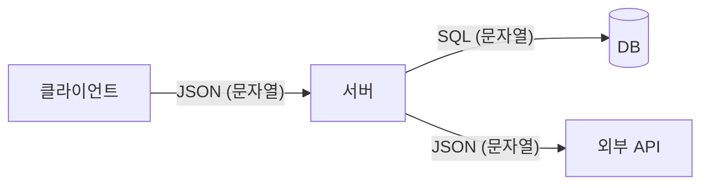
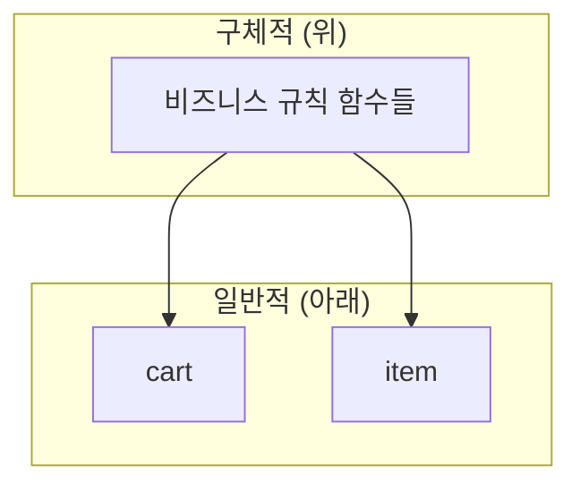
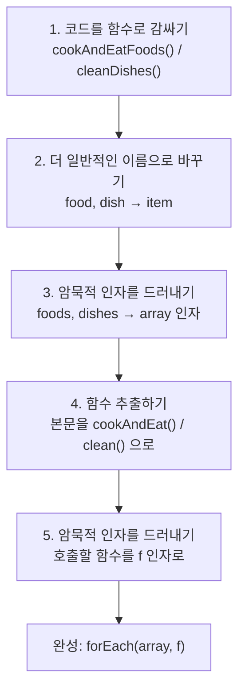

# 10장. 일급 함수 I

**이번 장에서 살펴볼 내용**

- 왜 일급 값이 좋은지 알아본다.
- 문법을 일급 함수로 만드는 방법에 대해 알아본다.
- 고차 함수로 문법을 감싸는 방법을 알아본다.
- 일급 함수와 고차 함수를 사용한 리팩터링 두 개를 살펴본다.

> 파트 I(액션과 계산, 데이터)을 마치고 **파트 II — 일급 추상**을 시작하는 장이다. 이 장의 주제는 **일급이 아닌 것을 찾아 일급으로 바꾸는 것**이다.

---

## 1. 문제 상황: 추상화 벽이 있어도 여전히 개발팀에 요청해야 한다

9장에서 만든 추상화 벽은 마케팅팀이 쓰기 좋은 API였다. 하지만 예상만큼 잘 되지 않았다.

- 마케팅팀이 개발팀에 요청한 티켓이 **2,343개** 쌓였다.
- 요청 내용은 전부 비슷하다. "장바구니 제품의 **값/개수/배송**을 설정하는 기능"
- **설정하는 필드명만 다르고 나머지는 똑같다.**

추상화 벽이 이런 요청을 막아 주어야 하는데, 오히려 마케팅팀이 개발팀을 기다리게 만들고 있다. 추상화 벽이 잘 동작하지 않는 것이다.

---

## 2. 코드의 냄새: 함수 이름에 있는 암묵적 인자

> **용어 설명 — 코드의 냄새(code smell)**
> 더 큰 문제를 가져올 수 있는 코드.

개발팀이 요구사항에 맞춰 열심히 만든 함수들은 아래처럼 생겼다.

```javascript
function setPriceByName(cart, name, price) {
  var item = cart[name];
  var newItem = objectSet(item, 'price', price);
  var newCart = objectSet(cart, name, newItem);
  return newCart;
}

function setQuantityByName(cart, name, quant) {
  var item = cart[name];
  var newItem = objectSet(item, 'quantity', quant);
  var newCart = objectSet(cart, name, newItem);
  return newCart;
}

function setShippingByName(cart, name, ship) { /* ... 'shipping' ... */ }
function setTaxByName(cart, name, tax)       { /* ... 'tax' ... */ }
```

명확한 문제는 **중복**이다. 그런데 더 근본적인 냄새가 있다. 함수들의 차이점, 즉 **필드를 결정하는 문자열이 함수 이름에 들어 있다**는 것이다. 함수 이름의 일부가 인자처럼 동작하고 있다. 값을 명시적으로 전달하지 않고 **함수 이름의 일부로 '전달'** 하고 있는 셈이다.

> **냄새를 맡는 법 — 함수 이름에 있는 암묵적 인자(implicit argument in function name)**
> 1. 함수 구현이 거의 똑같다.
> 2. 함수 이름이 구현의 차이를 만든다.
>
> → 함수 이름에서 서로 다른 부분이 **암묵적 인자**다.

---

## 3. 리팩터링: 암묵적 인자를 드러내기

**암묵적 인자를 드러내기(express implicit argument)** 리팩터링은 암묵적 인자를 명시적인 인자로 바꾼다.

**단계**

1. 함수 이름에 있는 암묵적 인자를 확인한다.
2. 명시적인 인자를 추가한다.
3. 함수 본문에 하드 코딩된 값을 새로운 인자로 바꾼다.
4. 함수를 호출하는 곳을 고친다.

### 리팩터링 전후

```javascript
// 전 — price가 함수 이름에 있는 암묵적 인자
function setPriceByName(cart, name, price) {
  var item = cart[name];
  var newItem = objectSet(item, 'price', price);
  var newCart = objectSet(cart, name, newItem);
  return newCart;
}

cart = setPriceByName(cart, "shoe", 13);
cart = setQuantityByName(cart, "shoe", 3);
cart = setShippingByName(cart, "shoe", 0);
cart = setTaxByName(cart, "shoe", 2.34);
```

```javascript
// 후 — 이름은 더 일반적으로, 인자는 명시적으로
function setFieldByName(cart, name, field, value) {
  var item = cart[name];
  var newItem = objectSet(item, field, value);
  var newCart = objectSet(cart, name, newItem);
  return newCart;
}

cart = setFieldByName(cart, "shoe", 'price', 13);
cart = setFieldByName(cart, "shoe", 'quantity', 3);
cart = setFieldByName(cart, "shoe", 'shipping', 0);
cart = setFieldByName(cart, "shoe", 'tax', 2.34);
```

리팩터링으로 **필드명을 일급 값으로** 만들었다. 리팩터링 전에는 필드명이 함수 이름에 암묵적으로 있었고 API로도 제공되지 않았다. 이제 암묵적인 이름은 인자로 넘길 수 있는 값(여기서는 문자열)이 되었다.

> **용어 설명 — 일급 값(first-class value)**
> 언어에 있는 다른 값처럼 쓸 수 있는 값. 변수에 할당할 수 있고, 함수의 인자로 넘길 수 있고, 리턴값으로 받을 수 있고, 배열이나 객체에 담을 수 있다.

### 얻은 것

- 함수 여러 개를 알아야 했는데 이제 **함수 하나와 필드명만** 알면 된다.
- 새로운 필드가 추가되어도 개발팀에 티켓을 요청하지 않아도 된다.
- 어떤 필드명을 쓸 수 있는지는 API 문서(추상화 벽에서 정의한 것처럼)로 정리하면 된다.

### 연습 문제 — 같은 냄새, 같은 리팩터링

```javascript
// 전
function multiplyByFour(x) { return x * 4; }
function multiplyBy12(x)   { return x * 12; }
function multiplyBySix(x)  { return x * 6; }
function multiplyByPi(x)   { return x * 3.14159; }

// 후
function multiply(x, y) { return x * y; }
```

```javascript
// 전
function incrementQuantityByName(cart, name) { /* item['quantity'] + 1 */ }
function incrementSizeByName(cart, name)     { /* item['size'] + 1 */ }

// 후
function incrementFieldByName(cart, name, field) {
  var item = cart[name];
  var value = item[field];
  var newValue = value + 1;
  var newItem = objectSet(item, field, newValue);
  var newCart = objectSet(cart, name, newItem);
  return newCart;
}
```

---

## 4. 일급인 것과 일급이 아닌 것 구별하기

자바스크립트에는 일급인 것과 일급이 아닌 것이 섞여 있다. 다른 언어도 마찬가지다.

| 구분 | 예시 |
| --- | --- |
| **일급이 아닌 것** | 수식 연산자(`+`, `*`), 반복문(`for`), 조건문(`if`), `try/catch` 블록 |
| **일급으로 할 수 있는 것** | 변수에 할당 / 함수의 인자로 넘기기 / 함수의 리턴값으로 받기 / 배열이나 객체에 담기 |

`+` 연산자는 변수에 담을 방법이 없고, `*` 연산자는 함수의 인자로 넘길 수 없다. 이런 것은 **언어의 부족함**을 이야기하려는 것이 아니다. 대부분의 언어가 일급이 아닌 것을 가지고 있다. **중요한 것은 일급이 아닌 것을 일급으로 바꾸는 방법을 아는 것**이다.

함수명은 일급이 아니기 때문에 함수명의 일부를 인자로 바꿔 일급으로 만들었다. 자바스크립트는 객체 필드에 접근할 때 문자열을 사용할 수 있으므로, 이 리팩터링만으로 문제를 잘 해결할 수 있었다.

---

## 5. 필드명을 문자열로 쓰면 버그가 생기지 않을까?

'문자열에 오타가 있으면 어떻게 될까?' — 충분히 걱정할 만한 문제다. 해결 방법은 두 가지다.

### 컴파일 타임 검사

주로 정적 타입 시스템에서 쓰는 방법이다. 자바스크립트는 정적 타입 언어가 아니지만 **타입스크립트**를 쓸 수 있다. 자바는 **Enum**, 하스켈은 **합 타입**으로 표현할 수 있다. 언어마다 타입 시스템이 다르므로 **언어에 맞는 최선의 방법**을 찾으면 된다.

### 런타임 검사

함수를 실행할 때마다 전달한 문자열이 올바른지 확인한다.

```javascript
var validItemFields = ['price', 'quantity', 'shipping', 'tax'];

function setFieldByName(cart, name, field, value) {
  if(!validItemFields.includes(field))
    throw "Not a valid item field: " + "'" + field + "'.";
  var item = cart[name];
  var newItem = objectSet(item, field, value);
  var newCart = objectSet(cart, name, newItem);
  return newCart;
}
```

**필드가 일급이기 때문에 런타임에 확인하는 것이 쉽다.** 접근 가능한 필드를 배열에 담아 두고 검사하면 된다.

### 정적 타입 vs 동적 타입 — 정답은 없다

정적 타입과 동적 타입 논쟁은 오래되었고 함수형 커뮤니티에서는 더 뜨겁다. 하지만 **정답은 없다.** 어떤 연구에서는 타입 시스템의 종류보다 **숙면을 하는 것이 소프트웨어 품질에 더 중요**하다고 한다. 또한 좋은 정적 타입 시스템도, 나쁜 정적 타입 시스템도 있으므로 **시스템의 형태만 가지고 비교하는 것은 바람직하지 않다.**

### 모두 문자열로 통신한다

문자열이 위험하다는 걱정은 조금 더 깊이 볼 필요가 있다.



브라우저는 서버로 **JSON 문자열**을 보내고, 서버는 DB로 **직렬화된 문자열 명령어**를 보낸다. 통신 과정에 있는 것은 **모두 문자열**이다. 데이터 형식에 타입이 있다 해도 결국 바이트일 뿐이다. **API는 클라이언트에게 받은 데이터를 런타임에 체크해야 하며, 이것은 정적 타입 언어를 써도 마찬가지다.**

여기서 데이터의 단점 하나를 발견할 수 있다. **데이터는 항상 해석이 필요하다.**

---

## 6. 일급 필드를 사용하면 API를 바꾸기 더 어렵나?

"추상화 벽 아래에서 정의한 필드명이 벽 위로 전달되는 것은 추상화 원칙을 위반하는 것 아닌가? API 문서에 필드명을 명시하면 영원히 못 바꾸는 것 아닌가?"

**필드명은 계속 유지해야 하지만, 구현이 외부에 노출된 것은 아니다.** 내부에서 정의한 필드명이 바뀌어도 사용하는 사람들이 원래 필드명을 그대로 쓰게 할 수 있다.

```javascript
var validItemFields = ['price', 'quantity', 'shipping', 'tax', 'number'];
var translations = { 'quantity': 'number' };

function setFieldByName(cart, name, field, value) {
  if(!validItemFields.includes(field))
    throw "Not a valid item field: '" + field + "'.";
  if(translations.hasOwnProperty(field))
    field = translations[field];   // 원래 필드명을 새로운 필드명으로 바꿔 줌
  var item = cart[name];
  var newItem = objectSet(item, field, value);
  var newCart = objectSet(cart, name, newItem);
  return newCart;
}
```

**필드명이 일급이기 때문에 할 수 있는 것**이다. 일급이라는 말은 객체나 배열에 담을 수 있다는 뜻이고, 그래서 언어의 모든 기능을 이용해 필드명을 처리할 수 있다.

---

## 7. 객체와 배열을 너무 많이 쓰게 된다 — 데이터 지향

"일급 필드를 쓰면 자바스크립트 객체를 너무 많이 쓰게 되는 것 아닌가?"

중요한 것은 **데이터를 임의의 인터페이스로 감싸지 않고 그대로 사용한다**는 점이다. 장바구니와 제품 엔티티는 호출 그래프에서 **가장 아래에 위치한 매우 일반적인 엔티티**다. 커스텀 API처럼 구체적인 것보다 낮은 곳에 있으므로 **객체와 배열 같은 일반적인 데이터 구조**를 사용하는 것이 맞다.



> **용어 설명 — 데이터 지향(data orientation)**
> 이벤트와 엔티티에 대한 사실을 표현하기 위해 일반 데이터 구조를 사용하는 프로그래밍 형식.

데이터를 데이터 그대로 쓰는 장점은 **여러 가지 방법으로 해석할 수 있다**는 것이다. 제한된 API로 정의하면 데이터를 제대로 활용할 수 없다. 데이터가 미래에 어떻게 해석될지 미리 알 수 없으므로 필요할 때 알맞은 방법으로 해석할 수 있어야 한다. 물론 9장에서 본 것처럼 **필요하다면 언제든지 인터페이스를 추가**할 수 있다.

---

## 8. 어떤 문법이든 일급 함수로 바꿀 수 있다

`+` 연산자는 변수에 할당할 수 없다. 하지만 `+` 연산자와 같은 함수를 만들 수는 있다.

```javascript
function plus(a, b) { return a + b; }
function times(a, b) { return a * b; }
function minus(a, b) { return a - b; }
function dividedBy(a, b) { return a / b; }
```

자바스크립트에서 **함수는 일급 값**이므로, 일급이 아닌 문법을 함수로 감싸면 일급으로 만들 수 있다. 단순해 보이지만 **일급으로 만들면 강력한 힘이 생긴다.**

---

## 9. 반복문 예제: 먹고 치우기 — forEach() 도출하기

마케팅팀의 새 요구: "반복문을 다시 작성하지 않아도 되게 해 달라."

> **일급 vs 고차**
> - **일급(first-class)**: 인자로 전달할 수 있다.
> - **고차(higher-order)**: 함수가 다른 함수를 인자로 받거나 리턴할 수 있다.
> - 일급 함수가 없으면 고차 함수를 만들 수 없다.

### 출발점 — 비슷하지만 다른 두 반복문

```javascript
for(var i = 0; i < foods.length; i++) {
  var food = foods[i];
  cook(food);
  eat(food);
}

for(var i = 0; i < dishes.length; i++) {
  var dish = dishes[i];
  wash(dish);
  dry(dish);
  putAway(dish);
}
```

### 리팩터링 진행



**1) 코드를 함수로 감싸기**

```javascript
function cookAndEatFoods() {
  for(var i = 0; i < foods.length; i++) {
    var food = foods[i];
    cook(food); eat(food);
  }
}
```

**2) 더 일반적인 이름으로 바꾸기** — 지역변수 `food` / `dish` → 둘 다 `item`

**3) 암묵적 인자를 드러내기** — 함수 이름에 있던 `foods` / `dishes`를 `array` 인자로

```javascript
function cookAndEatArray(array) {
  for(var i = 0; i < array.length; i++) {
    var item = array[i];
    cook(item); eat(item);
  }
}
cookAndEatArray(foods);
```

**4) 함수 추출하기** — 반복문 본문을 한 줄짜리 함수 호출로

```javascript
function cookAndEatArray(array) {
  for(var i = 0; i < array.length; i++) {
    var item = array[i];
    cookAndEat(item);
  }
}
function cookAndEat(food) { cook(food); eat(food); }
```

**5) 암묵적 인자를 드러내기** — 이제 두 함수의 유일한 차이는 **호출하는 함수 이름**이다. 이것을 인자 `f`로 뺀다.

```javascript
function operateOnArray(array, f) {
  for(var i = 0; i < array.length; i++) {
    var item = array[i];
    f(item);
  }
}
operateOnArray(foods, cookAndEat);
operateOnArray(dishes, clean);
```

두 함수가 완전히 같아졌으므로 하나를 지우고 이름을 `forEach()`로 바꾼다.

```javascript
function forEach(array, f) {
  for(var i = 0; i < array.length; i++) {
    var item = array[i];
    f(item);
  }
}
```

### 결과 — 익명 함수와 함께 쓰기

```javascript
forEach(foods, function(food) {
  cook(food);
  eat(food);
});

forEach(dishes, function(dish) {
  wash(dish); dry(dish); putAway(dish);
});
```

`forEach()`는 **배열 전체를 순회하는 완전한 반복문**이다. 더는 반복문을 만들 필요가 없다. `forEach()`는 함수를 인자로 받으므로 **고차 함수**다. **고차 함수의 좋은 점은 코드를 추상화할 수 있다는 것**이다. 반복문 본문은 항상 다르므로 매번 반복문을 만들어야 했지만, 고차 함수를 쓰면 **다른 부분만 함수로 넘기면 된다.**

---

## 10. 리팩터링: 함수 본문을 콜백으로 바꾸기

앞의 리팩터링은 단계가 다섯 개나 되어 길었다. 이것을 하나로 합친 리팩터링이 **함수 본문을 콜백으로 바꾸기(replace body with callback)** 다.

### 문제 상황 — try/catch 중복

테스트 담당 조지는 수천 줄의 코드를 `try/catch`로 감싸 에러 로깅 시스템(Snap Errors)으로 보내야 한다.

```javascript
try {
  saveUserData(user);
} catch (error) {
  logToSnapErrors(error);
}

try {
  fetchProduct(productId);
} catch (error) {
  logToSnapErrors(error);
}
```

`try`에서 `catch`를 분리하면 문법에 어긋나기 때문에 함수로 뺄 수가 없다. 절망적이다.

### 단계

1. **본문**과 본문의 **앞부분**, **뒷부분**을 구분한다.
2. 전체를 함수로 빼낸다.
3. 본문 부분을 빼낸 함수의 인자로 전달한 함수로 바꾼다.

```javascript
try {                              // ← 앞부분 (바뀌지 않음)
  saveUserData(user);              // ← 본문   (바뀜)
} catch (error) {                  // ← 뒷부분 (바뀌지 않음)
  logToSnapErrors(error);
}
```

**2단계 — 전체를 함수로 빼기**

```javascript
function withLogging() {
  try {
    saveUserData(user);
  } catch (error) {
    logToSnapErrors(error);
  }
}
withLogging();
```

**3단계 — 본문을 콜백으로 빼기**

```javascript
function withLogging(f) {
  try {
    f();
  } catch (error) {
    logToSnapErrors(error);
  }
}

withLogging(function() {
  saveUserData(user);
});
```

> **용어 설명 — 콜백(callback)**
> 자바스크립트에서 인자로 전달하는 함수. 나중에 호출될 것을 기대한다. **핸들러 함수(handler function)** 라고도 한다.

---

## 11. 이것은 무슨 문법인가? — 함수를 정의하는 세 가지 방법

```javascript
withLogging(function() { saveUserData(user); });
```

### 1) 전역으로 정의하기

```javascript
function saveCurrentUserData() {
  saveUserData(user);
}
withLogging(saveCurrentUserData);
```

가장 많이 쓰는 방법. 이름이 붙어 프로그램 어디서나 쓸 수 있다.

### 2) 지역적으로 정의하기

```javascript
function someFunction() {
  var saveCurrentUserData = function() {
    saveUserData(user);
  };
  withLogging(saveCurrentUserData);
}
```

지역 범위 안에서만 쓸 수 있는 이름을 붙인다. **지역적으로 쓰고 싶지만 이름이 필요할 때** 유용하다.

### 3) 인라인으로 정의하기

```javascript
withLogging(function() { saveUserData(user); });
```

함수를 사용하는 곳에서 바로 정의한다. 이름이 없으므로 **익명 함수(anonymous function)** 라 부른다.

> **용어 설명**
> - **익명 함수(anonymous function)**: 이름이 없는 함수.
> - **인라인 함수(inline function)**: 쓰는 곳에서 바로 정의하는 함수.

---

## 12. 왜 본문을 함수로 감싸서 넘기나?

```javascript
withLogging(function() { saveUserData(user); });
```

함수를 만들어 감싼 이유는 **코드가 바로 실행되면 안 되기 때문**이다. 함수로 감싼 코드는 **얼음 속에 있는 생선처럼 '보관'** 되어 있다고 생각할 수 있다. 이 방법은 **함수의 실행을 미루는 일반적인 방법**이다.

함수는 일급이므로 다양하게 다룰 수 있다.

| 방법 | 코드 |
| --- | --- |
| 이름 붙이기 | `var f = function() { saveUserData(user); };` |
| 컬렉션에 저장하기 | `array.push(function() { saveUserData(user); });` |
| 그냥 넘기기 | `withLogging(function() { saveUserData(user); });` |

전달한 함수는 이렇게 쓸 수 있다.

| 방법 | 설명 |
| --- | --- |
| **선택적으로 호출하기** | `if(today === "Thursday") f();` — 목요일에만 호출 |
| **나중에 호출하기** | `sleep(oneDay); f();` — 하루 지나서 호출 |
| **새로운 문맥 안에서 호출하기** | `try { f(); } catch(error) {...}` — try/catch 안에서 호출 |

---

## 13. 쉬는 시간 Q&A

**Q. 본문을 콜백으로 바꾸기가 중복을 없애는 것이 전부인가?**

A. 어떤 의미에서는 그렇다. 하지만 **고차 함수를 쓰지 않아도 중복은 없앨 수 있다.** 중복된 본문을 함수로 빼고 이름으로 실행하면 된다. 고차 함수를 쓰는 것과의 차이는 **일반 데이터가 아니라 함수를 실행해야 한다는 점**이다.

**Q. 왜 함수를 전달하나? 일반 데이터값을 전달하면 안 되나?**

```javascript
function withLogging(data) {
  try { data; } catch (error) { logToSnapErrors(error); }
}
withLogging(saveUserData(user));   // ← try/catch 문맥 밖에서 실행됨
```

이렇게 하면 `saveUserData()`가 `withLogging()`을 부르기 **전에** 예외를 던진다. `try/catch`가 아무 소용이 없다.

**함수로 전달하는 이유는 함수 안에 있는 코드가 특정한 문맥 안에서 실행돼야 하기 때문이다.** 여기서 문맥은 `try/catch`이고, `forEach()`의 경우 문맥은 반복문 안이다. **고차 함수를 쓰면 다른 곳에 정의된 문맥에서 코드를 실행할 수 있고, 문맥은 함수이기 때문에 재사용할 수 있다.**

---

## 결론

이 장에서 **일급 값**과 **일급 함수**, **고차 함수**에 대해 배웠다. 액션과 계산, 데이터를 구분하고 나서 고차 함수에 관한 개념은 함수형 프로그래밍이 가진 힘에 대한 새로운 세계를 열어 주었다.

## 요점 정리

- **일급 값**은 변수에 저장할 수 있고 인자로 전달하거나 함수의 리턴값으로 사용할 수 있다. 일급 값은 **코드로 다룰 수 있는 값**이다.
- 언어에는 일급이 아닌 기능이 많이 있다. 일급이 아닌 기능은 **함수로 감싸 일급으로** 만들 수 있다.
- 어떤 언어는 함수를 일급 값처럼 쓸 수 있는 **일급 함수**가 있다. 일급 함수는 어떤 단계 이상의 함수형 프로그래밍을 하는 데 필요하다.
- **고차 함수**는 다른 함수에 인자로 넘기거나 리턴값으로 받을 수 있는 함수다. 고차 함수로 다양한 동작을 추상화할 수 있다.
- **함수 이름에 있는 암묵적 인자**는 함수의 이름으로 구분하는 코드의 냄새다. **암묵적 인자를 드러내기** 리팩터링으로 없앨 수 있다.
- 동작을 추상화하기 위해 **본문을 콜백으로 바꾸기** 리팩터링을 사용할 수 있다. 서로 다른 함수의 동작 차이를 일급 함수 인자로 만든다.

## 다음 장에서 배울 내용

다음 장(11장)에서는 이 장에서 배운 리팩터링을 계속 적용하며, **함수를 리턴하는 함수**가 가진 강력한 힘을 알아본다.
