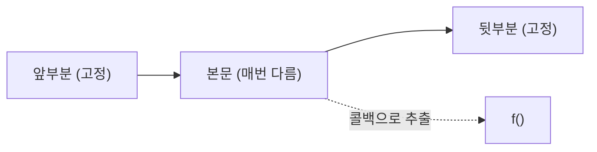
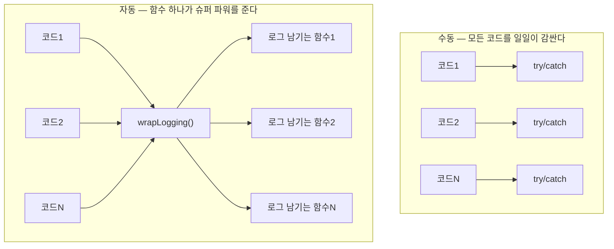
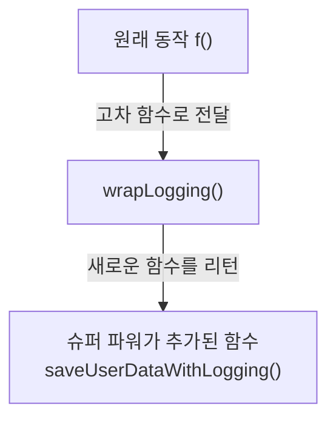

# 11장. 일급 함수 II

**이번 장에서 살펴볼 내용**

- 함수 본문을 콜백으로 바꾸기 리팩터링에 대해 더 알아본다.
- 함수를 리턴하는 함수가 가진 강력한 힘을 이해한다.
- 고차 함수에 익숙해지기 위해 여러 고차 함수를 만들어 본다.

> 10장에서 고차 함수를 만드는 방법을 배웠다. 이 장에서는 **카피-온-라이트 원칙을 코드로 옮기는 예제**와 **10장의 로그 시스템 개선**을 통해 고차 함수를 더 깊이 다룬다.

---

## 1. 코드 냄새 하나와 리팩터링 두 개 (복습)

파트 II 내내 계속 쓰게 될 도구이므로 다시 정리한다.

### 코드의 냄새: 함수 이름에 있는 암묵적 인자

**특징**
1. 거의 똑같이 구현된 함수가 있다.
2. 함수 이름이 구현에 있는 다른 부분을 가리킨다.

### 리팩터링 1: 암묵적 인자를 드러내기

1. 함수 이름에 있는 암묵적 인자를 확인한다.
2. 명시적인 인자를 추가한다.
3. 함수 본문에 하드 코딩된 값을 새로운 인자로 바꾼다.
4. 함수를 호출하는 곳을 고친다.

### 리팩터링 2: 함수 본문을 콜백으로 바꾸기

1. 본문에서 바꿀 부분의 **앞부분과 뒷부분**을 확인한다.
2. 리팩터링 할 코드를 **함수로 빼낸다**.
3. 빼낸 함수의 인자로 넘길 부분을 또 다른 **함수로 빼낸다**.



---

## 2. 카피-온-라이트 리팩터링하기

6장에서 만든 카피-온-라이트 함수들은 모두 같은 패턴을 따른다.

> **카피-온-라이트 단계**
> 1. 복사본을 만든다. ← **앞부분**
> 2. 복사본을 변경한다. ← **본문** (달라지는 부분)
> 3. 복사본을 리턴한다. ← **뒷부분**

이 구조가 **함수 본문을 콜백으로 바꾸기** 리팩터링의 앞부분/본문/뒷부분과 정확히 일치한다. 이 리팩터링은 반복문이나 `try/catch` 같은 **문법 중복**뿐 아니라 **코딩 원칙 같은 다른 형태의 중복**도 없앨 수 있다.

### 1단계: 본문과 앞부분, 뒷부분을 확인하기

```javascript
function arraySet(array, idx, value) {
  var copy = array.slice();   // 앞부분
  copy[idx] = value;          // 본문
  return copy;                // 뒷부분
}

function push(array, elem) {
  var copy = array.slice();   // 앞부분
  copy.push(elem);            // 본문
  return copy;                // 뒷부분
}

function drop_last(array) { /* slice → pop → return */ }
function drop_first(array) { /* slice → shift → return */ }
```

### 2단계: 함수 빼내기

배열을 복사하는 일을 하므로 `withArrayCopy()`라는 이름을 붙인다.

```javascript
function arraySet(array, idx, value) {
  return withArrayCopy(array);
}

function withArrayCopy(array) {
  var copy = array.slice();
  copy[idx] = value;   // ← idx, value가 아직 정의되지 않음
  return copy;
}
```

아직 동작하지 않는다. `idx`와 `value`가 `withArrayCopy()` 범위 안에 없기 때문이다.

### 3단계: 콜백 빼내기

본문(배열을 변경하는 일)을 `modify` 콜백으로 뺀다.

```javascript
function arraySet(array, idx, value) {
  return withArrayCopy(array, function(copy) {
    copy[idx] = value;
  });
}

function withArrayCopy(array, modify) {
  var copy = array.slice();
  modify(copy);
  return copy;
}
```

### 리팩터링으로 얻은 것

원래 코드가 2줄뿐이라 코드가 짧아지지는 않았다. 하지만 큰 장점을 얻었다.

| 얻은 것 | 설명 |
| --- | --- |
| **표준화된 원칙** | 카피-온-라이트 원칙을 **코드 한 곳에서 관리**할 수 있다 |
| **새로운 동작에 원칙을 적용할 수 있음** | 기본 연산뿐 아니라 **어떤 동작에도** 카피-온-라이트를 적용할 수 있다 |
| **여러 개를 변경할 때 최적화** | 중간 복사본을 만들지 않고 **복사본 하나만** 만들 수 있다 |

**새로운 동작에 적용하기 — 외부 정렬 라이브러리도 감쌀 수 있다**

```javascript
var sortedArray = withArrayCopy(array, function(copy) {
  SuperSorter.sort(copy);   // 배열을 직접 변경하는 고성능 정렬 함수
});
```

**최적화 — 복사본을 하나만 만들기**

```javascript
// 중간 복사본을 만든다 — 배열을 네 번 복사
var a1 = drop_first(array);
var a2 = push(a1, 10);
var a3 = push(a2, 11);
var a4 = arraySet(a3, 0, 42);

// 복사본을 하나만 만든다
var a4 = withArrayCopy(array, function(copy) {
  copy.shift();
  copy.push(10);
  copy.push(11);
  copy[0] = 42;
});
```

### 연습 문제 — 나머지 배열 함수에 적용하기

```javascript
function push(array, elem) {
  return withArrayCopy(array, function(copy) { copy.push(elem); });
}
function drop_last(array) {
  return withArrayCopy(array, function(copy) { copy.pop(); });
}
function drop_first(array) {
  return withArrayCopy(array, function(copy) { copy.shift(); });
}
```

### 연습 문제 — 객체 버전 만들기

```javascript
function withObjectCopy(object, modify) {
  var copy = Object.assign({}, object);
  modify(copy);
  return copy;
}

function objectSet(object, key, value) {
  return withObjectCopy(object, function(copy) { copy[key] = value; });
}
function objectDelete(object, key) {
  return withObjectCopy(object, function(copy) { delete copy[key]; });
}
```

---

## 3. 문법을 고차 함수로 감싸기 — 더 많은 연습

### try/catch 를 일반화한 tryCatch()

`try/catch`는 사용할 때마다 달라지는 곳이 두 군데다. `try`의 본문과 `catch`의 본문이다. **콜백 두 개**를 받으면 된다.

```javascript
function tryCatch(f, errorHandler) {
  try {
    return f();
  } catch(error) {
    return errorHandler(error);
  }
}

tryCatch(sendEmail, logToSnapErrors);
```

### if 구문을 함수로 — when()

```javascript
function when(test, then) {
  if(test)
    return then();
}

when(array.length === 0, function() {
  console.log("Array is empty");
});

when(hasItem(cart, "shoes"), function() {
  return setPriceByName(cart, "shoes", 0);
});
```

### else 까지 지원하는 IF()

```javascript
function IF(test, then, ELSE) {
  if(test)
    return then();
  else
    return ELSE();
}
```

> 실용적이지는 않지만, **일급이 아닌 문법을 함수로 감싸 일급으로 만드는** 좋은 연습이다.

---

## 4. 함수를 리턴하는 함수

### 문제 상황 — 여전히 남은 중복

10장에서 만든 `withLogging()`으로 중복을 많이 줄였지만, 여전히 두 가지 문제가 있다.

```javascript
withLogging(function() { saveUserData(user); });
withLogging(function() { fetchProduct(productID); });
```

1. **어떤 부분에 로그를 남기는 것을 깜빡할 수 있다.**
2. **모든 코드에 수동으로 `withLogging()` 함수를 적용해야 한다.**

에러를 잡아 로그를 남기는 것은 마치 **일반 코드에 슈퍼 파워를 주는 것**과 같다. 슈퍼 히어로가 슈퍼 파워를 얻기 위해 특별한 옷을 입는 것처럼, 수천 줄의 코드를 일일이 감싸야 한다. **이 옷 입히는 일을 자동으로 해주는 함수**가 있으면 좋겠다.



### 1) 이름을 명확하게 바꾸기

로그를 남기지 않는다는 것을 함수 이름에 표현한다.

```javascript
try {
  saveUserDataNoLogging(user);
} catch (error) {
  logToSnapErrors(error);
}
```

### 2) 로그를 남기는 버전을 함수로 빼기

```javascript
function saveUserDataWithLogging(user) {
  try {
    saveUserDataNoLogging(user);
  } catch (error) {
    logToSnapErrors(error);
  }
}

function fetchProductWithLogging(productId) {
  try {
    fetchProductNoLogging(productId);
  } catch (error) {
    logToSnapErrors(error);
  }
}
```

이제 함수 이름만으로 로그가 남을 것을 예상할 수 있다. 하지만 **두 함수가 거의 똑같은 새로운 중복**이 생겼다.

### 3) 익명 함수로 만들고 본문을 콜백으로 바꾸기

이름과 인자 이름을 일반적으로 바꾸면 앞부분/본문/뒷부분이 명확히 드러난다.

```javascript
function(arg) {
  try {                              // 앞부분
    saveUserDataNoLogging(arg);      // 본문
  } catch (error) {                  // 뒷부분
    logToSnapErrors(error);
  }
}
```

여기서 **콜백 인자를 추가하는 대신, 이 함수 전체를 새로운 함수로 감싼다.**

```javascript
function wrapLogging(f) {
  return function(arg) {
    try {
      f(arg);
    } catch (error) {
      logToSnapErrors(error);
    }
  };
}

var saveUserDataWithLogging = wrapLogging(saveUserDataNoLogging);
var fetchProductWithLogging = wrapLogging(fetchProductNoLogging);
```

`wrapLogging()`은 `f` 함수를 받아 **`f`를 `try/catch` 구문으로 감싼 함수를 리턴**한다. 이제 **어떤 함수라도 로그를 남기는 함수로 쉽게 바꿀 수 있고, 중복도 없앴다.**

### 시각적으로 보면



**함수를 리턴하는 함수는 함수 팩토리(factory)와 같다.** 자동으로 정형화된 코드를 함수로 만들 수 있다.

| 수동으로 슈퍼 파워 주기 | 자동으로 슈퍼 파워 주기 |
| --- | --- |
| `try { saveUserData(user); } catch(error) { logToSnapErrors(error); }` | `saveUserDataWithLogging(user)` |
| try/catch 구문을 수천 줄 써야 한다 | 함수 하나로 끝난다 |

---

## 5. 쉬는 시간 Q&A

**Q. 리턴값인 함수를 변수에 할당했다. 평소에는 `function` 키워드로 전역에 정의했는데 헷갈리지 않나?**

A. 익숙해지려면 시간이 걸린다. **함수를 정의하는 다양한 방법이 있다는 것에 익숙해져야 한다.** 코드에서 직접 정의할 수도 있고, 다른 함수의 리턴값으로 받아 정의할 수도 있다. (보통 함수명은 동사형, 변수명은 명사형을 쓴다는 관습과 부딪히는 지점이기도 하다.)

**Q. `wrapLogging()`은 인자가 하나인 함수만 받는다. 여러 개면?**

A. 리턴값 전달은 안쪽 함수에서 `return` 키워드를 쓰면 된다. 가변 인자는 ES6의 **rest arguments**와 **spread operator**를 쓰면 쉽다. 오래된 문법이라면 인자를 넉넉히 선언해도 실제로 쓸 수 있는 버전이 된다 — 자바스크립트 함수는 인자 개수가 유연하다.

```javascript
function wrapLogging(f) {
  return function(a1, a2, a3, a4, a5, a6, a7, a8, a9) {
    try {
      return f(a1, a2, a3, a4, a5, a6, a7, a8, a9);
    } catch (error) {
      logToSnapErrors(error);
    }
  };
}
```

**Q. 전체 프로그램을 고차 함수로 만들면 안 되나?**

A. 아마도 고차 함수만 가지고 프로그램 전체를 만들 수 있을 것이다. **더 좋은 질문은 "정말 그것이 필요한가?" 이다.**

- 고차 함수를 만드는 즐거움에 쉽게 빠질 수 있다. 마치 복잡한 퍼즐을 푸는 느낌이 뇌를 자극한다. 하지만 **좋은 엔지니어링은 퍼즐을 푸는 것이 아니라 효과적으로 문제를 해결하는 것이다.**
- **코드에 반복되는 부분을 줄이기 위해 고차 함수를 쓰는 것이 중요하다.** 반복문이 많으면 `forEach()`, `catch` 구문에서 에러를 반복 처리한다면 고차 함수로 일반화하는 것이 도움이 된다.
- **탐구와 실험은 자유롭게 하되, 제품 코드에서 실험하면 안 된다.**
- 좋은 방법을 찾았다면 **직관적인 방법과 항상 비교**해 보라. 어떤 것이 더 읽기 쉬운가? 얼마나 많은 중복 코드를 없앨 수 있는가?

> **요점: 고차 함수는 강력한 기능이지만 비용이 따른다. 만드는 재미에 빠져 문제를 보지 못하면 안 된다. 능숙하게 쓸 줄 알아야 하지만, 더 좋은 코드를 만드는 데 써야 한다.**

### 연습 문제 — 에러를 무시하는 함수를 만드는 함수

```javascript
function wrapIgnoreErrors(f) {
  return function(a1, a2, a3) {
    try {
      return f(a1, a2, a3);
    } catch(error) {   // 에러를 무시
      return null;
    }
  };
}
```

### 연습 문제 — makeAdder()

```javascript
function makeAdder(n) {
  return function(x) {
    return n + x;
  };
}

var increment = makeAdder(1);
var plus10 = makeAdder(10);

increment(10);  // 11
plus10(12);     // 22
```

---

## 결론

이 장에서 **일급 값**과 **일급 함수**, **고차 함수**에 대해 배웠다. 액션과 계산, 데이터를 구분하고 나서 고차 함수에 대한 개념은 함수형 프로그래밍의 힘에 대한 새로운 세계를 열어 주었다.

## 요점 정리

- **고차 함수로 패턴이나 원칙을 코드로 만들 수 있다.** 고차 함수를 사용하지 않는다면 일일이 수작업을 해야 한다. 고차 함수는 한번 정의하고 필요한 곳에 여러 번 사용할 수 있다.
- **고차 함수로 함수를 리턴하는 함수를 만들 수 있다.** 리턴 받은 함수는 변수에 할당해서 이름이 있는 일반 함수처럼 쓸 수 있다.
- **고차 함수를 사용하면서 잃는 것도 있다.** 고차 함수는 많은 중복 코드를 없애 주지만 **가독성을 해칠 수도 있다.** 잘 익혀서 적절한 곳에 써야 한다.

## 다음 장에서 배울 내용

앞에서 배열을 순회하는 `forEach()` 함수를 살펴봤다. 다음 장(12장)에서는 `forEach()` 개념을 더 확장해 **함수형 스타일로 순회하는 것**(`map()`, `filter()`, `reduce()`)에 대해 알아본다.
