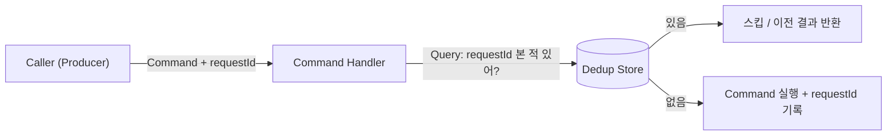
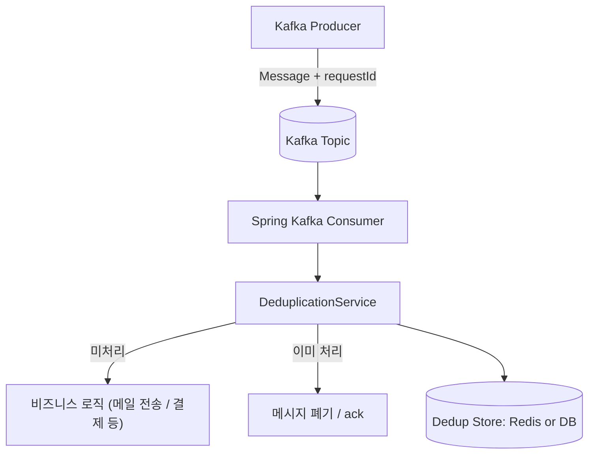
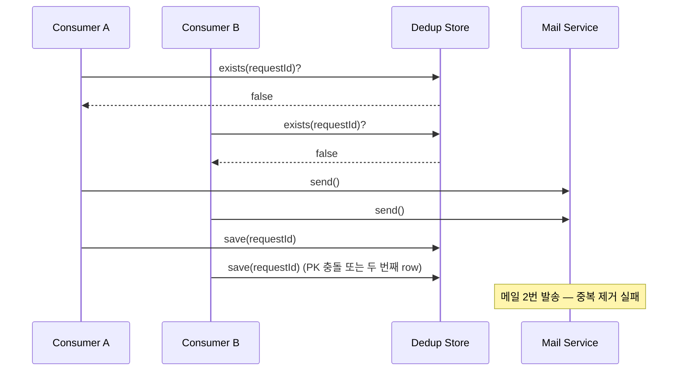
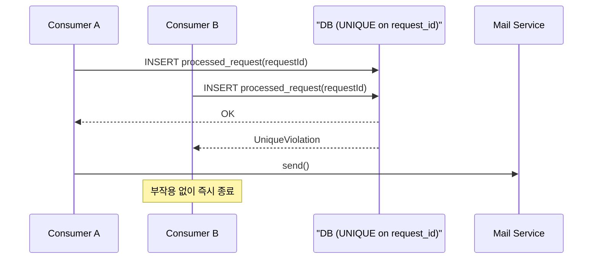
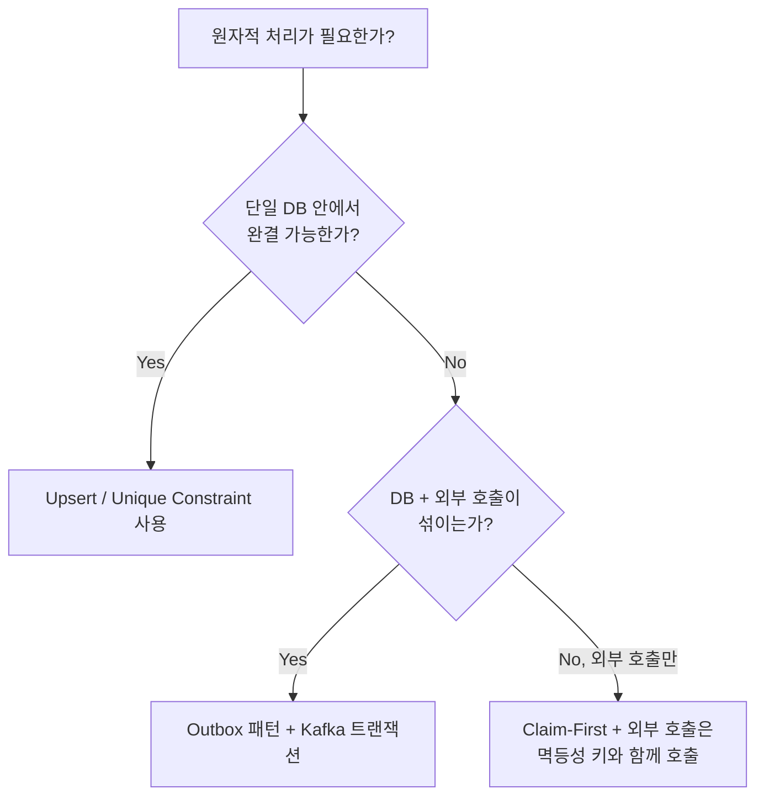

# 10장. 분산 시스템에서의 일관성과 원자성
## 최소한 한 번 이상 데이터 소스 전송
서비스가 단순한 배포 모델을 따르고 확장성을 염두에 두고 설계되지 않았다고 해도 분산된 환경에서 운영될 수 있다는 (그리고 아마도 운영될 것이라는) 사실을 인식하는 것이 중요하다.
- 시스템이 몇 가지 비즈니스 기능을 제공한다면 다른 서비스를 호출할 확률이 높기 때문이다.
- 외부 서비스를 호출할 때마다 네트워크 호출이 수행된다. 이는 서비스가 네트워크를 통해 도달하고 응답을 기다리는 요청을 수행할 필요가 있다는 사실을 의미한다.

### 노드 하나짜리 서비스 사이의 트래픽
노드 하나에 배포되어 있는 애플리케이션 A가 메일 서비스에 호출을 수행할 필요가 있다고 가정하자. 메일 서비스는 요청을 받을 때 이메일을 최종 사용자에게 전송한다.

- 모든 네트워크 요청은 실패할 수 있다는 사실을 기억하자.
- 실패는 애플리케이션에서 호출 중인 서비스로부터 발생한 오류가 초래할 수 있다.


간단한 상황이지만, 호출자 관점에서 이를 추론하기가 쉽지는 않다. 실제 세계에서 애플리케이션 A는 전자상거래 서비스, 마케팅 자동화 서비스, 지불 확인 서비스 등이 될 수 있다.

- 메일 서비스의 실패는 이메일을 보낸 직후 또는 직전에 일어날 수 있다.
- 이메일을 전송하는 도중에 실패가 일어나고 이메일 서비스가 (eg. 유지보수 목적의 중단이 있음을 나타내는 상태 코드 등) 합리적으로 응답할 수 있는 경우, 애플리케이션 A는 이메일이 전송되지 않았다고 결론을 내릴 수 있다.

이유를 모르는 일반적인 오류를 받았다면 이메일이 아직 전송되지 않았음을 안전하게 가정 가능하다.


- 네트워크 문제를 고려할 때 이런 상황은 더더욱 복잡해질 수 있다.
- 모든 네트워크 호출은 임의의 이유로 실패할 수 있다.
  - eg. 네트워크 경로에 위치한 라우터, 스위치, 허브가 고장 날수도...
- 네트워크 실패가 일어날 때 애플리케이션 A의 호출자는 연산 결과를 추론할 수 없다.
  - 타임아웃 발생 후 결과적으로 호출자는 시스템의 완전한 뷰를 얻지 못하며, 일관성을 유지하지 못한 상태가 된다.
  - 메일은 전송 되었을수도 않았을수도

### 애플리케이션 호출 재시도하기
한 가지 해법으로 초기 요청을 재시도할 수 있다.
- 일시적인 네트워크 분할로 인한 문제였다면 재시도가 성공할 확률이 매우 높다.

하지만 이런 시스템 아키텍처에서 재시도는 문제가 있다.
  - 두 번 이상 재시도할 필요가 있을 때 문제가 발생한다.
  - 중복된 이메일을 두 개 이상 보낼 가능성이 있다.
  - 재시도에 앞서 직전 호출이 이메일이 전송되기 전인지 후인지 알지 못하기 때문이다.


실제 시스템 아키텍처에선 외부 서비스 여러 개와 통합할 필요가 생긴다. 이 경우 이메일을 고객의 스팸함으로 보내는 결과가 생기더라도 이메일 전송 재시도 자체는 문제가 되지 않을 수 있다. 하지만, 시스템에서 결제할 필요가 있는 경우 더욱 심각한 문제가 벌어진다. 결제하는 작업 또한 외부 호출이며, 결제를 재시도하는 것이 문제가 되는 이유는 사용자 계정에서 두 번 이상 돈을 인출할 가능성이 있기 때문이다.

### 데이터 생성과 멱등성
부작용이 있는 연산을 재시도하는 방식은 일반적으로 안전하지 않다. 하지만 재시도 연산이 안전한지 그렇지 않은지를 결정하는 방법은?
- 시스템의 멱등성 특성 → 호출 횟수에 무관하게 동일한 결과를 얻는다면 연산에는 **멱등성**이 있는 것.
  - `GET` 연산
  - 주어진 ID에 대한 레코드를 삭제하는 작업
  - 데이터를 생성하는 연산은 거의 대부분 멱등성이 없다.

메일 전송은 멱등성이 없다. 전송 연산은 롤백이 불가능한 부작용이다. 이런 연산을 재시도하면 또 다른 전송이 일어나므로 또 다른 부작용이 생긴다.


### CQRS(Command Query Responsibility Segregation) 이해하기
재시도와 멱등성을 이야기할 때 빼놓을 수 없는 개념이 **CQRS**다. CQRS는 시스템의 연산을 **상태를 변경하는 Command(명령)** 와 **상태를 단순히 조회하는 Query(질의)** 로 명확히 분리하자는 설계 원칙이다.

- **Query**: 부작용이 없다. 같은 입력에 대해 같은 결과를 반환한다 → **천연적으로 멱등성**.
- **Command**: 상태를 변경한다. 재시도 시 부작용이 누적될 위험이 있다 → **멱등성을 별도로 설계**해야 한다.

CQRS 관점에서 멱등성 문제는 다음과 같이 재정의할 수 있다.
- "이 Command가 이미 처리되었는가?"라는 **Query**를 먼저 수행하고,
- 처리되지 않았을 때만 **Command**를 실행한다.

즉, "본 적 있는 요청인지 검사 → 처리"라는 두 단계를 통해 Command를 멱등성을 가진 연산으로 감싸 주는 것이다. 이때 **요청을 식별할 수 있는 키(요청 ID, 멱등성 키)** 가 반드시 필요하다.



#### Kotlin/Spring Boot - 멱등성 키를 활용한 Command 처리
```kotlin
data class SendEmailCommand(
    val requestId: String,   // 멱등성 키 (UUID 권장)
    val to: String,
    val subject: String,
    val body: String,
)

@Service
class EmailCommandHandler(
    private val dedupRepository: ProcessedRequestRepository,
    private val mailSender: MailSender,
) {
    @Transactional
    fun handle(command: SendEmailCommand) {
        // Query: 이미 처리된 요청인지 확인
        if (dedupRepository.existsByRequestId(command.requestId)) {
            return // 이미 처리됨 → 스킵 (CQRS의 Query 결과로 Command 차단)
        }

        // Command: 부작용 발생 + 처리 기록
        mailSender.send(command.to, command.subject, command.body)
        dedupRepository.save(ProcessedRequest(command.requestId))
    }
}
```

> 위 코드는 "단순히 보면 안전해 보이는" 구현이다. 그러나 이 구현은 **분산 환경에서 경쟁 조건**에 빠진다. 이어지는 절에서 이를 단계적으로 다룬다.

---

## 중복 제거 라이브러리의 단순한 구현
재시도가 발생하는 환경에서 가장 흔하게 도입하는 컴포넌트가 **중복 제거(Deduplication) 라이브러리**다. 핵심 아이디어는 단순하다.

- 모든 요청은 **고유한 식별자(`requestId`)** 를 가진다.
- 처리 직전에 "이 ID를 본 적 있는가?"를 확인한다.
- 본 적 없으면 처리하고 ID를 기록한다.

### 구조


### Kafka Producer - 멱등성 키 부여
```kotlin
@Component
class EmailEventProducer(
    private val kafkaTemplate: KafkaTemplate<String, EmailEvent>,
) {
    fun publish(to: String, subject: String, body: String) {
        val event = EmailEvent(
            requestId = UUID.randomUUID().toString(), // 멱등성 키
            to = to,
            subject = subject,
            body = body,
        )
        // requestId를 메시지 key로 사용하면 동일 파티션에 라우팅되어 순서 보장에도 유리
        kafkaTemplate.send("email-events", event.requestId, event)
    }
}
```

### Consumer - 단순한(naive) 중복 제거 구현
```kotlin
@Service
class NaiveDeduplicationService(
    private val repository: ProcessedRequestRepository,
) {
    fun isDuplicate(requestId: String): Boolean =
        repository.existsByRequestId(requestId)

    fun markProcessed(requestId: String) {
        repository.save(ProcessedRequest(requestId, processedAt = Instant.now()))
    }
}

@Component
class EmailEventConsumer(
    private val dedup: NaiveDeduplicationService,
    private val mailSender: MailSender,
) {
    @KafkaListener(topics = ["email-events"], groupId = "email-service")
    fun consume(event: EmailEvent) {
        if (dedup.isDuplicate(event.requestId)) {
            return // 단순히 스킵
        }
        mailSender.send(event.to, event.subject, event.body)
        dedup.markProcessed(event.requestId)
    }
}
```

이 구현은 "한 노드, 한 스레드, 신뢰 가능한 네트워크"라는 **이상적인 가정** 하에서는 동작한다. 하지만 실제 운영 환경에서는 다음 절에서 보듯 곧바로 깨진다.

---

## 분산된 시스템에서 중복 제거를 구현할 때 흔히 저지르는 실수
앞 절의 구현은 **명백한 두 단계의 비원자성**을 가진다.

```
1) existsByRequestId(requestId)   ← 조회
2) mailSender.send(...)            ← 부작용
3) save(processedRequest)          ← 기록
```

이 사이에 다른 노드/스레드가 끼어들 수 있다는 사실이 모든 문제의 출발점이다.

### 흔한 실수 1) Check-Then-Act 경쟁 조건
컨슈머 인스턴스가 두 개 이상이거나, 같은 메시지가 재전송(at-least-once)되어 거의 동시에 두 컨슈머에 도달했다고 가정하자.



→ "확인 후 행동(Check-Then-Act)"을 **두 개의 분리된 호출**로 구현하면 어떤 식으로든 경쟁 조건이 발생한다.

### 흔한 실수 2) "처리 기록"을 부작용 뒤에 두기
부작용(메일 전송)은 성공했는데, 그 직후 노드가 죽어 `markProcessed`가 실행되지 못하면 다음 재시도에서 메일이 또 나간다. 부작용과 기록을 하나의 트랜잭션으로 묶을 수 없을 때(외부 시스템 호출은 본질적으로 그렇다) 항상 발생할 수 있는 문제다.

### 흔한 실수 3) 캐시(Redis)만으로 중복 제거를 처리
Redis에 `SET requestId 1`만 해두면 빠르고 단순하다. 그러나
- TTL이 만료되면 같은 요청이 다시 들어왔을 때 다시 처리된다.
- Redis가 장애로 비워지면 모든 멱등성 키가 사라진다.
- Redis-Application 사이의 장애 시나리오에서 일관성이 깨진다.

→ **중복 제거의 진실 공급원은 영속 저장소(DB)** 여야 한다. 캐시는 보조 수단이다.

### 흔한 실수 4) Kafka의 at-least-once를 그냥 받아들이기
기본 설정의 Kafka Consumer는 **at-least-once**다. 오프셋 커밋 시점에 따라 같은 메시지를 재처리할 수 있다는 사실을 인지하지 못하고 컨슈머 로직을 작성하면 곧바로 중복 처리로 이어진다.

```kotlin
// 흔한 실수 — 자동 커밋 + 비멱등 로직
@KafkaListener(
    topics = ["email-events"],
    properties = ["enable.auto.commit=true"] // 처리 전 커밋될 수도 있음
)
fun consume(event: EmailEvent) {
    mailSender.send(event.to, event.subject, event.body) // 멱등성 보호 없음
}
```

### 흔한 실수 5) Producer 재시도에서의 중복
네트워크 타임아웃으로 Producer가 같은 메시지를 두 번 발행하는 것도 분산 환경에서는 흔하다. **Producer 측에서 멱등성 키를 부여**하지 않으면 Consumer 단에서 어떤 두 메시지가 같은 요청인지 식별할 방법조차 사라진다.

```kotlin
// Kafka Producer 설정 — 멱등 + 트랜잭션
@Bean
fun producerFactory(): ProducerFactory<String, EmailEvent> {
    val props = mapOf(
        ProducerConfig.BOOTSTRAP_SERVERS_CONFIG to "kafka:9092",
        ProducerConfig.ENABLE_IDEMPOTENCE_CONFIG to true,   // PID + sequence 기반 중복 제거
        ProducerConfig.ACKS_CONFIG to "all",
        ProducerConfig.MAX_IN_FLIGHT_REQUESTS_PER_CONNECTION to 5,
        ProducerConfig.TRANSACTIONAL_ID_CONFIG to "email-tx-1", // 트랜잭션 ID
    )
    return DefaultKafkaProducerFactory(props)
}
```

> Kafka의 `enable.idempotence=true`는 **브로커-프로듀서 사이의 중복**을 막아줄 뿐, **비즈니스 레벨의 중복**(같은 사용자 요청이 여러 번 들어오는 경우)은 막지 못한다는 점을 반드시 구분해야 한다.

---

## 경쟁 조건을 방지하기 위해 로직을 원자적으로 만들기
앞에서 본 모든 실수의 공통 원인은 **"확인-처리-기록"을 N개의 단계로 쪼갰다는 것**이다. 책의 표현 그대로 옮기면, *"원자적으로 기대되는 처리를 N개 단계로 나누면 원자성 유지가 복잡하거나 종종 불가능하다."*

해법은 두 가지 축으로 정리된다.
1. **DB 단일 원자 연산으로 합치기** — `INSERT ... ON CONFLICT`(upsert), 유니크 제약 위반을 신호로 활용.
2. **부작용 발생 순서를 뒤집기** — 기록(claim)을 먼저 원자적으로 시도하고, 성공한 측만 부작용을 실행.

### 패턴 1) 유니크 제약 + Insert-First 패턴 (가장 단순하고 강력)
```kotlin
@Entity
@Table(
    name = "processed_request",
    uniqueConstraints = [UniqueConstraint(columnNames = ["request_id"])]
)
class ProcessedRequest(
    @Id val requestId: String,
    val processedAt: Instant = Instant.now(),
    @Enumerated(EnumType.STRING)
    var status: Status = Status.CLAIMED,
) {
    enum class Status { CLAIMED, COMPLETED }
}

@Service
class IdempotentEmailHandler(
    private val repository: ProcessedRequestRepository,
    private val mailSender: MailSender,
) {
    fun handle(event: EmailEvent) {
        // 1) 먼저 "처리할 것이다"를 원자적으로 선언 (claim)
        try {
            repository.saveAndFlush(ProcessedRequest(event.requestId))
        } catch (e: DataIntegrityViolationException) {
            // 다른 노드/스레드가 이미 claim → 그쪽이 처리함
            return
        }

        // 2) claim에 성공한 단 하나의 처리자만 부작용을 실행
        mailSender.send(event.to, event.subject, event.body)

        // 3) 상태 업데이트 (선택)
        repository.markCompleted(event.requestId)
    }
}
```

이 구조는 "두 컨슈머가 동시에 같은 메시지를 받아도 정확히 한 번만 메일이 나간다"는 보장을 **DB의 유니크 제약**이라는 단일 원자 연산으로 얻어낸다.



### 패턴 2) Upsert로 N단계를 1단계로 압축
"이 키가 없으면 넣고, 있으면 그대로 둔다"를 한 쿼리로 표현하면 경쟁 조건이 사라진다.

```kotlin
interface ProcessedRequestRepository : JpaRepository<ProcessedRequest, String> {

    // PostgreSQL 예시 — INSERT ... ON CONFLICT DO NOTHING
    @Modifying
    @Query(
        value = """
            INSERT INTO processed_request (request_id, processed_at, status)
            VALUES (:requestId, now(), 'CLAIMED')
            ON CONFLICT (request_id) DO NOTHING
        """,
        nativeQuery = true,
    )
    fun claim(requestId: String): Int  // 영향받은 행: 1이면 claim 성공, 0이면 이미 존재
}

@Service
class UpsertEmailHandler(
    private val repository: ProcessedRequestRepository,
    private val mailSender: MailSender,
) {
    @Transactional
    fun handle(event: EmailEvent) {
        if (repository.claim(event.requestId) == 0) return // 다른 처리자가 선점
        mailSender.send(event.to, event.subject, event.body)
    }
}
```

### 패턴 3) Kafka의 Read-Process-Write 트랜잭션
DB와 Kafka가 같이 엮이는 시나리오에서는 **Kafka 트랜잭션 + Outbox 패턴**으로 원자성을 확보한다.

```kotlin
@Bean
fun kafkaTransactionManager(pf: ProducerFactory<String, EmailEvent>) =
    KafkaTransactionManager(pf)

@Service
class TransactionalEmailHandler(
    private val repository: ProcessedRequestRepository,
    private val kafkaTemplate: KafkaTemplate<String, EmailEvent>,
) {
    // DB 트랜잭션과 Kafka 트랜잭션을 ChainedKafkaTransactionManager로 묶을 수 있음
    @Transactional("chainedTransactionManager")
    fun handle(event: EmailEvent) {
        if (repository.claim(event.requestId) == 0) return

        // Outbox에 기록 — DB 커밋과 Kafka 발행이 함께 커밋/롤백
        kafkaTemplate.send("email-dispatch", event.requestId, event)
    }
}
```

- DB의 claim과 Kafka 발행이 함께 커밋되므로 "기록은 됐는데 메시지 발행이 빠지는" 부분 실패가 사라진다.
- Consumer 측에선 `isolation.level=read_committed`로 설정해 트랜잭션 미커밋 메시지를 읽지 않게 한다.

### 정리 - 원자성 확보를 위한 의사결정 흐름


- 가능한 한 **DB의 단일 원자 연산**으로 끝내는 것이 가장 단순하고 안전하다.
- 외부 호출이 섞일 수밖에 없다면 **claim을 먼저** 하고, 외부 호출 자체에도 **멱등성 키**를 같이 넘겨 외부 시스템 측 중복도 차단한다.
- "원자성을 N단계로 쪼개지 않는다"는 원칙을 설계 단계에서 의식적으로 적용해야 한다.

## 요약
- 애플리케이션이 네트워크 호출을 수행하면 분산된 시스템 환경에서 운영하고 있다고 해야 한다. 모든 네트워크 호출은 실패할 수 있다는 사실을 기억하자.
- 모든 외부 호출은 네트워크 실패나 실제 목표 애플리케이션 실패와 같이 다양한 이유로 인해 실패할 수 있지만, 이런 실패에 대한 원인을 분석하고 추론할 수 있다.
- 재시도 메커니즘은 내결함성이 있는 애플리케이션을 설계하게 돕는다.
- 멱등성 연산은 중복을 걱정하지 않고서 재시도 연산을 허용한다.
- 비즈니스 영역을 멱등성에 더 친화적으로 설계할 수 있다. 멱등성을 보이는 연산이 많아질수록 시스템의 자율성과 내결함성도 그만큼 더 높아질 것이다.
- 멱등성 이외에 요청 순서에도 주의할 필요가 있다. 애플리케이션에서 사용하는 재시도 전략에 미치는 멱등성의 영향을 분석할 수 있다.
- (중복 제거 라이브러리와 같이) 분산된 컨텍스트에서 운영하는 로직을 구현할 때 극단적인 경우와 실패 시나리오를 주의 깊게 분석할 필요가 있다.
- 원자적으로 기대되는 처리를 N개 단계로 나누는 경우 시스템에서 원자성을 유지하기가 복잡하거나 종종 불가능하다. 올바른 DB 연산을 사용해 비원자적인 해법을 원자적인 해법으로 재작업할 수 있다.
- 일관성을 유지해야 하는 연산을 N개 원격 호출로 나눌 때 시스템의 일관성을 잃어버릴 위험에 처한다.
- 모든 시스템은 코드에서 사용할 수 있는 보증 조건이 있다. 시스템 사이의 상호 작용이 외부 호출을 요구하면 모든 호출은 실패할 수 있다.
- 분산 환경에서 동작하게 설계된 시스템을 사용할 때 해결하고 싶은 문제가 이미 해결되어 있을 가능성이 높다. 예를 들어, 처음에는 달성하기 어려워 보이는 원자적인 많은 연산은 `upsert` 메서드를 사용해 구현할 수 있다. 이는 시스템의 일관성을 개선한다.