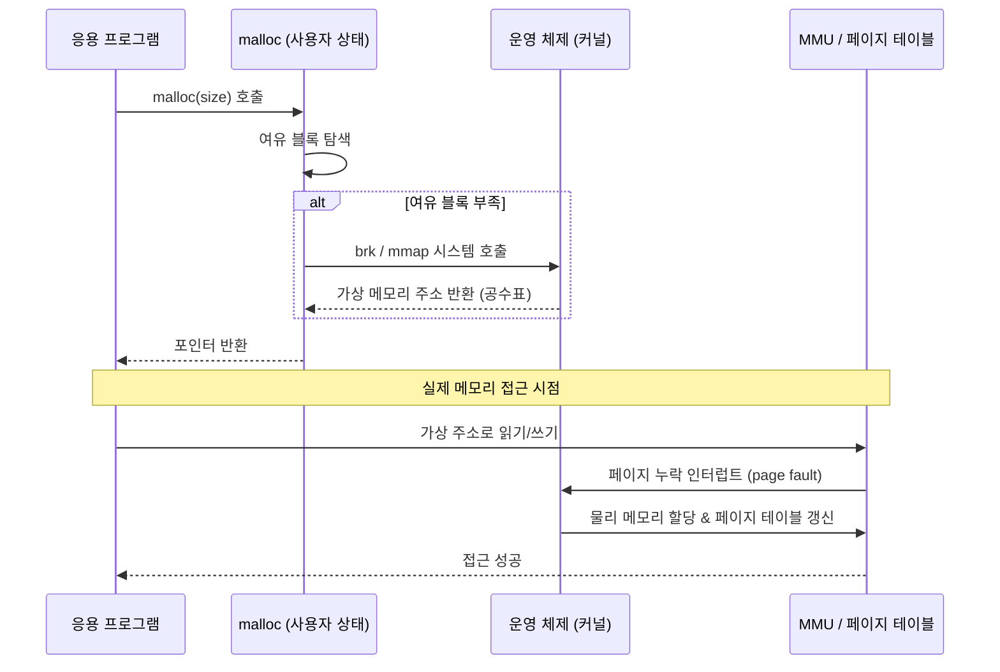

# 3장. 저수준 계층? 메모리라는 사물함에서부터 시작해 보자
- 범위: 3.1 ~ 3.8 (메모리, 포인터, 스택/힙, 가상 메모리, 메모리 풀, 메모리 버그)
- 공통: 가상 메모리, 스택/힙 구조 큰 그림
- FE: JS/브라우저 엔진에서의 스택/힙 매핑 이해, 메모리 누수와 GC 연계 (3.1~3.3, 3.7)
- BE: malloc, 메모리 풀, GC 동작과 대비, 포인터 버그 사례 (3.4~3.6, 3.7)
- DevOps: 시스템 콜(brk/mmap), 메모리 풀 최적화, OOM, 메모리 리소스 관리 (3.5~3.6)

---

모든 고수준 개념은 결국 **주소가 있는 사물함을 어떻게 해석하느냐의 문제**로 귀결된다.

## 3.1 메모리의 본질, 포인터와 참조

### 메모리는 사물함이다
- 메모리는 번호가 매겨진 사물함의 연속이다.
- 가장 작은 저장 단위는 bit이다.
- 실질적인 주소 단위는 1byte이다.
- 모든 바이트는 **고유한 주소**를 가진다.

> **메모리는 의미를 모른다.**
> → 이 값이 정수인지, 문자열인지, 객체인지는 CPU와 프로그램이 정하는 해석이다.

### 변수란 무엇인가?

```c
int a = 1;
```

| 관점 | 의미 |
|------|------|
| 값 관점 | a는 1이다 |
| 메모리 관점 | a는 **어딘가의 주소**에 저장된 1이다 |

변수는 "값과 그 값이 들어 있는 주소에 대한 추상화"이다.

### 포인터와 참조: 주소를 다루는 방법의 차이

포인터는 **사물함 번호 자체를 변수로 저장**한다.

```c
int a = 10;
int* p = &a; // p는 a의 주소를 가진다.
```

- 데이터를 복사하지 않고 **원본 위치를 직접 가리킨다.**
- 메모리 조작에 매우 강력하다.
- 동시에 매우 위험하다.

포인터가 위험한 이유:
- 잘못된 주소 접근 → 프로세스 메모리 파괴
- use-after-free, dangling pointer, buffer overflow

참조는 포인터의 **안전한 상위 개념**이다.

```c
int a = 10;
int& ref = a;
```

- 실제로는 주소를 사용한다.
- 하지만 주소를 직접 볼 수 없고 주소 연산(+1, -1)이 불가하다.

```kotlin
val a = User("Ramos")
val b = a

b.name = "Song"
println(a.name) // Song
```

- 객체는 참조로 전달된다.
- 값 복사가 아니다.
- 내부적으로는 "주소 공유"이다.

## 3.2 프로세스는 메모리 안에서 어떤 모습을 하고 있을까?
"주소"가 프로세스 단위로 어떻게 조작되는지를 이해하는 것이 핵심이다.

### 프로세스 주소 공간 (Process Address Space)
프로그램이 실행되면 OS는 프로세스마다 **독립적인 메모리 구조**를 만들어 준다.

```
┌───────────────┐  높은 주소
│   Stack       │  ← 함수 호출, 지역 변수
│               │
│   Heap        │  ← new / malloc
│               │
│   Data        │  ← 전역 변수
│               │
│   Code        │  ← 실행 명령어
└───────────────┘  낮은 주소
```

| 영역 | 역할 |
|------|------|
| Code | 컴파일된 기계어 |
| Data | 전역 변수, static |
| Heap | 런타임 동적 할당 |
| Stack | 함수 호출 프레임 |

서버 개발자가 유의할 사항:
- StackOverflowError → 스택 영역 한계
- OOM → 힙 영역 고갈
- 메모리 누수 → 힙 해제 실패

### 모든 프로세스의 코드 영역은 왜 항상 0x400000인가?
모든 프로세스는 똑같은 주소 구조를 가진 것처럼 보인다.

> Code segment starts at 0x400000

#### 가상 메모리: 모두가 속고 있는 환상

**가상 주소 vs 물리 주소**
- 우리가 보는 주소: 가상 주소
- 실제 RAM 주소: 물리 주소
- 예시:
  - 프로세스 주소: `0x400000`
  - → 실제 RAM: `0x7f12ab9000`

이 변환을 담당하는 것이 **가상 메모리 시스템**이다.

#### 페이지와 페이지 테이블
- 메모리는 페이지 단위(보통 4KB)로 관리된다.
- 프로세스 주소 공간도 페이지로 쪼개진다.
- 물리 메모리는 아무 곳에나 흩어져 있다.

운영체제는 **페이지 테이블**로 대응 관계를 관리한다.

```
가상 페이지 0x400 → 물리 페이지 0x12A
가상 페이지 0x401 → 물리 페이지 0x9F0
```

이런 구조 덕에 가능한 것들:
- 프로세스 간 메모리 완전 격리
- 같은 가상 주소 사용 가능
- 코드 공유 (shared library)
- 스왑, demand paging

## 3.3 스택 영역: 함수 호출은 어떻게 구현될까?
함수 호출 시 필요한 실행 시간 정보는 **스택 프레임(stack frame)** 에 저장되어 스택 영역을 구성한다. 스택 프레임 안에는 반환 주소, 매개변수, 지역 변수, 레지스터 정보 등이 보관되며 **후입선출(LIFO)** 순서로 증가하고 감소한다.

```
┌─────────────────────┐  높은 주소
│  main() 스택 프레임  │
│  - 반환 주소         │
│  - 지역 변수         │
├─────────────────────┤
│  foo() 스택 프레임   │  ← 함수 호출 시 push
│  - 반환 주소         │
│  - 매개변수          │
│  - 지역 변수         │
├─────────────────────┤
│  bar() 스택 프레임   │  ← 중첩 호출 시 push
│  - 반환 주소         │
│  - 매개변수          │
│  - 지역 변수         │
└─────────────────────┘  낮은 주소 (스택 성장 방향 ↓)
```

- 함수가 반환되면 해당 스택 프레임이 pop되어 제거되고, 반환 주소를 통해 호출자의 실행 흐름으로 복귀한다.
- 만약 함수 호출 단계가 너무 깊어지거나(재귀 폭발) 너무 큰 지역 변수를 할당하면 스택 영역의 제한을 초과하여 **스택 넘침(stack overflow)** 오류가 발생한다.
- JVM 환경에서는 `-Xss` 옵션으로 스레드당 스택 크기를 제어할 수 있으며, 기본값은 보통 512KB~1MB이다.

## 3.4 힙 영역: 메모리의 동적 할당은 어떻게 구현될까?
함수 호출을 뛰어넘어 수명 주기를 제어해야 하는 데이터는 **힙 영역**에 할당된다. `malloc` 같은 메모리 할당자는 메모리 조각에 32비트의 **머리 정보(header)** 와 **꼬리 정보(footer)** 를 붙여 크기와 할당 여부를 추적한다.

### 할당 전략

| 전략 | 설명 |
|------|------|
| 최초 적합(First Fit) | 여유 공간 리스트를 처음부터 탐색하여 충분한 크기의 첫 번째 블록을 사용 |
| 다음 적합(Next Fit) | 이전 탐색이 끝난 지점부터 이어서 탐색 |
| 최적 적합(Best Fit) | 요청 크기에 가장 가까운 여유 블록을 선택하여 낭비를 최소화 |

### 메모리 해제와 병합
메모리를 해제할 때는 파편화를 막기 위해 인접한 여유 조각과 **병합(coalescing)** 하는 과정을 거친다. 이 과정이 없으면 작은 빈 공간들이 산재하여 큰 메모리 요청을 처리하지 못하는 **외부 단편화(external fragmentation)** 가 발생한다.

## 3.5 메모리를 할당할 때 저수준 계층에서 일어나는 일
`malloc` 호출 시 여유 메모리가 부족해지면, 사용자 상태에서 **시스템 호출(예: `brk`)** 을 통해 운영 체제에 힙 영역 확장을 요청하게 된다.



- 이때 반환되는 것은 실제 물리 메모리가 아닌 **가상 메모리의 공수표**이다.
- 이후 프로그램이 해당 가상 메모리를 실제로 읽거나 쓸 때 **페이지 누락 인터럽트(page fault)** 가 발생하며, 이때 비로소 커널 상태의 운영 체제가 실제 물리 메모리를 할당해 준다.
- 이러한 지연 할당(lazy allocation) 방식 덕분에 실제로 사용하지 않는 메모리에 대해 물리 RAM을 낭비하지 않을 수 있다.

## 3.6 고성능 서버의 메모리 풀은 어떻게 구현될까?
범용 메모리 할당자인 `malloc`을 빈번하게 호출하면 병목 현상이 생길 수 있다. `malloc` 내부에서 잠금(lock)을 사용하기 때문에 다중 스레드 환경에서 경합이 발생하고, 시스템 호출 오버헤드도 무시할 수 없다.

이를 해결하기 위해 고성능 서버는 큰 메모리 덩어리를 미리 할당받아 응용 프로그램 내에서 직접 관리하는 **메모리 풀(memory pool)** 기법을 사용한다.

### 다중 스레드 환경에서의 메모리 풀

```
┌──────────────┐  ┌──────────────┐  ┌──────────────┐
│  Thread #1   │  │  Thread #2   │  │  Thread #3   │
│  ┌────────┐  │  │  ┌────────┐  │  │  ┌────────┐  │
│  │TLS Pool│  │  │  │TLS Pool│  │  │  │TLS Pool│  │
│  └────────┘  │  │  └────────┘  │  │  └────────┘  │
└──────┬───────┘  └──────┬───────┘  └──────┬───────┘
       │                 │                 │
       └─────────────────┼─────────────────┘
                         │
                 ┌───────▼───────┐
                 │  공용 메모리   │
                 │  (큰 덩어리)  │
                 └───────────────┘
```

- 잠금 경쟁으로 인한 성능 저하를 피하기 위해 **스레드 전용 저장소(TLS)** 를 활용하여 각 스레드마다 독립적인 메모리 풀을 유지한다.
- 각 스레드는 자신의 TLS 풀에서 할당/해제를 수행하므로 잠금이 필요 없다.
- TLS 풀이 부족해지면 공용 메모리에서 큰 덩어리를 가져오는 방식으로 동작한다.
- 대표적인 구현체로 `tcmalloc`(Google), `jemalloc`(Facebook/Meta) 등이 있다.

## 3.7 대표적인 메모리 관련 버그
C 언어처럼 포인터를 이용해 메모리를 직접 다루는 환경에서는 까다로운 버그가 자주 발생한다.

| 버그 유형 | 설명 |
|----------|------|
| 댕글링 포인터(Dangling Pointer) | 함수 종료와 함께 무효화되는 지역 변수의 포인터를 반환하여, 이미 해제된 스택 프레임의 주소를 참조 |
| 포인터 연산 오류 | 단위 크기를 고려하지 않은 포인터 연산으로 엉뚱한 메모리 위치에 접근 |
| 초기화되지 않은 메모리 읽기 | `malloc`으로 할당한 메모리를 초기화하지 않고 읽어 예측 불가능한 값을 사용 |
| Use-After-Free | 이미 `free`로 해제된 메모리를 다시 참조하여 정의되지 않은 동작 발생 |
| 메모리 누수(Memory Leak) | 메모리 해제를 잊어버려 힙 영역이 계속 늘어나 시스템 강제 종료(OOM) 유발 |
| 스택 버퍼 넘침(Stack Buffer Overflow) | 함수의 반환 주소를 덮어써 해커의 악성 코드 실행에 악용 가능 |

Java/Kotlin 같은 GC 기반 언어에서도 메모리 누수는 발생할 수 있다. 예를 들어 `static` 컬렉션에 객체를 계속 넣기만 하고 제거하지 않거나, 리스너/콜백을 등록만 하고 해제하지 않는 경우가 대표적이다.

## 3.8 왜 SSD는 메모리로 사용할 수 없을까?
SSD의 속도가 크게 발전했지만 여전히 메모리 대역폭과는 자릿수가 다를 정도로 느리다.

| 비교 항목 | RAM (DDR5) | SSD (NVMe) |
|----------|-----------|------------|
| 대역폭 | ~50 GB/s | ~7 GB/s |
| 지연 시간 | ~100 ns | ~10,000 ns (10 us) |
| 접근 단위 | 바이트(byte) | 블록(block, 4KB~) |
| 수명 제한 | 없음 (휘발성) | TBW 제한 있음 |

- 가장 결정적인 차이는 메모리가 CPU의 **바이트 단위 주소 지정**을 지원하여 직접 접근이 가능한 반면, SSD는 **블록(block) 단위**로 데이터를 관리하므로 CPU가 직접 명령어를 가져와 실행할 수 없다는 점이다.
- 또한 SSD는 데이터를 기록할 수 있는 최대 용량(TBW)에 따른 **수명 제한**이 있어, 빈번한 쓰기 작업이 발생하는 메모리 역할을 감당할 수 없다.
- 다만 SSD를 스왑(swap) 영역으로 활용하여 물리 RAM이 부족할 때 보조 저장소로 사용하는 것은 가능하며, 실제로 많은 시스템이 이 방식을 채택하고 있다.

## BE 개발자가 생각해볼만한 것들

| 개념 | 실제 체감 |
|------|----------|
| 힙 | JVM Heap, GC |
| 스택 | Thread Stack, StackOverflow |
| 가상 메모리 | 컨테이너 메모리 제한 |
| 페이지 | mmap, zero-copy |
| 주소 공간 | 프로세스 격리, 보안 |

```yaml
# 컨테이너 메모리 제한
resources:
  limits:
    memory: 512Mi
```

- JVM은 가상 메모리 크기만 보고 판단한다.
- 실제 물리 RAM과 다르다.
- 잘못 설정하면 OOMKilled가 발생한다.
