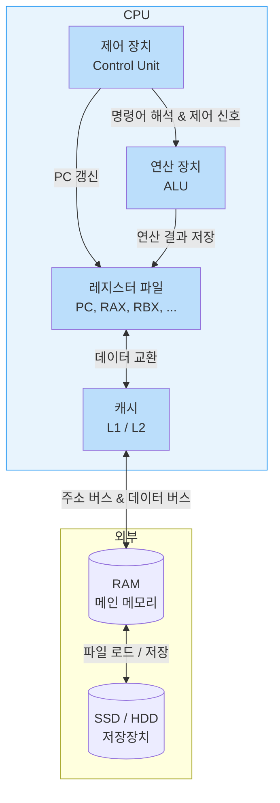
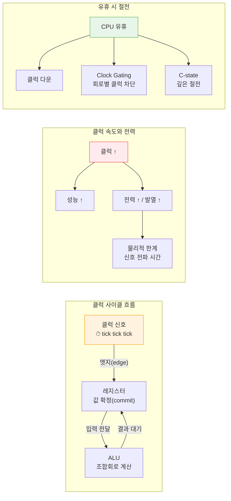
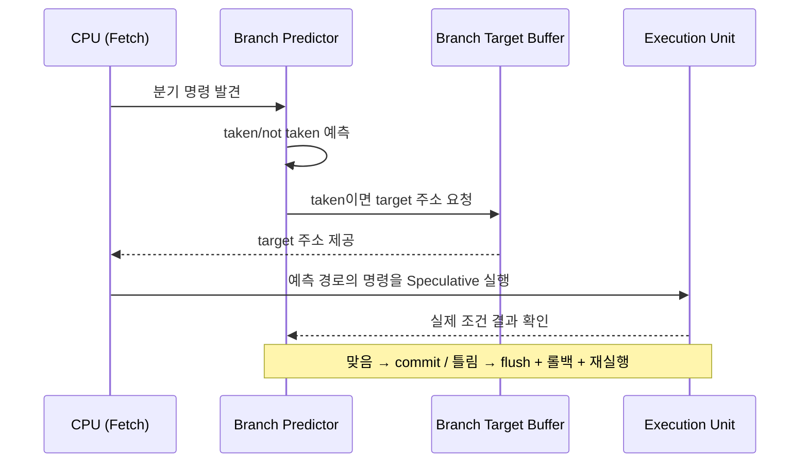
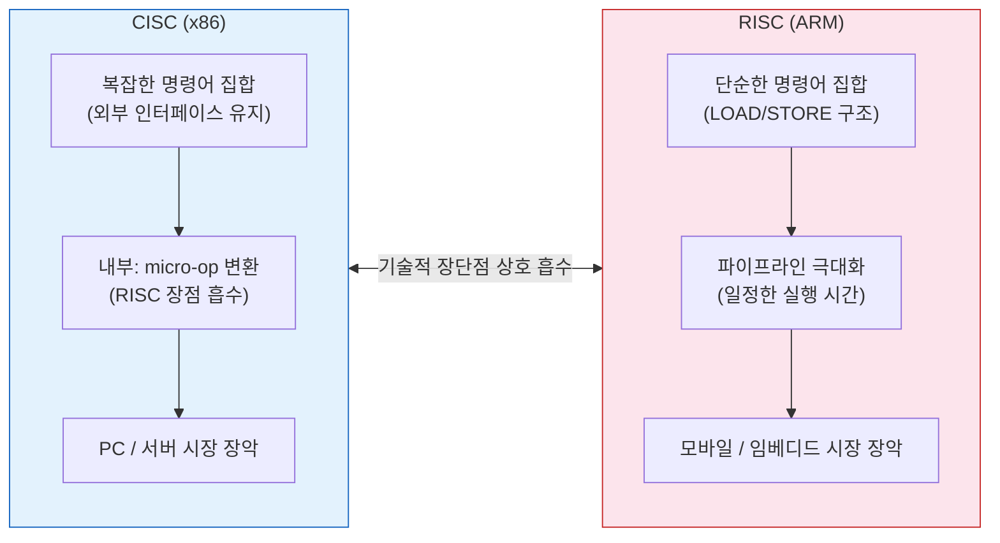
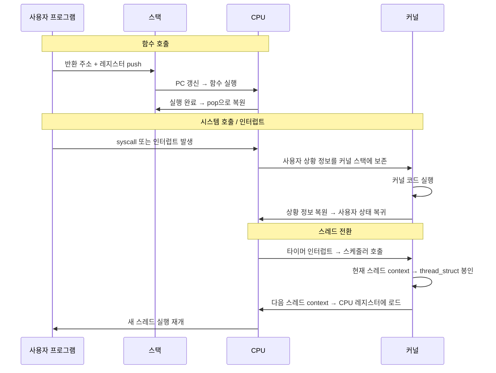

# 4장. 트랜지스터에서 CPU로, 이보다 더 중요한 것은 없다
- 범위: 4.1 ~ 4.9 (CPU 구조, 클럭, 유휴 상태, 파이프라인, 분기 예측, CISC/RISC, 스택과 제어 흐름)
- 공통: CPU-메모리 상호작용, 인터럽트, 분기 예측
- FE: 성능 최적화와 CPU 파이프라인 직관 (4.4 if문/분기 예측)
- BE: 함수 호출/스택 프레임/시스템 콜(4.9), 멀티코어 최적화 감각
- DevOps: CPU 스케줄링, 하이퍼스레딩, CISC vs RISC → 클라우드 인스턴스 선택 관점 (4.2~4.8)

---

## 4.1 이 작은 장난감을 CPU라고 부른다

### CPU 개략 구조도



### 정보는 "어디에" 저장되나? (물리적 저장 위치)
CPU가 정보를 저장하는 건 결국 비트(0/1)를 저장하는 것이고, 물리적으로는 아래와 같은 소자들이 그 역할을 한다.

**레지스터: CPU 내부에 있는 "초고속 저장소"**
- CPU 안쪽에 플립플롭(Flip-Flop) 또는 래치(Latch) 같은 회로로 만들어진다.
- 각 비트는 "현재 0인지 1인지" 상태를 회로가 유지하고 있다.
- 예: 64비트 레지스터라면 플립플롭 64개가 묶여있는 느낌이다.
- 특징: 매우 빠르고, 개수가 적으며, CPU가 직접 이름을 붙여서 접근한다(RAX, RBX, EAX 등).

**RAM(메인 메모리): 칩 안에 "엄청 많은 저장 칸"**
- RAM은 레지스터처럼 CPU 안이 아니라, 메모리 모듈(DRAM 칩) 내부에 저장된다.
- DRAM의 1비트는 보통 캐패시터(전하를 저장) + 트랜지스터(스위치)로 구성된다.
- 전하가 있으면 1, 없으면 0처럼 취급한다.
- 단, 전하가 새기 때문에 주기적으로 다시 채워주는 Refresh가 필요하다(그래서 "휘발성").
- 특징: 레지스터보다는 느리지만 매우 크며, 프로그램 실행 중 데이터/코드가 여기에 있다.

**SSD/HDD(저장장치): "영구 저장"**
- 전원이 꺼져도 데이터가 유지된다.
- 다만 CPU는 저장장치를 직접 1클럭 단위로 쓰지 못해서 파일 → RAM으로 로드 → CPU가 처리하는 흐름으로 동작한다.

### 주소(Address)란?
"부여된 번호를 토대로 회로에 저장된 정보를 읽는다"는 게 바로 메모리의 핵심이다.

주소란 "메모리 내부에서 몇 번째 저장칸을 읽을 건지 지정하는 숫자"이다. 즉 주소는 데이터 그 자체가 아니라, 데이터가 들어있는 위치를 가리키는 번호표이다.

### CPU가 데이터를 읽는 동작 방식
CPU가 RAM을 읽는 순간을 간단히 모델링하면 다음과 같다.

1. CPU가 **주소 버스(Address Bus)** 에 값을 올린다(예: `0x1000` 위치를 읽고 싶다).
2. 메모리 컨트롤러가 그 주소에 해당하는 메모리 셀(바이트/워드)을 찾아간다.
3. 해당 위치의 데이터가 **데이터 버스(Data Bus)** 를 통해 CPU로 넘어온다.

"번호를 주면 회로가 그 칸을 선택한다"는 의미는 실제로는 메모리 칩 내부에 선택 회로가 있기 때문이다.
- 행(row) 선택, 열(column) 선택 (DRAM은 보통 이런 구조)
- **디코더(decoder)** 가 주소를 보고 특정 위치를 선택한다.

### 메모리 주소의 단위
대부분의 시스템에서 주소는 아래처럼 해석된다.
- 주소 1 증가 = 1바이트 이동
- 예: `0x1000` → 1바이트, `0x1001` → 그 다음 1바이트, `0x1002` → 그 다음…

즉, 주소(address)는 "바이트 단위 저장칸의 번호"이다. CPU가 한 번에 4바이트(32bit), 8바이트(64bit) 읽을 수도 있는데 그건 "주소 단위(바이트)" 위에서 묶어서 읽는 것일 뿐이다.

### 레지스터 접근 방식
- 레지스터는 보통 RAM처럼 "주소 숫자"로 접근하지 않는다.
  - 명령어가 특정 레지스터를 직접 지정한다(`MOV RAX, ...`).
  - 내부적으로는 레지스터 파일(Register File)이라는 구조에서 "레지스터 번호(인덱스)"로 선택된다.
- **RAM 주소** = 외부로 공개된 "메모리 공간 번호"
- **레지스터 번호** = CPU 내부에서만 쓰는 "선택 번호"

둘 다 "선택을 위한 번호"라는 점에서 비슷하지만, RAM 주소처럼 큰 공간의 포인터 개념과는 결이 조금 다르다.

### 메모리의 정의
> 메모리란 0/1 상태를 저장해두는 회로들의 집합이고, 그 회로들 각각을 찾아가기 위해 주소(Address)라는 번호 체계를 붙여서 CPU가 원하는 칸을 읽고 쓸 수 있게 만든 것이다.

### 직관적인 비유

| 대상 | 비유 |
|------|------|
| 레지스터 | CPU 책상 위 메모장 (엄청 빠르고 작음) |
| RAM | 책장에 있는 수천만 권의 페이지 (크고 접근엔 절차가 필요) |
| 주소 | "책장 몇 번째 칸의 몇 번째 페이지" 같은 좌표 |
| CPU | 주소를 던지고 → 그 위치 데이터를 받아옴 |

### 클럭(Clock)이란?
CPU 내부 회로들이 "언제 상태를 바꿀지"를 맞춰주는 **기준 박자(타이밍 신호)** 이다.



CPU 안에는 레지스터, ALU, 제어회로 같은 것들이 동시에 신호를 주고받으면서 계산을 한다. "지금 값을 바꿔도 되는 타이밍"이 안 맞으면 다음과 같은 문제가 발생한다.
- 아직 계산이 끝나기 전인데 레지스터가 값을 저장해버리거나
- 신호가 흔들리는 순간(전기적으로 불안정한 순간)을 저장해버리거나
- 회로들끼리 순서가 꼬여서 오작동

그래서 CPU는 딱 정해진 타이밍에만 값을 확정(commit)하도록 만든다. CPU는 보통 클럭 "틱(tick)"마다 레지스터들이 "지금 들어온 입력 값을 저장할지 말지" 결정하는 식으로 동작한다.
- ALU 같은 조합회로는 계속 계산을 하고 있지만
- 레지스터는 클럭 엣지(edge) 순간에만 값을 저장해서 "다음 단계"로 넘어가게 만든다.

### 클럭 속도
예를 들어 3.5GHz라면:
- 1초에 35억 번 "틱"이 있고
- CPU가 35억 번 "다음 단계로 넘어갈 기회"가 있다는 뜻이다.
- **중요한 오해 방지:** 클럭 1번 = 명령어 1개 실행이 아니다. 명령어 하나는 보통 여러 단계(사이클)를 거치고, 반대로 요즘 CPU는 파이프라인/병렬 처리 때문에 한 클럭에 여러 명령이 겹쳐서 진행되기도 한다.

### 클럭이 빠르면 무조건 좋은가?
클럭을 올리면 보통 더 빨라지긴 하지만 한계가 있다.

- **한계 1: 전기 신호 전파 시간** — CPU 내부도 결국 물리적인 거리(배선)가 있어서 신호가 도착하는 데 시간이 걸린다. 클럭이 너무 빨라지면 다음 틱이 오기 전에 계산이 안 끝나 오류가 발생한다.
- **한계 2: 발열/전력** — 클럭 ↑ → 전력 ↑ → 발열 ↑

그래서 무작정 올릴 수 없고, 요즘은 "클럭만 올리는 시대"에서 "병렬/효율 최적화"로 넘어왔다.

### 유휴 상태에서의 클럭
CPU가 놀 때는 그냥 "아무것도 안 함"이 아니라:
- 클럭을 낮추거나(클럭 다운)
- 일부 회로에 클럭을 끊거나(Clock Gating)
- 더 깊은 절전 상태로 들어가기도 한다(C-state)

즉 클럭은 성능뿐 아니라 **전력 제어의 핵심 레버**이기도 하다.

## 4.2 CPU는 유휴 상태일 때 무엇을 할까?
사용자가 컴퓨터를 조작하지 않는 유휴 시간 동안 CPU는 실제로 유휴 프로세스(Windows의 'System Idle Process' 등)를 실행하고 있다. 운영 체제는 실행 가능한 일반 프로세스가 없을 때 우선순위가 가장 낮은 유휴 프로세스를 스케줄러를 통해 실행하며, 이를 통해 스케줄러가 항상 실행 대상을 찾을 수 있는 깔끔한 구조를 유지한다.

유휴 프로세스는 주로 CPU를 저전력 상태로 전환하는 `halt` 명령어를 무한 루프 내에서 반복 실행한다. 이 무한 루프는 시스템 타이머가 발생시키는 타이머 인터럽트에 의해 중단될 수 있으며, 운영 체제는 인터럽트 처리 과정에서 다른 프로세스가 준비되었는지 확인하여 다시 실행 흐름을 제어한다.

### 유휴 프로세스에 대한 Q&A

**Q1) 왜 OS는 '아무것도 안 하는 상태'를 그냥 비워두지 않고 프로세스로 만들까?**

스케줄러 관점에서 "항상 실행할 대상"이 존재하면 상태 관리가 단순해지고 예외 처리가 줄어든다. 그래서 runnable 작업이 없을 때는 우선순위 최하의 유휴 프로세스를 돌려 CPU를 안전하게 대기 상태로 보낸다.

**Q2) Windows의 System Idle Process는 "실제로 일을 하는 프로세스"인가?**

실제 사용자 작업을 수행하는 프로세스라기보다 "CPU가 놀고 있는 시간"을 대표하는 커널 idle thread를 표시한 것이다. 즉 보이는 형태는 프로세스지만 의미는 "남는 CPU 시간"의 집계에 가깝다.

**Q3) 유휴 프로세스는 유저 모드인가, 커널 모드인가?**

대부분 커널 모드에서 동작한다. CPU를 대기/저전력 상태로 만드는 명령과 스케줄링 흐름이 커널 책임이기 때문이다.

**Q4) 멀티코어면 코어마다 idle이 따로 있는가?**

멀티코어/멀티프로세서 환경에서는 보통 코어(논리 CPU)마다 idle thread가 따로 존재한다. 각 코어가 독립적으로 "할 일 없음" 상태를 처리해야 하기 때문이다.

**Q5) 유휴 프로세스가 돌고 있을 때 CPU 사용률이 왜 0%가 아니라 idle %로 잡히는지?**

CPU 사용률은 "아무것도 안 함"을 0으로 두기보다, 전체 시간 중 유휴 시간이 얼마인지를 따로 계산해 보여준다. 그래서 System Idle Process의 %는 "이만큼 CPU가 비어 있었다"는 의미이다.

## 4.3 CPU는 숫자를 어떻게 인식할까?
진법, 진수에 대한 내용. (생략)

## 4.4 CPU가 if 문을 만났을 때: 파이프라인과 분기 예측
CPU는 성능 향상을 위해 명령어 실행 과정을 여러 단계로 나누어 동시에 처리하는 **파이프라인(pipeline)** 기술을 사용한다.

- **파이프라인의 위기:** if 문과 같은 분기 명령어는 실행 결과가 나오기 전까지 다음에 어떤 명령어를 실행할지 알 수 없어 파이프라인 흐름을 끊을 수 있다.
- **분기 예측(Branch Prediction):** CPU는 성능 손실을 막기 위해 어느 분기로 점프할지 미리 추측하여 명령어를 실행한다.
- **성능 영향:** 추측이 성공하면 파이프라인이 매끄럽게 흐르지만, 실패하면 이미 실행 중이던 명령어를 모두 무효화하므로 성능이 저하된다. 예를 들어, 정렬된 배열을 처리할 때 속도가 더 빠른 이유는 데이터의 규칙성 덕분에 CPU의 분기 예측 성공률이 매우 높기 때문이다.

### 분기 예측 방식

**정적(static) 예측 — 규칙 기반**

CPU가 간단한 규칙으로 예측하는 방식이다.
- "뒤로 가는 분기(loop)는 보통 반복되니까 taken일 확률이 높다"
- "앞으로 가는 분기는 not taken일 확률이 높다"

요즘은 이것만으론 부족하다.

**동적(dynamic) 예측 — 과거 기록 기반**

예전에 이 분기가 어떻게 됐는지 기록해두고 그걸 기반으로 예측한다. 각 분기마다 "최근 경향"을 저장하는 작은 상태 머신이 있다.

```
Strongly Taken ↔ Weakly Taken ↔ Weakly Not Taken ↔ Strongly Not Taken
```

- Taken 쪽 상태면 Taken 예측, Not Taken 쪽 상태면 Not Taken 예측
- taken이 나오면 상태가 taken 쪽으로 한 칸 이동, not taken이 나오면 반대로 한 칸 이동

### 분기 예측의 흐름



### 분기 예측과 성능
- "분기 결과가 규칙적/연속적이면 예측이 잘 된다", 반대로 **"분기 결과가 불규칙하면 예측이 깨진다"** 가 핵심이다.
- 분기예측의 "비용"이 커진다기보다, **예측이 틀렸을 때 날아가는 비용(미스패널티)** 이 커서 성능이 떨어진다.
- 프로그램 성능에서 체감되는 건 거의 `미스 예측 횟수 x 미스패널티`에 해당한다.

분기 예측이 틀리면 CPU가 했던 추측 실행을 폐기하고 다시 실행해야 한다.
- 파이프라인 flush
- fetch/decode 다시 시작
- out-of-order로 쌓아둔 작업 취소

현대 CPU에서는 미스 한 번에 **10~20+ 사이클** 이상 손해가 발생할 수 있다.

## 4.5 CPU 코어 수와 스레드 수의 관계
CPU 코어는 하드웨어 리소스이고 스레드는 소프트웨어적인 실행 흐름(작업)을 의미하며, 이 둘 사이에는 고정된 필연적 관계가 없다.

- **스레드의 본질:** CPU는 자신이 실행하는 명령어가 어떤 스레드에 속하는지 알지 못하며, 단지 PC 레지스터가 가리키는 주소의 명령어를 실행할 뿐이다.
- **단일 코어와 다중 스레드:** 코어가 하나라도 운영 체제의 스케줄링을 통해 수많은 스레드를 번갈아 실행할 수 있으며, 이는 입출력 대기 시간을 효율적으로 활용하거나 UI 응답성을 유지하는 데 유용하다.
- **최적의 스레드 수:** 순수 계산 작업은 코어당 스레드 하나가 적합하지만, 입출력 작업이 포함된 경우 코어 수보다 많은 스레드를 생성하여 CPU 활용도를 높일 수 있다. 다만, 스레드가 너무 많아지면 문맥 전환(context switch) 부담으로 오히려 성능이 떨어질 수 있다.

## 4.6 CPU 진화론(상): 복잡 명령어 집합(CISC)의 탄생
초기 컴퓨터 환경의 제약은 **CISC(Complex Instruction Set Computer)** 라는 설계 철학을 탄생시켰다.

- **의미상 간격(semantic gap) 줄이기:** 과거에는 컴파일러 기술이 부족하여 프로그래머가 직접 어셈블리어로 코드를 작성했기 때문에, 고급 언어의 기능을 명령어 하나로 수행할 수 있는 강력한 기계 명령어가 필요했다.
- **저장 공간 절약:** 메모리 가격이 매우 비싸고 용량이 작았던 시절에는 프로그램의 크기를 줄이기 위해 가변 길이의 조밀하게 인코딩된 복잡한 명령어를 선호했다.
- **마이크로코드(Microcode):** 복잡한 명령어를 하드웨어로 직접 구현하기 어렵기 때문에, CPU 내부에서 이를 더 간단한 명령어들의 조합인 '마이크로코드'로 변환하여 실행하는 설계를 채택했다. 하지만 마이크로코드는 트랜지스터를 많이 소모하고 버그 수정이 어렵다는 단점이 있었다.

## 4.7 CPU 진화론(중): 축소 명령어 집합(RISC)의 탄생
메모리 용량의 급증과 컴파일러 기술의 눈부신 발전으로 인해 프로그래머가 직접 어셈블리어를 작성할 필요성이 줄어들면서, 기존 복잡 명령어 집합(CISC)의 비효율성이 수면 위로 드러났다. 기계 명령어의 20%가 전체 실행 시간의 80%를 차지한다는 점에 착안하여, 명령어 자체의 복잡성을 줄이는 **축소 명령어 집합(RISC)** 철학이 탄생했다.

- **단순화와 제어권 이양:** 복잡한 명령어를 제거하고 단순한 명령어의 조합으로 대체하여 CPU 내부의 마이크로코드(Microcode) 설계를 없앴으며, 이를 통해 컴파일러가 CPU를 더 정밀하게 제어할 수 있게 되었다.
- **LOAD/STORE 구조:** 연산은 CPU 내부 레지스터에서만 수행하고, 메모리 접근은 LOAD와 STORE라는 전용 기계 명령어로만 엄격하게 제한했다.
- **파이프라인의 극대화:** 단순해진 명령어들은 실행 시간이 거의 일정하기 때문에 명령어 처리량을 극대화하는 파이프라인(Pipeline) 기술을 완벽하게 활용할 수 있었고, 그 결과 초기 RISC 프로세서는 동시대의 CISC 프로세서를 성능 면에서 압도했다.

## 4.8 CPU 진화론(하): 절체절명의 위기에서 반격
RISC의 파상 공세에 직면한 CISC 진영(주로 인텔 x86)은 기존의 거대한 소프트웨어 생태계를 버릴 수 없었다. 이들은 외부의 명령어 집합 인터페이스는 CISC를 유지하되, CPU 내부에서는 복잡한 명령어를 RISC처럼 단순한 **마이크로 명령어(micro-operation)** 로 변환하여 실행하는 혁신적인 설계를 도입해 파이프라인의 이점을 고스란히 흡수했다.

- **하이퍼스레딩(Hyper-threading):** 파이프라인의 '빈 공간'을 채우기 위해, 하나의 물리 CPU 코어가 동시에 두 개의 스레드 명령어 흐름을 처리하게 하여 운영 체제에 마치 코어가 여러 개인 것 같은 환상을 제공하는 기술을 개발했다.
- **상업적 전쟁의 결과:** 두 아키텍처는 기술적으로 서로의 장단점을 흡수하며 진화했다. 상업적으로는 거대한 윈텔(WinTel) 소프트웨어 생태계를 업은 x86이 PC와 서버 시장을 완벽히 장악한 반면, RISC 기반의 ARM은 모바일 인터넷 시대의 도래와 함께 스마트폰 시장을 제패하며 각자의 영역을 굳혔다.



## 4.9 CPU, 스택과 함수 호출, 시스템 호출, 스레드 전환, 인터럽트 처리 통달하기
CPU가 단순히 명령어를 순차적으로만 실행하지 않고 프로그램의 제어 흐름을 동적으로 전환할 수 있는 핵심은 **상황 정보(Context)의 저장과 복원**에 있으며, 이는 후입선출(LIFO)의 중첩 구조인 **스택(Stack)** 을 통해 구현된다.

### 레지스터의 중추적 역할
- 속도가 가장 빠른 레지스터 중 **PC(프로그램 카운터)** 레지스터는 다음에 실행할 명령어의 주소를 가리켜 제어 흐름을 장악한다.
- **상태 레지스터**는 연산 상태 및 현재 CPU의 특권 단계(사용자 상태 vs 커널 상태)를 저장한다.

### 함수 호출
호출 시 반환 주소와 레지스터 상태 등을 프로세스 주소 공간의 사용자 상태 스택 프레임에 밀어 넣고(push), 함수 실행이 완료되면 이 정보를 꺼내어(pop) 원래의 흐름으로 복원한다.

### 시스템 호출 및 인터럽트
운영 체제의 서비스가 필요하거나(시스템 호출) 외부 장치의 신호가 발생하면(인터럽트), CPU는 특권 0단계인 **커널 상태**로 전환된다. 이때 사용자 상태의 상황 정보는 커널 상태 스택이나 전용 인터럽트 처리 함수 스택에 안전하게 보존된 뒤 커널 코드를 실행한다.

### 스레드 전환
타이머 인터럽트 발생 시 스케줄러가 현재 스레드의 시간 조각(time slice)이 다 되었다고 판단하면, CPU는 현재 실행 중이던 스레드의 상황 정보를 해당 프로세스 서술자(thread_struct)에 봉인하고, 다음에 실행할 스레드의 서술자에서 상황 정보를 CPU로 불러오는 일종의 '두뇌 교체술'을 단행한다. 이를 통해 중단되었던 스레드도 마치 아무 일도 없었던 것처럼 실행을 재개할 수 있다.


