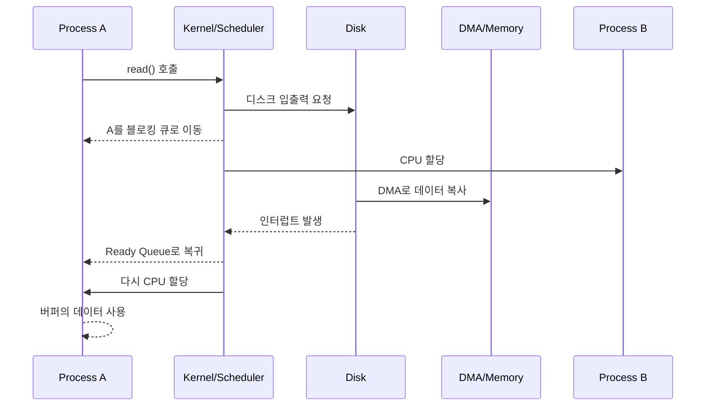
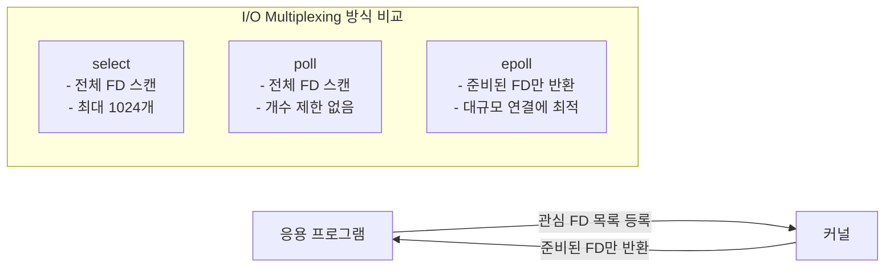
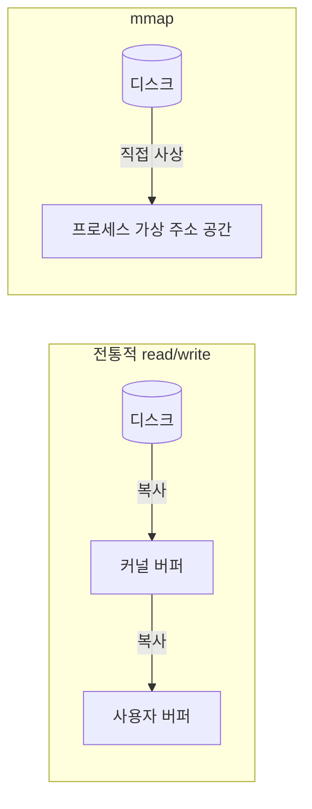

# 6장. 입출력이 없는 컴퓨터가 있을까?
## 6.1 CPU는 어떻게 입출력 작업을 처리할까?
CPU는 입출력 장치를 직접 "이해"하는 것이 아니라, 장치 내부의 **장치 레지스터(device register)** 를 읽고 쓰는 방식으로 제어한다. 장치 레지스터는 보통 데이터, 제어, 상태 정보를 담고 있으며, CPU는 이를 통해 장치에 명령을 내리고 현재 상태를 확인한다.

1. **장치를 제어하는 두 가지 방식**
   * **포트 입출력(Port-mapped I/O):** `IN`, `OUT` 같은 전용 기계 명령어로 장치 레지스터에 접근한다.
   * **메모리 사상 입출력(Memory-mapped I/O, MMIO):** 장치 레지스터를 메모리 주소 공간 일부에 매핑하여, 일반 메모리 읽기/쓰기처럼 장치를 제어한다.
2. **폴링(Polling)의 한계**
   * CPU가 장치 상태 레지스터를 계속 확인하면서 작업 완료를 기다리는 방식이다.
   * 구현은 단순하지만, 장치가 느릴수록 CPU가 아무 일도 못 하고 시간을 낭비하는 **동기식 설계**가 된다.
3. **인터럽트 기반 입출력**
   * 장치가 데이터 준비나 작업 완료 시 CPU에 **인터럽트** 신호를 보낸다.
   * CPU는 현재 실행 중인 작업 상태를 저장한 뒤 인터럽트 핸들러를 실행하고, 처리가 끝나면 원래 실행 흐름으로 복귀한다.
   * 따라서 CPU는 장치를 기다리며 계속 상태를 확인할 필요가 없고, 그 시간에 다른 계산을 수행할 수 있다.

## 6.2 디스크가 입출력을 처리할 때 CPU가 하는 일은 무엇일까?
디스크는 CPU보다 훨씬 느리다. 그래서 CPU가 디스크 입출력이 끝날 때까지 직접 기다리면 시스템 전체 효율이 크게 떨어진다. 운영 체제는 이 느린 구간을 숨기기 위해 **스케줄링**과 **DMA(Direct Memory Access)** 를 활용한다.

1. **CPU는 디스크를 기다리지 않는다**
   * 어떤 스레드나 프로세스가 디스크 입출력을 요청하면, 운영 체제는 해당 작업이 완료될 때까지 그 실행 흐름을 잠시 멈춘다.
   * 그동안 CPU는 준비 완료 상태의 다른 스레드나 프로세스를 실행한다.
2. **CPU가 직접 복사하던 시절의 비효율**
   * 과거에는 장치 버퍼의 데이터를 메모리로 옮기는 단순 복사 작업까지 CPU가 직접 수행했다.
   * 하지만 이는 CPU를 고속 계산기가 아니라 단순 운반자로 쓰는 것이므로 비효율적이다.
3. **DMA의 역할**
   * CPU는 DMA 컨트롤러에 "어디서 어디로 얼마만큼 복사하라"는 작업만 설정한다.
   * 이후 실제 데이터 복사는 DMA가 장치와 메모리 사이에서 직접 처리한다.
   * 전송이 끝나면 DMA 또는 장치가 인터럽트를 발생시켜 CPU에 완료 사실을 알린다.
4. **결과**
   * CPU는 계산을 계속하고,
   * 디스크와 DMA는 데이터를 옮기며,
   * 작업이 끝났을 때만 CPU가 다시 개입한다.
   * 즉, CPU와 디스크가 **병행적으로 유용한 일**을 처리하게 된다.

## 6.3 파일을 읽을 때 프로그램에는 어떤 일이 발생할까?
프로그램 입장에서 `read()` 같은 파일 읽기 함수는 단순 API 호출처럼 보이지만, 실제로는 운영 체제의 스케줄링, DMA 전송, 인터럽트 처리까지 연쇄적으로 일어난다. 핵심은 **입출력의 본질이 결국 장치와 메모리 사이의 데이터 복사**라는 점이다.

1. **블로킹 호출 발생**
   * 프로세스 A가 `read()`를 호출하면 운영 체제는 파일 데이터를 디스크에서 메모리 버퍼로 가져와야 한다고 판단한다.
2. **프로세스 A는 대기 상태로 전환**
   * 아직 데이터가 준비되지 않았으므로 프로세스 A는 계속 실행해도 진전이 없다.
   * 운영 체제는 A를 실행 상태에서 빼고 **입출력 블로킹 대기열**로 보낸다.
3. **다른 프로세스에 CPU 할당**
   * CPU를 놀리지 않기 위해 준비 완료 큐에 있던 프로세스 B가 실행된다.
4. **DMA가 데이터 복사 수행**
   * 디스크는 DMA를 이용해 필요한 데이터를 메모리 버퍼로 복사한다.
5. **인터럽트 발생**
   * 데이터 복사가 끝나면 장치가 CPU에 인터럽트를 보내 입출력 완료를 알린다.
6. **프로세스 A를 다시 준비 완료 상태로 이동**
   * 운영 체제는 A를 블로킹 대기열에서 꺼내 준비 완료 큐에 넣는다.
7. **프로세스 A 실행 재개**
   * 스케줄러가 다시 A를 선택하면, A는 필요한 데이터가 메모리에 준비된 상태에서 이어서 실행된다.
   * 프로그램 입장에서는 `read()`가 반환된 뒤 자연스럽게 다음 코드를 수행하는 것처럼 보인다.

## 6.4 높은 동시성의 비결: 입출력 다중화 (I/O Multiplexing)
수천, 수만 개의 사용자 요청(네트워크 소켓 등)을 동시에 처리해야 하는 서버 환경에서는 전통적인 동기식 입출력이나 스레드 생성 방식으로는 한계가 있다. 이를 해결하기 위한 핵심 기술이 바로 **입출력 다중화**이다.

1. **파일 서술자(File Descriptor)**
   * 리눅스/유닉스에서는 모든 입출력 장치를 '파일'로 취급하며, 프로세스가 파일을 조작할 때 사용하는 식별 번호이다.
2. **입출력 다중화의 원리**
   * 응용 프로그램이 파일 서술자들의 상태를 일일이 확인(폴링)하는 대신, 커널에 관심 있는 파일 서술자 목록을 넘기고 **"읽거나 쓸 수 있는 상태가 되면 알려달라"**고 요청하는 방식이다.
3. **select, poll, epoll — 리눅스의 대표적인 입출력 다중화 기술**
   * **select와 poll:** 이벤트가 발생했을 때 어떤 파일 서술자가 준비되었는지 알 수 없어 처음부터 끝까지 전체를 다시 확인해야 하는 비효율이 있다. (select는 1024개 개수 제한도 존재)
   * **epoll:** 커널 내부에 준비 완료된 파일 서술자 목록을 유지하여, 프로세스가 이 목록만 직접 획득하게 함으로써 수많은 연결을 매우 효율적으로 처리할 수 있다. (고성능 서버의 대명사)

## 6.5 mmap: 메모리 읽기와 쓰기 방식으로 파일 처리하기
전통적인 `read`/`write` 시스템 호출로 파일을 읽고 쓰려면 사용자 상태와 커널 상태 간의 전환 및 데이터 복사(디스크 → 커널 버퍼 → 사용자 버퍼)로 인해 큰 부담이 발생한다. **mmap**은 이를 우회하는 강력한 기능이다.

1. **원리**
   * 운영 체제의 가상 메모리 기술을 활용하여, 디스크에 있는 파일의 공간을 프로세스의 가상 주소 공간에 직접 사상(mapping)한다.
2. **장점**
   * 시스템 호출이나 불필요한 데이터 복사 과정 없이, 메모리에 값을 대입하듯 파일 내용을 직접 조작할 수 있다.
   * 물리 메모리 용량을 초과하는 거대한 파일도 가상 메모리 공간만 충분하다면 효과적으로 처리할 수 있다.
3. **동적 링크 라이브러리와의 관계**
   * 여러 프로세스가 공통으로 사용하는 동적 링크 라이브러리(예: C 표준 라이브러리 `libc.so`)는 mmap을 통해 각 프로세스의 가상 메모리에 사상된다.
   * 실제 물리 메모리에는 단 하나의 복사본만 존재하므로 메모리를 크게 절약할 수 있다.

## 6.6 컴퓨터 시스템의 각 부분에서 얼마큼 지연이 일어날까?
구글의 제프 딘(Jeff Dean)이 정리한 통계 자료를 바탕으로, 시스템 각 계층의 속도 차이를 직관적으로 설명한다.

1. **계층 간 속도 차이**
   * L1 캐시 접근 속도에 비해 L2 캐시는 약 14배, 메인 메모리는 약 200배 느리다.
   * 디스크 순차 읽기는 메모리보다 약 80배, 디스크 임의 탐색은 훨씬 더 오랜 시간이 걸린다.
2. **시간과 거리로 환산 (체감 지연)**
   * L1 캐시 접근 시간(0.5ns)을 **1초**라고 가정하면:
     * 메모리 접근 → **3분**
     * 1MB 데이터를 디스크에서 읽기 → **1년**
     * 컴퓨터 재시작 → **5600년**
   * 거리로 환산하면, L1 캐시 접근이 1m일 때 1MB 디스크 읽기는 **지구를 한 바퀴 도는 거리(4만 km)**에 해당한다.

## 6.7 요약
입출력은 CPU 속도에 비해 극도로 느리기 때문에, 운영 체제의 영리한 스케줄링, 인터럽트 작동 방식, DMA, 그리고 입출력 다중화 및 mmap 같은 고급 추상화 기술들이 결합되어야만 하드웨어 리소스를 낭비하지 않고 고성능 시스템을 구축할 수 있다.

---

## Q1. 폴링과 인터럽트 방식의 차이는?
- **폴링**
  - CPU가 장치 상태를 반복 확인
  - 구현이 단순
  - 짧고 매우 빈번한 장치 상태 확인에는 예측 가능성이 있음
  - 하지만 CPU 시간이 낭비되기 쉬움
- **인터럽트**
  - 장치가 필요할 때만 CPU에 알림
  - CPU를 더 효율적으로 활용 가능
  - 대신 인터럽트 처리, 문맥 전환, 커널 진입 비용이 있음

정리하면, **느린 장치일수록 폴링보다 인터럽트 기반 방식이 유리**하다.

## Q2. DMA가 없으면 왜 비효율적인가?
DMA가 없다면 CPU는 아래 일을 모두 직접 해야 한다.
1. 장치 버퍼에서 데이터 읽기
2. 메모리 버퍼에 쓰기
3. 이를 바이트 또는 워드 단위로 반복

이 작업은 계산적으로 거의 가치가 없는데도 CPU 시간을 대량 소모한다. 즉, CPU를 가장 비싼 복사기로 쓰는 셈이다. DMA는 이 단순 반복 작업을 하드웨어에 넘기고, CPU는 스케줄링과 실제 계산에 집중하게 만든다.

## Q3. 블로킹 I/O인데도 CPU 사용률이 유지되는 이유는?
블로킹되는 것은 **해당 스레드 또는 프로세스**이지, CPU 전체가 아니다.
- 프로세스 A는 `read()` 완료 전까지 잠든다.
- 운영 체제는 그 사이 다른 프로세스 B, C, D를 실행한다.
- 따라서 시스템에 실행 가능한 작업이 충분하면 CPU는 계속 바쁘게 동작한다.

즉, 블로킹 I/O는 "요청한 실행 흐름이 멈추는 것"이지, "컴퓨터 전체가 멈추는 것"이 아니다.

## Q4. epoll이 select/poll보다 고성능인 이유는?
핵심 차이는 **"준비된 FD를 찾는 방식"**에 있다.

| 항목 | select/poll | epoll |
|------|-------------|-------|
| 준비된 FD 탐색 | 매번 전체 FD 목록을 순회 (O(n)) | 커널이 준비된 FD 목록만 반환 (O(1)) |
| FD 목록 전달 | 호출할 때마다 유저 → 커널로 복사 | 최초 등록 후 커널이 내부적으로 유지 |
| FD 개수 제한 | select는 1024개 제한 | 사실상 제한 없음 |

- select/poll은 연결 수가 늘어날수록 **매 호출마다 전체를 스캔**해야 하므로 성능이 선형으로 저하된다.
- epoll은 연결 수와 무관하게 **실제로 이벤트가 발생한 FD만** 돌려주므로, 동시 연결이 수만 개여도 효율이 유지된다.
- 이것이 Nginx, Redis, Node.js 등 고성능 서버들이 epoll(리눅스) 기반으로 동작하는 이유이다.

## Q5. mmap이 전통적 read/write보다 빠른 이유는?
전통적 `read()` 호출의 데이터 경로는 다음과 같다.
1. 사용자 → 커널 모드 전환 (시스템 호출)
2. 디스크 → **커널 버퍼**로 복사
3. 커널 버퍼 → **사용자 버퍼**로 복사
4. 커널 → 사용자 모드 복귀

mmap은 파일을 프로세스의 가상 주소 공간에 직접 사상하므로:
- **커널 버퍼 → 사용자 버퍼 복사가 제거**된다. 페이지 폴트 시 커널이 디스크 데이터를 물리 페이지에 올리면, 그 페이지가 곧 프로세스의 가상 주소에 매핑된 것이므로 추가 복사 없이 바로 접근 가능하다.
- 반복적인 `read()`/`write()` 시스템 호출 오버헤드도 줄어든다.

단, mmap이 항상 유리한 것은 아니다. 작은 파일의 단순 순차 읽기에서는 페이지 테이블 설정 비용 등으로 인해 `read()`가 더 효율적일 수 있다.

## Q6. 지연 시간 계층 구조가 시스템 설계에 주는 시사점은?
제프 딘의 지연 시간 수치가 말해주는 핵심은 **"계층이 하나 내려갈 때마다 지연이 수십~수백 배씩 뛴다"**는 것이다.

- **캐시 계층을 최대한 활용하라:** L1/L2 캐시 적중률이 1%만 올라가도 전체 성능에 큰 영향을 준다.
- **디스크 접근을 줄여라:** 가능하면 메모리(페이지 캐시)에서 해결하고, 디스크 접근이 불가피하면 순차 읽기로 유도하라. 임의 탐색은 순차 읽기보다 수십 배 느리다.
- **네트워크는 디스크보다 더 느릴 수 있다:** 같은 데이터센터 내 왕복도 0.5ms 수준이므로, 분산 시스템 설계 시 네트워크 호출 횟수를 최소화하는 것이 핵심이다.
- **비동기/병렬 처리의 근거:** 느린 계층의 완료를 기다리는 동안 CPU를 놀리지 않기 위해 DMA, I/O 다중화, 비동기 처리 같은 기법이 존재하는 것이다.
