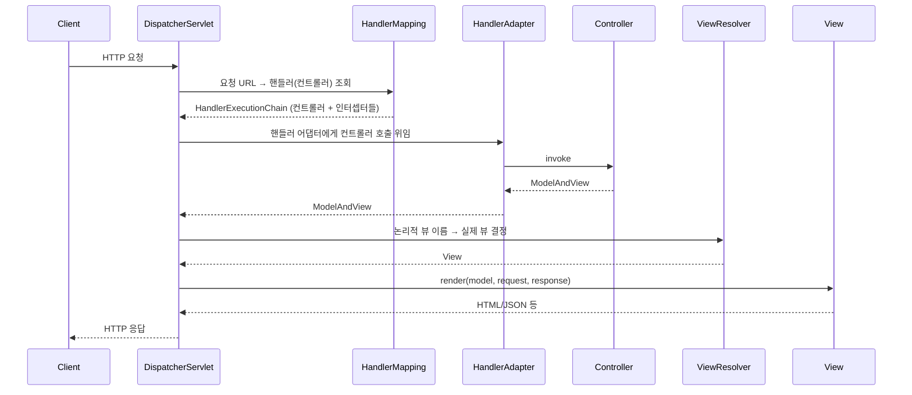
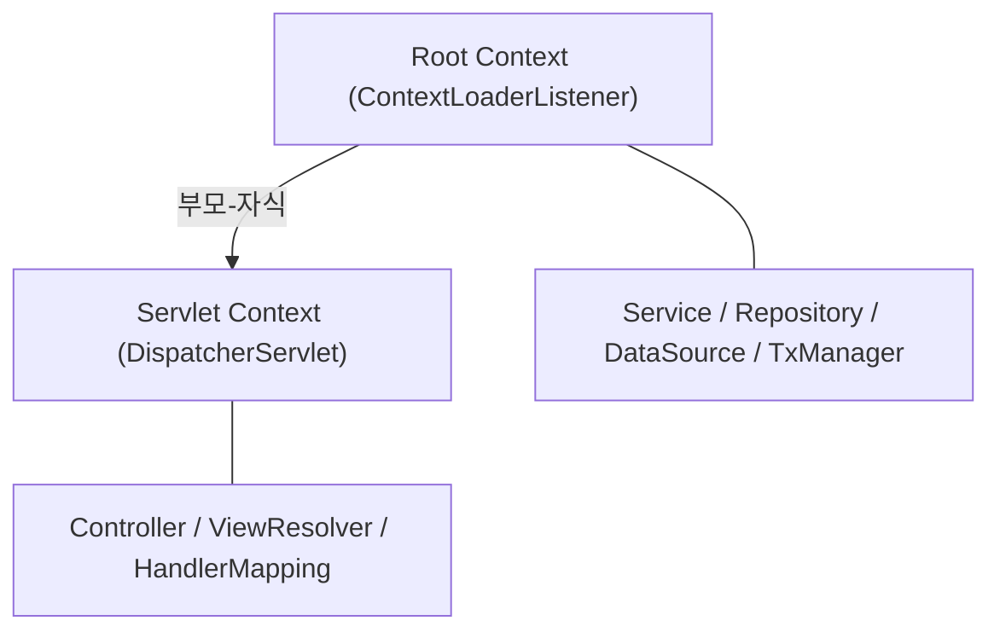
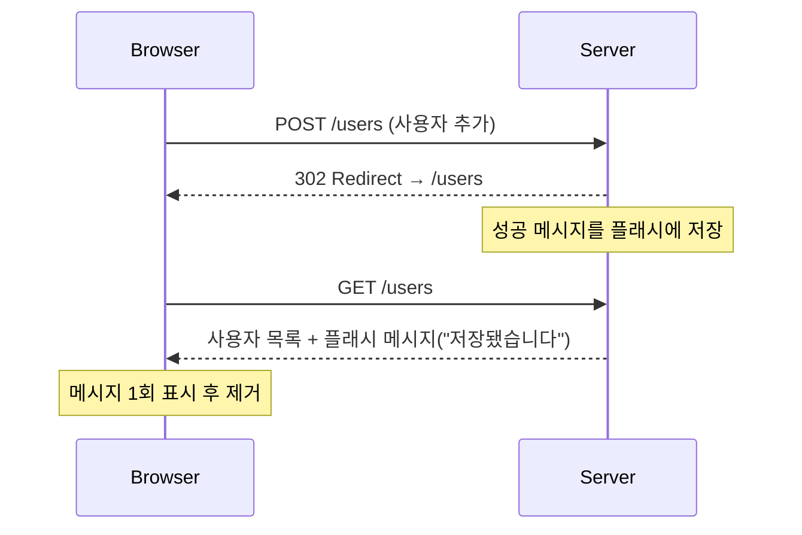

# 3장. 스프링 웹 기술과 스프링 MVC

엔터프라이즈 애플리케이션의 가장 앞단, **사용자/클라이언트와 직접 연동**하는 책임을 지는 계층이 웹 프레젠테이션 계층이다. 자바의 데이터 액세스 기술도 다양하지만 웹 기술의 종류는 그 비교가 안 될 만큼 많고, 새로운 기술이 끊임없이 등장하며 기존 기술도 빠르게 발전한다. 스프링은 이런 변화 잦은 웹 계층과 나머지 계층을 깔끔히 분리해 개발하는 아키텍처를 지지하며, **자체 웹 프레임워크인 스프링 MVC**를 핵심으로 제공한다.

> 3장은 웹 계층 설계 원칙 + 스프링 MVC 전략(웹 프레임워크 선택 → DispatcherServlet → 컨트롤러 → 뷰 → 기타 전략 → 스프링 3.1 신기능)을 다룬다.

---

## 3.1 스프링의 웹 프레젠테이션 계층 기술

### 3.1.1 스프링에서 사용되는 웹 프레임워크의 종류

크게 **세 가지 부류**로 나뉜다.

#### 1) 스프링 웹 프레임워크 (Spring MVC)

- 스프링 자체에 포함된 **표준 웹 MVC 프레임워크**
- 스프링 컨테이너에 가장 자연스럽게 통합 — 빈 DI, AOP, 트랜잭션 등 모든 인프라를 그대로 활용
- DispatcherServlet 기반의 **프론트 컨트롤러 패턴**

#### 2) 스프링 포트폴리오 웹 프레임워크

스프링 팀이 별도로 제공하는 확장 프레임워크.

- **Spring Web Flow**: 페이지 흐름 기반(예약, 결제 같은 다단계 프로세스)
- **Spring Faces**: JSF 통합
- **Spring JavaScript**: 자바스크립트 추상화
- **Spring Roo**: 코드 자동 생성

#### 3) 스프링을 기반으로 두지 않는 웹 프레임워크

- **Struts 2**: 액션 기반, `struts2-spring-plugin`으로 액션을 스프링 빈으로 등록 가능 → DI 활용
- **Tapestry 3, 4**: 컴포넌트 기반, 스프링 연동 가능
- **JSF/Seam**: 순수 JSF는 흔치 않고, JSF 기반 프레임워크인 JBoss Seam과 함께 사용
- 그 외 수십여 종의 자바 웹 프레임워크 — 대부분 스프링과 연동 가능

> **저자의 권고**: 회사 정책상 어쩔 수 없이 다른 웹 프레임워크를 써야 하는 게 아니라면, **스프링 MVC 또는 스프링 MVC 기반 확장 프레임워크를 우선적으로 고려**하라. 스프링답게 스프링의 개발철학과 원칙을 지켜 효과적으로 개발할 수 있는 방법은 결국 스프링이 직접 제공하는 웹 프레임워크다.

### 3.1.2 스프링 MVC와 DispatcherServlet 전략

#### MVC 아키텍처

스프링 MVC는 고전적인 MVC를 웹 환경에 맞게 변형한 모델이다.

- **Model**: 컨트롤러가 만든 데이터(주로 `Map<String, Object>`)
- **View**: 모델 데이터로 화면을 그리는 컴포넌트 (JSP, 템플릿, JSON, PDF 등)
- **Controller**: 요청 처리, 서비스 계층 호출, 모델/뷰 결정
- **DispatcherServlet (Front Controller)**: 모든 요청을 받아 위 세 컴포넌트를 조립·실행하는 **MVC 엔진**

#### DispatcherServlet의 요청 처리 흐름 (7단계)



각 단계는 모두 **DI 가능한 전략 인터페이스**로 분리되어 있어 갈아끼울 수 있다. 이것이 스프링 MVC가 자랑하는 **확장성**의 핵심이다.

#### DI 가능한 7가지 전략 (+ 3.1의 1가지 추가)

| 전략 | 역할 | 디폴트 |
| --- | --- | --- |
| **HandlerMapping** | URL/요청 → 핸들러 결정 | BeanNameUrlHandlerMapping, DefaultAnnotationHandlerMapping |
| **HandlerAdapter** | 핸들러 타입에 맞춰 호출 방식 결정 | 4종 자동 등록 |
| **HandlerExceptionResolver** | 핸들러 실행 중 발생한 예외 처리 | 4종 자동 등록 |
| **ViewResolver** | 논리 뷰 이름 → View 객체 | InternalResourceViewResolver |
| **LocaleResolver** | 지역(언어) 정보 결정 | AcceptHeaderLocaleResolver |
| **ThemeResolver** | 테마(스킨) 결정 | FixedThemeResolver |
| **MultipartResolver** | 파일 업로드 처리 | (등록되지 않음 — 명시적 등록 필요) |
| **FlashMapManager** *(3.1)* | 플래시 어트리뷰트 관리 | SessionFlashMapManager |

> 디폴트 전략으로 충분하면 따로 등록할 필요 없다. 필요할 때만 빈으로 등록해 교체한다.

---

## 3.2 스프링 웹 애플리케이션 환경 구성

### 3.2.1 간단한 스프링 웹 프로젝트 생성

#### 루트 + 서블릿 컨텍스트 (계층 구조)

웹 애플리케이션은 보통 **두 개의 컨텍스트**를 둔다.



- **루트 컨텍스트**: 서비스/리포지토리/DataSource 등 **공유 빈** (웹 외 계층)
- **서블릿 컨텍스트**: 컨트롤러/뷰 리졸버/핸들러 매핑 등 **웹 전용 빈**
- 자식(서블릿)은 부모(루트)의 빈을 참조 가능, 반대는 불가

#### web.xml 표준 설정

```xml
<!-- 루트 컨텍스트 -->
<listener>
  <listener-class>org.springframework.web.context.ContextLoaderListener</listener-class>
</listener>
<context-param>
  <param-name>contextConfigLocation</param-name>
  <param-value>/WEB-INF/applicationContext.xml</param-value>
</context-param>

<!-- 서블릿 컨텍스트 -->
<servlet>
  <servlet-name>spring</servlet-name>
  <servlet-class>org.springframework.web.servlet.DispatcherServlet</servlet-class>
  <load-on-startup>1</load-on-startup>
</servlet>
<servlet-mapping>
  <servlet-name>spring</servlet-name>
  <url-pattern>/app/*</url-pattern>
</servlet-mapping>
```

> 서블릿 이름이 `spring`이면 디폴트 서블릿 컨텍스트 설정파일은 `/WEB-INF/spring-servlet.xml`을 찾는다.

### 3.2.2 스프링 웹 학습 테스트

웹 계층을 **서버에 배치하지 않고도** 단위 테스트하는 전략들.

- **서블릿 목 오브젝트**: `MockHttpServletRequest`, `MockHttpServletResponse`, `MockServletContext`, `MockHttpSession`
- **테스트용 DispatcherServlet 확장**: `ConfigurableDispatcherServlet` — 컨텍스트 클래스/설정파일을 자유롭게 지정
- **AbstractDispatcherServletTest**: 반복되는 초기화 로직을 추상 클래스로 분리한 패턴

> 실 서버에 띄우지 않고도 디스패처 서블릿 전체 흐름을 빠르게 검증할 수 있다.

---

## 3.3 컨트롤러

컨트롤러는 MVC의 세 컴포넌트 중 **가장 많은 책임**을 진다. 비즈니스 로직은 서비스 계층에 위임하더라도, 컨트롤러가 직접 해야 할 작업은 적지 않다.

- 요청 정보 추출 (HttpServletRequest 가공)
- 입력 검증과 변환
- 서비스 계층 호출
- 결과 모델 생성
- 뷰 결정 (또는 리다이렉트)
- 세션/플래시 관리

### 3.3.1 컨트롤러의 종류와 핸들러 어댑터

스프링 MVC가 지원하는 컨트롤러는 **네 가지** 타입이며, 각 타입을 호출해 줄 핸들러 어댑터가 하나씩 있다.

| 컨트롤러 타입 | 핸들러 어댑터 | 디폴트 등록 | 특징 |
| --- | --- | --- | --- |
| `javax.servlet.Servlet` | `SimpleServletHandlerAdapter` | X | 일반 서블릿을 핸들러로 사용 |
| `HttpRequestHandler` | `HttpRequestHandlerAdapter` | O | `handleRequest(req, res)` — 원격 서비스 export 등 |
| `Controller` | `SimpleControllerHandlerAdapter` | O | `handleRequest()` → `ModelAndView` 반환 |
| `@RequestMapping` 메서드 | `AnnotationMethodHandlerAdapter` | O | **가장 많이 쓰임** — 애노테이션 기반 |

> 디폴트 어댑터 3개(`HttpRequestHandlerAdapter`, `SimpleControllerHandlerAdapter`, `AnnotationMethodHandlerAdapter`)는 등록 없이 바로 동작한다. 서블릿 핸들러만 명시적으로 어댑터를 등록해야 한다.

### 3.3.2 핸들러 매핑

요청 정보를 보고 **어떤 컨트롤러를 호출할지** 결정하는 전략. 5가지 기본 구현이 제공된다.

#### BeanNameUrlHandlerMapping *(default)*

- 빈 이름이 URL 형태(`/hello`, `/users/*`)면 그 빈을 매핑
- ANT 패턴 지원: `*`, `**`, `?`
- 단순/직관적이지만 빈 개수가 많아지면 XML이 산만해진다

```xml
<bean name="/s*" class="...Controller"/>
<bean name="/root/**/sub" class="...Controller"/>
```

#### ControllerBeanNameHandlerMapping

- 빈의 **id/name 자체**를 URL로 사용
- 자동으로 빈 id 앞에 `/`를 붙여줌
- `prefix`, `suffix` 지정 가능

```java
@Component("hello")
public class MyController implements Controller { ... }
// → /hello 로 매핑
```

#### ControllerClassNameHandlerMapping

- 빈 **클래스 이름**을 케밥/소문자화해 URL로 매핑
- `HelloController` → `/hello`
- 빈 이름을 따로 짓지 않아도 됨

#### SimpleUrlHandlerMapping

- 매핑 정보를 한 곳에 **정리해서** 등록 — 가장 깔끔
- 운영 환경에 적합

```xml
<bean class="...SimpleUrlHandlerMapping">
  <property name="mappings">
    <props>
      <prop key="/hello">helloController</prop>
      <prop key="/users/*">userController</prop>
    </props>
  </property>
</bean>
```

#### DefaultAnnotationHandlerMapping *(default)*

- `@RequestMapping`을 인식해 자동으로 매핑 정보를 등록
- **실무에서 가장 많이 쓰는 전략**

> 기본적으로 `BeanNameUrlHandlerMapping`과 `DefaultAnnotationHandlerMapping`이 자동 등록되므로 이 둘로 충분하면 추가 등록은 필요 없다.

### 3.3.3 핸들러 인터셉터

컨트롤러 실행 **전후로** 공통 작업을 가로채는 AOP 같은 메커니즘. 단, 트랜잭션처럼 진짜 AOP가 필요한 게 아니라 **웹 요청 한정 부가 기능**(인증 체크, 로깅, 측정)에 적합하다.

```java
public interface HandlerInterceptor {
    boolean preHandle(req, res, handler) throws Exception;
    void postHandle(req, res, handler, ModelAndView mv) throws Exception;
    void afterCompletion(req, res, handler, Exception ex) throws Exception;
}
```

| 메서드 | 시점 | 용도 |
| --- | --- | --- |
| `preHandle` | 컨트롤러 호출 **전** | 인증/권한 체크 (false 반환 시 컨트롤러 호출 안 됨) |
| `postHandle` | 컨트롤러 호출 **후**, 뷰 렌더링 **전** | 모델 후처리 |
| `afterCompletion` | 뷰 렌더링까지 끝난 **뒤** | 자원 정리, 응답 시간 측정 |

```xml
<mvc:interceptors>
  <bean class="myproject.AuthInterceptor"/>
  <mvc:interceptor>
    <mvc:mapping path="/admin/**"/>
    <bean class="myproject.AdminInterceptor"/>
  </mvc:interceptor>
</mvc:interceptors>
```

### 3.3.4 컨트롤러 확장

기본 4종으로 부족하면 직접 컨트롤러 인터페이스 + 어댑터를 만들어 추가할 수 있다. **DispatcherServlet의 전략 패턴이 빛나는 영역**이다.

---

## 3.4 뷰

### 3.4.1 View 인터페이스

```java
public interface View {
    String getContentType();
    void render(Map<String, ?> model, HttpServletRequest req, HttpServletResponse res) throws Exception;
}
```

#### 주요 뷰 종류

| 뷰 클래스 | 용도 |
| --- | --- |
| `InternalResourceView` | 서블릿/JSP를 RequestDispatcher.forward()로 호출 |
| `JstlView` | JSTL 메시지 소스 처리까지 추가 — JSP 표준 |
| `RedirectView` | HTTP 리다이렉트 |
| `VelocityView`, `FreeMarkerView` | 템플릿 엔진 기반 |
| `MarshallingView` | OXM(객체↔XML) 변환 — XML 응답 |
| `AbstractExcelView`, `AbstractJExcelView` | Excel 다운로드 |
| `AbstractPdfView` | PDF 생성 |
| `AbstractAtomFeedView`, `AbstractRssFeedView` | RSS/Atom 피드 |
| `XsltView`, `TilesView`, `AbstractJasperReportsView` | 그 외 |
| `MappingJacksonJsonView` | JSON 응답 — REST API에 자주 사용 |

> 컨트롤러는 **논리적 뷰 이름**(`"hello"`, `"users/list"`)만 돌려주고, 실제 View 객체는 **뷰 리졸버**가 결정한다. 뷰 객체를 직접 ModelAndView에 담아 돌려줄 수도 있다.

### 3.4.2 뷰 리졸버

| 리졸버 | 동작 |
| --- | --- |
| `InternalResourceViewResolver` | `prefix + 뷰이름 + suffix` (예: `/WEB-INF/jsp/hello.jsp`) — **디폴트** |
| `BeanNameViewResolver` | 뷰 이름과 같은 **빈**을 찾아 View로 사용 |
| `VelocityViewResolver`, `FreeMarkerViewResolver` | 템플릿 엔진별 |
| `ResourceBundleViewResolver`, `XmlViewResolver` | 리소스/XML에서 뷰 매핑 |
| `ContentNegotiatingViewResolver` | **클라이언트가 원하는 미디어 타입**(JSON/XML/HTML)에 따라 뷰 선택 |

#### `ContentNegotiatingViewResolver`

REST 응답에서 매우 강력하다. 다음 순서로 미디어 타입을 결정한다.

1. URL 확장자 (`/users.json` → application/json)
2. `format` 파라미터
3. `Accept` 헤더

```xml
<bean class="...ContentNegotiatingViewResolver">
  <property name="mediaTypes">
    <map>
      <entry key="json" value="application/json"/>
      <entry key="xml" value="application/xml"/>
      <entry key="html" value="text/html"/>
    </map>
  </property>
  <property name="viewResolvers">
    <list>
      <bean class="...BeanNameViewResolver"/>
      <bean class="...InternalResourceViewResolver">
        <property name="prefix" value="/WEB-INF/jsp/"/>
        <property name="suffix" value=".jsp"/>
      </bean>
    </list>
  </property>
  <property name="defaultViews">
    <list>
      <bean class="...MappingJacksonJsonView"/>
    </list>
  </property>
</bean>
```

> 강력한 만큼 적용이 까다롭다 — **뷰 종류와 미디어 타입 매트릭스를 먼저 명확히** 정의하고 설정을 만들어야 한다.

---

## 3.5 기타 전략

### 3.5.1 핸들러 예외 리졸버

핸들러(컨트롤러) 실행 중 던져진 예외를 처리해 **사용자에게 보여줄 응답**으로 변환한다. 디폴트로 4개가 등록된다.

| 리졸버 | 처리 대상 |
| --- | --- |
| `AnnotationMethodHandlerExceptionResolver` | `@ExceptionHandler` 메서드로 위임 |
| `ResponseStatusExceptionResolver` | `@ResponseStatus`가 붙은 예외 → HTTP 상태코드 반환 |
| `DefaultHandlerExceptionResolver` | 스프링 표준 예외 → HTTP 상태코드 |
| `SimpleMappingExceptionResolver` | **예외 클래스 → 뷰 이름** 매핑 |

```xml
<bean class="...SimpleMappingExceptionResolver">
  <property name="exceptionMappings">
    <props>
      <prop key="DataAccessException">errors/db</prop>
      <prop key="java.lang.Exception">errors/default</prop>
    </props>
  </property>
  <property name="defaultErrorView" value="errors/default"/>
</bean>
```

### 3.5.2 지역정보 리졸버

다국어 메시지/포매팅을 위해 사용자의 Locale을 결정.

| 구현 | 결정 방식 |
| --- | --- |
| `AcceptHeaderLocaleResolver` *(기본)* | HTTP `Accept-Language` 헤더 |
| `CookieLocaleResolver` | 쿠키에 저장 |
| `SessionLocaleResolver` | 세션에 저장 |
| `FixedLocaleResolver` | 고정값 |

### 3.5.3 멀티파트 리졸버

파일 업로드 처리. **명시적으로 등록**해야 동작한다.

```xml
<bean id="multipartResolver" class="org.springframework.web.multipart.commons.CommonsMultipartResolver">
  <property name="maxUploadSize" value="10485760"/>
</bean>
```

#### `RequestToViewNameTranslator`

컨트롤러가 뷰 이름을 돌려주지 않은 경우, **요청 URL에서 뷰 이름을 추론**한다. 디폴트는 `DefaultRequestToViewNameTranslator` — 예: `/hello.do` → `hello`.

---

## 3.6 스프링 3.1의 MVC

스프링 3.1의 MVC 변화는 대부분 **`@MVC` 애노테이션 기반**(다음 4장)에 집중되어 있다. 이 장에서는 애노테이션 기반이 아닌 곳에서도 적용되는 두 가지 신기능을 다룬다.

### 3.6.1 플래시 맵 매니저 전략

#### 플래시 맵 / 플래시 어트리뷰트란

- **플래시 어트리뷰트(Flash Attribute)**: 한 요청에서 만들어 **다음 요청으로 전달**하는 정보
- HTTP 세션과 달리 **다음 요청에서 한 번 사용되면 바로 제거**된다

#### 사용 시나리오 — Post/Redirect/Get 패턴



POST 직후 **결과 메시지**를 보여주는 페이지로 리다이렉트할 때 주로 사용된다. POST 결과 페이지를 그대로 보여주면 새로고침 시 중복 등록될 위험이 있고, 리다이렉트하면 HTTP 요청이 새로 시작되므로 모델/세션을 통하지 않으면 메시지가 전달되지 않는데, **플래시 어트리뷰트가 정확히 그 간극을 메운다**.

#### `FlashMapManager` 전략 *(스프링 3.1 신규)*

- 디폴트는 `SessionFlashMapManager` — HTTP 세션에 저장
- 플래시 맵에는 여러 어트리뷰트를 담을 수 있고, **사용 가능 URL 조건과 제한시간** 지정 가능
- 컨트롤러에서는 `RedirectAttributes`(@MVC) 또는 `FlashMap` 직접 조작으로 사용

### 3.6.2 WebApplicationInitializer를 이용한 컨텍스트 등록

#### 배경

기존에는 `web.xml`에서 리스너/서블릿/필터를 일일이 등록해야 했다. **서블릿 3.0**부터 `ServletContainerInitializer` SPI가 도입돼, 컨테이너가 시작될 때 사용자 코드를 자동 실행할 수 있게 됐다.

스프링은 이를 활용해 `WebApplicationInitializer` 인터페이스를 제공한다 — **web.xml 없이도** 자바 코드만으로 컨텍스트를 등록할 수 있다.

```java
public class MyWebAppInitializer implements WebApplicationInitializer {
    @Override
    public void onStartup(ServletContext servletContext) {
        // 1) 루트 컨텍스트
        AnnotationConfigWebApplicationContext root = new AnnotationConfigWebApplicationContext();
        root.register(AppConfig.class);
        servletContext.addListener(new ContextLoaderListener(root));

        // 2) 서블릿 컨텍스트
        AnnotationConfigWebApplicationContext sac = new AnnotationConfigWebApplicationContext();
        sac.register(WebConfig.class);
        ServletRegistration.Dynamic dispatcher =
            servletContext.addServlet("spring", new DispatcherServlet(sac));
        dispatcher.setLoadOnStartup(1);
        dispatcher.addMapping("/app/*");
    }
}
```

#### 장점

- web.xml의 **모든 등록 항목을 자바 코드로 대체** 가능 (필터/리스너 포함)
- XML의 문자열 클래스명 제약을 벗고 **컴파일 타입 검증** 활용
- IDE 지원, 리팩터링 안전

#### 주의

- `web.xml`을 함께 사용할 때는 `<web-app>` 루트의 `version="3.0"` 이상이어야 한다
- 루트 컨텍스트 종료 시점 자원 회수를 위해 **여전히 `ContextLoaderListener` 사용을 권장**

> 이 두 기능은 **3.1의 자바 코드 기반 설정 흐름**의 마지막 퍼즐이다. `@Configuration` + `AnnotationConfigWebApplicationContext` + `WebApplicationInitializer` 조합이면 web.xml을 거의 완전히 떼어낼 수 있다.

---

## 3.7 정리

3장에서는 스프링 애플리케이션의 웹 프레젠테이션 계층에 사용할 수 있는 **기술의 종류**와, 스프링이 내장한 핵심 웹 기술인 **스프링 서블릿/MVC의 활용 전략**을 살펴봤다. 스프링 MVC는 뛰어난 유연성과 확장 포인트를 제공한다 — 세 가지 핵심 컴포넌트(컨트롤러, 모델, 뷰)와 이를 엮어주는 MVC 엔진 DispatcherServlet에서 사용할 수 있는 다양한 전략이 제공되며, 새로운 전략을 만들어 적용할 수도 있다.

### 3장 핵심 정리

- 스프링 애플리케이션의 웹 계층에는 **스프링 MVC, 스프링 포트폴리오 웹, 서드파티 웹 프레임워크**를 모두 사용할 수 있다. 단, 웹 계층과 나머지 계층 간의 의존관계를 제거하고 독립적으로 개발해야 한다.
- 웹 계층의 테스트도 **적절한 목 오브젝트**를 사용하면 서버에 배치하지 않고 자동으로 실행 가능한 단위 테스트로 작성할 수 있다.
- 스프링 MVC의 핵심 엔진인 `DispatcherServlet`은 **7가지 종류의 전략**을 제공한다. 각 전략은 빈으로 등록·설정해 사용하며, 직접 등록하지 않으면 디폴트 전략 구성을 활용한다.
- 컨트롤러는 여러 가지 방식으로 개발할 수 있다. 핸들러 어댑터를 함께 만들면 새로운 컨트롤러 타입을 추가할 수도 있다.
- **핸들러 매핑**은 다양한 전략을 통해 요청정보와 이를 처리하는 컨트롤러를 연결해준다.
- **핸들러 인터셉터**는 컨트롤러를 실행하기 전후에 적용할 부가기능을 만들 때 사용한다.
- **뷰 리졸버**는 컨트롤러가 리턴한 논리적인 뷰 이름을 이용해 뷰 오브젝트를 찾아준다.
- **핸들러 예외 리졸버**를 이용하면 애플리케이션에서 발생한 예외를 처리하는 방법을 지정해줄 수 있다.
- 스프링 **3.1**에는 **플래시 맵 매니저** 전략이 추가됐고, **WebApplicationInitializer**를 이용해 컨텍스트 생성과 등록을 위한 초기화 코드를 자바로 작성할 수 있다.

> 스프링 MVC는 단순한 프레임워크가 아니라 **전략 패턴이 잘 적용된 MVC 엔진**이다. 디폴트 구성으로 빠르게 시작할 수 있되, 어떤 전략이든 갈아끼워 확장할 수 있다는 점을 기억해두면 4장의 `@MVC`를 훨씬 깊게 이해할 수 있다.
