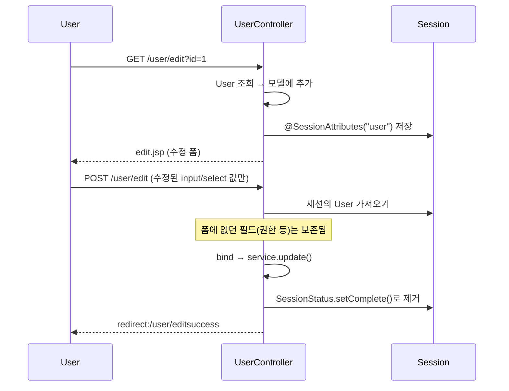
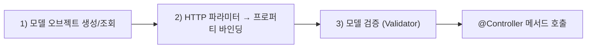
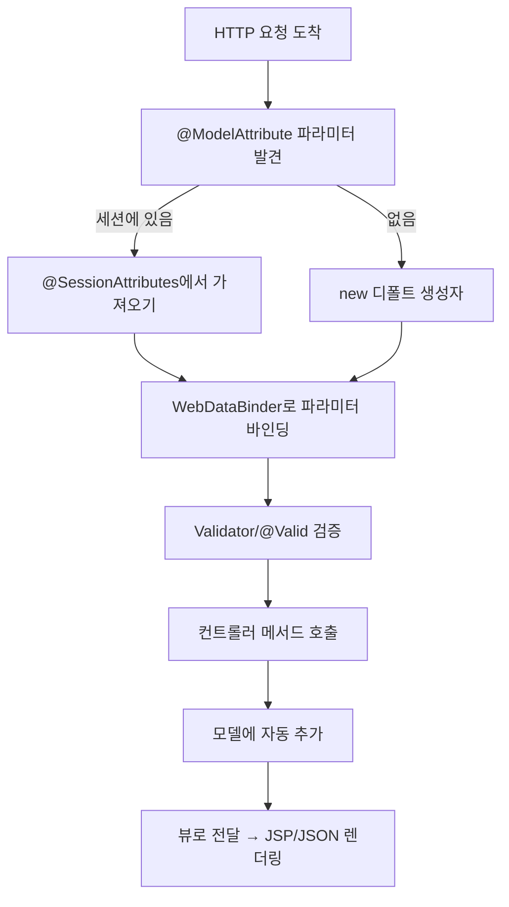
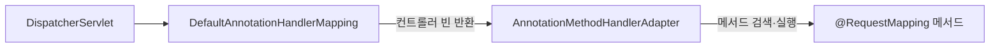

# 4장. 스프링 @MVC

스프링은 `DispatcherServlet`과 7가지 전략을 기반으로 한 MVC 프레임워크를 제공한다. 그중 가장 혁신적인 발전은 **스프링 2.5에서 처음 도입돼 3.0에서 한층 강화된 애노테이션 기반 MVC** — **@MVC**다. 애노테이션이라는 자바 언어의 특징과 **CoC(Convention over Configuration)** 스타일의 관례를 적극 도입한 덕분에 컨트롤러 코드가 매우 간결해졌다.

> @MVC는 스프링 3.0에서 기존의 `Controller` 인터페이스 기반 클래스들을 대부분 대체했다. 하지만 `DispatcherServlet`의 기본 전략구조는 그대로이므로 기존 전략을 활용하거나 커스텀 전략을 만들어 사용할 수 있다는 사실은 변하지 않았다.

---

## 4.1 @RequestMapping 핸들러 매핑

### 4.1.1 클래스/메소드 결합 매핑정보

`@RequestMapping`은 **타입(클래스/인터페이스)** 과 **메서드** 양쪽에 부착할 수 있다. 두 위치의 매핑정보가 결합되는 방식은 네 가지로 분류된다.

#### 1) 타입 레벨 + 메서드 레벨 매핑 결합 *(가장 일반적)*

```java
@Controller
@RequestMapping("/user")
public class UserController {
    @RequestMapping("/list")
    public String list() { ... }   // → /user/list

    @RequestMapping(value = "/edit", method = RequestMethod.POST)
    public String edit() { ... }   // → POST /user/edit
}
```

#### 2) 메서드 레벨 단독 매핑

타입 레벨에는 `@RequestMapping`이 없고 메서드 레벨에만 있는 경우. 메서드 레벨 매핑이 그대로 사용된다.

#### 3) 타입 레벨 단독 매핑

타입에만 `@RequestMapping("/user")`이 있고 메서드에 없는 경우. 클래스의 모든 메서드가 `/user` URL의 핸들러로 동작 가능 — 보통 메서드 레벨에 `method`/`params`/`headers`로 분기.

#### 4) 인터페이스 레벨 매핑

```java
@RequestMapping("/user")
public interface Intf {
    @RequestMapping("/list") String list();
}

public class Impl implements Intf {
    public String list() { ... }   // → /user/list
}
```

### 4.1.2 타입 상속과 매핑

상속 시 `@RequestMapping`이 어떻게 전달되는지가 헷갈릴 수 있다.

| 케이스 | 결과 |
| --- | --- |
| 슈퍼클래스에만 매핑이 있고 서브클래스가 그대로 상속 | 그대로 상속 |
| 서브클래스에서 메서드를 **오버라이드**(매핑은 안 붙임) | 슈퍼클래스의 매핑이 그대로 상속 |
| 슈퍼 타입 레벨 + 서브 메서드 레벨 결합 | 결합돼 새 매핑 생성 |
| 인터페이스 레벨 매핑을 구현 클래스가 구체화 | 결합되어 적용 |

> 매핑 결합은 URL뿐 아니라 HTTP 메서드, 파라미터에도 적용된다. **제네릭스와 매핑 상속을 활용**하면 공통 컨트롤러 베이스를 만들어 코드 재사용도 가능하다.

---

## 4.2 @Controller

`@Controller`는 스프링 2.5부터 도입된 **애노테이션 기반 컨트롤러**다. 특별한 인터페이스 구현이 필요 없고, 메서드 시그니처와 리턴 타입을 매우 자유롭게 가져갈 수 있다는 점이 강력하다.

### 4.2.1 메서드 파라미터의 종류

`@RequestMapping` 메서드는 다양한 타입의 파라미터를 자동으로 받을 수 있다. 스프링이 **리플렉션으로 시그니처를 분석**해 적절한 값을 채워준다.

#### 서블릿 API / 표준 객체

| 파라미터 타입 | 용도 |
| --- | --- |
| `HttpServletRequest`, `HttpServletResponse` | 서블릿 요청/응답 |
| `HttpSession` | HTTP 세션 |
| `WebRequest`, `NativeWebRequest` | 서블릿/포틀릿에 종속되지 않는 추상 요청 |
| `Locale` | 사용자 지역 |
| `InputStream`/`Reader`, `OutputStream`/`Writer` | 요청 본문 직접 읽기/응답 본문 직접 쓰기 |
| `Principal` | 보안 컨텍스트의 인증 사용자 |

#### 애노테이션으로 의미 부여

| 애노테이션 | 의미 | 예시 |
| --- | --- | --- |
| `@PathVariable` | URI 템플릿 변수 | `/user/view/{id}` → `@PathVariable("id") int id` |
| `@RequestParam` | 단일 요청 파라미터 | `@RequestParam(value="id", required=false, defaultValue="-1") int id` |
| `@CookieValue` | HTTP 쿠키 값 | `@CookieValue("JSESSIONID") String session` |
| `@RequestHeader` | HTTP 헤더 값 | `@RequestHeader("User-Agent") String ua` |
| `@RequestBody` | HTTP 요청 본문 → 객체 변환 | JSON/XML 입력 처리 |
| `@ModelAttribute` | 모델 바인딩 (폼 객체) | 4.3 참조 |
| `@Valid` | 바인딩 후 검증 수행 | JSR-303 |
| `@Value` | 프로퍼티 값 주입 | `@Value("${admin.email}") String email` |

> `@RequestParam`은 다중으로 받을 수 있고, `Map<String, String>`으로 모든 파라미터를 한 번에 받을 수도 있다. 디버그 정보가 보존된 빌드면 단순 타입은 애노테이션을 **생략**해도 된다 — 다만 명시 권장.

#### 모델/검증 관련

| 파라미터 | 용도 |
| --- | --- |
| `Map`, `Model`, `ModelMap` | 컨트롤러가 모델에 데이터 추가 |
| `@ModelAttribute User user` | 폼 파라미터를 객체에 바인딩 |
| `Errors`, `BindingResult` | 바인딩/검증 결과 (반드시 `@ModelAttribute` **바로 뒤**에 위치) |
| `SessionStatus` | `@SessionAttributes` 세션 작업 완료 알림 |

### 4.2.2 리턴 타입의 종류

리턴 타입도 매우 자유롭다.

| 리턴 타입 | 의미 |
| --- | --- |
| `ModelAndView` | 모델 + 뷰 이름 직접 지정 (전통적) |
| `String` | 뷰 이름 — 모델은 자동 누적 |
| `void` | 뷰 이름은 `RequestToViewNameTranslator`가 추론 (또는 응답을 직접 작성) |
| 모델 오브젝트(임의 객체) | 자동으로 모델에 추가 + 뷰 이름 자동 생성 |
| `Map`/`Model`/`ModelMap` | 모델만 반환 — 뷰 이름은 자동 |
| `View` | 뷰 객체 직접 반환 |
| `@ResponseBody`가 붙은 객체 | 메시지 컨버터로 응답 본문 작성 (REST API) |

#### 자동 추가 모델 / 자동 생성 뷰 이름

- `@ModelAttribute` 파라미터, 메서드의 모델 객체 리턴값은 **자동으로 모델에 누적**
- `void`/`Map` 리턴 시 `RequestToViewNameTranslator`가 URL → 뷰 이름 변환 (`/user/list` → `user/list`)

### 4.2.3 @SessionAttributes와 SessionStatus

여러 페이지에 걸친 폼 처리(위자드, 수정 등)에서 **모델 객체를 세션에 유지**하고 싶을 때 사용한다.

#### 사용 시나리오 — 사용자 정보 수정



#### 핵심 동기

폼에 출력되지 않은 필드(권한, 가입일 등)는 POST에 포함되지 않는다. 매번 DB에서 다시 읽어오거나 hidden 필드로 숨기는 대신, **세션에 원본을 보관**해두면 폼에서 변경된 필드만 덮어쓰는 방식으로 안전하게 합쳐진다.

```java
@Controller
@SessionAttributes("user")
public class UserController {
    @RequestMapping(value = "/user/edit", method = GET)
    public User form(@RequestParam int id) { return userService.get(id); }

    @RequestMapping(value = "/user/edit", method = POST)
    public String submit(@ModelAttribute User user, SessionStatus status) {
        userService.update(user);
        status.setComplete();   // 세션에서 제거
        return "redirect:/user/editsuccess";
    }
}
```

> 도메인 중심 모델을 유지하려면 **세션 기반 상태 유지**가 필요하다. 그 핵심이 `@SessionAttributes`. 잊지 말 것: **`SessionStatus.setComplete()`** 를 호출해야 세션에서 객체가 제거된다.

---

## 4.3 모델 바인딩과 검증

`@ModelAttribute` 파라미터가 등장하면 컨트롤러 메서드에 들어오기 전 **세 가지 작업**이 자동 진행된다.



1. **모델 객체 준비** — 디폴트 생성자로 새로 만들거나, `@SessionAttributes`로 저장된 것을 가져온다
2. **파라미터 바인딩** — HTTP 문자열 파라미터를 프로퍼티 타입에 맞게 변환·주입
3. **검증** — `Validator`/`@Valid`로 값 검사

바인딩 실패는 `BindingResult`(=`Errors` 서브타입)에 누적되어 컨트롤러로 전달된다.

### 4.3.1 PropertyEditor

스프링 1.x부터 사용된 **타입 변환** API. `java.beans.PropertyEditor` 표준을 활용한다.

#### 디폴트 프로퍼티 에디터

문자열 ↔ 기본 타입(int, long, BigDecimal, Boolean, …) 변환은 자동 등록.

#### 커스텀 프로퍼티 에디터

도메인 타입(예: `Code`, `Money`)을 직접 지원하려면 `PropertyEditorSupport`를 확장한다.

```java
public class CodePropertyEditor extends PropertyEditorSupport {
    @Override public void setAsText(String text) {
        setValue(codeService.get(text));
    }
}
```

#### `@InitBinder`

컨트롤러별로 `WebDataBinder`에 커스텀 에디터를 등록.

```java
@InitBinder
public void initBinder(WebDataBinder binder) {
    binder.registerCustomEditor(Code.class, new CodePropertyEditor());
}
```

#### `WebBindingInitializer`

전역 바인딩 설정. `AnnotationMethodHandlerAdapter` (또는 3.1의 `RequestMappingHandlerAdapter`)에 주입.

#### 프로토타입 빈 프로퍼티 에디터 *(스테이트풀 처리)*

`PropertyEditor`는 변환 과정에서 상태를 가질 수 있어 **싱글톤으로 공유 불가**. 프로토타입 빈으로 등록하고 `@InitBinder`에서 매번 가져와 새 인스턴스를 생성·등록한다.

```java
@Inject
private Provider<CodePropertyEditor> codeEditorProvider;

@InitBinder
public void initBinder(WebDataBinder binder) {
    binder.registerCustomEditor(Code.class, codeEditorProvider.get());
}
```

> 프로퍼티 에디터의 근본적 문제: 변환할 때마다 새 객체를 만들어야 하고, 싱글톤이 아니므로 빈으로 안전하게 공유할 수 없다는 점. 그래서 스프링 3.0이 **`Converter`** 를 도입했다.

### 4.3.2 Converter와 Formatter

#### `Converter<S, T>`

```java
public interface Converter<S, T> {
    T convert(S source);
}
```

- **변환 과정에서 상태를 갖지 않음** → 멀티스레드 환경에서 안전하게 빈으로 공유 가능
- 스프링 3.0의 새로운 타입 변환 API

#### `ConversionService`

여러 `Converter`를 모아 통합 변환을 제공. 스프링 3.0+에서는 디폴트 구성으로 등록된다.

#### `Formatter<T>` & `FormattingConversionService`

`Converter` + 출력용 포맷팅 + Locale 인식.

```java
public interface Formatter<T> {
    String print(T object, Locale locale);
    T parse(String text, Locale locale) throws ParseException;
}
```

- 날짜/숫자 포맷팅, `@DateTimeFormat`, `@NumberFormat` 등에 사용

#### 적용 우선순위

```
@InitBinder 등록 PropertyEditor
       ↓
WebBindingInitializer 등록 PropertyEditor
       ↓
ConversionService (Converter/Formatter)
       ↓
디폴트 PropertyEditor
```

> 신규 프로젝트에선 `Converter`/`Formatter` 위주로 가고, 레거시 컨버전이 필요할 때만 `PropertyEditor`를 추가한다.

### 4.3.3 WebDataBinder 설정 항목

| 항목 | 의미 |
| --- | --- |
| `allowedFields` | 바인딩 허용 필드 화이트리스트 |
| `disallowedFields` | 바인딩 금지 필드 블랙리스트 (보안: 권한/잔액 같은 민감 필드) |
| `requiredFields` | 필수 입력 필드 |
| `fieldMarkerPrefix` (기본 `_`) | 체크박스/멀티셀렉트 누락 보정용 hidden 필드 prefix |
| `fieldDefaultPrefix` (기본 `!`) | 디폴트 값 prefix |

> **보안상 매우 중요**: `User` 같은 도메인 객체에 `role` 같은 민감 필드가 있다면 반드시 `disallowedFields`로 막거나 별도 DTO 사용. 안 막으면 폼 변조로 권한 상승이 가능하다.

### 4.3.4 Validator와 BindingResult, Errors

#### `Validator`

```java
public interface Validator {
    boolean supports(Class<?> clazz);
    void validate(Object target, Errors errors);
}
```

```java
public class UserValidator implements Validator {
    @Override public boolean supports(Class<?> clazz) {
        return User.class.isAssignableFrom(clazz);
    }
    @Override public void validate(Object target, Errors errors) {
        ValidationUtils.rejectIfEmpty(errors, "name", "name.required");
        User u = (User) target;
        if (u.getEmail() != null && !u.getEmail().contains("@"))
            errors.rejectValue("email", "email.invalid");
    }
}
```

#### JSR-303 빈 검증

```java
public class User {
    @NotEmpty String name;
    @Email String email;
    @Min(0) int age;
}
```

```java
public String submit(@Valid @ModelAttribute User user, BindingResult br) {
    if (br.hasErrors()) return "user/edit";
    ...
}
```

- Hibernate Validator가 사실상 표준 구현
- `@Valid`로 자동 검증 트리거 — `MethodArgumentNotValidException`은 4.x 변경점이 있지만 3.1 시점엔 `BindingResult`로 처리

#### `BindingResult`/`Errors`/`MessageCodeResolver`/`MessageSource`

- 검증 오류는 `BindingResult`에 누적
- 오류 코드는 `MessageCodeResolver`가 단계별로 풀어줌 (`name.required.user.name` → `name.required.name` → `name.required` → 디폴트)
- `MessageSource`(messages.properties)에서 사용자에게 보여줄 메시지로 변환

### 4.3.5 모델의 일생



> 모델은 **요청 도착 → 컨트롤러 → 뷰**까지 일관된 흐름으로 흘러간다. 이 흐름을 정확히 알아야 폼·검증·세션 사용에서 사고가 안 난다.

---

## 4.4 JSP 뷰와 form 태그

### 4.4.1 EL과 spring 태그 라이브러리를 이용한 모델 출력

| 출력 방식 | 예 |
| --- | --- |
| **JSP EL** | `${user.name}` |
| **스프링 SpEL** *(JSP에서 직접 평가하진 않지만 빈/뷰에 활용)* | `#{user.name + ' (' + user.age + ')'}` |
| **`<spring:message>`** | 지역화 메시지 |

```jsp
<%@ taglib prefix="spring" uri="http://www.springframework.org/tags" %>
<spring:message code="greeting" arguments="${user.name}" text="Hi"/>
```

- `MessageSource` 빈이 등록되어 있어야 한다
- `LocaleResolver`가 결정한 Locale에 맞춰 messages_ko.properties 등에서 검색

### 4.4.2 spring 태그 라이브러리를 이용한 폼 작성

#### 단일 폼 모델

스프링은 등록과 수정 폼을 **구분하지 않고**, 항상 모델 객체를 폼에 미리 출력하는 방식을 사용한다. 빈 객체든 기존 데이터든 동일하게 처리되어 코드 중복이 사라진다.

#### `<spring:bind>` & `BindingStatus`

```jsp
<spring:bind path="user.name">
  <input name="${status.expression}" value="${status.value}"/>
  <c:if test="${status.error}">
    <span class="err">${status.errorMessage}</span>
  </c:if>
</spring:bind>
```

### 4.4.3 form 태그 라이브러리

`<spring:bind>`를 더 간결하게 한 **HTML 폼 전용 태그**.

```jsp
<%@ taglib prefix="form" uri="http://www.springframework.org/tags/form" %>

<form:form modelAttribute="user" method="post">
  <form:label path="name">이름</form:label>
  <form:input path="name"/>
  <form:errors path="name" cssClass="err"/>

  <form:password path="password"/>
  <form:textarea path="memo"/>
  <form:checkbox path="agree"/>
  <form:checkboxes path="hobbies" items="${hobbyList}"/>
  <form:radiobuttons path="gender" items="${genderList}"/>
  <form:select path="country" items="${countryList}"/>
  <form:hidden path="id"/>

  <input type="submit"/>
</form:form>
```

- `path` 속성으로 모델 프로퍼티에 자동 바인딩
- 검증 오류, 이전 입력값 복구가 자동 처리됨
- 커스텀 UI 태그도 만들 수 있다

---

## 4.5 메시지 컨버터와 AJAX

### 4.5.1 메시지 컨버터의 종류

`@RequestBody`/`@ResponseBody`는 **HTTP 본문 ↔ 객체** 변환을 메시지 컨버터에 맡긴다. JSON/XML 기반 REST API에 핵심.

| 컨버터 | 미디어 타입 | 객체 타입 | 디폴트 등록 |
| --- | --- | --- | --- |
| `ByteArrayHttpMessageConverter` | `*/*` | `byte[]` | O |
| `StringHttpMessageConverter` | `*/*` | `String` | O |
| `FormHttpMessageConverter` | `application/x-www-form-urlencoded` | `MultiValueMap<String,String>` | O |
| `SourceHttpMessageConverter` | `application/xml`, `text/xml`, `application/*+xml` | `javax.xml.transform.Source` | O |
| `Jaxb2RootElementHttpMessageConverter` | XML | `@XmlRootElement` 클래스 | (라이브러리 있을 때) |
| `MappingJacksonHttpMessageConverter` | JSON | 임의 객체 | (Jackson 있을 때) |
| `MarshallingHttpMessageConverter` | XML | OXM 마샬링 객체 | X |
| `AtomFeedHttpMessageConverter`, `RssChannelHttpMessageConverter` | Atom/RSS | Rome 객체 | X |

#### REST 컨트롤러 패턴

```java
@RequestMapping(value = "/users", method = POST,
                consumes = MediaType.APPLICATION_JSON_VALUE,
                produces = MediaType.APPLICATION_JSON_VALUE)
@ResponseBody
public UserDto create(@RequestBody UserDto dto) {
    return userService.create(dto);
}
```

> POST/PUT 요청은 본문이 있으므로 `@RequestBody`, GET은 `@RequestParam`/`@ModelAttribute`. 응답에 `@ResponseBody`를 붙이면 뷰가 아닌 메시지 컨버터로 직접 응답 본문 작성.

---

## 4.6 MVC 네임스페이스

`<mvc:*>` 태그는 @MVC 인프라 빈을 한 줄로 등록·구성한다.

| 태그 | 역할 |
| --- | --- |
| `<mvc:annotation-driven/>` | `RequestMappingHandlerMapping`, `RequestMappingHandlerAdapter`, 메시지 컨버터, `Validator`, `ConversionService` 등 **@MVC 인프라 빈을 일괄 등록** |
| `<mvc:interceptors>` | 핸들러 인터셉터 등록 (URL 패턴 한정 가능) |
| `<mvc:view-controller path="/" view-name="home"/>` | 컨트롤러 클래스 없이 URL → 뷰 이름 매핑 |
| `<mvc:resources/>` | 정적 리소스 핸들러 |
| `<mvc:default-servlet-handler/>` | 디폴트 서블릿으로 fallback |

> 실무에서 `<mvc:annotation-driven/>` 한 줄이면 사실상 **@MVC가 다 켜진다**. 세부 커스터마이징이 필요할 때만 직접 빈을 정의.

---

## 4.7 @MVC 확장 포인트

### 4.7.1 `AnnotationMethodHandlerAdapter`

3.0까지의 @MVC 핸들러 어댑터. 다음 프로퍼티들을 통해 확장한다.

| 프로퍼티 | 용도 |
| --- | --- |
| `sessionAttributeStore` | `@SessionAttributes` 저장소 — 세션 외 다른 저장소(예: 쿠키)로 교체 가능 |
| `webArgumentResolvers` | 커스텀 메서드 파라미터 타입 처리 |
| `modelAndViewResolvers` | 커스텀 리턴 타입 처리 |
| `messageConverters` | 메시지 컨버터 직접 등록 |
| `customArgumentResolvers` | 추가 인자 리졸버 |

> 표준 파라미터/리턴 타입으로 부족할 때 — 예: 인증 사용자(`@AuthUser User user`) 같은 커스텀 어노테이션 — `WebArgumentResolver`로 손쉽게 확장된다.

---

## 4.8 URL과 리소스 관리

### 4.8.1 `<mvc:default-servlet-handler/>` — URL 매핑 문제 해결

#### 디폴트 서블릿과 URL 매핑 문제

`DispatcherServlet`을 `/`(루트)에 매핑하면 `*.css`, `*.js`, 이미지 등 **정적 리소스 요청까지 가로챈다**. 결과적으로 정적 파일을 못 찾는 문제가 발생.

#### 해결책

```xml
<mvc:default-servlet-handler/>
```

- `DispatcherServlet`이 처리할 핸들러를 못 찾으면 **WAS의 디폴트 서블릿**으로 forward
- 정적 리소스는 디폴트 서블릿이 처리, 동적 요청만 컨트롤러로

### 4.8.2 `<mvc:resources/>` — 리소스 관리

```xml
<mvc:resources mapping="/resources/**" location="/, classpath:/static/"
               cache-period="31556926"/>
```

- 클래스패스/파일시스템 등 다양한 위치를 리소스 루트로 노출
- 캐시 헤더(`Cache-Control`, `Last-Modified`) 자동 처리
- jar 안의 정적 리소스도 그대로 서빙

---

## 4.9 스프링 3.1의 @MVC

3.1에서는 **@MVC 핸들러 매핑/어댑터 전략을 통째로 새로 구현**해 기존의 구조적 한계를 해소했다. 기존 전략과 새 전략은 공존 가능하지만, 신규 프로젝트는 새 전략을 쓰는 것이 정석이다.

### 4.9.1 새로운 RequestMapping 전략 — 등장 배경

#### 기존 구조의 불일치

3.0까지의 구조는 다음과 같았다.



핸들러 매핑이 **빈(컨트롤러)** 까지만 찾고, 실제 호출할 **메서드 결정은 어댑터**가 한다. 그 결과:

- 핸들러 매핑이 매핑을 깔끔하게 마무리하지 못하고, 어댑터가 어댑터답지 못한 매핑 작업을 떠안음
- `HandlerInterceptor`가 어떤 메서드가 호출될지 모르고 `preHandle`이 동작
- 책임/역할이 엉성하게 얽혀 확장이 어려움
- 리플렉션 API 직접 사용으로 코드가 지저분

#### 핵심 변화: `HandlerMethod`

새 전략에서는 **메서드 자체를 핸들러 단위**로 추상화한 `HandlerMethod`를 도입했다. 핸들러 매핑이 `HandlerMethod`를 반환 → 어댑터는 그것을 그대로 호출.

| 구버전 | 신버전 |
| --- | --- |
| `DefaultAnnotationHandlerMapping` | **`RequestMappingHandlerMapping`** |
| `AnnotationMethodHandlerAdapter` | **`RequestMappingHandlerAdapter`** |
| `AnnotationMethodHandlerExceptionResolver` | **`ExceptionHandlerExceptionResolver`** |

> 이 전환의 효과: 핸들러 인터셉터에서도 호출될 정확한 메서드를 알 수 있고, 매핑/실행 책임이 깔끔하게 분리된다.

### 4.9.2 `RequestMappingHandlerMapping` — 요청 조건의 결합 방식

`@RequestMapping`이 표현 가능한 6가지 요청 조건과 결합 방식을 알아두면 매핑 충돌·헷갈림이 사라진다.

| 조건 | 엘리먼트 | 결합 방식 |
| --- | --- | --- |
| URL 패턴 | `value` | AND (타입 + 메서드 결합) |
| HTTP 메서드 | `method` | AND |
| 파라미터 | `params` | AND (모든 조건 만족) |
| 헤더 | `headers` | AND |
| `Content-Type` | `consumes` | OR (한 가지만 일치하면 OK), 메서드 조건이 있으면 **타입 조건 무시(오버라이드)** |
| `Accept` | `produces` | OR, 메서드 조건이 있으면 타입 조건 무시 |

> `consumes`/`produces`는 다른 조건과 **결합 방식이 다르다** — 메서드에 지정되어 있으면 클래스 조건은 무시된다. 클래스에 `consumes={"application/xml", "application/x-www-form-urlencoded"}`가 있고 메서드에 `consumes={"multipart/form-data", "application/json"}`이 있다면 메서드 것만 적용.

### 4.9.3 `RequestMappingHandlerAdapter` — 파라미터 타입과 확장 포인트

#### 파라미터 / 리턴 타입 처리

3.0의 `WebArgumentResolver`/`ModelAndViewResolver` 대신 **`HandlerMethodArgumentResolver`** / **`HandlerMethodReturnValueHandler`** SPI로 통일.

```java
public interface HandlerMethodArgumentResolver {
    boolean supportsParameter(MethodParameter parameter);
    Object resolveArgument(MethodParameter parameter, ModelAndViewContainer mavContainer,
                           NativeWebRequest webRequest, WebDataBinderFactory binderFactory) throws Exception;
}
```

#### 확장 포인트

- `argumentResolvers`/`customArgumentResolvers`
- `returnValueHandlers`/`customReturnValueHandlers`
- `messageConverters`
- `webBindingInitializer`

### 4.9.4 `@EnableWebMvc`와 `WebMvcConfigurationSupport`를 이용한 @MVC 설정

XML의 `<mvc:annotation-driven/>`을 자바 코드로 대체하는 두 가지 방법.

#### 방법 1) `@EnableWebMvc` + `WebMvcConfigurer` *(권장)*

```java
@Configuration
@EnableWebMvc
public class WebConfig extends WebMvcConfigurerAdapter {

    @Override
    public void addInterceptors(InterceptorRegistry registry) {
        registry.addInterceptor(new AuthInterceptor());
    }

    @Override
    public void configureMessageConverters(List<HttpMessageConverter<?>> converters) {
        converters.add(new MappingJacksonHttpMessageConverter());
    }

    @Bean
    public InternalResourceViewResolver viewResolver() {
        InternalResourceViewResolver r = new InternalResourceViewResolver();
        r.setPrefix("/WEB-INF/views/");
        r.setSuffix(".jsp");
        return r;
    }
}
```

- `@EnableWebMvc`가 기본 @MVC 인프라 빈을 등록
- `WebMvcConfigurer` (또는 `WebMvcConfigurerAdapter`)로 콜백 메서드만 오버라이드해 추가 설정
- 여러 `WebMvcConfigurer` 빈을 등록해 **설정 분할** 가능 (보안용, 인터셉터용, 매핑용 등)

#### 방법 2) `WebMvcConfigurationSupport` 상속 *(고급)*

```java
@Configuration
public class WebConfig extends WebMvcConfigurationSupport {
    @Override
    public RequestMappingHandlerMapping requestMappingHandlerMapping() {
        // 기본 전략을 직접 커스터마이징
        return super.requestMappingHandlerMapping();
    }
}
```

- `@EnableWebMvc`가 등록하는 모든 전략 빈을 직접 정의·오버라이드
- **상당히 강력한 만큼 위험** — 잘못 만들면 기본 @MVC 전략 구성을 망가뜨릴 수 있다
- 사용 전 `WebMvcConfigurationSupport`의 내용을 잘 살펴보자

#### @MVC 전략용 설정 빈 등록

`WebMvcConfigurer`로는 등록되지 않는 일부 빈(예: `InternalResourceViewResolver`)은 그냥 `@Bean` 메서드로 직접 등록한다. 뷰/뷰 리졸버/지역정보/멀티파트/메시지 소스처럼 서블릿 컨텍스트에 **빈 형태**로 있어야 하는 것들이 해당.

---

## 4.10 정리

4장에서는 최신 스프링 웹 기술인 **애노테이션 기반의 @MVC 기술**을 살펴봤다. 스프링이 제공하는 기능 대부분이 그렇듯이 **@MVC도 극한의 유연성과 확장성**을 얻을 수 있게 설계됐다. 그 덕분에 웹 프레젠테이션 계층의 다양한 기술 조합과 활용 방법을 충족할 수 있으면서, 동시에 **재사용 가능하도록 기능별로 분리된 기능과 확장 포인트**를 잘 활용해서 최적화된 간결한 코드로 웹 계층을 개발할 수 있다.

### 4장 핵심 정리

- `@RequestMapping`은 **타입과 메서드** 양쪽에 부착할 수 있고, 결합·상속 규칙을 잘 알아야 한다.
- `@Controller` 메서드는 **다양한 파라미터 타입**(`@PathVariable`, `@RequestParam`, `@ModelAttribute`, `@RequestBody`, …)과 **리턴 타입**(`String`, `void`, 모델 객체, `View`, `@ResponseBody` 객체)을 지원한다.
- `@SessionAttributes` + `SessionStatus`는 다단계 폼/수정 시 도메인 모델을 세션에 보존하는 표준 패턴이다.
- `@ModelAttribute` 바인딩은 **모델 준비 → 파라미터 바인딩 → 검증** 3단계로 자동 진행된다. 흐름을 정확히 알아야 폼·검증을 안전하게 다룰 수 있다.
- 타입 변환은 `PropertyEditor`(스테이트풀, 스레드 안전 X) → `Converter`/`Formatter`(스레드 안전, 빈 공유 가능)로 발전했다. 신규 코드는 후자를 사용한다.
- `WebDataBinder`의 `disallowedFields` 설정은 **보안에 직결**되는 설정이다.
- 검증은 `Validator` 인터페이스 또는 **JSR-303 `@Valid`** 로 처리한다.
- `@RequestBody`/`@ResponseBody` + 메시지 컨버터로 JSON/XML 기반 **REST API**를 손쉽게 만든다.
- `<mvc:annotation-driven/>` 한 줄이면 @MVC 인프라가 켜진다. 정적 리소스는 `<mvc:resources/>` / `<mvc:default-servlet-handler/>` 로 처리.
- 스프링 **3.1**은 `RequestMappingHandlerMapping` / `RequestMappingHandlerAdapter` / `HandlerMethod` 도입으로 **매핑과 실행 책임을 분리**했고, `@EnableWebMvc` + `WebMvcConfigurer`로 자바 코드 기반 @MVC 설정을 깔끔하게 만들 수 있다.

> **실무 팁**
> - 신규 스프링 3.1+ 프로젝트는 `@EnableWebMvc` + `WebMvcConfigurer` + `AnnotationConfigWebApplicationContext` + `WebApplicationInitializer`로 **web.xml/XML 없이** 구성하는 것이 표준이다.
> - REST API와 전통 폼 처리를 한 컨트롤러에 섞지 말고, `@Controller` vs `@RestController`(4.x 도입)처럼 **계층을 명확히 분리**해야 코드가 길게 안 무너진다.
> - `@SessionAttributes`는 **세션 누수 위험**이 있으니 반드시 `SessionStatus.setComplete()`로 종료시점을 통제할 것.
