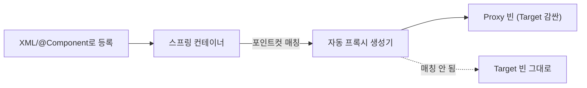
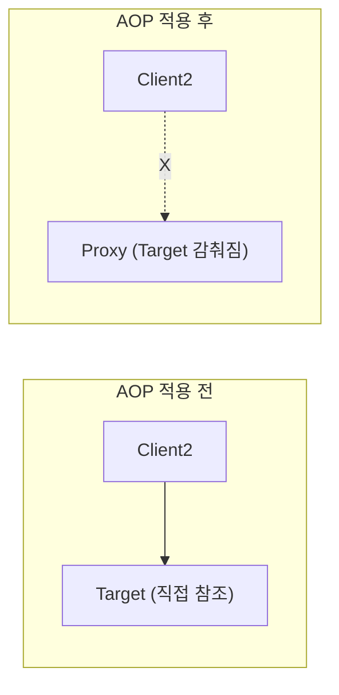
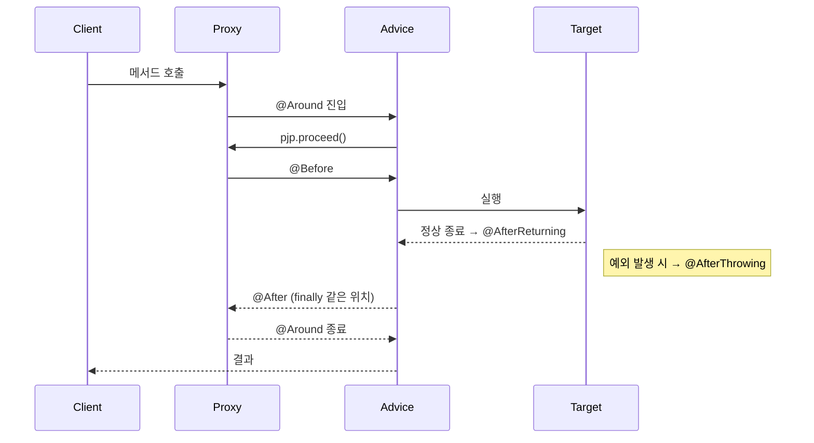
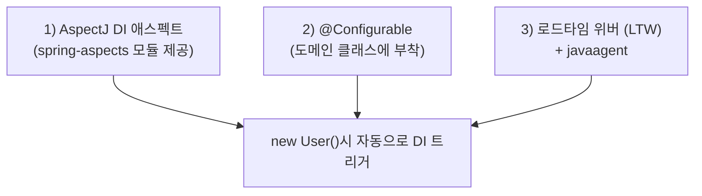

# 5장. AOP와 LTW

AOP의 기본 원리와 적용된 패턴, 활용 방법, 포인트컷과 어드바이스 작성에 관한 내용은 이미 Vol.1에서 자세히 다뤘다. 5장은 그 위에서 **스프링의 또 다른 AOP 개발 방식인 `@AspectJ` AOP**, **AspectJ 라이브러리를 직접 활용해 빈이 아닌 객체에 DI를 적용하는 `@Configurable`**, 그리고 **로딩 시점 바이트코드 조작인 LTW(Load-Time Weaving)** 를 다룬다.

> 5장의 내용은 AOP의 고급 기술에 해당하므로 다소 이해하기 어려운 주제가 등장하기도 한다. 이미 Vol.1에서 본 AOP 활용 방법으로 충분하다고 생각되면 시간을 두고 천천히 학습해도 된다.

---

## 5.1 애스펙트 AOP

### 5.1.1 프록시 기반 AOP

#### 프록시 기반 AOP 개발 스타일의 종류와 특징

스프링 AOP는 모두 **자동 프록시 생성기를 통한 프록시 기반**이다. 따라서 다음 공통 특징을 갖는다.

- **모듈화된 부가기능(어드바이스) + 적용 대상(포인트컷)** 의 조합
- **빈 단위**로만 적용 가능 — 스프링 컨테이너가 관리하는 객체에만 부가기능 적용
- **메서드 호출 지점**에만 어드바이스 적용 가능 (필드 읽기/쓰기, 생성자 호출 등은 불가)

#### 자동 프록시 생성기와 프록시 빈의 핵심 동작



핵심: 프록시 빈은 **Target 클래스 타입이 아니라 Target이 구현한 인터페이스 타입**으로 등록된다.

#### AOP 적용의 두 가지 중요한 특징 *(반드시 기억)*

**① AOP 적용은 `@Autowired` 타입 의존관계 설정에 문제를 일으키지 않는다**

수동 프록시 빈 방식에서는 클라이언트가 `@Autowired`로 Target 타입을 받을 수 없는 경우가 있었다. 자동 프록시 생성기 방식은 이런 문제가 발생하지 않는다 — AOP 때문에 `@Autowired`를 포기할 일은 없다.

**② AOP 적용은 다른 빈들이 Target 객체에 직접 의존하지 못하게 한다**



```java
public class Client2 {
    @Autowired Target target;   // ⚠️ AOP 적용 시 더 이상 Target 빈은 없음 — 컨텍스트 초기화 실패
}
```

자동 프록시 생성기는 Target을 **Proxy 빈 안에 숨겨버린다**. Target 타입의 빈이 더 이상 존재하지 않으므로 직접 의존하던 다른 빈에서 DI 실패가 발생할 수 있다.

> **권장**: AOP 적용 가능성이 있는 클래스는 처음부터 **인터페이스를 정의해 인터페이스로 의존**하라. 그러면 Proxy도 같은 인터페이스 타입이라 DI에 문제가 없다.

#### 프록시의 종류

| 종류 | 생성 방식 | 조건 |
| --- | --- | --- |
| **JDK 다이내믹 프록시** | `Proxy.newProxyInstance()` | Target이 인터페이스 구현 |
| **CGLib 프록시** | 클래스 상속 (서브클래스 동적 생성) | Target이 인터페이스 없거나 `proxyTargetClass=true` |

- JDK 프록시: 인터페이스 메서드만 어드바이스 가능
- CGLib 프록시: `final` 메서드 어드바이스 불가, 생성자 두 번 호출됨 (주의)

### 5.1.2 @AspectJ AOP

스프링 AOP를 가장 잘 적용된 기술인 **트랜잭션 AOP**의 활용 방법은 Vol.1에서 충분히 봤다. 5장에서는 자유롭게 직접 부가기능을 만들 때 쓰는 **@AspectJ 스타일**을 다룬다.

> 스프링은 AspectJ라는 강력한 AOP 프레임워크의 **포인트컷 표현식**과 **애노테이션 문법**만 빌려와 사용한다. 따라서 AspectJ 라이브러리를 따로 깔지 않아도 `@AspectJ` 방식 AOP가 동작한다 — 여전히 스프링의 **프록시 기반**이다.

#### @AspectJ를 이용하기 위한 준비사항

```xml
<!-- XML -->
<aop:aspectj-autoproxy/>
```

```java
// 자바 코드
@Configuration
@EnableAspectJAutoProxy
public class AppConfig { ... }
```

이 한 줄이 `AnnotationAwareAspectJAutoProxyCreator` 자동 프록시 생성기를 등록한다. 이후 `@Aspect`가 붙은 빈을 발견하면 자동으로 어드바이저로 변환해 적용한다.

#### @Aspect 클래스와 구성요소

```java
@Aspect
@Component
public class TransactionTraceAspect {

    @Pointcut("execution(* com.eprial.myproject.service..*(..))")
    private void serviceLayer() {}

    @Around("serviceLayer()")
    public Object trace(ProceedingJoinPoint pjp) throws Throwable {
        long start = System.currentTimeMillis();
        try {
            return pjp.proceed();
        } finally {
            log.info("{} took {}ms", pjp.getSignature(), System.currentTimeMillis() - start);
        }
    }
}
```

- `@Aspect` 클래스는 **평범한 POJO** — 일반 필드, 단순 메서드 보유 가능, DI 받을 수 있음
- 빈으로 등록되어 있어야 한다 (`@Component` 또는 `@Bean`)
- 포인트컷, 어드바이스, 일반 메서드를 한 클래스에 자유롭게 조합

#### 포인트컷 메서드와 애노테이션

```java
@Pointcut("execution(* sayHello(..))")
private void hello() {}      // 리턴 타입은 반드시 void
```

- `@Pointcut`으로 **이름 있는 포인트컷**을 정의 → 다른 어드바이스/포인트컷에서 재사용
- 메서드 이름 + 파라미터까지 포함해 참조 (`hello()`)

#### 포인트컷 지시자(PCD, Pointcut Designator)

| 지시자 | 의미 |
| --- | --- |
| `execution(...)` | 메서드 실행 지점 — 가장 많이 사용 |
| `within(...)` | 특정 타입/패키지 내의 모든 조인 포인트 |
| `this(...)` | 프록시(스프링 프록시 객체) 타입 매칭 |
| `target(...)` | Target(실제) 객체 타입 매칭 |
| `args(...)` | 파라미터 타입 매칭 — 어드바이스에 인자 바인딩 |
| `@target`, `@args`, `@within`, `@annotation` | 애노테이션 기반 매칭 |
| `bean(빈이름)` | 스프링 빈 이름 매칭 (스프링 전용) |

```java
// 결합 — AND, OR, NOT
@Pointcut("within(com.eprial.myproject.service..*) && args(java.io.Serializable)")
private void serializableArg() {}

@Pointcut("serviceLayer() && @annotation(com.eprial.myproject.anno.Secured)")
private void securedService() {}

@Pointcut("daoLayer() || within(com.eprial.legacy.dao..*)")
private void anyDao() {}

@Pointcut("!within(com.eprial.legacy..*)")
private void notLegacy() {}
```

> 포인트컷도 하나의 언어다 — 문법과 기호를 정확히 알아야 베스트 프랙티스도 익힐 수 있다. 스프링 레퍼런스 문서의 AOP 항목과 AspectJ 사이트의 프로그래밍 가이드를 참고하자.

#### 어드바이스 메서드와 애노테이션



| 어드바이스 | 적용 시점 | 시그니처 예 |
| --- | --- | --- |
| `@Before` | 메서드 실행 직전 | `@Before("daoLayer()") void log(JoinPoint jp)` |
| `@AfterReturning` | 정상 리턴 후 | `@AfterReturning(pointcut="...", returning="ret") void log(Object ret)` |
| `@AfterThrowing` | 예외 발생 시 | `@AfterThrowing(pointcut="...", throwing="ex") void log(Exception ex)` |
| `@After` | 정상/예외 무관 (finally) | `@After("...") void cleanup()` |
| `@Around` | 전체 (가장 강력) | `@Around("...") Object invoke(ProceedingJoinPoint pjp) throws Throwable` |

- `@Around`는 `MethodInterceptor`와 같은 종류 — `pjp.proceed()`로 Target 호출
- 모든 어드바이스 애노테이션은 포인트컷 표현식 또는 이름 있는 포인트컷을 인자로 받는다

#### 파라미터 선언과 바인딩

`args()`/`@annotation()`/`target()` 등을 사용해 어드바이스에 **메서드 인자/애노테이션/타깃 객체**를 전달받을 수 있다.

```java
@Around("execution(* save(..)) && args(user)")
public Object aroundSave(ProceedingJoinPoint pjp, User user) throws Throwable {
    log.info("save user={}", user.getId());
    return pjp.proceed();
}
```

#### @AspectJ AOP 학습 방법과 적용 전략

- 우선 **포인트컷 표현식** 학습이 7할 — 표현식이 정확해야 의도한 곳에만 적용된다
- 자주 쓰는 패턴은 이름 있는 `@Pointcut`으로 분리·재사용
- 운영에서 **인터셉터 디버깅**을 위해 `@Around`에 메서드 시그니처/소요시간 로깅을 미리 만들어두면 유용

---

## 5.2 AspectJ와 @Configurable

### 5.2.1 AspectJ AOP

| 항목 | 스프링 AOP (프록시) | AspectJ |
| --- | --- | --- |
| 적용 방식 | 런타임 프록시 | **컴파일/로드타임 바이트코드 조작** |
| 조인 포인트 | 메서드 실행만 | 필드 읽기/쓰기, 생성자, 스태틱 초기화, 인스턴스 생성/초기화 등 |
| 적용 대상 | 빈만 | **모든 객체** (빈이 아닌 객체 포함) |
| 준비물 | 추가 라이브러리 X | AspectJ 컴파일러(ajc) 또는 LTW + javaagent |
| 성능 오버헤드 | 약간(프록시 호출) | 거의 없음 |

> 99% 정도의 애플리케이션은 메서드 실행 지점을 조인 포인트로 사용해서 충분히 부가기능을 제공할 수 있기 때문에 **스프링 프록시 방식 AOP만으로 충분하다**. 단, 스프링이 직접 제공하는 AspectJ AOP 적용 기능이 한 가지 있다 — **빈이 아닌 객체에 DI 적용**.

### 5.2.2 빈이 아닌 객체에 DI 적용하기

#### 동기

도메인 객체(예: `User`, `Order`)는 보통 빈이 아니다 — `new`로 생성되거나 ORM이 만들어준다. 그런데 도메인 객체에도 비즈니스 로직이 있고 그 로직이 외부 서비스(예: `EmailService`, `UserPolicyDao`)를 필요로 한다면? **DI가 필요해진다.**

도메인 모델 중심 설계(DDD)에서는 도메인 객체에 비즈니스 로직을 두는 것이 자연스럽고, 이때 의존성 주입이 필요하다.

#### DI 애스펙트 + `@Configurable` + LTW

세 가지가 함께 동작해야 빈이 아닌 객체에 DI가 적용된다.



#### `@Configurable`

```java
@Configurable(autowire = Autowire.BY_TYPE)
public class User {
    @Autowired private UserPolicyDao userPolicyDao;
    @Autowired private EmailService emailService;

    public void changeEmail(String newEmail) {
        emailService.sendVerify(newEmail);
        // ...
    }
}
```

- `autowire`: `BY_NAME` / `BY_TYPE` — 자동 와이어링 모드
- 또는 그냥 `@Autowired` / `@Resource`를 필드/세터에 직접 부착해 명시적 DI

XML에서는 다음 한 줄로 DI 애스펙트를 등록한다.

```xml
<context:spring-configured/>
```

#### 로드타임 위버와 자바 에이전트

`@Configurable`이 제대로 동작하려면 **클래스 로딩 시점에 바이트코드 조작**이 가능해야 한다. 두 단계 설정 필요.

**1) JVM 옵션으로 javaagent 등록**

```
-javaagent:lib/org.springframework.instrument-3.0.7.RELEASE.jar
```

또는 `spring-instrument-3.0.7.RELEASE.jar`. 이 jar는 클래스패스가 아닌 **`-javaagent` 옵션**으로 지정해야 한다.

**2) XML에 LTW 활성화**

```xml
<context:load-time-weaver/>
```

또는 AspectJ 표준 aop.xml이 없다면:

```xml
<context:load-time-weaver aspectj-weaving="on"/>
```

#### 톰캣에서의 로드타임 위빙

자바 에이전트 없이 톰캣의 InstrumentableClassLoader를 사용할 수도 있다.

```xml
<Context path="/springapp" docBase=".../springapp">
  <Loader loaderClass="org.springframework.instrument.classloading.tomcat.TomcatInstrumentableClassLoader"/>
</Context>
```

> 스프링의 LTW는 환경에 따라 최적화된 방식을 자동으로 선정해 준다 — 환경별로 설정을 바꿔야 하는 부담이 작다.

---

## 5.3 로드타임 위버(LTW)

LTW는 클래스가 JVM에 로드되는 시점에 바이트코드를 변환하는 기술이다.

#### 활용처

1. **`@Configurable`의 DI 애스펙트** *(스프링이 직접 제공)*
2. **AspectJ 자체의 모든 애스펙트** *(메서드 외 조인 포인트 사용 시)*
3. **JPA 같은 ORM의 lazy loading** — 일부 구현은 LTW로 엔티티 클래스를 변환

#### 스프링이 제공하는 LTW의 장점

- **여러 LTW 구현(자바 에이전트, 톰캣, JBoss, WebLogic 등)을 자동 감지**
- 환경별 설정 차이를 흡수
- AspectJ 표준 `aop.xml`을 그대로 사용 가능

```xml
<context:load-time-weaver/>            <!-- 자동 감지 -->
<context:load-time-weaver weaver-class="..."/>   <!-- 명시적 지정 -->
```

> 대부분의 프로젝트는 `@Configurable` 정도가 LTW의 활용처이고, 그조차도 도메인 로직을 서비스 계층에 두는 전통적 설계라면 필요하지 않다. 필요할 때만 신중히 도입하자.

---

## 5.4 스프링 3.1의 AOP와 LTW

스프링 3.1의 AOP/LTW 기능에 별다른 변화는 없다. 자바 코드 설정에서 사용할 수 있는 **전용 애노테이션 두 개**가 추가됐다.

### 5.4.1 AOP와 LTW를 위한 애노테이션

#### `@EnableAspectJAutoProxy`

XML의 `<aop:aspectj-autoproxy/>` 자바 코드 버전.

```java
@Configuration
@EnableAspectJAutoProxy
public class AppConfig {
    @Bean
    public MyAspect myAspect() {
        return new MyAspect();
    }
}
```

- `@Aspect` 클래스를 빈으로 등록만 하면 자동 프록시가 적용된다
- `@Component` + 컴포넌트 스캔으로 등록해도 OK

##### CGLib 강제

```java
@EnableAspectJAutoProxy(proxyTargetClass = true)
```

- 인터페이스 없는 클래스에도 프록시 적용 (CGLib)
- 인터페이스가 있어도 클래스 기반 프록시 강제

#### `@EnableLoadTimeWeaving`

XML의 `<context:load-time-weaver/>` 자바 코드 버전.

```java
@Configuration
@EnableLoadTimeWeaving
public class AppConfig { ... }
```

##### AspectJ 위빙 활성화

```java
@EnableLoadTimeWeaving(aspectjWeaving = AspectJWeaving.ENABLED)
```

##### 직접 구현한 위버 사용

`LoadTimeWeavingConfigurer` 인터페이스를 구현한 빈을 등록하면 기본 LTW 대신 그 위버를 사용한다.

---

## 5.5 정리

5장에서는 스프링에서 사용되는 AOP 기술과 로드타임 위버의 사용 방법을 알아봤다.

### 5장 핵심 정리

- 스프링에서는 **프록시 기반 AOP 기술을 네 가지 접근 방법**으로 활용할 수 있다 *(어드바이저+포인트컷, 자동 프록시, XML 기반 `<aop:*>`, `@AspectJ`)*. 각 접근 방법의 장단점을 파악하고 자신에게 맞는 방법을 선택할 수 있어야 한다.
- **`@AspectJ`** 는 AspectJ 스타일의 POJO 애스펙트 작성 방법이다. 유연하고 강력한 기능을 가진 애스펙트를 손쉽게 만들게 해주지만, 복잡한 AspectJ 문법과 사용 방법을 익혀야 하는 부담이 있다.
- 스프링은 또한 **AspectJ를 스프링 애플리케이션 내에서 간접적으로 활용할 수 있는** 몇 가지 방법을 제공한다. **`@Configurable`** 은 스프링 빈이 아닌 객체에 DI를 적용할 수 있게 해준다.
- 스프링은 **다양한 서버환경에서 사용 가능한 편리한 로드타임 위버**를 제공해준다.

### 실무 가이드

- **99% 케이스는 스프링 프록시 AOP로 충분**하다. AspectJ를 도입하기 전에 정말 메서드 외 조인 포인트가 필요한지 한 번 더 자문하자.
- **프록시는 빈에만 적용된다**는 점 + **프록시는 인터페이스 타입**이라는 점을 항상 기억. 그래서 새 도메인/서비스 클래스를 만들 때 처음부터 **인터페이스를 분리**해 두면 나중에 AOP 도입이 매끄럽다.
- **AOP 적용 후 자기 자신 메서드 호출(self-invocation)은 어드바이스가 적용되지 않는다** — 트랜잭션이 안 걸리는 흔한 함정. 동일 객체 내부 호출은 프록시를 거치지 않기 때문. 이런 경우 메서드를 별도 빈으로 분리하거나 AspectJ AOP로 전환해야 한다.
- 자바 코드 설정 시대(스프링 3.1+) 표준 조합: **`@EnableAspectJAutoProxy` + `@Aspect` 빈**. 필요할 때만 `@EnableLoadTimeWeaving`까지 추가.
