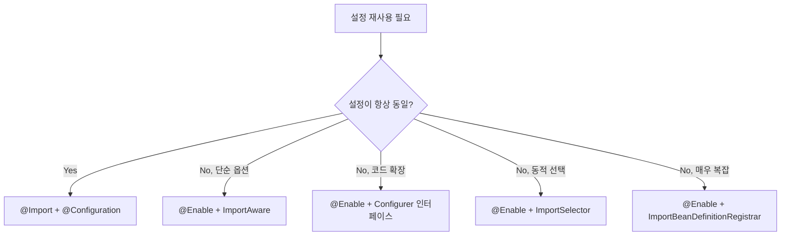

# 7장. 스프링의 기타 기술과 효과적인 학습 방법

스프링은 자바 엔터프라이즈 개발에 사용되는 다양한 기술 영역을 지원하는 방대한 기능을 제공한다. 스프링의 자체 기술은 물론, 표준 기술과 주요 오픈소스 기술에 대한 지원 기능도 함께 제공된다. 이 모든 걸 한 권에 담는 건 불가능하므로, 7장에서는 **새로운 기능을 효과적으로 이해·학습·적용하는 방법**과 **아직 다루지 않은 기타 기술**들을 정리한다.

> 스프링은 매우 일관된 방식으로 작성된 프레임워크다. 한번 원리를 알고 나면 어떤 새로운 기능이라도 어렵지 않게 이해하고 사용할 수 있다.

---

## 7.1 스프링 기술과 API를 효과적으로 학습하는 방법

스프링은 **DI**라는 단일 원리에 기반해 만들어졌다. 사용자 코드의 DI를 지원하는 프레임워크일 뿐 아니라 **스프링 자신도 DI를 이용해** 만들어졌다 — 따라서 새로운 기능을 만나면 그것이 어떤 빈으로 구성되고 어떻게 DI되는지 분석하는 게 학습의 핵심이다.

> "DI를 권장하는 기술이면서 자신은 DI를 사용하지 않는다면 그것은 기만이다." — 다행히도 스프링은 그렇지 않다.

### 7.1.1 빈으로 등록되는 스프링 클래스와 DI

새로 만나는 스프링 기능을 익힐 때 다음 세 가지를 분석한다.

#### 1) 구현 인터페이스 분석

빈으로 등록되는 클래스가 어떤 인터페이스를 구현했는지 확인한다.

- **인터페이스 = 그 빈의 추상화된 책임**
- 같은 인터페이스를 구현한 다른 클래스 = 대안 구현 — 갈아끼울 수 있음
- 예: `DataSourceTransactionManager`가 `PlatformTransactionManager`를 구현 → JTA로 갈아끼우면 `JtaTransactionManager` 사용

#### 2) 프로퍼티 분석

세터/필드/생성자에 들어오는 의존성과 단순 값을 본다.

- **인터페이스 타입 프로퍼티** = 다른 빈으로 갈아끼울 수 있는 확장 포인트
- **단순 값 프로퍼티** = 동작 옵션
- 예: `DataSourceTransactionManager`에 `DataSource` 인터페이스 프로퍼티가 있다 → 자연스럽게 스프링에는 `DataSource`를 구현한 클래스들이 무엇이 있는지 찾아보는 습관을 들이는 게 중요하다.

#### 3) DI/확장 포인트 분석

해당 기능이 어떤 빈 후처리기/팩토리 후처리기/이벤트 리스너를 통해 동작하는지, 그래서 어디까지 커스터마이징할 수 있는지 살핀다.

> 스프링의 모든 기능은 이 세 축 — **인터페이스 / 프로퍼티 / 확장 포인트** — 으로 환원된다. 새 기능 학습 시 이 프레임으로 접근하면 일관되게 빠르게 익혀진다.

---

## 7.2 IoC 컨테이너 DI

IoC 컨테이너 자체도 DI를 받는다 — 다만 **`<property>`** 직접 설정 방식이 아니라, 자신의 확장 포인트 인터페이스를 구현한 빈을 찾아서 스스로 DI한다(엄밀히 말하면 **DL**에 가깝다).

### 7.2.1 BeanPostProcessor와 BeanFactoryPostProcessor

가장 많이 사용되는 IoC 컨테이너의 확장 포인트 두 가지.

#### `BeanPostProcessor` — 빈 후처리기

```java
public interface BeanPostProcessor {
    Object postProcessBeforeInitialization(Object bean, String beanName) throws BeansException;
    Object postProcessAfterInitialization(Object bean, String beanName) throws BeansException;
}
```

**실제 빈 객체가 생성된 시점**에 호출된다. 핵심 활용:

- `@Autowired`/`@Inject`/`@Resource` 처리 — `AutowiredAnnotationBeanPostProcessor`
- `@PostConstruct`/`@PreDestroy` 처리 — `CommonAnnotationBeanPostProcessor`
- **AOP 자동 프록시 생성** — `AnnotationAwareAspectJAutoProxyCreator`가 이 인터페이스를 구현
- 빈을 통째로 다른 객체로 바꿔치기 가능 (프록시 패턴의 근간)


#### `BeanFactoryPostProcessor` — 빈 팩토리 후처리기

```java
public interface BeanFactoryPostProcessor {
    void postProcessBeanFactory(ConfigurableListableBeanFactory beanFactory) throws BeansException;
}
```

**빈 객체가 만들어지기 전, 빈 설정 메타정보가 준비된 시점**에 호출된다. 핵심 활용:

- `PropertyPlaceholderConfigurer` / `PropertySourcesPlaceholderConfigurer` — `${...}` 치환자 처리
- `<context:component-scan>` 처리 (`ConfigurationClassPostProcessor` 등)
- 빈 정의 자체를 추가/수정/제거

> 두 후처리기는 **스프링 확장의 양대 축**. 새 인프라 빈을 만들 일이 생기면 거의 항상 둘 중 하나를 구현하게 된다.

---

## 7.3 SpEL (Spring Expression Language)

스프링 3.0에서 도입된 **표현식 언어**. EL과 유사하지만 훨씬 강력하다.

### 7.3.1 SpEL 사용 방법

```xml
<bean class="...UserService">
  <property name="defaultLevel" value="#{T(myproject.Level).BASIC}"/>
  <property name="adminEmail" value="#{systemProperties['admin.email']}"/>
  <property name="targetUser" value="#{userRepository.findById(1)}"/>
</bean>
```

```java
@Value("#{systemProperties['user.timezone']}") String tz;
@Value("#{userService.findActiveUsers().size()}") int activeCount;
```

#### 주요 문법

| 표현 | 의미 |
| --- | --- |
| `#{...}` | SpEL 평가 |
| `${...}` | 프로퍼티 치환 (PropertyPlaceholderConfigurer) |
| `T(java.lang.Math).PI` | static 멤버 접근 |
| `#root`, `#this` | 루트/현재 객체 |
| `someBean.method(arg)` | 빈 메서드 호출 |
| `list.![ #this.name ]` | 컬렉션 프로젝션 |
| `list.?[ #this.age > 30 ]` | 컬렉션 셀렉션 |

> SpEL은 `@Value`, `@Cacheable(condition=)`, 시큐리티 표현식, 뷰 등 **스프링 곳곳에서 같은 문법으로 재사용**된다. 익혀두면 활용도가 매우 높다.

---

## 7.4 OXM (Object/XML Mapping)

XML과 자바 객체 간 변환을 추상화한 모듈. 다양한 OXM 구현(Castor/JAXB/XMLBeans/JiBX/XStream)을 같은 인터페이스로 사용할 수 있게 해준다.

### 7.4.1 Marshaller / Unmarshaller 인터페이스

```java
public interface Marshaller {
    boolean supports(Class<?> clazz);
    void marshal(Object graph, Result result) throws IOException, XmlMappingException;
}

public interface Unmarshaller {
    boolean supports(Class<?> clazz);
    Object unmarshal(Source source) throws IOException, XmlMappingException;
}
```

- `marshal()`: 객체 그래프 → `javax.xml.transform.Result` (XML)
- `unmarshal()`: `javax.xml.transform.Source` → 객체 그래프
- IO 예외가 아닌 OXM 관련 예외는 `XmlMappingException` 계층구조로 변환되어 던져진다 → 일관된 예외 처리

### 7.4.2 OXM 기술 어댑터 클래스

| 어댑터 클래스 | OXM 기술 |
| --- | --- |
| `CastorMarshaller` | Castor |
| `Jaxb2Marshaller` | JAXB 2 (가장 많이 사용) |
| `XmlBeansMarshaller` | Apache XMLBeans |
| `JibxMarshaller` | JiBX |
| `XStreamMarshaller` | XStream |

```xml
<bean id="castorMarshaller" class="org.springframework.oxm.castor.CastorMarshaller"/>
```

- 모든 어댑터 빈은 `Marshaller`와 `Unmarshaller`를 **동시에 구현**한다 — 두 가지 모두 같은 빈 레퍼런스를 주입한다
- 활용처: 스프링 MVC의 `MarshallingView`, `MarshallingHttpMessageConverter` (XML 응답 자동화)

---

## 7.5 리모팅과 웹 서비스, EJB

원격 호출을 **DI 받은 인터페이스**처럼 다룰 수 있게 해주는 추상화. 클라이언트 코드는 평범한 메서드 호출만 하고, 그 호출이 네트워크를 타고 원격 서비스로 전달된다.

### 7.5.1 익스포터와 프록시

#### 익스포터(Exporter) — 서버 측

빈으로 등록된 서비스 객체를 원격 호출 가능한 형태로 노출.

| 익스포터 | 프로토콜 |
| --- | --- |
| `RmiServiceExporter` | RMI |
| `HttpInvokerServiceExporter` | HTTP 위 자바 시리얼라이즈 (Spring 자체 포맷) |
| `HessianServiceExporter`, `BurlapServiceExporter` | Hessian/Burlap |
| `JaxWsPortProxyFactoryBean` | JAX-WS (SOAP) |
| `SimpleJaxWsServiceExporter` | 경량 JAX-WS |

#### 프록시(Proxy) — 클라이언트 측

원격 서비스를 로컬 빈처럼 DI 받기 위한 클라이언트 프록시 빈.

| 프록시 빈 | 프로토콜 |
| --- | --- |
| `RmiProxyFactoryBean` | RMI |
| `HttpInvokerProxyFactoryBean` | Spring HTTP Invoker |
| `HessianProxyFactoryBean` | Hessian |
| `JaxWsPortProxyFactoryBean` | JAX-WS |

```xml
<bean id="userService" class="org.springframework.remoting.httpinvoker.HttpInvokerProxyFactoryBean">
  <property name="serviceUrl" value="http://server/userService"/>
  <property name="serviceInterface" value="myproject.UserService"/>
</bean>
```

```java
@Autowired UserService userService;   // 평범한 빈처럼 DI
userService.findUser(1);              // 호출 시 원격으로 전달
```

### 7.5.2 RESTful 서비스 템플릿 — `RestTemplate`

JdbcTemplate이 JDBC를 단순화한 것처럼, **REST 호출을 단순화**한 템플릿.

```java
RestTemplate rt = new RestTemplate();

User user = rt.getForObject("http://api.example.com/users/{id}", User.class, 1);
List<User> users = rt.getForObject("http://api.example.com/users", List.class);

User created = rt.postForObject("http://api.example.com/users", newUser, User.class);
rt.put("http://api.example.com/users/{id}", updatedUser, 1);
rt.delete("http://api.example.com/users/{id}", 1);
```

- 메시지 컨버터(JSON/XML)와 자동 통합 — `MappingJacksonHttpMessageConverter` 등록만 되어 있으면 객체↔JSON 자동
- Spring 5+에선 `WebClient`가 더 권장되지만, 동기식 단순 호출엔 여전히 유효

### 7.5.3 EJB 서비스 이용

EJB 2/3 컴포넌트를 스프링에서 **DI 받은 빈처럼** 사용할 수 있다.

```xml
<jee:local-slsb id="helloService" jndi-name="ejb/helloService"
                business-interface="myproject.HelloService"/>

<jee:remote-slsb id="remoteHelloService" jndi-name="ejb/helloService"
                 business-interface="myproject.HelloService"/>
```

- EJB 빈을 통해 DI 받기 때문에 클라이언트는 EJB인지 평범한 스프링 빈인지 모른다
- **레거시 EJB → POJO 마이그레이션 전략**: 일단 EJB 빈을 `<jee:local-slsb>`로 노출 → 점진적으로 EJB를 POJO로 전환하면서 프록시를 POJO 빈으로 바꿔나간다. 모든 EJB가 POJO로 전환되면 EJB 종속성 없이 가벼운 스프링 애플리케이션으로 동작.

---

## 7.6 태스크 실행과 스케줄링

### 7.6.1 TaskExecutor — 비동기 실행 추상화

```java
public interface TaskExecutor extends java.util.concurrent.Executor {
    void execute(Runnable task);
}
```

- JDK 5의 `Executor`를 상속한 인터페이스 — 같은 메서드 시그니처
- 스프링이 별도로 정의한 이유: **CommonJ WorkManager**, **Quartz**, JCA Worker 같은 다양한 태스크 실행 기술의 어댑터를 제공하기 위해

| 구현 | 설명 |
| --- | --- |
| `SyncTaskExecutor` | 호출 스레드에서 동기 실행 (테스트용) |
| `SimpleAsyncTaskExecutor` | 매번 새 스레드 — 풀링 X |
| `ThreadPoolTaskExecutor` | **JDK ThreadPoolExecutor 기반** (실무 권장) |
| `ConcurrentTaskExecutor` | 외부 `Executor` 어댑터 |
| `WorkManagerTaskExecutor` | CommonJ WorkManager (WAS 통합) |

### 7.6.2 TaskScheduler — 스케줄링 추상화

```java
public interface TaskScheduler {
    ScheduledFuture<?> schedule(Runnable task, Trigger trigger);
    ScheduledFuture<?> schedule(Runnable task, Date startTime);
    ScheduledFuture<?> scheduleAtFixedRate(Runnable task, long period);
    ScheduledFuture<?> scheduleWithFixedDelay(Runnable task, long delay);
    // ...
}
```

| 구현 | 설명 |
| --- | --- |
| `ThreadPoolTaskScheduler` | 표준 |
| `ConcurrentTaskScheduler` | `ScheduledExecutorService` 어댑터 |

### 7.6.3 task 네임스페이스

XML로 간편 등록.

```xml
<task:executor id="executor" pool-size="5-25" queue-capacity="100"/>
<task:scheduler id="scheduler" pool-size="10"/>
<task:annotation-driven executor="executor" scheduler="scheduler"/>

<task:scheduled-tasks scheduler="scheduler">
  <task:scheduled ref="reportService" method="generate" cron="0 0 2 * * *"/>
</task:scheduled-tasks>
```

### 7.6.4 애노테이션 기반 — `@Scheduled` / `@Async`

#### `@Scheduled`

```java
@Scheduled(fixedDelay = 60000)
public void checkSystemStatus() { ... }   // 이전 메서드 종료 후 60초 뒤

@Scheduled(fixedRate = 60000)
public void heartbeat() { ... }           // 60초 간격 (이전 메서드 호출 시점부터)

@Scheduled(cron = "0 0 12 1 * MON-FRI")
public void monthlyReport() { ... }       // cron — 가장 유연
```

- 메서드는 **파라미터를 가질 수 없으며 반드시 void 리턴**
- 상위 빈은 `@Scheduled` 메서드 1개 이상 가지면 스케줄러에 자동 등록

#### `@Async`

```java
@Async
public void complexWork(String s) { ... }   // 별도 스레드에서 비동기 실행

@Async
public Future<Result> compute() { ... }     // 결과 받기
```

- 리턴 타입은 `void` 또는 `Future<T>`만 가능
- 호출하면 즉시 리턴, 작업은 `TaskExecutor`에서 실행

#### 활성화

```xml
<task:annotation-driven executor="executor" scheduler="scheduler"/>
```

```java
@Configuration
@EnableAsync
@EnableScheduling
public class AppConfig { ... }
```

> `@Async`도 결국 AOP 프록시 — 같은 객체 내부 호출은 비동기 실행되지 않음. self-invocation 함정에 주의.

---

## 7.7 캐시 추상화 *(스프링 3.1 신규)*

스프링 3.1은 **캐시 서비스를 메서드 단위로 적용**할 수 있는 기능을 추가했다. 트랜잭션과 마찬가지로 **AOP 기반**이며, 캐시 API를 코드에 추가하지 않아도 손쉽게 캐시를 부여할 수 있다.

#### 캐시의 목적

- 무거운 계산이나 DB 작업, **원격 API 호출** 결과를 임시 저장
- 다음 동일 요청이 오면 다시 작업하지 않고 캐시 결과를 그대로 반환
- → 응답 속도 향상 + 백엔드 부하 감소

### 7.7.1 애노테이션을 이용한 캐시 속성 부여

#### `@Cacheable` — 결과 저장 + 재사용

```java
@Cacheable(value = "user")
public User findUser(int id) { ... }

@Cacheable(value = "user", condition = "#user.type == 'ADMIN'")
public User findUser(User user) { ... }   // 조건부 캐싱

@Cacheable(value = "user", key = "#id")   // SpEL로 key 지정
public User findUser(int id) { ... }
```

- 메서드 호출 전 캐시 확인 → 있으면 메서드 미실행, 캐시값 반환
- 없으면 메서드 실행 후 결과를 캐시에 저장
- `key` 미지정 시 모든 파라미터를 조합한 키 사용

#### `@CacheEvict` — 캐시 제거

```java
@CacheEvict(value = "bestProduct")
public void refreshBestProducts() { ... }

@CacheEvict(value = "product", key = "#product.productNo")
public void updateProduct(Product product) { ... }

@CacheEvict(value = "product", allEntries = true)
public void clearProducts() { ... }
```

- 데이터 변경 시점에 관련 캐시를 무효화
- `allEntries=true`로 캐시 전체 삭제

#### `@CachePut` — 항상 메서드 실행 + 결과 캐싱

```java
@CachePut(value = "user", key = "#user.id")
public User saveUser(User user) { ... }
```

- `@Cacheable`과 달리 항상 메서드를 실행 — 캐시는 부수적으로 갱신
- 사용 빈도는 낮음

#### 활성화

```xml
<cache:annotation-driven/>
```

```java
@Configuration
@EnableCaching
public class AppConfig { ... }
```

- 모드: `proxy`(기본) / `aspectj`
- `proxyTargetClass` 옵션으로 클래스 프록시 강제 가능

### 7.7.2 캐시 매니저

`CacheManager` 인터페이스가 캐시 구현 기술을 추상화. 이름이 같은 캐시(`@Cacheable(value="user")`의 "user")를 어떤 백엔드에서 가져올지 결정.

| `CacheManager` 구현 | 백엔드 |
| --- | --- |
| `ConcurrentMapCacheManager` | JDK `ConcurrentHashMap` (개발/테스트용) |
| `SimpleCacheManager` | 정적으로 등록한 캐시 모음 |
| `EhCacheCacheManager` | EhCache |
| `JCacheCacheManager` | JSR-107 호환 (Hazelcast, Redis 등) |
| `CompositeCacheManager` | 여러 매니저 합성 |

```xml
<cache:annotation-driven cache-manager="cacheManager"/>

<bean id="cacheManager" class="org.springframework.cache.ehcache.EhCacheCacheManager"
      p:cacheManager-ref="ehcache"/>

<bean id="ehcache" class="org.springframework.cache.ehcache.EhCacheManagerFactoryBean"
      p:configLocation="classpath:ehcache.xml"/>
```

> 환경/구현이 바뀌어도 `@Cacheable` 메서드는 그대로다 — 캐시 추상화의 핵심 가치.

---

## 7.8 @Enable 애노테이션을 이용한 빈 설정정보 모듈화

자바 코드 설정의 **재사용**을 위한 도구들. XML 전용 태그보다 훨씬 간단한 방법으로 설정정보 재사용 모듈을 만들 수 있다.

### 7.8.1 `@Import`와 `@Configuration` 상속

#### `@Import`로 단순 재사용

재사용할 설정을 별도 `@Configuration` 클래스로 빼두고 가져온다.

```java
// 재사용 설정 클래스
@Configuration
public class HelloConfig {
    @Bean
    public Hello hello() {
        Hello h = new Hello();
        h.setName("Spring");
        return h;
    }
}

// 메인 설정에서 가져오기
@Configuration
@Import(HelloConfig.class)
public class AppConfig { ... }
```

#### `@Configuration` 상속 + 오버라이딩으로 확장

```java
@Configuration
public class CustomHelloConfig extends HelloConfig {
    @Override
    public Hello hello() {
        Hello h = super.hello();
        h.setName("Custom");
        return h;
    }
}
```

- `@Bean` 메서드는 `public` 가상 메서드처럼 오버라이드 가능
- 단점: **항상 같은 옵션**일 때만 유효 — 옵션을 바꾸려면 매번 새 클래스를 만들어야 함

### 7.8.2 @Enable 전용 애노테이션과 ImportAware

`@EnableXxx` 패턴은 옵션을 받아 설정을 선택할 수 있게 해준다.

#### `@Enable` 애노테이션 만들기

```java
@Target(ElementType.TYPE)
@Retention(RetentionPolicy.RUNTIME)
@Import(HelloConfig.class)
public @interface EnableHello {
    String name() default "Spring";
}
```

#### `ImportAware`로 옵션 읽기

```java
@Configuration
public class HelloConfig implements ImportAware {
    private String name = "Spring";

    @Bean
    public Hello hello() {
        Hello h = new Hello();
        h.setName(name);
        return h;
    }

    @Override
    public void setImportMetadata(AnnotationMetadata importMetadata) {
        Map<String, Object> attrs = importMetadata.getAnnotationAttributes(
            EnableHello.class.getName());
        this.name = (String) attrs.get("name");
    }
}
```

```java
@Configuration
@EnableHello(name = "Toby")
public class AppConfig { ... }
```

> `@EnableTransactionManagement`, `@EnableAsync`, `@EnableCaching` 등 스프링 자신이 제공하는 모든 `@Enable` 시리즈가 이 패턴으로 만들어졌다.

### 7.8.3 빈 설정자 (Configurer)

`@Enable`의 엘리먼트만으로는 부족할 때 — 코드로 복잡한 설정을 추가해야 할 때 — 사용하는 패턴.

```java
public interface HelloConfigurer {
    void configName(Hello hello);
}
```

```java
@Configuration
@EnableHello
public class AppConfig implements HelloConfigurer {
    @Override
    public void configName(Hello hello) {
        hello.setName("Toby (configured by code)");
    }
}
```

`HelloConfig`는 등록된 모든 `HelloConfigurer` 빈을 모아 `configName()`을 차례로 호출한다.

#### 빈 설정자의 장점

- **상속과 달리 여러 개의 설정자**를 동시에 적용 가능
- `@Bean` 메서드를 직접 노출하지 않음 → 잘못된 오버라이딩으로 설정을 망칠 위험 없음
- 4장의 **`WebMvcConfigurer`** 가 대표적 예 (`@EnableWebMvc`와 함께 사용)

> **자바 코드 기반 설정 확장이 필요하면 `@Configuration` 상속보다는 `@Enable` + `Configurer` 조합이 낫다.**

### 7.8.4 ImportSelector와 ImportBeanDefinitionRegistrar

#### `ImportSelector` — 옵션에 따라 다른 `@Configuration` 선택

```java
public class HelloSelector implements ImportSelector {
    @Override
    public String[] selectImports(AnnotationMetadata metadata) {
        String mode = (String) metadata.getAnnotationAttributes(
            EnableHello.class.getName()).get("mode");
        if ("mode1".equals(mode))
            return new String[] { HelloConfig1.class.getName() };
        else
            return new String[] { HelloConfig2.class.getName() };
    }
}
```

```java
@Target(ElementType.TYPE)
@Retention(RetentionPolicy.RUNTIME)
@Import(HelloSelector.class)
public @interface EnableHello {
    String mode();
}
```

→ `@EnableHello(mode="mode1")` / `@EnableHello(mode="mode2")` 로 빈 조합을 동적으로 선택.

#### `ImportBeanDefinitionRegistrar` — XML 전용 태그처럼 빈 메타정보 직접 생성

옵션에 따라 복잡한 빈 설정 조합을 만들어내야 하는 경우 — 사실상 XML 전용 태그가 하던 일을 자바 코드로 한다.

> 스프링 내부에 대한 깊은 지식이 필요하므로, 특별한 이유가 있지 않으면 사용을 권장하지 않는다.

#### @Enable 확장 4가지 도구 정리



---

## 7.9 정리

7장에서는 스프링의 기술을 효과적으로 학습하는 방법과 스프링의 기타 기술을 간단히 살펴봤다. 스프링은 기능이 매우 방대한 프레임워크다. 누구도 스프링의 모든 기능을 다 알고 있을 수는 없기 때문에 **필요할 때마다 관련 문서를 찾아보는 습관을 들이는 게 중요**하다.

### 7장 핵심 정리

- 스프링 학습의 정도(正道): **인터페이스 / 프로퍼티 / 확장 포인트** 세 축으로 빈을 분석한다. 스프링 자신도 DI로 만들어졌다는 사실을 늘 떠올리자.
- IoC 컨테이너의 양대 확장 포인트: **`BeanPostProcessor`(빈 객체 후처리)** + **`BeanFactoryPostProcessor`(빈 정의 후처리)** — 거의 모든 인프라 기능이 이 둘 위에 쌓여 있다.
- **SpEL**은 `@Value`, `@Cacheable(condition=)`, 시큐리티, 뷰 등 곳곳에서 같은 문법으로 재사용된다.
- **OXM**으로 다양한 XML 매핑 기술(JAXB/Castor/XStream 등)을 같은 인터페이스로 다룬다.
- **리모팅**: 익스포터(서버) + 프록시 팩토리 빈(클라이언트)으로 원격 호출을 평범한 DI 빈처럼 다룬다. **`RestTemplate`** 으로 REST 호출도 단순화.
- **태스크/스케줄링**: `TaskExecutor`/`TaskScheduler` 추상화 + `@Async`/`@Scheduled` 애노테이션으로 비동기·스케줄링 코드가 매우 깔끔해진다.
- **캐시 추상화 (3.1 신규)**: `@Cacheable`/`@CacheEvict`/`@CachePut` + `CacheManager` — 트랜잭션처럼 AOP 기반으로 메서드에 캐시 적용.
- **`@Enable` 시리즈와 빈 설정자 패턴** 은 자바 코드 설정 재사용의 표준이다. `@EnableTransactionManagement`, `@EnableWebMvc`, `@EnableCaching` 모두 같은 골격으로 만들어졌다.

### 마무리 — Vol.2 전체를 돌아보며

- 1장 IoC/DI: **모든 것의 출발점.** 빈 정의, 컨테이너 종류, 환경 추상화/프로파일/프로퍼티 소스(3.1)
- 2장 데이터 액세스: JDBC/iBatis/JPA/Hibernate 통합, 트랜잭션 추상화·전파·격리수준, JTA
- 3장 웹 기술: DispatcherServlet의 7가지 전략, 컨트롤러/뷰 리졸버
- 4장 @MVC: 애노테이션 기반 컨트롤러, 모델 바인딩/검증, 메시지 컨버터, 3.1의 `RequestMappingHandler*`
- 5장 AOP/LTW: 프록시 기반 + `@AspectJ` + `@Configurable`/LTW
- 6장 테스트 컨텍스트: 컨테이너 기반 통합 테스트
- **7장**: 학습 방법론과 기타 기술 + `@Enable` 모듈화

> Vol.2는 결국 **"스프링의 모든 기능은 빈 + 메타정보 + 후처리기로 환원된다"** 는 한 가지 메시지를 다양한 영역에서 반복해 보여준다. 새 기능을 만나면 이 공식으로 분해해서 접근하면 된다.
